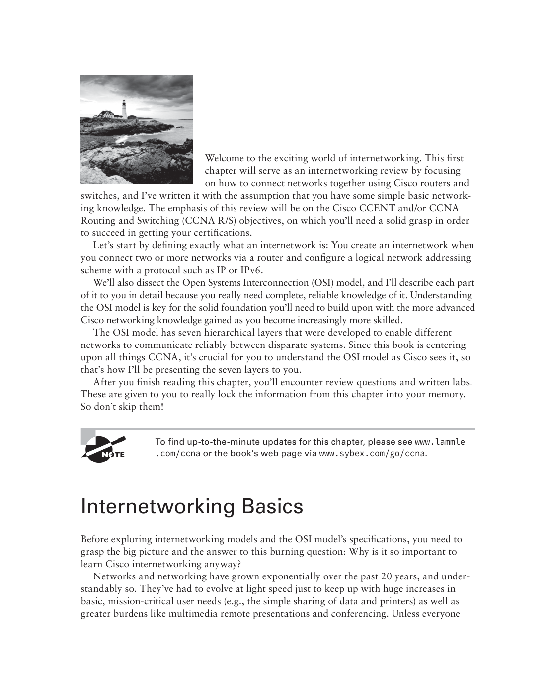

# Bib Study Guide — CCNA Certification Study Guide (Lammle) 7th Edition

> **Bib reference:** *CCNA Routing and Switching Study Guide*, 7th Edition — Todd Lammle (Sybex).
>
> **Regular-exam scope:** Study topics on IPv6 routing protocols, monitoring access lists, OSI model.
> **Substitute-exam scope:** Chapters 4, 12.
> **Union — what this guide covers:** OSI model (Ch 1-ish recap + any OSI-heavy sections), Easy Subnetting (Ch 4), VLANs and Inter-VLAN Routing (Ch 12), IPv6 routing protocols (Ch 15-ish), Monitoring / verifying access lists (Ch 13 Security scope).

**Posture:** Lammle's CCNA text reads like a cert-prep course with lots of configuration examples. This guide captures the Bib-scope concepts plus the specific `show` / `configure terminal` patterns an exam question is likely to reference. Pairs with `JCAC-NETWORKING.md` (combined Modules 6 + 10 from JCAC) and `BOOK-TCPIP-GUIDE.md` (deeper on protocol internals).

---

## OSI Model (Lammle recap)

Covered in Ch 1 of Lammle under "Internetworking." Lammle's emphasis is on **where things go wrong** and **how to troubleshoot** layer by layer.

### Seven layers


*Lammle CCNA 7e — OSI seven-layer model*

| # | Layer | Lammle's troubleshooting focus |
|---|---|---|
| **7** | Application | Does the application work? (browser, email client, SSH) |
| **6** | Presentation | Encoding / encryption / compression mismatches |
| **5** | Session | Authentication sessions, tunnel teardown |
| **4** | Transport | TCP retransmits, zero-window, port blocks |
| **3** | Network | IP routing, ACLs, TTL |
| **2** | Data Link | MAC learning, STP, trunking, duplex |
| **1** | Physical | Cabling, link lights, speed/duplex autoneg |

Lammle's **top-down troubleshooting mantra** — sometimes faster to start at L7 ("ping the URL"); if that fails, work down. Alternate **bottom-up** troubleshooting starts at L1 (is the cable in?); good for deep physical problems.

### Encapsulation terminology (Cisco uses Lammle's vocabulary on the exam)

Working down the stack:

| Layer | Data unit name |
|---|---|
| 7–5 Application | **Data / PDU** |
| 4 Transport | **Segment** (TCP) / **Datagram** (UDP) |
| 3 Network | **Packet** (or datagram; IP calls it "datagram") |
| 2 Data Link | **Frame** |
| 1 Physical | **Bits** |

### Protocol examples per layer (Lammle flavor)

- **Application (7):** HTTP, HTTPS, DNS, FTP, SMTP, POP3, IMAP, Telnet, SSH, SNMP, TFTP, DHCP, NTP.
- **Presentation (6):** MIME, TLS encryption, data formats (ASCII, EBCDIC, JPEG, GIF, MPEG).
- **Session (5):** NetBIOS, RPC, SIP, L2TP, NFS.
- **Transport (4):** TCP, UDP.
- **Network (3):** IP, ICMP, IGMP, OSPF, EIGRP, BGP, RIP, IPsec.
- **Data Link (2):** Ethernet, PPP, Frame Relay, HDLC, ARP, STP, PPPoE.
- **Physical (1):** Cables (Cat5e/6, fiber), connectors (RJ-45, LC/SC), Ethernet PHY standards (1000BASE-T, 10GBASE-LR), radio specs.

### Encapsulation walk-through

When Host A sends data to Host B:

1. Application data built.
2. Transport layer adds TCP header → **segment**.
3. Network layer adds IP header → **packet**.
4. Data Link layer adds Ethernet header + trailer → **frame**.
5. Physical layer transmits **bits** on the medium.

Host B reverses: frame → packet → segment → data.

---

## Chapter 4 — Easy Subnetting

### The why of subnetting

Divide a larger network into smaller broadcast domains:

- Reduce collision / broadcast scope.
- Improve security via traffic segmentation.
- Efficient use of IP address space.
- Enable VLSM (Variable Length Subnet Masks) for precise sizing.

### IPv4 address anatomy

32-bit address, dotted-decimal notation: `192.168.1.25`.

- **Network portion** — determined by subnet mask (prefix).
- **Host portion** — the remainder.
- **Subnet mask** — contiguous 1s followed by contiguous 0s; 1s mark network bits.

### Classful (legacy) address ranges

| Class | Prefix bits | First octet | Default mask | Private range |
|---|---|---|---|---|
| **A** | `0xxx` | 1–126 | /8 `255.0.0.0` | `10.0.0.0/8` |
| **B** | `10xx` | 128–191 | /16 `255.255.0.0` | `172.16.0.0/12` |
| **C** | `110x` | 192–223 | /24 `255.255.255.0` | `192.168.0.0/16` |
| **D** | `1110` | 224–239 | (multicast) | — |
| **E** | `1111` | 240–255 | (reserved) | — |

Loopback: `127.0.0.0/8`. APIPA: `169.254.0.0/16`. Carrier-NAT: `100.64.0.0/10`.

### CIDR — the modern way

Classless Inter-Domain Routing — arbitrary prefix lengths. `/24` → 24 network bits, 8 host bits.

Quick subnet math Lammle drills you on:

- **Hosts per subnet** = `2^(32 − prefix) − 2` (subtract net + broadcast addresses).
- **Subnets available** within a parent block = `2^(new_prefix − old_prefix)`.
- **Block size** (host jump between subnets) = `256 − last octet of subnet mask`.

### Subnet table (the one to memorize)

| Prefix | Mask | Hosts | Block size |
|---|---|---|---|
| /24 | 255.255.255.0 | 254 | 256 |
| /25 | 255.255.255.128 | 126 | 128 |
| /26 | 255.255.255.192 | 62 | 64 |
| /27 | 255.255.255.224 | 30 | 32 |
| /28 | 255.255.255.240 | 14 | 16 |
| /29 | 255.255.255.248 | 6 | 8 |
| /30 | 255.255.255.252 | 2 | 4 |
| /31 | 255.255.255.254 | 2 (point-to-point, RFC 3021) | 2 |
| /32 | 255.255.255.255 | 1 (host route) | 1 |

### Subnetting worked example


*Lammle CCNA 7e — Subnet-mask mechanics (network vs host portion)*

Given `192.168.1.0/24`, make **/27 subnets**:

- Block size = 256 − 224 = 32.
- Subnets: 192.168.1.0, 192.168.1.32, 192.168.1.64, 192.168.1.96, 192.168.1.128, 192.168.1.160, 192.168.1.192, 192.168.1.224.
- Each subnet has 30 usable hosts (32 − 2).
- First subnet: network 192.168.1.0, broadcast 192.168.1.31, hosts .1–.30.
- Second subnet: network .32, broadcast .63, hosts .33–.62.
- And so on.

### Binary-to-decimal mask conversion

255 = 11111111 (8 ones). Break down a mask byte:

- 128 = 10000000
- 192 = 11000000
- 224 = 11100000
- 240 = 11110000
- 248 = 11111000
- 252 = 11111100
- 254 = 11111110

Prefix = count of 1 bits across all four octets.

### VLSM — different prefix lengths in one network

Lammle's whole theme: sub-allocate from a parent block without wasting:

- /22 (1022 hosts) for a large floor.
- /24 (254 hosts) for a department.
- /26 (62 hosts) for a lab.
- /30 (2 hosts) for router-to-router links.

All carved from the same /16 or /20 parent. Modern routing protocols (OSPF, EIGRP, BGP, RIPv2) are classless and support VLSM.

### Summarization (supernetting)

Roll up multiple contiguous subnets into one advertisement:

- `192.168.0.0/24` + `192.168.1.0/24` + `192.168.2.0/24` + `192.168.3.0/24` → `192.168.0.0/22`.

Reduces routing-table size; required for efficient BGP.

---

## Chapter 12 — VLANs and Inter-VLAN Routing

### What VLANs do

A **VLAN (Virtual LAN)** splits one physical switched network into multiple **Layer-2 broadcast domains** — without running separate cables.

Benefits:
- Segmentation for security (HR / Finance / Guest separated).
- Reduced broadcast scope.
- Flexibility (move a user's VLAN via config, not a wiring change).
- QoS boundary.

### 802.1Q — the tagging standard

IEEE 802.1Q inserts a 4-byte tag between source MAC and EtherType:

```
+------+-----+---+----------+
| TPID | PCP |DEI| VLAN ID  |
| 0x8100|  3 | 1 |   12     |
+------+-----+---+----------+
```

- **TPID** (Tag Protocol Identifier) = `0x8100`.
- **PCP** (Priority Code Point) — 3-bit IEEE 802.1p priority (0–7).
- **DEI** (Drop Eligible Indicator) — 1 bit.
- **VLAN ID** — 12 bits, valid range 1–4094 (0 and 4095 reserved).

### Access ports vs trunk ports

- **Access port** — untagged member of exactly one VLAN; connects end stations (PCs, phones).
- **Trunk port** — carries multiple VLANs (tagged) between switches or to a router / L3 switch.

### Native VLAN

On an 802.1Q trunk, one VLAN is the **native VLAN** — frames in this VLAN are sent **untagged**. Default is VLAN 1.

Security best practice:
- Change native VLAN from 1 to an **unused** VLAN.
- Never use VLAN 1 for user traffic.
- Do not put any access ports in the native VLAN.

### Common VLAN commands (Cisco IOS)

```
SW1> enable
SW1# configure terminal
SW1(config)# vlan 10
SW1(config-vlan)# name SAILORS
SW1(config-vlan)# exit
SW1(config)# vlan 20
SW1(config-vlan)# name DEVS
SW1(config-vlan)# exit

SW1(config)# interface g0/1
SW1(config-if)# switchport mode access
SW1(config-if)# switchport access vlan 10
SW1(config-if)# spanning-tree portfast
SW1(config-if)# spanning-tree bpduguard enable
SW1(config-if)# exit

SW1(config)# interface g0/24
SW1(config-if)# switchport mode trunk
SW1(config-if)# switchport trunk encapsulation dot1q
SW1(config-if)# switchport trunk allowed vlan 10,20,99
SW1(config-if)# switchport trunk native vlan 999
```

### Voice VLAN

A special trunk-like use on an access port where **phone** traffic is tagged on one VLAN and the **PC-behind-phone** traffic is untagged on another:

```
SW1(config-if)# switchport access vlan 10
SW1(config-if)# switchport voice vlan 110
```

### Inter-VLAN routing

VLANs are Layer-2 isolation — by default hosts in different VLANs can't communicate. To bridge them you need a **Layer-3** device.

**Option 1 — Router-on-a-stick:**

A single physical router interface carries a trunk from the switch; the router has a **subinterface** per VLAN.

```
R1(config)# interface g0/0.10
R1(config-subif)# encapsulation dot1q 10
R1(config-subif)# ip address 10.0.10.1 255.255.255.0
R1(config-subif)# exit
R1(config)# interface g0/0.20
R1(config-subif)# encapsulation dot1q 20
R1(config-subif)# ip address 10.0.20.1 255.255.255.0
```

**Option 2 — Layer-3 switch with SVIs:**

Modern data-center deployment. The switch itself routes between VLAN SVIs (Switch Virtual Interfaces):

```
SW1(config)# ip routing
SW1(config)# interface vlan 10
SW1(config-if)# ip address 10.0.10.1 255.255.255.0
SW1(config-if)# no shutdown
SW1(config)# interface vlan 20
SW1(config-if)# ip address 10.0.20.1 255.255.255.0
SW1(config-if)# no shutdown
```

Faster than router-on-a-stick (no single choke point); standard on enterprise cores.

### VLAN hopping attacks

Exam-tested.

**Double-tagging:**
- Attacker on native-VLAN access port crafts a frame with two 802.1Q tags.
- First tag stripped at trunk; second tag delivers frame to a different VLAN.
- Mitigation: don't put access ports in the native VLAN, or tag all VLANs (don't use native at all).

**Switch spoofing (DTP abuse):**
- Access port configured with `switchport mode dynamic auto` (or `dynamic desirable`) negotiates trunking with an attacker who sends DTP frames.
- Once trunk, attacker can send tagged frames for any VLAN.
- Mitigation: **`switchport nonegotiate`** disables DTP; explicitly `switchport mode access` on edge.

### Verifying VLAN config

```
SW1# show vlan brief
SW1# show interfaces trunk
SW1# show interfaces g0/1 switchport
SW1# show mac address-table
SW1# show spanning-tree vlan 10
```

---

## IPv6 Routing Protocols (Lammle Ch 15-ish)

### IPv6 address review

- 128 bits, hex groups: `2001:db8:85a3::8a2e:370:7334`.
- Prefix-length notation `/64`, `/48`, etc.
- No broadcast — replaced by multicast.
- Link-local: `fe80::/10` — auto-configured on every interface.
- Global unicast: `2000::/3`.
- ULA (private-like): `fc00::/7`.
- Loopback: `::1/128`. Unspecified: `::/128`.

### IPv6 routing protocol options

| Protocol | Distance-vector / link-state | IPv6-native? | Cisco proprietary? |
|---|---|---|---|
| **RIPng** | Distance-vector | Yes (for v6) | No |
| **OSPFv3** | Link-state | Yes | No |
| **EIGRP for IPv6** | Advanced distance-vector | Yes | Yes |
| **IS-IS** | Link-state | Dual-stack native | No |
| **MP-BGP / BGP-4+** | Path-vector | Yes (multiprotocol) | No |

### OSPFv3

Similar to OSPFv2 but runs per-link (not per-subnet) and uses link-local addresses for neighbor adjacencies.

```
R1(config)# ipv6 unicast-routing
R1(config)# interface g0/0
R1(config-if)# ipv6 address 2001:db8:1::1/64
R1(config-if)# ipv6 ospf 1 area 0
R1(config-if)# exit
R1(config)# ipv6 router ospf 1
R1(config-rtr)# router-id 10.0.0.1
```

Differences from OSPFv2:
- One OSPFv3 process can handle multiple address families (v6, v4).
- Authentication via IPsec rather than simple/MD5 keys in protocol.
- LSAs carry v6 prefixes; flooding scope flags (link, area, AS).

### EIGRP for IPv6

```
R1(config)# ipv6 router eigrp 100
R1(config-rtr)# router-id 10.0.0.1
R1(config-rtr)# no shutdown
R1(config)# interface g0/0
R1(config-if)# ipv6 eigrp 100
```

Uses the same DUAL algorithm, metrics, neighbor discovery — just running over IPv6 hello multicast (`FF02::A`).

### RIPng

```
R1(config)# ipv6 unicast-routing
R1(config)# ipv6 router rip RIP_PROCESS
R1(config)# interface g0/0
R1(config-if)# ipv6 rip RIP_PROCESS enable
```

Similar to RIPv2: distance-vector, 15-hop max, 30 s updates. Rarely deployed except in small/lab networks.

### MP-BGP for IPv6

IPv6 NLRI (Network Layer Reachability Information) carried inside BGP-4 via the multiprotocol extension:

```
R1(config)# router bgp 65001
R1(config-router)# neighbor 2001:db8::2 remote-as 65002
R1(config-router)# address-family ipv6 unicast
R1(config-router-af)# neighbor 2001:db8::2 activate
R1(config-router-af)# network 2001:db8:1::/48
```

### Static IPv6 routes

```
R1(config)# ipv6 route 2001:db8:2::/48 2001:db8::2
R1(config)# ipv6 route ::/0 2001:db8::1       ! default route
```

### Verification

```
R1# show ipv6 route
R1# show ipv6 ospf neighbor
R1# show ipv6 eigrp neighbors
R1# show ipv6 protocols
R1# show running-config | section router
```

---

## Monitoring Access Lists (ACL verification)

Bib focus: **monitoring** — not just configuring ACLs, but verifying them in production.

### ACL quick recap

| Type | Match fields | Numbering |
|---|---|---|
| **Standard** | Source IP only | 1–99, 1300–1999 |
| **Extended** | Source/dest IP, protocol, port, flags | 100–199, 2000–2699 |
| **Named** | Either | By name |

### Wildcard masks

Inverse of subnet mask — 0 bits must match, 1 bits don't care:

- `0.0.0.0` → exact host.
- `0.0.0.255` → any host in /24.
- `0.0.0.3` → 4 hosts (/30 equivalent).
- `255.255.255.255` → `any` keyword.

### Configuring a simple ACL

**Standard:**

```
R1(config)# access-list 10 permit 10.0.0.0 0.0.0.255
R1(config)# access-list 10 deny any

R1(config)# interface g0/0
R1(config-if)# ip access-group 10 in
```

**Extended (named):**

```
R1(config)# ip access-list extended WEB-OUT
R1(config-ext-nacl)# permit tcp 10.0.0.0 0.0.0.255 any eq 443
R1(config-ext-nacl)# permit tcp 10.0.0.0 0.0.0.255 any eq 80
R1(config-ext-nacl)# permit udp 10.0.0.0 0.0.0.255 any eq 53
R1(config-ext-nacl)# deny ip any any log
R1(config-ext-nacl)# exit
R1(config)# interface g0/0
R1(config-if)# ip access-group WEB-OUT in
```

### `show` commands for monitoring ACLs

```
R1# show access-lists                       # all ACLs, hit counts per line
R1# show access-lists 100
R1# show access-lists WEB-OUT
R1# show ip access-lists                    # IPv4 only
R1# show ipv6 access-lists                  # IPv6
R1# show ip interface g0/0                  # which ACLs applied where
R1# show running-config | section access-list
```

### Interpreting hit counts

Each `permit` / `deny` line has a counter; line-match counts show up in `show access-lists`:

```
R1# show access-lists WEB-OUT
Extended IP access list WEB-OUT
    10 permit tcp 10.0.0.0 0.0.0.255 any eq 443 (12345 matches)
    20 permit tcp 10.0.0.0 0.0.0.255 any eq 80 (678 matches)
    30 permit udp 10.0.0.0 0.0.0.255 any eq 53 (9876 matches)
    40 deny ip any any log (5 matches)
```

Operational use:
- **Zero matches on a permit** — rule likely never hit; check ACL order, interface direction, endpoints.
- **High deny count** — investigate for blocked legitimate traffic or attacks.
- **`log` keyword** enables `%SEC-6-IPACCESSLOGP:` syslog messages per match; useful but slows forwarding (avoid on high-rate rules).

### Clearing counters

```
R1# clear access-list counters WEB-OUT
R1# clear ip access-list counters 100
```

### Troubleshooting checklist

1. Is the ACL applied in the correct **direction** (`in` vs `out`)?
2. Is it on the right **interface**?
3. Are rules in the correct **order** (first match wins)?
4. Is there an **implicit deny** at the end silently dropping expected traffic?
5. Do the **wildcard masks** cover the intended IP ranges?
6. For extended ACLs, is the **protocol + port** correct (UDP vs TCP)?
7. `log` on the final deny — what's getting silently dropped?

### Common Lammle exam traps

- Standard ACLs should be applied **close to the destination** (they only match source).
- Extended ACLs should be applied **close to the source** (they can match both, so stop traffic early).
- `deny any` is **implicit** at the end — explicit `deny any log` lets you see hits.
- Editing numbered ACLs in place is tricky; **named ACLs** with sequence numbers support in-place insertion / deletion:

```
R1(config)# ip access-list extended WEB-OUT
R1(config-ext-nacl)# 15 permit icmp 10.0.0.0 0.0.0.255 any
R1(config-ext-nacl)# no 30
```

---

## Cross-book connections

- OSI model ↔ `BOOK-TCPIP-GUIDE.md` Ch 3 · `JCAC-NETWORKING.md` §8.
- Subnetting ↔ `JCAC-NETWORKING.md` §11.
- VLANs ↔ `JCAC-NETWORKING.md` §28 · `JCAC-PROTOCOL-ANALYSIS.md` §4 (frame tagging).
- IPv6 ↔ `JCAC-NETWORKING.md` §23 · `BOOK-TCPIP-GUIDE.md` §5 (IPv6 discussion).
- ACLs ↔ `JCAC-NETWORKING.md` §36 · `JCAC-UNIX-LINUX.md` §22 (iptables — different but same concept).

---

## Exam-testable concepts (rapid-fire)

### OSI

- **OSI layer count?** 7.
- **Top-down mnemonic?** "All People Seem To Need Data Processing" (Application, Presentation, Session, Transport, Network, Data Link, Physical).
- **Data unit at L4 TCP?** Segment. UDP? Datagram.
- **Data unit at L3?** Packet.
- **Data unit at L2?** Frame.
- **Data unit at L1?** Bits.
- **Layer where ARP lives?** 2 (bridging L2 to L3).
- **Layer where TLS operates (purist)?** 6. (Practically between 4 and 5.)
- **Layer where IP lives?** 3.

### Subnetting (Ch 4)

- **Formula for hosts per subnet?** `2^(32 − prefix) − 2`.
- **Hosts in a /24?** 254.
- **Hosts in a /27?** 30.
- **Hosts in a /30?** 2.
- **Block size for /28?** 16.
- **Classful default masks?** A=/8, B=/16, C=/24.
- **Private IPv4 ranges?** 10/8, 172.16/12, 192.168/16.
- **Wildcard mask for /24 match?** 0.0.0.255.
- **Wildcard mask for one specific host?** 0.0.0.0.
- **Point-to-point /31 RFC?** 3021.

### VLANs (Ch 12)

- **802.1Q TPID value?** 0x8100.
- **VLAN ID bits?** 12 (1–4094).
- **Native VLAN default?** 1.
- **Access port vs trunk?** Access = untagged, one VLAN. Trunk = multiple VLANs, tagged.
- **Disable DTP command?** `switchport nonegotiate`.
- **Two VLAN-hopping attacks?** Double-tagging, switch-spoofing.
- **Router-on-a-stick uses?** Subinterfaces with `encapsulation dot1q <vlan>`.
- **Inter-VLAN routing on an L3 switch uses?** SVIs (`interface vlan <N>`).
- **Enable routing on a Cisco L3 switch?** `ip routing`.

### IPv6 Routing

- **IPv6 address bit width?** 128.
- **IPv6 link-local prefix?** `fe80::/10`.
- **IPv6 global unicast prefix?** `2000::/3`.
- **Loopback IPv6?** `::1/128`.
- **OSPFv3 uses what transport for adjacencies?** Link-local addresses over IPv6.
- **EIGRP for IPv6 hello multicast?** `FF02::A`.
- **MP-BGP activates a neighbor with?** `neighbor <x> activate` under `address-family ipv6 unicast`.
- **Enable IPv6 routing globally?** `ipv6 unicast-routing`.
- **Static IPv6 default route?** `ipv6 route ::/0 <next-hop>`.
- **RIPng hop-count limit?** 15.

### Monitoring ACLs

- **Command to see all ACLs and hit counts?** `show access-lists`.
- **See which ACL is applied to an interface?** `show ip interface <iface>`.
- **Enable per-match syslog on a rule?** Append `log` keyword.
- **Standard ACL placed close to?** Destination (can't filter by destination).
- **Extended ACL placed close to?** Source (stops bad traffic early).
- **Reset ACL counters?** `clear access-list counters <name-or-number>`.
- **Implicit rule at end of every ACL?** `deny any any` (invisible; only visible if you add `deny any log` explicitly).
- **Insert a rule in a named ACL at sequence 15?** `15 permit ... ` inside `ip access-list` config mode.
- **Delete sequence 30 from a named ACL?** `no 30`.

---

## Cross-references

- **[CCNA Certification Study Guide (Lammle)](../references/CCNA%20Certification%20Study%20Guide%20%28Lammle%29.pdf)** — text on disk.
- **[Cisco CCNA 200-301 Exam Topics](https://learningnetwork.cisco.com/s/ccna-exam-topics)** — current exam blueprint.
- **[Cisco Learning Network](https://learningnetwork.cisco.com/)** — free labs, flashcards, practice questions.
- **[Boson NetSim](https://www.boson.com/netsim-cisco-network-simulator)** — commercial lab simulator.
- `JCAC-NETWORKING.md` — broader networking concepts (Modules 6 + 10).
- `JCAC-PROTOCOL-ANALYSIS.md` — packet-level detail.
- `BOOK-TCPIP-GUIDE.md` — protocol internals.
