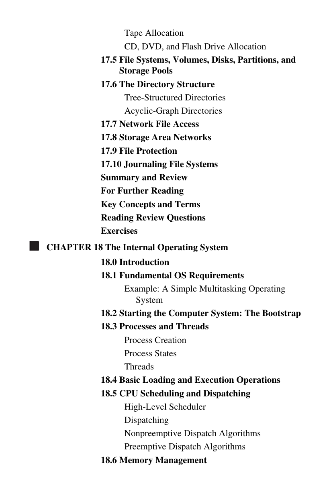
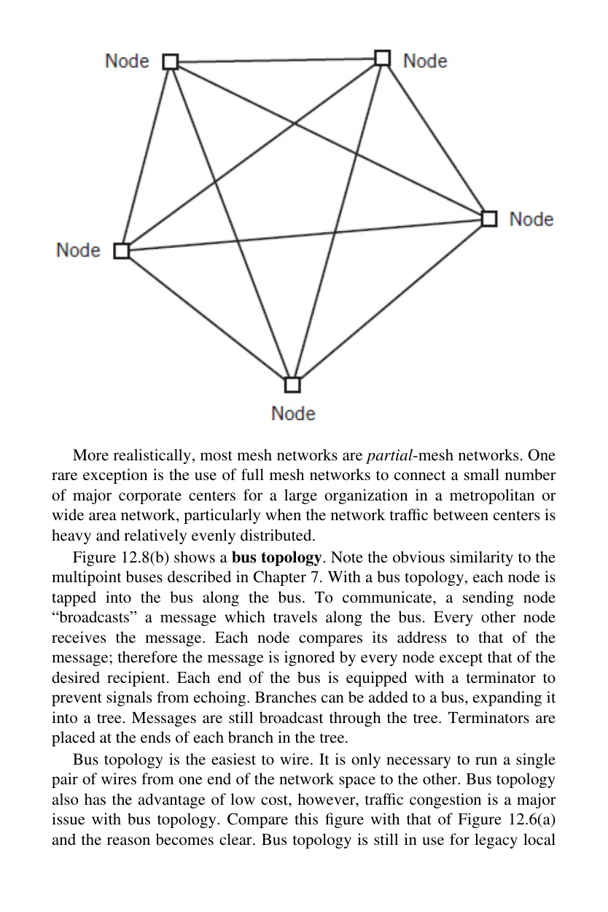
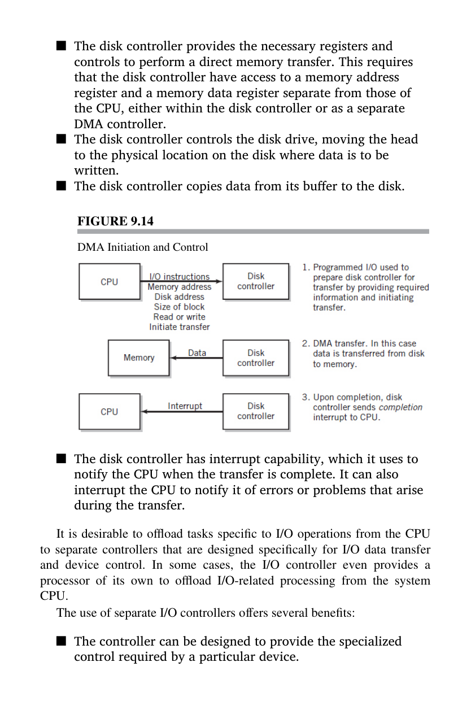

# JCAC Student Guide — Computer Organization and Architecture

> **Realigned to JCAC Module 4 (Computer Organization and Architecture, v2019-10) TOC.** Matches the 9-section course structure from the physical Student Guide (photos IMG_3675–IMG_3677).

**Module 4 scope:** Data Representation → Digital Logic → Computer Organization (LMC + ALU + Memory) → Functional Organization → Multiprocessing → I/O Architecture → Memory Architecture → ARM Processor Architecture → x86 Processor Architecture.

**Posture:** Depth-first — bit-level data layouts, logic-gate building blocks, processor internals, memory hierarchy, and both major ISAs. Pairs with `JCAC-OS.md` (process memory, interrupts, syscalls above the metal) and `JCAC-ACTIVE-EXPLOIT.md` (offensive use of memory corruption, ROP, shellcode).

## 1. Data representation {#data-representation}

### Positional numbering

Every digit has a **place value** equal to the base raised to a power.
- Decimal 307 = 3·10² + 0·10¹ + 7·10⁰ = 307.
- Binary 1101 = 1·2³ + 1·2² + 0·2¹ + 1·2⁰ = 13.
- Hex 0x1F = 1·16¹ + 15·16⁰ = 31.

### Number systems

| Base | Symbols | Use |
|---|---|---|
| 2 (binary) | 0, 1 | Machine language, masks, flags |
| 8 (octal) | 0–7 | UNIX permissions (`0755`) |
| 10 (decimal) | 0–9 | Human |
| 16 (hex) | 0–F | Addresses, bytes, colors, opcodes |

Conversions you must do in your head:

- Byte = 8 bits = 2 hex digits (`0xFF` = 255 = `11111111`).
- 32-bit word = 4 bytes = 8 hex digits.
- 64-bit word = 8 bytes = 16 hex digits.
- Nibble = 4 bits = 1 hex digit.

### Unsigned vs signed integer arithmetic

- **Unsigned** — all N bits are magnitude. Range: 0 to 2^N − 1.
- **Signed (two's complement)** — MSB is sign bit, rest is magnitude. Range: −2^(N−1) to 2^(N−1) − 1.
- Negate a two's complement value: invert all bits, add 1. (`~x + 1` == `-x`.)
- Zero has a single representation; addition/subtraction use the same hardware for signed and unsigned.

| Width | Unsigned max | Signed min | Signed max |
|---|---|---|---|
| 8-bit | 255 | −128 | 127 |
| 16-bit | 65,535 | −32,768 | 32,767 |
| 32-bit | 4,294,967,295 | −2,147,483,648 | 2,147,483,647 |
| 64-bit | ~1.8×10¹⁹ | −9.2×10¹⁸ | 9.2×10¹⁸ |

### Integer overflow vulnerability

- **Unsigned overflow** — wraps to zero (255 + 1 = 0 in 8-bit). CF (Carry Flag) set.
- **Signed overflow** — crosses the sign boundary (127 + 1 = −128 in 8-bit). OF (Overflow Flag) set.
- **Security impact:** attacker-controlled size calculation overflows → allocator returns a small buffer, subsequent copy writes far past it. CVEs from this class: CVE-2002-0639 (OpenSSH), CVE-2017-16544 (BusyBox), CVE-2020-11901 (Treck TCP/IP "Ripple20").
- **CWE-190** — Integer Overflow or Wraparound. **CWE-191** — Integer Underflow.
- Mitigations: explicit range checks before arithmetic, `__builtin_add_overflow` / `checked_add` / `strncpy_s`, unsigned types where negative is impossible.

### Floating-point (IEEE 754)

| Format | Width | Sign | Exponent | Mantissa | Range |
|---|---|---|---|---|---|
| Half (binary16) | 16 | 1 | 5 | 10 | ±65,504 |
| Single (binary32, `float`) | 32 | 1 | 8 | 23 | ~±3.4·10³⁸ |
| Double (binary64, `double`) | 64 | 1 | 11 | 52 | ~±1.8·10³⁰⁸ |

- Special values: ±0, ±∞, NaN, denormals.
- **Not associative**: `(a+b)+c ≠ a+(b+c)` in general due to rounding.
- Exact integer range: 2^24 for single, 2^53 for double. Past that, integers lose precision.
- Security: float-to-int conversions can trigger undefined behavior; comparisons against NaN are always false.

### Text encoding

| Encoding | Width | Notes |
|---|---|---|
| ASCII | 7-bit | 128 chars; `A` = 0x41, `a` = 0x61, `0` = 0x30 |
| Extended ASCII / code pages | 8-bit | Windows-1252, ISO-8859-1 |
| UTF-8 | 1–4 bytes | ASCII-compatible; dominant on web/Unix |
| UTF-16 | 2 or 4 bytes | Windows internal strings; BOM `FF FE` or `FE FF` |
| UTF-32 | 4 bytes | Fixed-width, memory-heavy |

- BOM (byte-order mark) detects endianness of UTF-16/32.
- Encoding confusion (UTF-7, overlong UTF-8) is an exploitation primitive — historically bypassed WAFs and filters.

### Executable formats

| Format | Platform | Header magic |
|---|---|---|
| **PE / PE32+** | Windows | `MZ` (0x4D5A) at file start, `PE\0\0` at e_lfanew offset |
| **ELF** | Linux, BSD, Solaris | `\x7FELF` (0x7F454C46) |
| **Mach-O** | macOS, iOS | `0xFEEDFACE` (32-bit) or `0xFEEDFACF` (64-bit); fat binary `0xCAFEBABE` |
| **COFF** | Legacy UNIX / Windows object files | Varies |

Every format has sections for code (`.text`), data (`.data`/`.rodata`/`.bss`), imports/exports, and relocations. Forensics and malware analysis start with header parsing (`file`, `exiftool`, `pefile`, `readelf -h`).

### Audio / image / video / compression

| File | Magic bytes | Notes |
|---|---|---|
| JPEG | `FF D8 FF` | Lossy |
| PNG | `89 50 4E 47 0D 0A 1A 0A` | Lossless |
| GIF | `47 49 46 38 37 61` or `47 49 46 38 39 61` | Lossless, 256-color |
| PDF | `25 50 44 46` (`%PDF`) | Container |
| ZIP | `50 4B 03 04` (`PK..`) | Container for JAR, DOCX, XLSX |
| WAV | `52 49 46 46` (`RIFF`) | Lossless PCM |
| MP3 | `FF FB` or `49 44 33` (ID3) | Lossy |
| MP4 / MOV | `... 66 74 79 70` (`ftyp` box) | Container |

- **Lossless compression** — exact reconstruction (ZIP, gzip, PNG, FLAC).
- **Lossy compression** — quality traded for size (JPEG, MP3, H.264).
- Magic-byte detection is how `file(1)` and IDS tools classify unknown blobs.

### Order of magnitude

| Prefix | Decimal (SI) | Binary (IEC) |
|---|---|---|
| kilo / kibi | 10³ = 1,000 | 2¹⁰ = 1,024 (KiB) |
| mega / mebi | 10⁶ | 2²⁰ = 1,048,576 (MiB) |
| giga / gibi | 10⁹ | 2³⁰ (GiB) |
| tera / tebi | 10¹² | 2⁴⁰ (TiB) |
| peta / pebi | 10¹⁵ | 2⁵⁰ (PiB) |

- Storage vendors use decimal; OS tools often report binary. A "1 TB" disk shows ~931 GiB in Windows.

## 2. Digital logic {#digital-logic}

### Boolean logic gates

| Gate | Symbol | Truth (A,B → Y) |
|---|---|---|
| NOT | `¬` / `~` / `!` | 0→1, 1→0 |
| AND | `∧` / `&` | 1 only if both 1 |
| OR | `∨` / `|` | 1 if either 1 |
| XOR | `⊕` / `^` | 1 if exactly one 1 |
| NAND | NOT(AND) | 0 only if both 1 |
| NOR | NOT(OR) | 1 only if both 0 |
| XNOR | NOT(XOR) | 1 if both match |

**Universality:** NAND and NOR are each **functionally complete** — any Boolean function can be built from just NAND gates or just NOR gates. This is why they dominate CMOS chip design.

### Bitwise operations

```
  0xA5 = 1010 0101
  0x3C = 0011 1100
  ─────────────────
  AND  = 0010 0100 = 0x24
  OR   = 1011 1101 = 0xBD
  XOR  = 1001 1001 = 0x99
  NOT 0xA5 (8-bit) = 0x5A
```

**Shifts:**
- `<<` left shift (multiply by 2^n, high bits lost).
- `>>` right shift (divide by 2^n; arithmetic vs logical depending on signed type).

**Masks:**
- Clear bits: `x & ~MASK`.
- Set bits: `x | MASK`.
- Toggle bits: `x ^ MASK`.
- Test bit: `(x & (1 << n)) != 0`.

### Digital circuit ↔ truth table ↔ boolean expression

JCAC expects you to convert between three equivalent representations:

1. **Circuit schematic** — gates wired together.
2. **Truth table (I/O table)** — all input combinations, output per row.
3. **Boolean expression** — sum-of-products or product-of-sums.

**Example.** Three inputs A, B, C; output Y = 1 when majority of inputs are 1.

Truth table:

| A | B | C | Y |
|---|---|---|---|
| 0 | 0 | 0 | 0 |
| 0 | 0 | 1 | 0 |
| 0 | 1 | 0 | 0 |
| 0 | 1 | 1 | 1 |
| 1 | 0 | 0 | 0 |
| 1 | 0 | 1 | 1 |
| 1 | 1 | 0 | 1 |
| 1 | 1 | 1 | 1 |

Sum-of-products: Y = A'BC + AB'C + ABC' + ABC.
Simplified: Y = AB + BC + AC.

**Karnaugh map** — graphical minimization for up to 4–6 variables; adjacent 1-cells combine into product terms.

### Combinational vs sequential

- **Combinational** — output depends only on current input (gates, muxes, decoders, adders).
- **Sequential** — output depends on history / stored state (latches, flip-flops, registers, memory, state machines).
- Clock signal coordinates state updates; rising edge vs falling edge latches.
- **D flip-flop** — the fundamental 1-bit memory cell (stores value on clock edge).

## 3. Computer organization — LMC, ALU, memory {#computer-organization}

### Little Man Computer (LMC)

A pedagogical model of the von Neumann architecture. Invented by Stuart Madnick (1965).

**Components:**
- **100 mailboxes** (addresses 00–99), each holds a 3-digit decimal value.
- **Calculator / accumulator** — single register, 3 digits.
- **Program counter** — address of next instruction.
- **Inbox / outbox** — I/O queues.

**Instruction set (3-digit opcodes):**

| Mnemonic | Code | Meaning |
|---|---|---|
| `HLT` | 000 | Halt |
| `ADD xx` | 1xx | Accumulator += mailbox[xx] |
| `SUB xx` | 2xx | Accumulator −= mailbox[xx] |
| `STA xx` | 3xx | mailbox[xx] = accumulator |
| `LDA xx` | 5xx | accumulator = mailbox[xx] |
| `BRA xx` | 6xx | PC = xx (branch always) |
| `BRZ xx` | 7xx | PC = xx if accumulator == 0 |
| `BRP xx` | 8xx | PC = xx if accumulator ≥ 0 |
| `INP` | 901 | Read from inbox into accumulator |
| `OUT` | 902 | Write accumulator to outbox |
| `DAT` | — | Data (assembler directive) |

**Example — add two inputs:**

```
    INP        ; read first number
    STA 99     ; store at mailbox 99
    INP        ; read second number
    ADD 99     ; add mailbox 99
    OUT        ; output result
    HLT
```

LMC teaches the **fetch-decode-execute cycle** without the complexity of real hardware. Every real CPU reduces to this core loop.

### Building an ALU from digital logic

The **Arithmetic Logic Unit** is the heart of the CPU. Build it bottom-up:

**Half-adder** — adds two bits, outputs sum and carry.
- S = A ⊕ B
- Cout = A ∧ B

**Full-adder** — adds two bits + carry-in, outputs sum and carry-out.
- S = A ⊕ B ⊕ Cin
- Cout = (A ∧ B) ∨ (Cin ∧ (A ⊕ B))

**Ripple-carry adder (N-bit)** — chain N full-adders, Cout of each feeds Cin of next. Simple but slow (propagation delay is O(N)).

**Carry-lookahead adder** — precomputes carries in parallel, O(log N) delay. Used in modern CPUs.

**ALU operations:**
- Add / subtract (subtract = add two's complement).
- AND, OR, XOR, NOT (bitwise, per-bit gates).
- Shift left / right (barrel shifter).
- Compare (subtract and check flags without writing result).

A minimal ALU block takes two N-bit inputs, an operation-select signal, and outputs the result plus flag bits (ZF, SF, CF, OF).

### Main memory organization

- Addressable in bytes on x86/ARM.
- Each byte has a unique physical address.
- Memory is laid out in a linear space; the OS maps virtual to physical via page tables.
- Word alignment matters — unaligned loads are slow or faulting on some ISAs.
- **Segment** — legacy division (code, data, stack). Replaced by paging on 64-bit.

**Process memory layout (typical):**

```
  High addresses
  ┌──────────────────┐
  │ Kernel (private) │
  ├──────────────────┤
  │ Stack (↓ grows)  │
  ├──────────────────┤
  │        ↕ gap     │
  ├──────────────────┤
  │ Heap (↑ grows)   │
  ├──────────────────┤
  │ .bss (zero-init) │
  │ .data (init)     │
  │ .rodata (const)  │
  │ .text (code)     │
  ├──────────────────┤
  │ (unmapped)       │
  └──────────────────┘
  Low addresses
```

### Memory vulnerabilities

- **Stack buffer overflow** — writing past end of a local buffer overwrites saved frame pointer / return address / adjacent locals. Classic example: `strcpy(dest, src)` with src larger than dest.
- **Heap buffer overflow** — overflows into adjacent chunk metadata, freeing → unlink-write primitives.
- **Use-after-free (CWE-416)** — pointer reused after `free()`.
- **Double-free (CWE-415)** — `free()` called twice on same pointer.
- **Type confusion (CWE-843)** — object interpreted as wrong type, virtual table dispatch lands on attacker data.
- **Format string (CWE-134)** — `printf(user_input)` — attacker controls format tokens, reads/writes arbitrary memory via `%n`.
- **Mitigations:**
  - **Stack canary** — random value between locals and saved RIP, checked at return.
  - **DEP / NX** — writable pages not executable.
  - **ASLR** — randomize stack/heap/libraries/PIE base.
  - **Control-Flow Integrity (CFI)** — indirect calls validated against whitelist.
  - **Shadow stacks / Intel CET** — hardware return-address protection.

Covered in depth in `JCAC-ACTIVE-EXPLOIT.md`.

### System architecture: ISA vs microarchitecture

- **ISA (Instruction Set Architecture)** — the programmer-visible contract: registers, instructions, memory model, privilege levels. Examples: x86-64, ARMv8, RISC-V, MIPS, PowerPC.
- **Microarchitecture** — the implementation behind the ISA: pipeline depth, cache sizes, branch predictor, execution units. Multiple microarchitectures implement the same ISA (Intel Skylake, Ice Lake, Golden Cove all run x86-64).
- **CISC vs RISC**:
  - CISC (x86): variable-length instructions, many addressing modes, memory operands on most instructions.
  - RISC (ARM, RISC-V, MIPS): fixed-length instructions, load/store architecture (memory access only via dedicated instructions), larger register file.

## 4. Functional organization {#functional-organization}

### Power wall

Around 2004, single-core clock scaling stalled because **P = C·V²·f** — power grows quadratically with voltage and linearly with frequency, and heat dissipation hit physical limits. Industry pivoted to:
- Multicore (parallel throughput at fixed frequency).
- SIMD (data parallelism per instruction).
- Heterogeneous compute (CPU + GPU + AI accelerators).


*Englander — architectural view of how the OS layers sit on top of the storage subsystem and hardware bus fabric.*

### Instruction pipeline

Modern CPUs execute instructions in an **overlapping pipeline** with stages:

1. **Fetch (IF)** — load instruction from instruction cache.
2. **Decode (ID)** — interpret opcode and operands.
3. **Execute (EX)** — ALU op, address calc.
4. **Memory access (MEM)** — load/store if needed.
5. **Writeback (WB)** — commit result to register.

Ideal throughput: 1 instruction per cycle (IPC = 1) at steady state.

### Hazards

- **Data hazards** — instruction needs result of prior instruction still in pipeline. Mitigated by forwarding / register renaming.
- **Control hazards** — branch direction unknown until execute. Mitigated by branch prediction.
- **Structural hazards** — two instructions need the same hardware unit. Mitigated by duplication or scheduling.

### Instruction-level parallelism (ILP) and superscalar

- **Superscalar** — CPU issues multiple instructions per cycle through parallel execution units (multiple ALUs, load units, etc.).
- **Out-of-order execution (OoO)** — the CPU reorders independent instructions around stalls to keep execution units busy. Relies on a reorder buffer (ROB) that commits in program order.
- Modern high-end x86 cores sustain 4–8 IPC in favorable code.

### Multithreaded execution

- **SMT / Hyper-Threading** — one physical core presents two (or more) logical cores by duplicating architectural state (registers, PC) but sharing execution units. Extracts parallelism when one thread stalls on memory.
- Vulnerable to **side-channel leakage** between threads on the same core (L1TF, MDS, "ZombieLoad"). Mitigation: disable SMT or use core scheduling.

### Speculative execution side channels

**Spectre** (CVE-2017-5753, CVE-2017-5715) and **Meltdown** (CVE-2017-5754), disclosed January 2018: attackers leak data through observable cache/branch-predictor state from speculatively-executed but not retired instructions.
- Meltdown — read kernel memory from user mode (x86-specific, bypasses page-table privilege bit).
- Spectre — cross-process / cross-privilege via branch predictor training.
- Mitigations: microcode updates (IBRS, IBPB, STIBP), **KPTI** (Kernel Page-Table Isolation), `lfence`/serializing instructions at trust boundaries, retpolines.
- Subsequent variants: L1TF, MDS, TAA, RIDL, SRBDS, ZombieLoad.

## 5. Multiprocessing {#multiprocessing}

### Flynn's taxonomy

| Model | Instruction streams | Data streams | Example |
|---|---|---|---|
| **SISD** | 1 | 1 | Classical uniprocessor |
| **SIMD** | 1 | Many | Vector extensions (SSE/AVX/NEON), GPU shaders |
| **MISD** | Many | 1 | Rare — fault-tolerant systems (Space Shuttle) |
| **MIMD** | Many | Many | Multicore CPU, cluster, cloud |

### Multicore

- Multiple independent cores on one die, each with private L1/L2 caches, shared L3 and memory controller.
- Threads scheduled across cores by the OS.
- Performance scales with parallelizable fraction of workload (**Amdahl's Law**: speedup ≤ 1 / (s + p/N)).

### Short vector (SIMD)

- SSE (128-bit), AVX/AVX2 (256-bit), AVX-512 (512-bit) on x86.
- NEON (128-bit), SVE (scalable) on ARM.
- One instruction processes multiple data elements in parallel.
- Dominant use: media codecs, crypto (AES-NI), memcpy/memset, numerical code, string search.

### GPU

- Hundreds to tens of thousands of simple cores.
- SIMD-at-scale (SIMT — Single Instruction Multiple Threads): a warp/wavefront executes the same instruction across 32–64 threads.
- Massive FP throughput, poor branchy-code performance.
- Modern uses: graphics, ML training/inference, password cracking (Hashcat), crypto mining.

### Multiprocessor systems

- **SMP (Symmetric Multiprocessing)** — equal access to memory for all CPUs.
- **NUMA (Non-Uniform Memory Access)** — memory is partitioned; local access is fast, remote access over interconnect (QPI / UPI / Infinity Fabric) is slower. Scheduling must respect NUMA locality.
- **Cluster** — independent nodes connected by network, running distributed-memory workloads (MPI, Hadoop, Spark).

### Reconfigurable logic (FPGA)

- Field-Programmable Gate Array — hardware reprogrammable via HDL (VHDL/Verilog).
- Use cases: network packet processing (SmartNICs), high-frequency trading, signal processing, crypto acceleration.
- Slower per-MHz than ASICs but reprogrammable.

### Performance metrics

- **MIPS** — million instructions per second (misleading across ISAs).
- **FLOPS** — floating-point ops per second.
- **IPC** — instructions per cycle (microarchitectural).
- **Throughput vs latency** — batch jobs care about throughput; interactive jobs care about latency.
- **Amdahl's Law** — parallel speedup ceiling.
- **Gustafson's Law** — in practice workload grows with resources, so scaling is better than Amdahl suggests.

## 6. Input/Output architecture {#io-architecture}

### Buses

- **Bus** — a shared set of wires carrying address, data, and control.
- **Topology** — star (through hub), shared bus (party line), point-to-point (PCIe, QPI).
- **Arbitration** — protocol to decide which device drives the bus next (daisy-chain, centralized, distributed).
- **Protocol** — handshake (request, grant, acknowledge).

### I/O interfaces / buses

| Bus | Use |
|---|---|
| **PCI / PCIe** | Expansion cards (GPU, NIC, NVMe SSD). PCIe uses serial lanes (x1, x4, x8, x16). |
| **USB** | Peripheral devices; host-controlled, tiered star topology. |
| **SATA / SAS** | Disk interfaces. |
| **NVMe** | SSD protocol over PCIe; high queue depth. |
| **Thunderbolt** | USB-C form factor carrying PCIe + DisplayPort. |
| **I²C / SPI** | Embedded / low-speed peripheral. |


*Englander — system I/O bus fabric: CPU/memory bus feeds a bus bridge, which branches into peripheral buses (PCIe, USB, SATA) to reach each class of device.*

### I/O control methods

| Method | How data moves | Pros / Cons |
|---|---|---|
| **Memory-mapped I/O (MMIO)** | Device registers appear at memory addresses; read/write like memory. | Simple programming model; consumes address space. |
| **Port-mapped I/O (PIO)** | Dedicated `in`/`out` instructions (x86 `IN`/`OUT`). | Separate address space; legacy/peripheral. |
| **Interrupt-driven I/O** | Device raises IRQ when ready; CPU handles via ISR. | CPU doesn't block; latency-sensitive peripherals. |
| **DMA (Direct Memory Access)** | DMA controller moves data to/from memory without CPU. CPU interrupted at completion. | High throughput (disk, NIC, GPU); bypasses CPU for bulk transfers. |

**DMA security:** devices with DMA can read/write host memory without OS mediation. Historical attack: DMA over FireWire / Thunderbolt to dump memory. Mitigation: **IOMMU** (Intel VT-d, AMD-Vi) restricts device access to specific memory regions.


*Englander — DMA controller moves data between device and RAM without involving the CPU; CPU is interrupted only at completion. Eliminates per-byte CPU overhead for disk/NIC bulk transfers.*

## 7. Memory architecture {#memory-architecture}

### Memory hierarchy

| Level | Typical size | Typical latency |
|---|---|---|
| Registers | 8–32 × word size | <1 ns |
| L1 cache | 32–64 KB | ~1 ns |
| L2 cache | 256 KB–1 MB | ~3 ns |
| L3 cache | 4–64 MB | ~10 ns |
| DRAM | GBs | ~100 ns |
| NVMe SSD | TBs | ~100 µs |
| SATA SSD | TBs | ~500 µs |
| HDD | TBs | ~10 ms |
| Tape | PBs | ~seconds |

### CPU cache

- **Temporal locality** — recently-accessed data likely accessed again soon.
- **Spatial locality** — nearby memory likely accessed soon.
- **Cache line** — unit of transfer; 64 bytes on x86, 64 bytes on most ARM.
- **Cache coherency** (MESI, MOESI) keeps per-core caches consistent.
- Cache timing is the basis of many side-channel attacks.

### Cache mapping schemes

| Scheme | Description | Trade-off |
|---|---|---|
| **Direct-mapped** | Each memory block maps to exactly one cache line: `index = addr mod N`. | Fast, but high conflict miss rate. |
| **Fully associative** | Block can go anywhere in cache; CAM search. | No conflict misses, expensive hardware. |
| **N-way set-associative** | Memory maps to a set of N lines; within set fully associative. | Balanced; typical modern L1 (8-way), L2 (8–16-way), L3 (16-way+). |

### Replacement policies

- **LRU (Least Recently Used)** — evict the oldest-accessed line.
- **FIFO** — oldest inserted.
- **Random** — simple, surprisingly close to LRU in practice.
- **Pseudo-LRU (tree-PLRU)** — approximation used by real CPUs.

### Write policies

- **Write-through** — every write goes to cache and memory. Simple, high memory traffic.
- **Write-back** — writes land in cache, marked dirty; flushed on eviction. Fast, needs dirty-bit tracking.
- **Write-allocate** — on write miss, load the line into cache first.
- **No-write-allocate** — on write miss, write directly to memory, bypass cache.

### Multi-level caches

Split design: per-core L1 (often split into L1I and L1D), per-core L2, shared L3. Inclusive (L2 contains L1) vs exclusive (L2 holds only victims) designs trade capacity against simplicity.

### Primary storage

| Type | Characteristics |
|---|---|
| **SRAM** | Fast, expensive, low density; used for cache. |
| **DRAM** | Slower, cheap, high density; used for main memory. Requires periodic refresh. |
| **ROM** | Read-only; boot firmware. |
| **PROM** | Programmable once. |
| **EPROM** | Erasable via UV. |
| **EEPROM / Flash** | Electrically erasable; SSDs, BIOS/UEFI flash chips. |

### Secondary storage

| Technology | Notes |
|---|---|
| **HDD (magnetic)** | Rotating platters, seek + rotational latency, ~10 ms. |
| **SSD (flash)** | No moving parts, wear leveling, TRIM; SATA or NVMe. |
| **Hybrid (SSHD)** | HDD + small SSD cache. |

### RAID

| Level | Minimum disks | Fault tolerance | Capacity | Notes |
|---|---|---|---|---|
| **RAID 0** | 2 | None | 100% | Striping; speed, no redundancy. |
| **RAID 1** | 2 | 1 disk | 50% | Mirror; simple, costly. |
| **RAID 5** | 3 | 1 disk | (N−1)/N | Striping + distributed parity. Write amplification. |
| **RAID 6** | 4 | 2 disks | (N−2)/N | Double parity. Survives two failures. |
| **RAID 10 (1+0)** | 4 | 1 per mirror pair | 50% | Mirror + stripe. Fast + resilient. |
| **RAID 50 / 60** | 6+ | Per group | Varies | Striped RAID 5 / 6 groups. |

- RAID is not backup — it protects against drive failure, not accidental deletion, ransomware, or corruption.

### External storage

- **Tape (LTO)** — sequential access, huge capacity, slow seek; archival / long-term backup.
- **Optical (CD/DVD/Blu-ray)** — largely replaced by flash, still used for read-only distribution and long-term archive (M-DISC).

## 8. ARM processor architecture {#arm-architecture}

### ARM at a glance

- **RISC** ISA: fixed-length 32-bit instructions (ARM mode), 16-bit (Thumb), or mixed (Thumb-2).
- Load/store architecture — arithmetic only on registers.
- Dominant in mobile (smartphones, tablets), embedded, IoT, Apple Silicon, AWS Graviton.
- Versions: ARMv7 (32-bit), ARMv8 (introduced 64-bit AArch64), ARMv9.

### Registers (AArch32 / ARMv7)

- **r0–r12** — general-purpose (13).
- **r13 (SP)** — stack pointer.
- **r14 (LR)** — link register (return address from `BL`).
- **r15 (PC)** — program counter.
- **CPSR** — Current Program Status Register (flags: N Z C V, mode bits, interrupt disables, Thumb bit T).
- **SPSR** — Saved Program Status Register (per exception mode, holds previous CPSR on exception).
- Banked registers per mode (FIQ has its own r8–r14, other modes have their own r13/r14).

### Registers (AArch64 / ARMv8)

- **x0–x30** — 31 general-purpose 64-bit registers. (`w0–w30` are the low 32-bit halves.)
- **x30** — link register (LR).
- **SP** — dedicated stack pointer (not in GPR bank).
- **PC** — not directly addressable as a register; modified via branches.
- **NZCV** — condition flags (Negative, Zero, Carry, oVerflow).
- **V0–V31** — 128-bit SIMD/FP registers (NEON).

### Calling convention — AAPCS / AAPCS64

- **AArch32 AAPCS**: args in r0–r3, return in r0 (or r0:r1 for 64-bit). Callee-saves r4–r11, LR.
- **AAPCS64**: args in x0–x7, return in x0. Callee-saves x19–x29.
- Stack is 16-byte aligned at function entry.

### Instruction categories

**Data movement:**
- `MOV Rd, Rs` — register to register.
- `LDR Rd, [Rn, #imm]` — load from memory.
- `STR Rd, [Rn, #imm]` — store to memory.
- `LDP / STP` (AArch64) — load/store pair.

**Arithmetic:**
- `ADD`, `SUB`, `MUL`, `SDIV` / `UDIV`.
- Condition-flag-setting variants: `ADDS`, `SUBS`, `CMP` (= SUBS with discarded result), `CMN`.

**Boolean logic:**
- `AND`, `ORR`, `EOR` (XOR), `BIC` (clear bits = AND NOT), `MVN` (move not).
- Shifts applied as operand modifiers: `ADD R0, R1, R2, LSL #2` computes R0 = R1 + (R2 << 2).

**Flow control:**
- `B label` — branch always.
- `BL label` — branch with link (writes return addr to LR, then branches) — equivalent to `call`.
- `BX Rn` — branch and exchange (change ARM/Thumb mode based on low bit).
- `BLX` — `BL` + mode exchange.
- `BR Rn` (AArch64) — branch to register.
- Conditional branches: `BEQ`, `BNE`, `BGT`, `BLE`, `BLT`, `BGE`, `BHI`, `BLS` (and others).

**Stack:**
- `PUSH {r4-r7, lr}` / `POP {r4-r7, pc}` (AArch32) — multi-register push/pop.
- `STP x29, x30, [sp, #-16]!` / `LDP x29, x30, [sp], #16` (AArch64) — save/restore frame pointer + LR.

**Subroutine:**
- Call: `BL func` writes LR = PC_after, branches to `func`.
- Return: `BX LR` (AArch32) or `RET` (AArch64) — branches to LR.
- Leaf functions skip saving LR.

### ARM vs x86 — key differences for exploitation

| Aspect | ARM | x86 |
|---|---|---|
| Return address | **LR register** (only pushed to stack in non-leaf functions) | Pushed on stack by `CALL` |
| Instruction length | Fixed (4 bytes ARM / 2 bytes Thumb) | Variable (1–15 bytes) |
| Endianness | Bi-endian; Linux/Android default little | Little |
| Calling convention | r0–r3 / x0–x7 args | RCX/RDX/R8/R9 (Win) or RDI/RSI/RDX/RCX/R8/R9 (SysV) |
| Memory access | Load/store only | Most instructions can have memory operands |
| Stack frame | FP in r11 (AArch32) or x29 (AArch64), LR | RBP, saved RIP |

**Exploitation note:** ROP on ARM targets **gadget suffixes ending in `POP {..., PC}` or `LDM sp!, {..., pc}`**, not `RET`. Since LR is a register, leaf-function overflows don't automatically reach the stack's saved return address.

## 9. x86 / x86-64 processor architecture {#x86-registers}

### General-purpose registers — 64-bit mode

In long mode (x86-64), there are 16 GPRs. Each has addressable sub-widths:

| 64-bit | 32-bit (low) | 16-bit | 8-bit | 8-bit (high, legacy A–D only) |
|---|---|---|---|---|
| RAX | EAX | AX | AL | AH |
| RBX | EBX | BX | BL | BH |
| RCX | ECX | CX | CL | CH |
| RDX | EDX | DX | DL | DH |
| RSI | ESI | SI | SIL | — |
| RDI | EDI | DI | DIL | — |
| RBP | EBP | BP | BPL | — |
| RSP | ESP | SP | SPL | — |
| R8 – R15 | R8D – R15D | R8W – R15W | R8B – R15B | — |

### System V AMD64 calling convention (Linux / macOS)

- **RDI** — 1st integer/pointer arg
- **RSI** — 2nd
- **RDX** — 3rd
- **RCX** — 4th
- **R8** — 5th
- **R9** — 6th
- **RAX** — return value / syscall number
- **RSP** — stack pointer
- **RBP** — base pointer / frame base (optional in modern code)
- Callee-saved: **RBX, RBP, R12, R13, R14, R15**
- Caller-saved: **RAX, RCX, RDX, RSI, RDI, R8–R11**
- **Red zone** — 128 bytes below RSP reserved for leaf functions.

### Windows x64 calling convention

- Args: **RCX, RDX, R8, R9** (first four); rest on stack.
- Caller reserves **32-byte shadow space** on stack for those four registers.
- Stack 16-byte aligned before call.
- Callee-saved: RBX, RBP, RDI, RSI, RSP, R12–R15, XMM6–XMM15.

### Instruction pointer and flags

- **RIP** — next instruction; not directly writable (`jmp`, `call`, `ret` modify).
- **RFLAGS** — status flags:
  - **ZF** — Zero Flag (result was 0)
  - **SF** — Sign Flag (MSB of result, i.e., sign)
  - **CF** — Carry Flag (unsigned overflow)
  - **OF** — Overflow Flag (signed overflow)
  - **PF** — Parity Flag
  - **AF** — Auxiliary Carry (BCD ops)
  - **DF** — Direction Flag (string ops)
  - **IF** — Interrupt Enable Flag

### Segment registers

- **CS, DS, ES, FS, GS, SS** — code, data, extra, F/G, stack segments.
- In long mode most have zero base; **FS** and **GS** retained for thread-local:
  - Windows: TEB at `GS:[0]`, PEB at `GS:[0x60]`.
  - Linux: TCB at `FS:[0]`.

### Control and debug registers (kernel)

- **CR0** — PE (protected-enable), PG (paging), WP (write-protect), and more.
- **CR2** — last page-fault virtual address.
- **CR3** — base of page directory (per-process address space).
- **CR4** — extended features (VMX, SMEP, SMAP, PCID, LA57, etc.).
- **DR0–DR3, DR6, DR7** — hardware breakpoints.
- **MSRs** — Model-Specific Registers (read/write via `rdmsr` / `wrmsr`); e.g., `IA32_EFER`, `IA32_LSTAR` (syscall entry), `IA32_SYSENTER_*`.

### SSE / AVX vector registers

- **XMM0–XMM15** (128-bit) — SSE, SSE2, SSE3, SSE4.
- **YMM0–YMM15** (256-bit) — AVX / AVX2.
- **ZMM0–ZMM31** (512-bit) — AVX-512.

Used for SIMD arithmetic, FP, crypto primitives (AES-NI, SHA extensions), memcpy/memset fast paths.

### Stack operations

- `PUSH reg` — decrements RSP by 8 (in 64-bit), writes reg to [RSP].
- `POP reg` — reads [RSP] into reg, increments RSP by 8.
- Stack **grows downward** (toward lower addresses) on x86/x64.
- **CALL** — pushes RIP of next instruction, jumps to target.
- **RET** — pops return address into RIP.

**Exploitation relevance:** a stack overflow that reaches the saved RIP lets an attacker redirect execution by overwriting the return address. This is the basis of classic stack smashing, ROP, and the motivation for stack canaries, DEP/NX, ASLR, and Intel CET shadow stacks.

### Common x86 instructions {#instructions}

**Data movement:**

| Instruction | Purpose |
|---|---|
| `mov dst, src` | Move src to dst (no flag update) |
| `push reg` | Push reg onto stack |
| `pop reg` | Pop stack top into reg |
| `lea dst, [mem]` | Load effective address (no memory access) |
| `xchg a, b` | Exchange registers |

**Arithmetic / logic:**

| Instruction | Purpose |
|---|---|
| `add / sub / mul / div` | Arithmetic |
| `inc / dec` | Increment / decrement |
| `and / or / xor / not` | Bitwise |
| `shl / shr / sar` | Shifts (logical / arithmetic) |
| `cmp a, b` | Compare (sets flags from a-b) |
| `test a, b` | Bitwise AND, sets flags only |

**Control flow:**

| Instruction | Purpose |
|---|---|
| `jmp tgt` | Unconditional jump |
| `je / jz` | Jump if equal / zero |
| `jne / jnz` | Jump if not equal / nonzero |
| `jg / jl / jge / jle` | Signed compare jumps |
| `ja / jb / jae / jbe` | Unsigned compare jumps |
| `call tgt` | Push RIP, jump |
| `ret` | Pop RIP |
| `int 0x80` / `syscall` | System call |

### Example: simple function in assembly

```asm
; int add(int a, int b) { return a + b; }
; Linux x86-64 System V ABI
add:
    mov rax, rdi       ; RAX = a (first arg)
    add rax, rsi       ; RAX += b (second arg)
    ret                ; return value in RAX
```

## Endianness

- **Little-endian** — low byte at low address. x86 / x86-64, ARM (Linux default), most modern CPUs.
- **Big-endian** — high byte at low address. **Network byte order** (`htonl`, `htons`), classic PowerPC, SPARC, MIPS (often).
- 0x12345678 stored little-endian in memory: `78 56 34 12`.
- Protocol dissection requires knowing wire-format endianness (usually big-endian for network protocols).

## Exam-testable concepts

- How many GPRs does x86-64 have? **16.**
- How many GPRs does AArch64 have? **31 (x0–x30), plus a dedicated SP.**
- On AArch64, which register holds the return address? **x30 (LR).**
- On x86-64, where is the return address? **Top of stack (RSP).**
- Which register holds a function's 1st integer arg on Linux x86-64? **RDI.** On Windows x64? **RCX.** On AArch64? **x0.**
- Which flag indicates an unsigned arithmetic overflow? **CF (Carry Flag).** Signed? **OF (Overflow Flag).**
- 64-bit word size in hex digits? **16.**
- What does `xor rax, rax` do? **Zeros RAX (smaller and faster than `mov rax, 0`).**
- Universal gate (any logic from it alone)? **NAND (or NOR).**
- What x86 instruction pushes return address and jumps? **`CALL`.** Pops into RIP? **`RET`.**
- ARM equivalent of `CALL`? **`BL`** (writes LR, branches). Return? **`BX LR`** (AArch32) or **`RET`** (AArch64).
- Typical x86 cache line size? **64 bytes.**
- 2018 speculative-execution side channels? **Spectre and Meltdown.**
- LMC accumulator purpose? **Single register that holds intermediate results; all arithmetic flows through it.**
- LMC opcodes to add two input numbers? **`INP`, `STA`, `INP`, `ADD`, `OUT`, `HLT`.**
- RISC vs CISC? **RISC = fixed-length, load/store, many registers (ARM). CISC = variable length, memory operands, fewer registers (x86).**
- Flynn's four categories? **SISD, SIMD, MISD, MIMD.**
- RAID 5 minimum disks? **3.** Survives how many failures? **1.** RAID 6 minimum? **4.** Survives? **2.**
- RAID 0 redundancy? **None — pure striping.**
- DMA primary benefit? **CPU not involved in bulk transfer → higher I/O throughput.**
- Bus topology used by PCIe? **Point-to-point (serial lanes).**
- Cache mapping schemes? **Direct-mapped, fully associative, N-way set-associative.**
- Write-back cache vs write-through? **Write-back defers memory write until eviction; write-through writes every time.**
- File magic `7F 45 4C 46`? **ELF.** `4D 5A` at offset 0? **PE/MZ.** `FF D8 FF`? **JPEG.**
- Two's complement negation? **Invert all bits, add 1.**
- Classic C stack-buffer-overflow primitive? **`strcpy`, `strcat`, `gets`, `sprintf` without bounds.**
- Stack canary's role? **Random value between local buffers and saved return address; mismatch at function epilogue aborts program.**
- ISA vs microarchitecture? **ISA = programmer-visible contract (registers + instructions); microarch = implementation (pipeline, cache, predictors).**

## Cross-references

- **[Intel 64 and IA-32 SDM Vol 1](https://cdrdv2-public.intel.com/671436/253665-sdm-vol-1.pdf)** (free) — authoritative x86 reference
- **[ARM Architecture Reference Manual for A-profile](https://developer.arm.com/documentation/ddi0487/latest)** (free) — authoritative ARM reference
- **[OST2 — Architecture 1001 x86-64 Assembly](https://p.ost2.fyi/courses/course-v1:OpenSecurityTraining2+Arch1001_x86-64_Asm+2021_v1/about)** (free)
- **[OST2 — Architecture 2001 ARM64](https://ost2.fyi/Arch2001.html)** (free)
- **[BOOK-ASM-PROG](#references/BOOK-ASM-PROG)** (on disk) — Mastering Assembly Programming
- **[BOOK-ARCH-COMP-HW](#references/BOOK-ARCH-COMP-HW)** (on disk) — Architecture of Computer Hardware 5th Ed
- **JCAC-OS** — builds on this for process memory, interrupts, traps
- **JCAC-WINDOWS** / **JCAC-UNIX-LINUX** — OS use of registers, stack, syscalls
- **JCAC-ACTIVE-EXPLOIT** — memory corruption, ROP, shellcode, exploitation primitives built on this foundation
