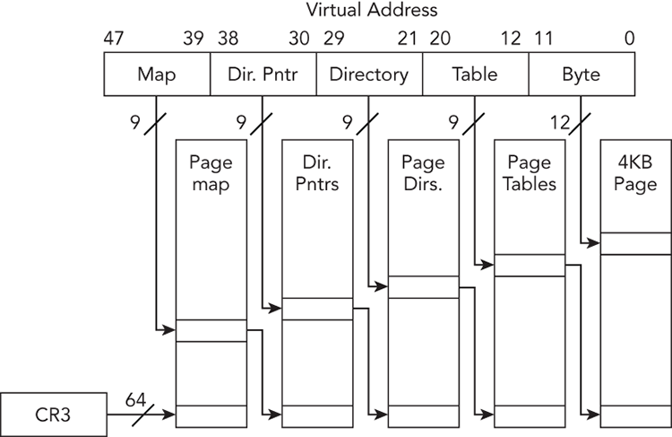
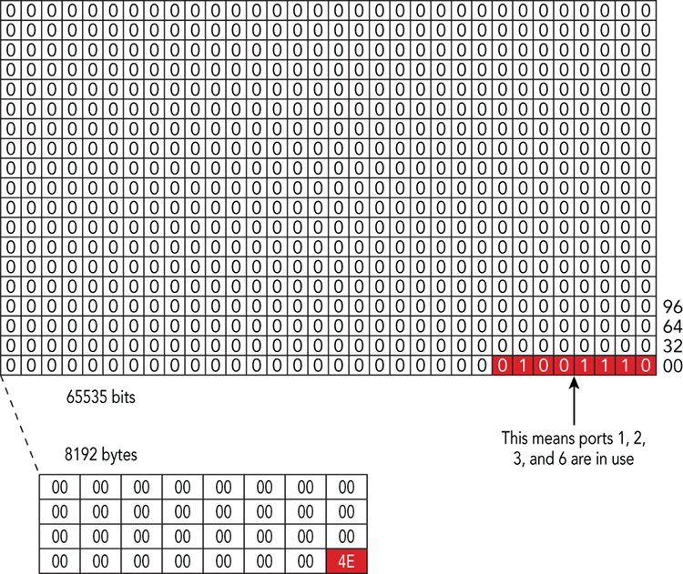
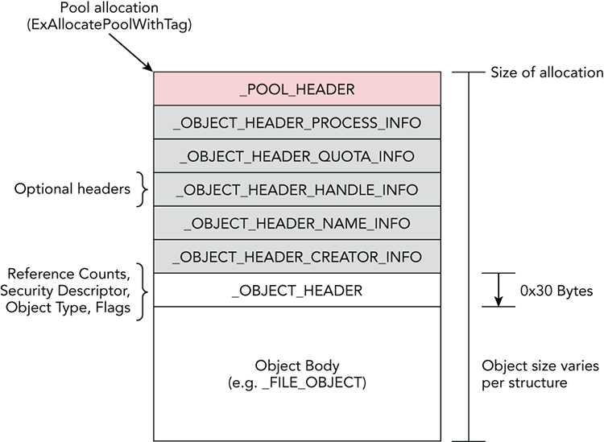
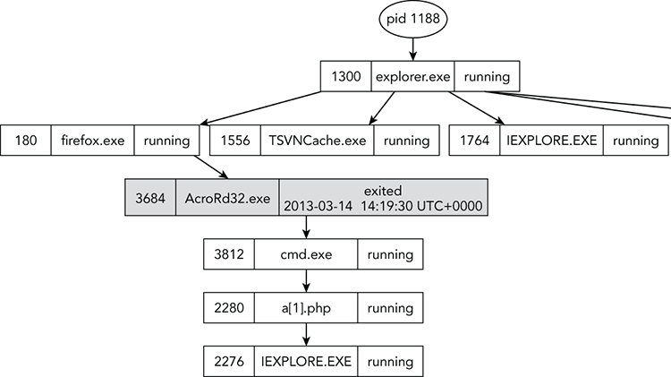

# JCAC Student Guide — Forensic Methodology and Malware Analysis

> **Study guide with depth.** Bib scope: data recovery, digital-forensics methodology, disk preparation. Goes beyond the JCAC sprint.

**Bib study scope:** Data recovery; digital forensics methodology; disk preparation.

## Digital-forensics methodology (the framework) {#methodology}

Standard DFIR lifecycle (maps to NIST SP 800-86, ISO/IEC 27037):

1. **Identification** — recognize evidence exists and should be collected.
2. **Preservation** — protect evidence from alteration (chain of custody begins).
3. **Collection / Acquisition** — capture evidence in a forensically-sound way (write-blocked, imaged, hashed).
4. **Examination** — extract artifacts from the acquired data.
5. **Analysis** — interpret artifacts to answer investigative questions.
6. **Presentation / Reporting** — document findings for stakeholders (legal, command).

Parallel to this, **Chain of Custody** is maintained throughout: every handoff is logged with who, when, where, condition.

### Order of Volatility (RFC 3227)

Collect most volatile evidence first, because it disappears fastest:

1. **CPU registers, CPU cache** (microseconds).
2. **Memory (RAM)** — contents of running processes, encryption keys, malware residents.
3. **Running processes, network connections, routing tables, ARP cache, kernel stats** (/proc on Linux).
4. **Temporary filesystems** (/tmp, %TEMP%).
5. **Disk / persistent storage**.
6. **Remote logging and monitoring data**.
7. **Physical configuration, network topology**.
8. **Archival media / backups**.

## Disk preparation for forensic work {#disk-prep}

### Write-blockers

Hardware or software interposers that **prevent any writes to the evidence drive** while allowing reads. Required for court-admissible evidence (and best practice regardless).

- **Hardware write-blockers** — CRU WiebeTech, Tableau, Logicube. Physical device between suspect drive and forensic workstation.
- **Software write-blockers** — mount-time mount options. Linux: `mount -o ro,noload` (ext) or `mount -o ro,nodev,noexec,nosuid`. FTK Imager on Windows can do read-only mounts.

### Forensic imaging

- **Bit-for-bit copy** (not file-level).
- **Formats:**
  - **Raw (.dd, .img)** — uncompressed bit-for-bit. Simple, universal.
  - **E01 / EWF (Expert Witness Format)** — compressed, with embedded metadata + hashes. Produced by EnCase, FTK Imager, `ewfacquire`.
  - **AFF4** — modern open forensic format.
- **Tools:**
  - `dd` — classic but no integrity checking built in.
  - `dcfldd` / `dc3dd` — DoD-patched `dd` with hash-on-read.
  - `ewfacquire` — creates E01.
  - FTK Imager — GUI, creates E01 or raw.
  - Guymager — GUI, Linux.

### Hashing — verifying integrity

Hash the original (via write-blocker) and hash the image; they must match.

```bash
# MD5 (historically used; collision-weak but still checked)
md5sum image.dd

# SHA-256 (current standard)
sha256sum image.dd

# Both at once during imaging
dc3dd if=/dev/sdb of=evidence.dd hash=sha256 log=imaging.log
```

Record hashes in the chain-of-custody document. Court-room practice: MD5 + SHA-1 + SHA-256 for defense in depth against any single hash collision.

### Preparing the working copy

**Never analyze the original.** Standard flow:

1. Acquire with write-blocker → evidence.E01 (or .dd).
2. Hash.
3. Copy image to analysis workstation.
4. Mount read-only on the analysis box (`mount -o ro,loop,noatime`).
5. Work on mount / extracted artifacts.
6. Re-hash original if questioned.

## Data recovery {#recovery}

Two main categories:

### File-system-level recovery

- **Undelete** — most filesystems just unlink; data blocks remain until overwritten.
  - NTFS: entry in `$MFT` is marked deleted; file data blocks still in place until allocator reuses them.
  - ext4: deleted file's inode has `i_size` and block pointers cleared, complicating recovery — tools like `extundelete` walk the journal for pre-deletion states.
- **Tools:** TestDisk, PhotoRec, `extundelete`, Recuva (Windows), `fls`/`icat` from The Sleuth Kit.

### File-carving (filesystem-independent)

Scan raw bytes for known **file-header magic** and extract whatever follows until an end marker or sane size.

- JPEG: `\xff\xd8\xff\xe0` or `\xff\xd8\xff\xe1` start.
- PNG: `\x89PNG\r\n\x1a\n` start.
- PDF: `%PDF-` start.
- ZIP: `PK\x03\x04` start.
- EXE (PE): `MZ` start, `PE\0\0` signature later.

Tools: **PhotoRec**, **Scalpel**, **Foremost**, **bulk_extractor**.

### Slack space and unallocated

- **File slack** — space between end of file data and end of the final allocated cluster (often contains previous file's data).
- **Unallocated** — clusters not currently assigned to any file; often rich with deleted-file fragments.

## Memory forensics {#memory}


*Ligh, Case, Levy, Walters — Art of Memory Forensics, early chapter figure illustrating memory acquisition or analysis workflow.*


*Art of Memory Forensics — figure showing Windows process or kernel-object structure (EPROCESS, ETHREAD, or related).*

Capture RAM before shutdown. Use Volatility (or Rekall) for analysis.

- **Windows acquisition:** FTK Imager, Magnet RAM Capture, winpmem, DumpIt.
- **Linux acquisition:** LiME (kernel module) — compile against target kernel version, load, dump.
- **Mac acquisition:** osxpmem.

### Volatility key plugins (Windows)

| Plugin | Purpose |
|---|---|
| `imageinfo` / `windows.info` | Identify OS version, architecture |
| `pslist`, `pstree`, `psscan` | Running processes (live list / tree / pool scan) |
| `cmdline` | Command-line args of processes |
| `handles`, `filescan` | Open handles, files on disk |
| `netscan` (v3) | Network connections and listeners |
| `malfind` | Find injected / hidden code segments |
| `dlllist`, `ldrmodules` | Loaded DLLs; spot DLL injection |
| `hashdump`, `lsadump` | Credential hashes (if suspect system can extract) |
| `hivelist`, `printkey` | Registry hive parsing |
| `yarascan` | Scan memory with YARA rules |

### Indicators of malware in memory

- Process with unexpected parent (e.g., `explorer.exe` spawning `cmd.exe`).
- Unsigned executable memory region (malfind result).
- Process name typosquatting system binaries (`svchost.exe` vs `svch0st.exe`).
- Injected threads (`psxview` cross-view).
- Unexpected network connections.

## The Sleuth Kit (TSK) — command-line forensics {#sleuthkit}

Open-source CLI suite for low-level filesystem analysis. The backbone of Autopsy.

| Tool | Layer | Purpose |
|---|---|---|
| `mmls` | Volume | List partition table (MBR/GPT) |
| `fsstat` | Filesystem | Filesystem metadata (type, block size, inode count) |
| `fls` | File | List files in a filesystem (including deleted) |
| `istat` | Inode | Dump metadata for a specific inode/MFT record |
| `icat` | Inode | Extract file content by inode |
| `blkcat` | Block | Dump raw block contents |
| `blkls` | Block | List unallocated blocks (→ carve) |
| `jls` / `jcat` | Journal | Parse filesystem journal (ext3/4) |
| `tsk_recover` | Convenience | Recover deleted files to output dir |

Example workflow:

```bash
# Identify partitions in image
mmls evidence.dd

# Inspect filesystem starting at sector 2048
fsstat -o 2048 evidence.dd

# List root directory, show deleted (*) entries
fls -o 2048 -r evidence.dd

# Extract file by inode
icat -o 2048 evidence.dd 128 > recovered.bin

# Carve unallocated space
blkls -o 2048 evidence.dd > unalloc.bin
foremost -i unalloc.bin -o carved/
```

## Timeline creation {#timeline}

Unified timelines correlate filesystem, registry, event-log, browser, and log artifacts into a single chronological view — the heart of intrusion reconstruction.

- **`mactime`** (TSK) — classic MAC-time body-file timeline.
- **`log2timeline.py` / `plaso`** — the modern super-timeline tool. 200+ parsers.
- **Super Timeline output** — `.plaso` storage file → `psort.py` filters to CSV / Elasticsearch / L2TCSV.
- **Timeline Explorer (EZ Tools)** — Eric Zimmerman's Windows timeline viewer.
- **Timesketch** — web-based collaborative timeline analysis.

```bash
# Generate super-timeline from disk image
log2timeline.py timeline.plaso evidence.dd

# Filter to date range and output CSV
psort.py -o l2tcsv -w timeline.csv timeline.plaso \
  "date > '2025-01-01' AND date < '2025-02-01'"
```


*Art of Memory Forensics — figure from the registry chapter showing hive structure or key/value layout in memory.*

## Windows registry forensic artifacts {#registry-forensics}

The registry is a forensic goldmine — program execution, USB insertion, user activity, persistence all leave fingerprints.

| Artifact | Hive | Purpose |
|---|---|---|
| **ShimCache / AppCompatCache** | SYSTEM | Program execution evidence (path, size, timestamp) |
| **AmCache (`Amcache.hve`)** | Separate | Executed programs with SHA-1 hash (Win8+) |
| **UserAssist** | NTUSER.DAT | GUI-launched programs per user (ROT-13 encoded) |
| **Shellbags** | NTUSER.DAT / UsrClass.dat | Folders browsed in Explorer |
| **MUICache** | UsrClass.dat | Applications that displayed a window |
| **RecentDocs** | NTUSER.DAT | Recently opened documents by extension |
| **Typed URLs / Paths** | NTUSER.DAT | Explorer address-bar history |
| **Run / RunOnce** | NTUSER.DAT, SOFTWARE | Autostart persistence |
| **Services** | SYSTEM | Service persistence (malware favorite) |
| **USBSTOR** | SYSTEM | USB device insertion history |
| **Prefetch** (`.pf` files) | Not registry | Program execution count + last-run times |
| **SRUM (`SRUDB.dat`)** | Not registry | System Resource Usage Monitor — network/app usage per user |

**Tools:** RegRipper, Registry Explorer (EZ Tools), AmcacheParser, ShimCacheParser, ShellBags Explorer.

## YARA — the pattern-matching language for malware {#yara}

YARA rules describe patterns (strings, bytes, structures) that identify malware families. Used by AV, EDR, threat-intel, and forensic memory scanning.

**Rule anatomy:**

```yara
rule APT_Backdoor_XYZ {
    meta:
        author      = "analyst"
        date        = "2026-04-01"
        description = "Detects XYZ backdoor variants"
        family      = "XYZ"
        tlp         = "AMBER"
        hash        = "a1b2c3d4e5f6..."

    strings:
        $str_cmd    = "cmd.exe /c " ascii
        $str_c2     = "xyz-c2.example.net" ascii wide
        $mutex      = "Global\\XYZ_MUTEX_2025" ascii
        $hex_magic  = { 4D 5A 90 00 [4-8] 50 45 00 00 }
        $regex_ua   = /Mozilla\/5\.0 \(XYZ[0-9]+\)/

    condition:
        uint16(0) == 0x5A4D and     // PE file
        filesize < 2MB and
        (2 of ($str_*) or $hex_magic) and
        $mutex
}
```

**Key concepts:**
- **`strings`** section — literal (`ascii`/`wide`), hex with wildcards (`??`, `[n-m]` for jump), or regex (`/pattern/`).
- **`condition`** — Boolean logic; supports `any of`, `all of`, `N of`, counts (`#str_cmd > 3`), offsets (`@str_cmd[1]`), file-structure helpers.
- **Modules** — `pe`, `elf`, `math`, `hash`, `cuckoo`.
- **Deploy:** `yara rules.yar /path/or/pid`, scan memory with Volatility `yarascan`.

## Chain of custody document {#coc}

A minimum viable CoC record:

```
CASE #:           2026-INC-0142
ITEM #:           1 of 3
DESCRIPTION:      Dell Latitude 5420, S/N ABC123, HDD S/N XYZ789
SEIZED BY:        MA1 Smith, 2026-04-15 0830Z, Bldg 400, Rm 212
ACQUIRED BY:      CTN1 Jones, 2026-04-15 1200Z
ACQUISITION:      Tableau T35es write-blocker → ewfacquire → evidence.E01
HASHES:           MD5    = d41d8cd98f00b204e9800998ecf8427e
                  SHA-256= e3b0c44298fc1c149afbf4c8996fb924...

TRANSFER LOG:
  Date/Time       From         To           Purpose                 Signatures
  2026-04-15 1200 MA1 Smith    CTN1 Jones   Acquisition             __/__
  2026-04-15 1600 CTN1 Jones   Evidence Lkr Storage                 __/__
  2026-04-18 0900 Evidence Lkr CTN1 Jones   Analysis                __/__
```

**Rules:**
- Every transfer signed by both parties.
- Evidence stored in a locked container with controlled access log.
- Any break in custody is a defense attack vector — lose the case.

## Anti-forensics techniques {#anti-forensics}

What adversaries do to frustrate investigators — and what defenders look for:

| Technique | Method | Detection |
|---|---|---|
| **Timestomping** | Change MFT `$STANDARD_INFORMATION` times | Compare to `$FILE_NAME` times (harder to set); nanosecond-granularity mismatches |
| **Secure delete** | Overwrite file data (sdelete, shred) | Unusual wipe patterns; journal remnants |
| **Encryption** | BitLocker, VeraCrypt, LUKS | RAM capture before shutdown to grab keys |
| **Log wiping** | `wevtutil cl`, clear Security log | Missing events, Event ID 1102 (log cleared) |
| **Alternate Data Streams** | `file.txt:hidden.exe` | `dir /r`, streams.exe, TSK `fls` |
| **Steganography** | Hide data in images/audio | Anomaly detection, known-plaintext headers |
| **Packers / cryptors** | UPX, Themida, custom | Entropy analysis (>7.0 bits/byte), section-ratio checks |
| **Living-off-the-land** | Use legitimate binaries (LOLBAS) | Behavioral, unusual parent-child |
| **Rootkits** | Hook syscalls, hide processes | Cross-view (Volatility `psxview`), unhooking |
| **VM / sandbox detection** | Check MAC, CPU cores, timing | Sandbox hardening, bare-metal analysis |

## Event log forensics {#event-logs}

Windows Event Logs (`.evtx` in `C:\Windows\System32\winevt\Logs\`) record security-relevant activity:

| Channel | Key Event IDs |
|---|---|
| **Security** | 4624 (logon), 4625 (failed logon), 4634 (logoff), 4672 (admin logon), 4688 (process create), 4697 (service install), 4698 (scheduled task), 4720 (user created), 4728/4732 (group add), 1102 (log cleared) |
| **System** | 7045 (service install), 6005/6006 (event-log start/stop), 7036 (service state change) |
| **Application** | Application-specific; often malware crash reports |
| **Microsoft-Windows-PowerShell/Operational** | 4103, 4104 (script-block logging) |
| **Microsoft-Windows-Sysmon/Operational** | 1 (process), 3 (net), 7 (image load), 11 (file create), 13 (registry) |

**Tools:** Event Log Explorer, `wevtutil`, EvtxECmd (EZ Tools), Chainsaw, Hayabusa.

Linux equivalents: `/var/log/` (syslog, auth.log, secure), `journalctl`, systemd journal.


*Art of Memory Forensics — figure illustrating malware persistence, injection, or hooking artifacts visible in memory.*

## Malware analysis methodology {#malware}

Three-phase approach:

### Triage (minutes)

- File type? `file samp.bin` → PE32+? ELF? PDF?
- Hashes: MD5, SHA-256. Look up on VirusTotal (if appropriate / authorized).
- Strings: `strings -n 6 samp.bin` — often reveals C2 URLs, commands, keys.
- PE imports: `pe-parse`, `Detect It Easy`, `CFF Explorer` — imports hint at capability (`ws2_32` → network, `Crypt32` → crypto, `WinInet` → HTTP).

### Static analysis (hours)

- **Unpack / de-obfuscate** — unpack UPX-style packers with `upx -d`; use Detect It Easy to identify packers.
- **Disassemble** — IDA Pro, Ghidra (free), Binary Ninja, Radare2.
- **Pseudo-code** — Ghidra and IDA Hex-Rays decompile to C-like.
- **Classify** — crypto routines, C2 mechanics, file operations, privilege-escalation attempts.

### Dynamic analysis (hours to days)

- **Sandbox** — Cuckoo, Joe Sandbox, any.run, Detonate.io. Automated behavioral run in isolated VM.
- **Manual in VM** — REMnux (Linux analysis distro) + FLARE VM (Windows) on an isolated network.
- **Instrument** — Process Monitor (procmon), Wireshark, API Monitor, RegShot (before/after registry diff).
- **Debug** — x64dbg, WinDbg, OllyDbg, gdb for Linux.

## Common malware categories {#malware-families}

| Category | Behavior | Examples |
|---|---|---|
| **Trojan / RAT** | Backdoor with remote control | DarkComet, njRAT, Cobalt Strike beacons |
| **Ransomware** | Encrypt files, demand payment | LockBit, BlackCat, Conti, WannaCry |
| **Wiper** | Destructive — no recovery option | NotPetya, Shamoon, HermeticWiper |
| **Banker / infostealer** | Steal creds, cookies, crypto wallets | Emotet, TrickBot, RedLine, Vidar |
| **Rootkit / bootkit** | Kernel/firmware persistence, hide artifacts | TDL4, Necurs, LoJax (UEFI) |
| **Worm** | Self-propagating | Conficker, Stuxnet, WannaCry |
| **Loader / dropper** | Stage-1 installer for additional payloads | SocGholish, Bumblebee, GuLoader |
| **Cryptominer** | Hijack CPU/GPU for cryptocurrency | XMRig, Coinhive (historical) |
| **APT implants** | State-tracked, targeted, stealthy | PLUGX, Sunburst (SolarWinds), Snake (Turla) |
| **Fileless** | Live in memory / LOLBAS only | Kovter, PowerShell Empire payloads |

**ATT&CK mapping discipline** — identify each behavior observed and tag with ATT&CK technique ID (e.g., T1055 Process Injection, T1486 Data Encrypted for Impact, T1078 Valid Accounts). Reporting that cites ATT&CK IDs is immediately actionable.

## EDR / SIEM integration {#edr-siem}

Modern forensics is rarely disk-only — live telemetry is collected continuously:

- **EDR (Endpoint Detection and Response)** — CrowdStrike Falcon, Microsoft Defender for Endpoint, SentinelOne, Carbon Black. Capture process trees, file writes, registry ops, network connections. Kernel-mode agents see what user-space malware can't easily hide.
- **SIEM (Security Information and Event Management)** — Splunk, Elastic Security, Sentinel, QRadar. Aggregate logs from endpoints, network, cloud; run correlation rules; support hunt queries.
- **XDR** — cross-domain (endpoint + network + email + cloud) correlation.

**Sysmon** — free Microsoft tool that enriches Windows Event Log with detailed process/network/registry telemetry. Configure with community baselines (Olaf Hartong, SwiftOnSecurity).

## Exam-testable concepts

- What's the first item on the Order of Volatility? **CPU registers / cache.**
- What's the required tool between suspect drive and forensic box? **Write-blocker** (hardware preferred).
- What forensic image format embeds hashes and metadata? **E01 / EWF.**
- Name two hashes you'd use to verify image integrity. **SHA-256 (primary), MD5 (legacy cross-check).**
- What's file slack? **Unused space between file end and the end of its allocated cluster — often contains previous file data.**
- What Volatility plugin finds injected code in memory? **malfind.**
- Why never analyze the original drive? **Any write invalidates it as evidence and may overwrite recoverable data.**
- What's the free NSA-maintained disassembler? **Ghidra.**
- What TSK command lists files including deleted entries? **`fls`.** What extracts file by inode? **`icat`.**
- What tool creates a Windows super-timeline? **`log2timeline.py` / Plaso.**
- What registry artifact records every GUI-launched program per user? **UserAssist** (ROT-13 encoded).
- Which Windows registry artifact contains SHA-1 hashes of executed programs? **AmCache.**
- What's the YARA condition keyword for "at least N of the strings match"? **`N of`** (e.g., `2 of ($str_*)`).
- Which Windows Event ID is logged when the Security log is cleared? **1102.**
- Which Event ID records a successful logon? **4624.** Failed logon? **4625.** Process creation? **4688.**
- Why does timestomping show up against `$FILE_NAME`? **`$FILE_NAME` times are set by the OS on move/rename, not accessible to userland API — harder to fake.**
- What ATT&CK technique ID is "Data Encrypted for Impact" (ransomware)? **T1486.**
- Which free Microsoft tool enriches Windows event logs for forensics? **Sysmon.**

## Cross-references

- **[Art of Memory Forensics](data/bibs/CWT-E7/references/The%20Art%20of%20Memory%20Forensics%20-%20Detecting%20Malware%20and%20Threats%20in%20Windows,%20Linux,%20and%20Mac%20Memory-9781118824993.pdf)** (on disk) — canonical memory forensics textbook
- **[Practical Memory Forensics](data/bibs/CWT-E7/references/Practical%20Memory%20Forensics-9781801070331.pdf)** (on disk — salvaged) — detailed practice
- **[Volatility Foundation Docs](https://volatilityfoundation.org/the-volatility-framework/)**
- **[MalwareUnicorn RE101](https://malwareunicorn.org/workshops/re101.html)** — free malware analysis course
- **[SANS DFIR Memory Forensics Poster](https://www.sans.org/posters/dfir-memory-forensics)**
- **JCAC-OS, JCAC-WINDOWS, JCAC-UNIX-LINUX** — where data-layer artifacts live
