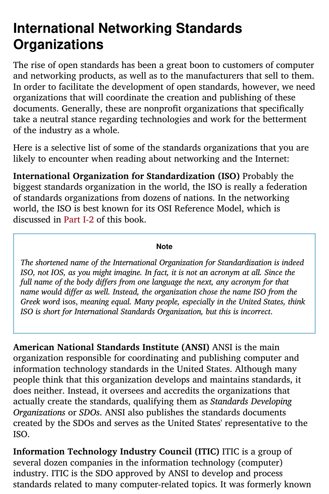
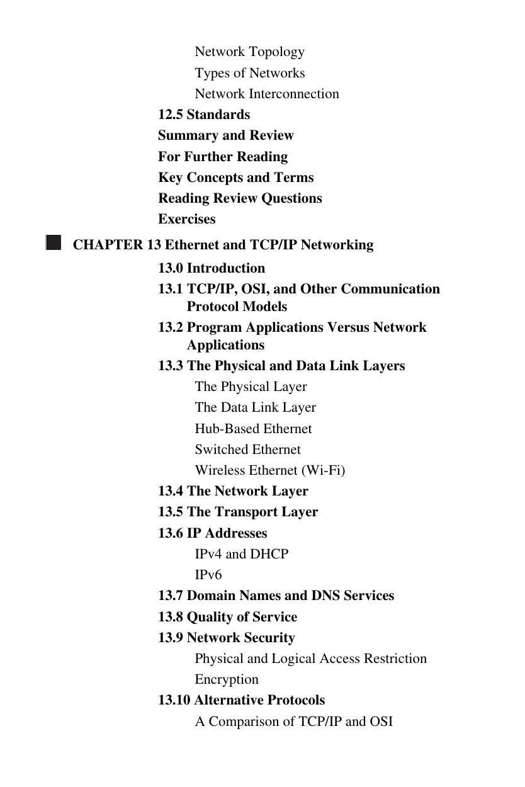
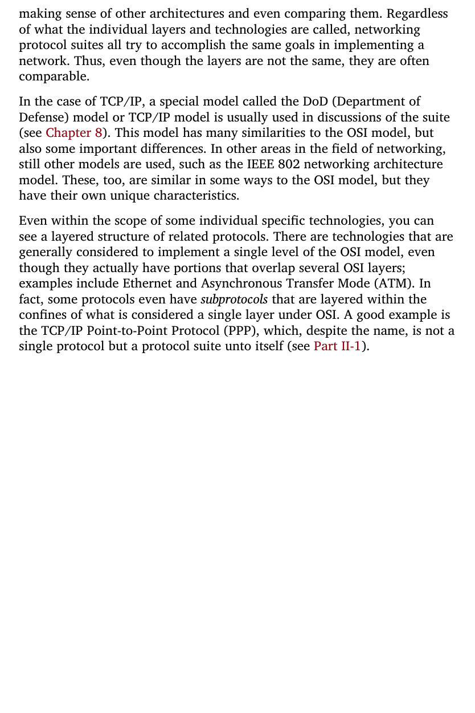
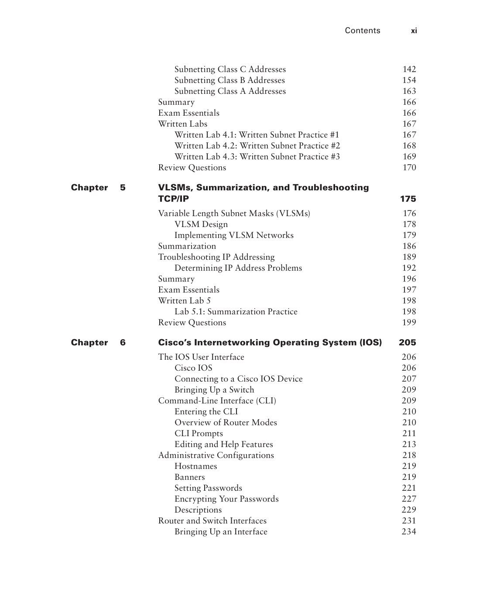
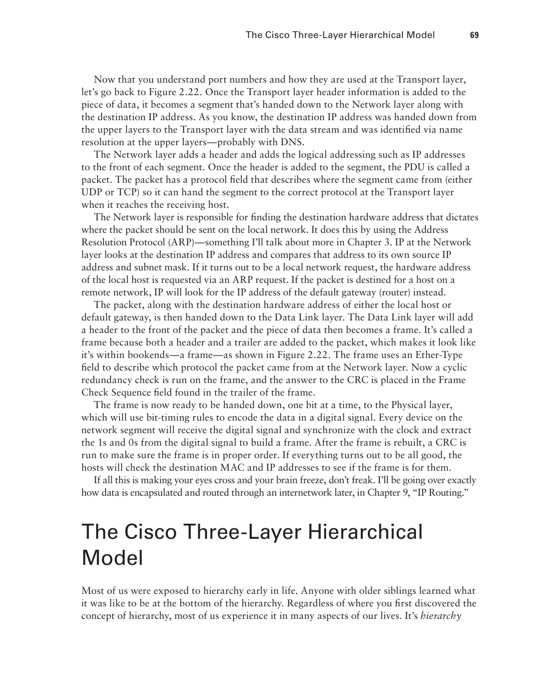

# JCAC Student Guide — Networking Concepts and Enterprise Networking

> **Realigned to JCAC Module 6 (Networking Concepts and Protocols, v2019-06R1) and Module 10 (Enterprise Level Networking, v2017-11).** Matches the combined 30 + 9 section structure from the physical Student Guides (photos IMG_3695–IMG_3699 for Module 6; IMG_3700–IMG_3703 for Module 10).

**Combined scope:** Part I — Networking Concepts (Module 6, 30 sections): fundamentals, topologies, OSI, TCP/IP, addressing, switching, routing, WAN, ICMP, transport, crypto, application protocols, VoIP, NAT, IPv6, SCADA, IPSec, AAA, VLAN/VPN, cloud, network security. Part II — Enterprise Networking (Module 10, 9 sections): Cisco model, switch security, routing protocols, ACLs, attack denial, tunneling, NAT.

**Posture:** Depth-first with the operational detail a Chief needs — port numbers, protocol fields, command syntax, attack surface, defender controls. Part I builds the protocol vocabulary; Part II applies it to Cisco-style enterprise networks.

---

# Part I — Networking Concepts and Protocols (Module 6)

---

## 1. Fundamentals of Networking

A **network** is two or more nodes exchanging data over a communications medium using agreed-upon rules (protocols).

### Benefits
- Resource sharing (files, printers, compute).
- Communication (email, chat, voice, video).
- Distributed computing / redundancy / scale.

### Categories by scope

| Name | Scope | Example |
|---|---|---|
| **PAN** | Personal Area Network | Bluetooth earbuds, USB tether |
| **LAN** | Local Area Network | Office / building |
| **CAN** | Campus Area Network | University campus |
| **MAN** | Metropolitan Area Network | City-wide fiber |
| **WAN** | Wide Area Network | DoD DISN, ISP backbone |
| **GAN** | Global Area Network | Internet |
| **SAN** | Storage Area Network | Fibre Channel / iSCSI fabric |
| **WLAN** | Wireless LAN | Wi-Fi |

### Architectural models

- **Client-server** — centralized services (file servers, DCs, databases).
- **Peer-to-peer** — every host is both client and server (BitTorrent, legacy Windows workgroup).
- **Three-tier / n-tier** — presentation → application → data tiers (classic web apps).
- **Cloud / SaaS** — consumed as a service.

---

## 2. Network Organizations

Standards bodies that shape what a Chief deals with:

| Body | Scope |
|---|---|
| **ISO** | International Organization for Standardization — OSI model |
| **ITU / ITU-T** | Telecom standards (X.25, H.323, G.711, …) |
| **IEEE** | Institute of Electrical and Electronics Engineers — 802 family (Ethernet, Wi-Fi, Bluetooth) |
| **IETF** | Internet Engineering Task Force — RFCs, TCP/IP stack |
| **IANA** | Internet Assigned Numbers Authority — IP/ASN/port allocation |
| **ICANN** | Oversees DNS and IP address allocation |
| **RIRs** | ARIN, RIPE NCC, APNIC, LACNIC, AFRINIC — regional IP registries |
| **W3C** | Web standards (HTML, CSS, HTTP) |
| **DoD CIO / DISA** | DoD-specific policy, STIGs, architecture |

---

## 3. DoD Information Network (DoDIN)

DoDIN is the DoD's enterprise of networks. Three primary enclaves by classification:

| Network | Classification | Purpose |
|---|---|---|
| **NIPRNet** | Unclassified (UNCLASS / CUI) | Day-to-day business; Internet-reachable via CAP |
| **SIPRNet** | SECRET | Classified C2 and intelligence sharing at SECRET |
| **JWICS** | TS/SCI | Joint Worldwide Intelligence Communications System; intel community backbone |

Other DoD networks:

- **DREN** — Defense Research and Engineering Network.
- **DISN** — Defense Information Systems Network (the transport that carries NIPR/SIPR/JWICS).
- **BICES** — Battlefield Information Collection and Exploitation System (coalition).
- **CENTRIXS** — Combined Enterprise Regional Information Exchange System (coalition).

**Air gaps / cross-domain solutions (CDS):** data flow between classification levels is strictly controlled through certified CDS appliances; no casual crossing.

---

## 4. Network Topologies

Physical and logical arrangement of nodes:

| Topology | Shape | Pros | Cons |
|---|---|---|---|
| **Bus** | All nodes on one shared medium | Simple, cheap (historical coax) | Single point of failure; collisions |
| **Star** | All nodes connect to a central hub/switch | Scalable, isolates failures | Central device is SPOF |
| **Ring** | Each node connects to two neighbors in a loop | Predictable latency (Token Ring) | Break disrupts all |
| **Dual Ring** | Two counter-rotating rings | Fault tolerance (FDDI) | Cost |
| **Mesh (full)** | Every node to every other | Highest redundancy | n(n-1)/2 links; expensive |
| **Partial mesh** | Only critical nodes fully meshed | Balance of cost/redundancy | Less uniform |
| **Hybrid** | Combination | Flexible | Complex to document |
| **Point-to-multipoint** | One head-end serving many spokes | Efficient for hub-and-spoke WAN | Head-end is SPOF |
| **Tree / hierarchical** | Root → parents → leaves | Models Cisco's three-layer model | Upstream bottleneck |

Logical topology ≠ physical: Ethernet is physically star (switch), logically bus (shared-medium model from CSMA/CD origins — mostly theoretical on modern full-duplex).

---

## 5. Network Cabling / Medium

### Copper

| Type | Bandwidth / distance | Connector |
|---|---|---|
| **Coaxial** (RG-58, RG-6, RG-59) | ~10 Mbps over 500 m (10BASE2); used for cable TV and legacy Ethernet | BNC, F-type |
| **UTP Cat5** | 100 Mbps / 100 m | RJ-45 |
| **UTP Cat5e** | 1 Gbps / 100 m | RJ-45 |
| **UTP Cat6** | 1 Gbps / 100 m; 10 Gbps / 55 m | RJ-45 |
| **UTP Cat6a** | 10 Gbps / 100 m | RJ-45 |
| **UTP Cat7 / Cat8** | 10–40 Gbps, shielded | RJ-45 / GG45 |
| **STP (Shielded Twisted Pair)** | Cat-N variants with foil/braid | RJ-45 |

### Fiber-optic

| Type | Notes |
|---|---|
| **Single-mode (SMF)** | 9 μm core; long-haul, lasers; km-to-tens-of-km range |
| **Multi-mode (MMF)** | 50/62.5 μm core; LED/VCSEL; up to ~2 km; data-center |

Connectors: LC (modern, small), SC (older, square), ST (bayonet), MTP/MPO (multi-fiber).

Fiber advantages: no EMI, no emission side-channel, huge bandwidth. Disadvantages: cost, fragility, specialized termination.

### Wireless

- **Wi-Fi (IEEE 802.11)** — 2.4 GHz, 5 GHz, 6 GHz bands; 802.11a/b/g/n/ac/ax/be (Wi-Fi 1–7).
- **Bluetooth (IEEE 802.15.1)** — short-range PAN.
- **Zigbee / Z-Wave (IEEE 802.15.4)** — low-power IoT.
- **Cellular** — 3G/4G LTE/5G.
- **Satellite** — geostationary (high latency), LEO (Starlink-style).

Signal characteristics: attenuation with distance, multipath, interference, jamming resilience.

---

## 6. Data Transmission Methods and Signaling

### Signal types

- **Analog** — continuous waveform (voice, radio).
- **Digital** — discrete levels (0/1).
- **Baseband** — single signal on the medium (Ethernet).
- **Broadband** — multiple signals multiplexed (cable TV, DOCSIS Internet).

### Encoding

| Scheme | Notes |
|---|---|
| **NRZ (Non-Return-to-Zero)** | Voltage stays at level through bit time |
| **Manchester** | 0 = high-to-low transition, 1 = low-to-high; self-clocking; 10BASE-T |
| **Differential Manchester** | Transition at every bit boundary; Token Ring |
| **4B/5B** | 4 bits of data → 5-bit code; FDDI / Fast Ethernet |
| **8B/10B** | 8 bits → 10 bits; Gigabit Ethernet, Fibre Channel |
| **64B/66B** | 10 GbE and beyond |
| **PAM-4** | 4-level pulse amplitude modulation; 50/100/400 GbE |

### Transmission modes

- **Simplex** — one direction only (broadcast radio).
- **Half-duplex** — one direction at a time (walkie-talkie, shared Ethernet).
- **Full-duplex** — both directions simultaneously (switched Ethernet).

### Synchronization

- **Asynchronous** — start/stop bits per character (serial RS-232).
- **Synchronous** — clock signal separate or embedded (modern Ethernet via the encoding).

---

## 7. Digital / Telecommunications Convergence

Legacy and modern telecom tech you'll still see on DoD WAN docs:

| Tech | Notes |
|---|---|
| **PSTN** | Public Switched Telephone Network; circuit-switched voice |
| **Network Carrier Standards** | T1 (1.544 Mbps, 24 channels), T3 (44.736 Mbps), E1 (2.048 Mbps, 32 channels), E3 (34.368 Mbps) |
| **ISDN** | Integrated Services Digital Network; BRI 2B+D = 144 kbps; PRI 23B+D (T1) or 30B+D (E1) |
| **DSL** | Digital Subscriber Line over copper; ADSL, VDSL, SDSL |
| **ATM** | Asynchronous Transfer Mode; fixed 53-byte cells; telco backbones pre-MPLS |
| **SONET** | Synchronous Optical Networking; OC-3 (155 Mbps), OC-12 (622 Mbps), OC-48 (2.488 Gbps), OC-192 (9.953 Gbps); ring architectures with APS |
| **Satellite (Geosync)** | 35,786 km orbit; ~500 ms RTT; wide-area footprint |
| **Satellite (Elliptical)** | Molniya orbits for high-latitude coverage |
| **Satellite (LEO)** | Low Earth orbit; Iridium, Starlink; lower latency |
| **VSAT** | Very Small Aperture Terminal; small-dish satellite endpoint |

---

## 8. OSI Reference Model

Seven layers (OSI) for conceptual clarity; real stacks are TCP/IP (four or five layers).

| Layer | Name | Purpose | Units | Examples |
|---|---|---|---|---|
| **7** | Application | User/app services | Data | HTTP, FTP, DNS, SMTP, SSH |
| **6** | Presentation | Format, encryption, compression | Data | TLS (some), MIME, JPEG, ASCII |
| **5** | Session | Sessions, dialog control | Data | NetBIOS, RPC, SIP |
| **4** | Transport | End-to-end delivery | Segment (TCP) / Datagram (UDP) | TCP, UDP, SCTP |
| **3** | Network | Routing, logical addressing | Packet | IP, ICMP, IPsec |
| **2** | Data Link | Framing, MAC addressing | Frame | Ethernet, PPP, HDLC, ARP |
| **1** | Physical | Bits on medium | Bit | Cables, connectors, radio |

**Mnemonic (top-down):** All People Seem To Need Data Processing. **(Bottom-up)** Please Do Not Throw Sausage Pizza Away.


*Kozierok — OSI Reference Model: Physical / Data Link / Network / Transport / Session / Presentation / Application.*

Encapsulation: each lower layer wraps the upper layer's PDU with its own header (and sometimes trailer).


*Kozierok — each layer adds its header (and sometimes trailer) around the upper-layer PDU: data → segment → packet → frame → bits.*


*Englander — OSI layers annotated with representative protocols at each tier, from Ethernet at L1/L2 through HTTP at L7.*

---

## 9. TCP/IP Protocol Suite

Real-world model with four layers (IETF RFC 1122):

| TCP/IP | OSI equivalents |
|---|---|
| **Application** | 5–7 (Application, Presentation, Session) |
| **Transport** | 4 |
| **Internet** | 3 |
| **Link** | 1–2 (Physical, Data Link) |

Key protocols by layer:

- Application: HTTP, HTTPS, DNS, DHCP, SMTP, POP3, IMAP, FTP, SSH, SNMP, LDAP.
- Transport: TCP, UDP, SCTP, QUIC (over UDP).
- Internet: IPv4, IPv6, ICMP, ICMPv6, IGMP, IPsec.
- Link: Ethernet, PPP, ARP, NDP, Wi-Fi.


*Kozierok — side-by-side: OSI's 7 layers collapse into TCP/IP's 4 (Link, Internet, Transport, Application). Presentation and Session are absorbed into Application on the TCP/IP side.*

---

## 10. Introduction to Network Devices

| Device | Layer | Function |
|---|---|---|
| **NIC** | 1 + 2 | Network Interface Card; endpoint MAC/PHY |
| **Repeater** | 1 | Amplifies/regenerates signal (obsolete) |
| **Hub** | 1 | Multi-port repeater — everyone sees everything (obsolete) |
| **Bridge** | 2 | Joins two L2 segments by MAC learning (legacy) |
| **Switch** | 2 (L3 switches do 3) | Forwards frames by MAC; builds CAM table |
| **Router** | 3 | Forwards packets between networks; makes routing decisions |
| **Firewall** | 3–7 | Filters traffic by policy |
| **IDS/IPS** | 3–7 | Detects / prevents malicious traffic |
| **Load balancer** | 4 or 7 | Distributes connections across back-ends |
| **Proxy** | 7 | Intermediates requests |
| **Wireless AP** | 1 + 2 | 802.11 radio + bridge to wired LAN |
| **Modem** | 1 | Modulates/demodulates for physical medium (cable, DSL) |

**Uplink port** — a switch port specifically for connecting to another switch or to the next tier up (router/core); often higher speed, may have crossover built-in or use auto-MDIX.

---

## 11. Addressing

### Physical / Hardware (MAC)

- **48-bit** burned-in address on NIC.
- Format: `AA:BB:CC:DD:EE:FF` (six hex octets).
- **OUI** (first 3 octets) = Organizationally Unique Identifier — vendor.
- Broadcast: `FF:FF:FF:FF:FF:FF`. Multicast: first bit of first octet = 1 (e.g., `01:00:5E:xx:xx:xx` for IPv4 multicast).
- Locally-administered bit (U/L): second-least-significant bit of first octet = 1 for local override (random MACs).

### IPv4 Logical Addressing

- **32-bit**, dotted-decimal: `10.0.0.1` = `0x0A000001`.
- **Host portion** and **network portion** delimited by **subnet mask**.

#### IP Address Classes (legacy classful)

| Class | Prefix | Range | Default mask | Networks | Hosts/net |
|---|---|---|---|---|---|
| **A** | `0xxx` | 1.0.0.0 – 126.0.0.0 | /8 (255.0.0.0) | 126 | 16,777,214 |
| **B** | `10xx` | 128.0.0.0 – 191.255.0.0 | /16 (255.255.0.0) | 16,384 | 65,534 |
| **C** | `110x` | 192.0.0.0 – 223.255.255.0 | /24 (255.255.255.0) | 2,097,152 | 254 |
| **D** | `1110` | 224.0.0.0 – 239.255.255.255 | — | Multicast | — |
| **E** | `1111` | 240.0.0.0 – 255.255.255.255 | — | Reserved/experimental | — |


*Odom CCNA — classful partitioning: leading bits determine class; Class A/B/C are unicast, D is multicast, E is reserved.*

Classful addressing is obsolete (replaced by CIDR) but classes still appear in exam questions.

#### Subnetting (CIDR)

Given a network, borrow host bits to create subnets.

- `/24` = 24 network bits, 8 host bits → 254 usable hosts (subtract net + bcast).
- `/25` = 126 usable hosts.
- `/26` = 62 usable.
- `/27` = 30 usable.
- `/28` = 14 usable.
- `/29` = 6 usable.
- `/30` = 2 usable (point-to-point).
- `/31` = 2 usable (RFC 3021, no net/bcast).

**Formulas:**
- Subnets from extra prefix bits: `2^n`.
- Hosts per subnet: `2^(32 - prefix) - 2` (or - 0 for /31).

**Example:** `192.168.1.0/24` into /27 subnets → 8 subnets, 30 hosts each.


*Odom CCNA — borrowing host bits to create subnets: each bit borrowed doubles the subnet count and halves the hosts per subnet.*

#### Supernetting (CIDR aggregation)

Combine multiple contiguous blocks into one shorter prefix for routing-table efficiency. `192.168.0.0/24` + `192.168.1.0/24` → advertised as `192.168.0.0/23`.

#### Private IP ranges (RFC 1918)

- `10.0.0.0/8`
- `172.16.0.0/12`
- `192.168.0.0/16`

Plus:
- `169.254.0.0/16` — APIPA (auto-config when DHCP fails).
- `127.0.0.0/8` — loopback.
- `100.64.0.0/10` — Carrier-grade NAT (RFC 6598).

#### Address verification

- `ping <ip>` — reachable?
- `arp -a` — is the MAC known?
- `ip addr` / `ipconfig` — what's my IP?

### ARP — Address Resolution Protocol

ARP is an **OSI Layer 2 protocol** that maps **IPv4 addresses (L3)** to **MAC addresses (L2)** within a single broadcast domain.

**How it works:**
1. Host A wants to send to `10.0.0.5` on its LAN; checks its ARP cache.
2. If absent, A **broadcasts** an ARP Request to `FF:FF:FF:FF:FF:FF`: "Who has 10.0.0.5? Tell 10.0.0.2".
3. Host 10.0.0.5 **unicasts** a Reply: "10.0.0.5 is at aa:bb:cc:dd:ee:ff".
4. A caches the mapping (~2–20 min depending on OS).

**Packet structure** (EtherType `0x0806`, 28 bytes inside frame):

| Field | Bytes |
|---|---|
| Hardware type | 2 (`0x0001` Ethernet) |
| Protocol type | 2 (`0x0800` IPv4) |
| HW addr len | 1 (6) |
| Proto addr len | 1 (4) |
| Operation | 2 (1=Request, 2=Reply) |
| Sender MAC | 6 |
| Sender IP | 4 |
| Target MAC | 6 (0 in Request) |
| Target IP | 4 |

**Attack surface:**
- **ARP spoofing / poisoning** — attacker sends gratuitous replies, MITM on LAN.
- **Gratuitous ARP** — legitimate (announce self); abused.
- **Mitigations:** Dynamic ARP Inspection (DAI) on switches, static ARP entries, 802.1X.
- **RARP** (legacy, obsolete — MAC→IP); replaced by DHCP.
- **NDP (ICMPv6)** replaces ARP in IPv6.

Commands: `arp -a` (dump cache), `ip neigh show` (modern Linux), `arping` (L2-level ping).

### VLSM — Variable Length Subnet Mask

Use different prefix lengths within the same network based on actual host requirements. Example from `10.0.0.0/16`:
- /22 (1022 hosts) for large floor.
- /24 (254 hosts) for a department.
- /30 (2 hosts) for router-to-router links.

Modern routing protocols (OSPF, EIGRP, BGP, RIPv2) are classless and support VLSM.

---

## 12. Operation of a Switch

A switch forwards Ethernet frames based on destination MAC.

### Three functions

1. **Address learning** — inspects source MAC on incoming frames; records port in CAM (Content-Addressable Memory) / MAC address table.
2. **Forward / filter decisions** — looks up destination MAC in CAM; forwards out the known port, or floods to all ports (except source) if unknown / broadcast / multicast.
3. **Loop avoidance** — runs STP/RSTP/MSTP to prevent broadcast storms on redundant links.

### Switch behavior summary

- **Known unicast** → forward out one port.
- **Unknown unicast** → flood all ports except incoming.
- **Broadcast** (dst `FF:FF:FF:FF:FF:FF`) → flood all ports except incoming.
- **Multicast** → flood all, or targeted via IGMP snooping.

### CAM table

```
VLAN  MAC             Port
1     aa:bb:cc:11:22:33  Gi0/1
1     aa:bb:cc:44:55:66  Gi0/2
10    aa:bb:cc:77:88:99  Gi0/3
```

Ages out entries (default 300 s Cisco). **MAC flooding attack** fills the table so the switch fails open (floods everything) → eavesdropping on LAN. Mitigation: **port security** — limit MACs per port, sticky MAC, violation = shutdown.

### Store-and-forward vs cut-through

- **Store-and-forward** — read entire frame, verify FCS, then forward. Slowest but catches errors.
- **Cut-through** — forward as soon as destination MAC is read. Fastest but propagates errored frames.
- **Fragment-free** — read first 64 bytes (past collision window).

---

## 13. Ethernet

IEEE 802.3. The dominant wired LAN technology.

### Frame format (DIX / II)

| Field | Bytes | Purpose |
|---|---|---|
| Preamble + SFD | 8 | Synchronization (sent by PHY, not usually counted) |
| Destination MAC | 6 | |
| Source MAC | 6 | |
| EtherType / Length | 2 | Upper-layer protocol (0x0800 = IPv4, 0x0806 = ARP, 0x86DD = IPv6, 0x8100 = 802.1Q tagged) |
| Payload | 46–1500 | Data |
| FCS | 4 | 32-bit CRC |

Minimum frame = 64 bytes (to ensure CSMA/CD collision detection on legacy half-duplex). Maximum standard = 1518 bytes (1522 with 802.1Q tag). Jumbo frames up to 9000 bytes common in data centers.

### Speeds

| Standard | Speed | Medium |
|---|---|---|
| 10BASE-T | 10 Mbps | Cat3 UTP |
| 100BASE-TX | 100 Mbps | Cat5 UTP |
| 1000BASE-T | 1 Gbps | Cat5e UTP |
| 10GBASE-T | 10 Gbps | Cat6a UTP |
| 1000BASE-SX/LX | 1 Gbps | Fiber |
| 10GBASE-SR/LR | 10 Gbps | Fiber |
| 40/100GBASE-* | 40/100 Gbps | Fiber (QSFP+/QSFP28) |
| 400GBASE-* | 400 Gbps | Fiber (QSFP-DD, OSFP) |

### Half-duplex vs full-duplex

- Half-duplex — one direction at a time; needs CSMA/CD for collisions.
- Full-duplex — simultaneous bidirectional; switched Ethernet default; no collisions possible.

### Auto-negotiation

Speed and duplex negotiated via Fast Link Pulses. **Duplex mismatch** (one side forced half, other auto) causes late collisions and performance collapse — classic troubleshooting gotcha.

---

## 14. Operation of a Router

Routers forward packets between networks based on destination IP.

### Forwarding decision

1. Packet arrives on an interface.
2. Router strips L2 header; inspects L3 header.
3. Looks up destination IP in routing table (FIB).
4. Longest-prefix match wins (e.g., `10.1.1.0/24` beats `10.0.0.0/8` for `10.1.1.5`).
5. Rewrites L2 header for next hop (new src/dst MAC) — decrement TTL, recompute checksum.
6. Transmits out outgoing interface.

### Routing table

```
Destination         Gateway         Interface   Metric
0.0.0.0/0           192.168.1.1     eth0        10         <- default route
10.0.0.0/8          10.1.1.1        eth1        20
192.168.1.0/24      0.0.0.0         eth0        0          <- directly connected
```

### Route types

- **Directly connected** — interface on that subnet.
- **Static** — admin-configured.
- **Dynamic** — learned via routing protocol (RIP, OSPF, EIGRP, BGP, IS-IS).

### Administrative distance (Cisco)

When multiple sources propose a route, lower AD wins:

| Source | AD |
|---|---|
| Connected | 0 |
| Static | 1 |
| EIGRP summary | 5 |
| External BGP | 20 |
| Internal EIGRP | 90 |
| IGRP | 100 |
| OSPF | 110 |
| IS-IS | 115 |
| RIP | 120 |
| External EIGRP | 170 |
| Internal BGP | 200 |
| Unreachable | 255 |

### TTL

IPv4 **TTL** (hop limit on IPv6) decremented by each router; reaches 0 → packet dropped, ICMP Time Exceeded sent to source (basis of `traceroute`).

---

## 15. Internet Protocol (IP)

### IPv4 header (20 bytes without options)

| Field | Bits | Notes |
|---|---|---|
| Version | 4 | 4 |
| IHL | 4 | Header length in 32-bit words (min 5 = 20 B) |
| DSCP + ECN | 8 | QoS + congestion |
| Total Length | 16 | Header + payload (max 65,535 B) |
| Identification | 16 | Fragmentation tag |
| Flags | 3 | DF, MF |
| Fragment Offset | 13 | × 8 bytes |
| TTL | 8 | Hop limit |
| Protocol | 8 | Next header (1=ICMP, 6=TCP, 17=UDP, 50=ESP, 51=AH, 89=OSPF) |
| Header Checksum | 16 | Header only (not payload) |
| Source IP | 32 | |
| Destination IP | 32 | |

### Fragmentation

- MTU-limited path requires oversized packets to be fragmented.
- IPv4 fragments: routers can fragment; receiver reassembles.
- **DF (Don't Fragment) bit** set → ICMP Destination Unreachable (Fragmentation Needed) instead. Path MTU Discovery uses this.
- IPv6: only the sender fragments (using Fragment extension header); routers drop + signal Packet Too Big.

---

## 16. WAN Fundamentals

WAN links connect LANs across long distances.

### Multiplexing

| Type | Description |
|---|---|
| **TDM (Time-Division)** | Each channel gets a time slot |
| **FDM (Frequency-Division)** | Each channel gets a frequency band |
| **WDM (Wavelength-Division)** | Each channel gets a light wavelength (fiber) |
| **DWDM / CWDM** | Dense / Coarse WDM |
| **TDMA** | Time-Division Multiple Access (cellular, satellite) |
| **CDMA** | Code-Division Multiple Access (cellular, GPS) |
| **OFDM / OFDMA** | Orthogonal FDM (LTE, 5G, 802.11ax) |

### Circuit types

- **Point-to-Point (P2P / leased line)** — dedicated bandwidth between two endpoints (T1 leased line).
- **Circuit Switching** — dedicated path for the duration of a call (legacy PSTN).
- **Packet Switching** — packets independently routed (Internet, Frame Relay, MPLS).

### WAN protocols

| Protocol | Notes |
|---|---|
| **HDLC** | High-level Data Link Control; Cisco default on serial links (proprietary variant) |
| **PPP** | Point-to-Point Protocol; authentication (PAP, CHAP), multiprotocol |
| **Frame Relay** | Packet-switched, virtual circuits (DLCI); largely retired |
| **X.25** | Packet-switched, error-corrected; pre-Internet WAN |
| **MPLS** | Multiprotocol Label Switching; modern carrier WAN with traffic engineering, QoS, VPNs |
| **ATM** | Cell-switched (53 B); telco backbone pre-MPLS |

---

## 17. ICMP

Internet Control Message Protocol — carries error and diagnostic messages for IP. IPv4 protocol 1; IPv6 uses ICMPv6 (protocol 58).

### Common ICMP types (v4)

| Type | Purpose |
|---|---|
| 0 | Echo Reply (ping response) |
| 3 | Destination Unreachable (codes: Network/Host/Port/Protocol Unreachable, Frag Needed) |
| 4 | Source Quench (deprecated) |
| 5 | Redirect |
| 8 | Echo Request (ping) |
| 11 | Time Exceeded (TTL expired — traceroute) |
| 12 | Parameter Problem |
| 13/14 | Timestamp Request/Reply |

### Ping

```
ping -c 4 8.8.8.8
```

Sends Echo Requests, measures RTT and loss. Useful for: liveness check, baseline RTT, MTU testing (`ping -M do -s <size>` to set DF bit).

### Traceroute

Incremental TTL trick:
- Packet 1 with TTL=1 → first-hop router decrements to 0 → sends ICMP Time Exceeded.
- Packet 2 with TTL=2 → second hop replies similarly.
- …continue until TTL reaches destination → ICMP Echo Reply (or Port Unreachable for UDP-based).

Variants: Linux `traceroute` uses UDP by default; `traceroute -I` ICMP; Windows `tracert` uses ICMP.

### ICMP and firewalls

Blocking all ICMP breaks Path MTU Discovery. Best practice: allow Echo Request/Reply from trusted sources (for monitoring), Fragmentation Needed, Time Exceeded; drop redirects.

---

## 18. Transport Layer

### TCP — Transmission Control Protocol

Connection-oriented, reliable, stream-oriented.

**Header (20 B without options):**

| Field | Bits |
|---|---|
| Source Port | 16 |
| Destination Port | 16 |
| Sequence Number | 32 |
| Acknowledgment Number | 32 |
| Data Offset | 4 |
| Reserved | 3 |
| Flags (CWR, ECE, URG, ACK, PSH, RST, SYN, FIN) | 9 |
| Window Size | 16 |
| Checksum | 16 |
| Urgent Pointer | 16 |
| Options | variable |

**Three-way handshake:**
1. Client → Server: SYN (seq=X).
2. Server → Client: SYN+ACK (seq=Y, ack=X+1).
3. Client → Server: ACK (seq=X+1, ack=Y+1).

**Four-way close:**
1. A → B: FIN.
2. B → A: ACK.
3. B → A: FIN (when B finishes sending).
4. A → B: ACK.

**Features:** ordered delivery, retransmission (RTO, fast retransmit on duplicate ACKs), flow control (receive window), congestion control (slow start, congestion avoidance, fast recovery — Reno/New Reno/CUBIC/BBR).

### UDP — User Datagram Protocol

Connectionless, unreliable, message-oriented.

**Header (8 B):**

| Field | Bits |
|---|---|
| Source Port | 16 |
| Destination Port | 16 |
| Length | 16 |
| Checksum | 16 |

No handshake, no retransmit, no ordering — "send and pray." Lower overhead; app handles reliability if needed (QUIC does).

### Common ports

| Port | Protocol | Service |
|---|---|---|
| 20/21 | TCP | FTP data / control |
| 22 | TCP | SSH |
| 23 | TCP | Telnet |
| 25 | TCP | SMTP |
| 53 | TCP/UDP | DNS |
| 67/68 | UDP | DHCP server / client |
| 69 | UDP | TFTP |
| 80 | TCP | HTTP |
| 110 | TCP | POP3 |
| 123 | UDP | NTP |
| 137/138 | UDP | NetBIOS name/datagram |
| 139 | TCP | NetBIOS session |
| 143 | TCP | IMAP |
| 161/162 | UDP | SNMP / SNMP trap |
| 389 | TCP | LDAP |
| 443 | TCP | HTTPS |
| 445 | TCP | SMB |
| 465 | TCP | SMTPS |
| 514 | UDP | Syslog |
| 587 | TCP | SMTP (submission) |
| 636 | TCP | LDAPS |
| 993 | TCP | IMAPS |
| 995 | TCP | POP3S |
| 1433 | TCP | MS SQL |
| 1521 | TCP | Oracle DB |
| 3306 | TCP | MySQL |
| 3389 | TCP | RDP |
| 5432 | TCP | PostgreSQL |
| 5985/5986 | TCP | WinRM HTTP / HTTPS |

Well-known 0–1023, registered 1024–49151, ephemeral 49152–65535.

---

## 19. Information and Data Security

### Hashing

One-way functions producing fixed-length digest:

| Algorithm | Output | Status |
|---|---|---|
| MD5 | 128 bit | Broken (collisions) |
| SHA-1 | 160 bit | Broken (SHAttered 2017) |
| SHA-256 / SHA-384 / SHA-512 | 256/384/512 bit | Secure |
| SHA-3 family | 224/256/384/512 bit | Secure (Keccak) |
| BLAKE2, BLAKE3 | variable | Modern, fast |

Uses: integrity verification, digital signatures, password storage (with salt + slow KDF like bcrypt/scrypt/Argon2).

### Symmetric encryption

Same key for encrypt and decrypt.

| Cipher | Key sizes | Mode notes |
|---|---|---|
| **DES** | 56-bit | Broken |
| **3DES** | 112/168-bit effective | Deprecated |
| **AES** | 128/192/256-bit | Current standard |
| **ChaCha20** | 256-bit | Modern stream cipher; mobile, TLS 1.3 |
| **Blowfish / Twofish** | variable | Legacy |

Modes: ECB (never), CBC (legacy, needs IV + MAC), CTR, GCM (AEAD — confidentiality + integrity), CCM (AEAD).

### Asymmetric encryption

Different keys for encrypt / decrypt (public + private pair).

| Algorithm | Based on | Notes |
|---|---|---|
| **RSA** | Integer factorization | 2048+ bits today |
| **Diffie-Hellman (DH)** | Discrete log | Key exchange |
| **ECDH / ECDSA** | Elliptic curves | Smaller keys for same security (P-256, P-384, Curve25519) |
| **EdDSA (Ed25519)** | Edwards curves | Fast, deterministic |

**Hybrid encryption:** use asymmetric to exchange a symmetric key, then encrypt data symmetrically. TLS works this way.

### Digital signatures

Hash the message, encrypt the hash with the sender's private key. Anyone can verify with the public key. Provides: authenticity + integrity + non-repudiation.

### PKI (Public Key Infrastructure)

- **Certificate Authority (CA)** — trusted entity issuing certificates.
- **X.509 certificate** — binds a public key to an identity via CA signature.
- **CRL (Certificate Revocation List)** — published list of revoked certs.
- **OCSP** — online query for cert status.
- **Chain of trust** — leaf → intermediate → root (in trust store).

---

## 20. Application Layer Protocols

### DHCP — Dynamic Host Configuration Protocol

Client auto-configuration: IP, mask, gateway, DNS, options.

**Four-step DORA:**
1. **Discover** — client broadcasts UDP/67→68.
2. **Offer** — server offers IP.
3. **Request** — client formally requests.
4. **Acknowledge** — server ACKs + lease.

Relay agents forward DHCP across subnets (DHCP broadcasts don't cross routers by default).

### DNS — Domain Name System

(Also covered briefly in Part I's original scope; here in full.)

**Hierarchy:** root (.) → TLD (.mil, .com) → 2nd level (navy.mil) → subdomain.


*Kozierok — inverted-tree DNS hierarchy: root at top, TLDs (com / net / mil / ...), then 2LD (example.com), then subdomains. Authoritative servers delegate down the tree.*

**Recursive vs iterative queries:**
- **Recursive** — "Give me the final answer" (client → local resolver).
- **Iterative** — "Give me the best you have; I'll chase" (resolver → root → TLD → authoritative).

**Record types:**

| Record | Purpose |
|---|---|
| A | IPv4 address |
| AAAA | IPv6 address |
| CNAME | Alias |
| MX | Mail server |
| NS | Name server |
| PTR | Reverse (IP→name) |
| SOA | Zone authority (serial) |
| TXT | Free text (SPF, DKIM) |
| SRV | Service (`_ldap._tcp.example.com`) |
| CAA | Authorized CAs |

**Zone transfers** (AXFR full, IXFR incremental) use TCP/53. Normal queries UDP/53 (TCP if >512 B or DNSSEC).

**Forwarder** — a DNS server that hands off queries it can't resolve to another server (instead of going to roots).

**Caching** — resolvers cache answers per TTL to reduce load.

**Attack surface:** cache poisoning (Kaminsky), DNS tunneling (exfil), DGA-backed malware. Mitigations: DNSSEC, DoT/DoH, response-policy zones, egress DNS controls.

### HTTP — Hypertext Transfer Protocol

Request/response protocol over TCP/80 (HTTP) or TCP/443 (HTTPS). Stateless; statefulness added via cookies / sessions.


*Kozierok — client sends an HTTP request (method, URI, headers, optional body); server returns a response (status, headers, body). HTTPS wraps this in TLS.*

Common methods: GET, HEAD, POST, PUT, DELETE, PATCH, OPTIONS, CONNECT, TRACE. Status classes: 1xx informational, 2xx success, 3xx redirect, 4xx client error, 5xx server error.

### SMTP — Simple Mail Transfer Protocol

**TCP/25** (server-to-server), **TCP/587** (submission with auth), **TCP/465** (SMTPS legacy).

Commands: HELO/EHLO, MAIL FROM, RCPT TO, DATA, QUIT.

### POP3

Post Office Protocol v3. **TCP/110** (clear), **TCP/995** (POP3S). Downloads messages; classic model leaves nothing on server.

### IMAP4

Internet Message Access Protocol v4. **TCP/143** (clear), **TCP/993** (IMAPS). Messages stay on server; folders, search, partial fetch. Modern default for mail clients.

### HTTP

HyperText Transfer Protocol. **TCP/80**. Request/response:

```
GET /index.html HTTP/1.1
Host: example.com
User-Agent: Mozilla/5.0 ...

HTTP/1.1 200 OK
Content-Type: text/html
Content-Length: 1234

<html>...</html>
```

Methods: GET, POST, PUT, DELETE, HEAD, OPTIONS, PATCH.
Status codes: 1xx info, 2xx success, 3xx redirect, 4xx client error, 5xx server error.

### HTTPS — SSL/TLS

HTTP inside TLS. **TCP/443**.

**SSL** is the deprecated predecessor (SSLv2, SSLv3 — never use). **TLS 1.2 and TLS 1.3** are current.

**TLS 1.2 handshake:**
1. ClientHello (versions, ciphers, random, SNI).
2. ServerHello (chosen version + cipher, random).
3. Certificate (server X.509).
4. ServerKeyExchange (DHE/ECDHE params).
5. ServerHelloDone.
6. ClientKeyExchange.
7. ChangeCipherSpec + Finished (both sides).

**TLS 1.3** — reduces round trips (1-RTT, 0-RTT resumption), removes weak crypto (no static RSA kex, no SHA-1, no RC4, no CBC streams).

**Cipher suite:** `TLS_ECDHE_RSA_WITH_AES_256_GCM_SHA384` — ECDHE key exchange, RSA auth, AES-256-GCM bulk, SHA384 MAC/PRF.

**Attack surface:** Heartbleed (CVE-2014-0160), POODLE (SSL 3.0), BEAST, CRIME, BREACH, downgrade. Defenders: TLS 1.2+ only, HSTS, pinning, PFS (ECDHE).

### FTP — File Transfer Protocol

**TCP/21** (control), **TCP/20** (active-mode data).

- **Active mode** — server connects back to client port for data (firewall-hostile).
- **Passive (PASV) mode** — client connects to server-offered port for data (firewall-friendly).

Clear-text passwords. Use SFTP (SSH) or FTPS (FTP + TLS) instead.

### TFTP — Trivial FTP

**UDP/69**. No auth, no dirs. Used for firmware/config loads in network gear.

### Telnet

**TCP/23**. Interactive remote login; clear-text (including passwords). Use SSH instead.

### Rlogin

**TCP/513**. Berkeley remote login; even worse than Telnet (trust-based). Obsolete.

### SSH — Secure Shell

**TCP/22**. Encrypted remote login and file transfer.

- **Versions:** SSHv1 broken; **SSHv2** current.
- **Auth:** password, public key, GSSAPI, certificate.
- **Subsystems:** sftp, scp, port forwarding (local/remote/dynamic SOCKS), X11 forwarding.

### LDAP — Lightweight Directory Access Protocol

**TCP/389** (LDAP + StartTLS), **TCP/636** (LDAPS).

Hierarchical directory: DIT (Directory Information Tree) with entries, each identified by DN. Used for auth (AD, OpenLDAP), address books, machine inventory.

### SNMP — Simple Network Management Protocol

**UDP/161** (queries), **UDP/162** (traps).

Versions:
- **v1** — community strings, no encryption.
- **v2c** — same security, bigger counters.
- **v3** — auth + encryption (noAuthNoPriv, authNoPriv, authPriv with MD5/SHA and DES/AES).

MIB (Management Information Base) — hierarchical OIDs (`.1.3.6.1.2.1.1.1.0` = sysDescr).

Operations: Get, GetNext, GetBulk, Set, Trap, Inform.

### Band Management

- **In-band management** — manage device via the production network it serves.
- **Out-of-band (OOB)** management — separate network / console serial / dedicated management interface (idrac, iLO, LOM).

OOB preferred for security: compromise of production doesn't give attacker the management plane; OOB survives production outages.

---

## 21. VoIP

Voice over IP — telephone calls over packet networks.

### Components

- **User Agent (UA)** — softphone, IP desk phone.
- **Signaling** — sets up / tears down calls.
- **Media** — carries the actual audio/video.

### Protocols

| Protocol | Purpose |
|---|---|
| **SIP** | Session Initiation Protocol — signaling (UDP/TCP 5060; TLS 5061) |
| **H.323** | ITU legacy signaling; complex, still in enterprise telco gear |
| **RTP** | Real-time Transport Protocol — media (UDP, even port); sequence + timestamp + payload type |
| **RTCP** | RTP Control Protocol — QoS feedback (odd port alongside RTP) |
| **SRTP** | Secure RTP — encryption + auth |
| **Skype** | Proprietary (originally P2P; now Microsoft server-assisted) |

### Codecs

- **G.711 (PCM)** — 64 kbps, toll quality.
- **G.729** — 8 kbps, compressed.
- **Opus** — modern, adaptive.

### Attack surface

- SIP registrar brute force, INVITE flood, toll fraud.
- Eavesdropping on unencrypted RTP (Wireshark's "Decode As" + VoIP calls menu).
- Defenders: SRTP, SIP-TLS, strong registrar auth, SBC (Session Border Controller).

---

## 22. NAT / PAT

Network Address Translation — rewrites IP (and optionally port) as packets cross a boundary.

### Types

- **Static NAT** — 1:1 mapping (one private → one public).
- **Dynamic NAT** — many private → pool of public; 1:1 at a time.
- **PAT / NAT Overload / Masquerade** — many private → 1 public; source port distinguishes flows. The RFC 1918 → Internet case you see everywhere on home / office routers.

### Cisco terminology

- **Inside Local** — private address on the inside.
- **Inside Global** — public translation of that inside address.
- **Outside Local** — how the outside sees itself from the inside (rare).
- **Outside Global** — actual outside public address.

### PAT flow

```
10.0.0.5:50000 → 203.0.113.10:60000
10.0.0.6:50000 → 203.0.113.10:60001
```

Router maintains a translation table mapping (inside IP, inside port) ↔ (public IP, public port).

### Consequences

- Breaks end-to-end addressing; inbound connections need port forwarding.
- Complicates protocols that embed IP addresses in payload (FTP active mode, SIP) — need ALGs.
- IPv6 is designed not to need NAT.

---

## 23. IPv6

(Summary of addressing + NDP; full treatment in the Bib's original scope.)

### Addressing

- **128 bits**, 8 groups of 4 hex separated by colons.
- Collapse: leading zeros in a group can be dropped; one run of all-zero groups → `::`.
- `2001:db8:85a3:0000:0000:8a2e:0370:7334` → `2001:db8:85a3::8a2e:370:7334`.

### Aggregation

- Provider allocates /32 to carriers; /48 to sites; /64 to subnets (standard).
- Hierarchical allocation simplifies routing aggregation at Internet scale.

### Categories

| Category | Notes |
|---|---|
| **Unicast** | One-to-one |
| **Multicast** | One-to-many subscribers |
| **Anycast** | One-to-nearest (same address on multiple hosts) |

**No broadcast in IPv6** — role replaced by multicast (`ff02::1` all-nodes).

### Unicast types

| Prefix | Type |
|---|---|
| `2000::/3` | Global unicast — routable Internet |
| `fc00::/7` | Unique local (ULA) — private-like |
| `fe80::/10` | Link-local — single link only, auto-configured |
| `::1/128` | Loopback |
| `::/128` | Unspecified |

### Multicast scopes

| Prefix | Scope |
|---|---|
| `ff01::/16` | Interface-local |
| `ff02::/16` | Link-local |
| `ff05::/16` | Site-local |
| `ff08::/16` | Organization-local |
| `ff0e::/16` | Global |

Well-known groups: `ff02::1` all-nodes, `ff02::2` all-routers, `ff02::1:2` DHCPv6 relays.

### Transition mechanisms

- **Dual stack** — run v4 and v6 simultaneously.
- **Translation** — NAT64 / DNS64 between v4-only and v6-only.
- **Tunneling** — 6in4, Teredo, ISATAP, 6rd.

### ICMPv6 / NDP / DHCPv6

- **NDP (Neighbor Discovery Protocol, RFC 4861)** — replaces ARP.
  - **Neighbor Solicitation / Advertisement** — ARP-equivalent.
  - **Router Solicitation / Advertisement** — host discovers default router + prefix.
  - **Redirect** — router points host to a better gateway.
- **SLAAC (RFC 4862)** — host auto-generates address from router-advertised prefix + interface ID (EUI-64 or privacy-extended random).
- **DHCPv6** — stateful alternative to SLAAC; also "stateless DHCPv6" provides DNS servers only.

### IPv6 header (40 B fixed)

| Field | Bits |
|---|---|
| Version (6) | 4 |
| Traffic Class | 8 |
| Flow Label | 20 |
| Payload Length | 16 |
| Next Header | 8 |
| Hop Limit | 8 |
| Source | 128 |
| Destination | 128 |

No checksum. Extension headers (Hop-by-Hop Options, Routing, Fragment, Destination Options, AH, ESP) chain via `Next Header`.

### IPv6 routing protocols

- **OSPFv3** — OSPF for v6.
- **RIPng** — RIP for v6.
- **EIGRP for IPv6** — Cisco proprietary.
- **MP-BGP / BGP-4+** — carries v6 NLRI.
- **IS-IS** — dual-stack.

---

## 24. Heartbeat Networks

Low-bandwidth secondary link between cluster nodes to detect peer liveness:

- **Direct-connect cable / crossover / dedicated VLAN** — avoid shared paths with production traffic.
- Each node periodically sends "I'm alive" packets.
- Missed heartbeats within quorum threshold → peer declared dead → cluster failover triggers.
- **Split-brain** risk — if heartbeat fails but both nodes are alive, both can try to be primary. Mitigations: quorum (odd node count, witness disk/server), STONITH (Shoot The Other Node In The Head — fence via power switch or IPMI).

Examples: Microsoft Failover Clustering, Pacemaker/Corosync, VRRP/HSRP for gateway redundancy.

---

## 25. SCADA — Supervisory Control and Data Acquisition

Industrial control systems monitoring and controlling physical processes (power grid, water, pipelines, manufacturing, weapons systems).

### Components

| Component | Role |
|---|---|
| **MTU / HMI (Master Terminal Unit / Human-Machine Interface)** | Operator console; centralized monitoring/control |
| **RTU (Remote Terminal Unit)** | Field device acquiring sensor data, transmitting to MTU |
| **PLC (Programmable Logic Controller)** | Rugged, deterministic controller running control logic |
| **IED (Intelligent Electronic Device)** | Microprocessor-based field device (protective relays) |
| **Historian** | Time-series database of process values |
| **Sensors / Actuators** | Temperature, pressure, flow, valves, motors |

### Protocols

| Protocol | Domain |
|---|---|
| **Modbus** | Plant floor; RTU (serial) or TCP (TCP/502); plaintext, no auth |
| **DNP3** | Electric utility; secure authentication in DNP3-SA extension |
| **IEC 61850** | Substation automation |
| **OPC / OPC-UA** | Interoperability; OPC-UA has modern security |
| **Profinet** | Siemens industrial Ethernet |
| **EtherNet/IP** | Rockwell CIP |
| **ICCP / IEC 60870** | Utility inter-control-center |

### Security concerns

- Protocols predate network security — plaintext, no auth, no replay protection.
- Long device lifespan (20+ years) — hard to patch.
- Safety > availability > confidentiality (inverted from IT).
- High-profile incidents: Stuxnet (Natanz centrifuges), Ukrainian power-grid attacks, Colonial Pipeline.
- Defender posture: **Purdue model** segmentation (levels 0–5), air gaps where possible, one-way data diodes, dedicated OT SOC, NIST SP 800-82.

---

## 26. IPSec

IPSec provides authenticity, integrity, and confidentiality at L3. Works with IPv4 and IPv6 (natively in IPv6).

### Two protocols

| Protocol | Purpose | Header |
|---|---|---|
| **AH (Authentication Header)** | Authenticity + integrity (no confidentiality) | Protocol 51 |
| **ESP (Encapsulating Security Payload)** | Confidentiality (+ optional auth/integrity) | Protocol 50 |

### Two modes

- **Transport mode** — only the payload is protected; original IP header preserved. End-to-end between hosts.
- **Tunnel mode** — entire original packet encapsulated; new outer IP header added. Gateway-to-gateway VPN.

### IKE (Internet Key Exchange)

Negotiates Security Associations (SAs). Two phases:

- **Phase 1 (IKE SA)** — authenticate peers, establish secure channel. Main Mode (identity-protected) or Aggressive Mode (faster, identity exposed).
- **Phase 2 (IPSec SAs)** — negotiate the ESP/AH SAs used for actual traffic.

**IKEv2** simplifies, removes Aggressive Mode, adds mobility/NAT traversal.

### Use cases

- Site-to-site VPN (two firewalls/routers tunneling subnets).
- Remote-access VPN (client to concentrator; often IKEv2).
- End-to-end host-to-host (rare in practice; app-layer TLS usually preferred).

---

## 27. AAA

**Authentication, Authorization, and Accounting** — centralized identity and access management for network devices.

| Protocol | Transport | Notes |
|---|---|---|
| **RADIUS** | UDP/1812 (auth), UDP/1813 (accounting) | Encrypts password field only; combines auth+authz; multi-vendor |
| **TACACS+** | TCP/49 | Encrypts entire payload; separates auth/authz/acct; Cisco |
| **DIAMETER** | TCP/SCTP 3868 | Modern RADIUS successor; used in 4G/5G, some WLAN |
| **Kerberos** | TCP/UDP 88 | MIT-derived; used for AD auth |

### RADIUS flow

1. NAS (Network Access Server — AP, VPN concentrator, switch with dot1x) receives credential.
2. NAS forwards to RADIUS server.
3. RADIUS server accepts / rejects / challenges.
4. Optional accounting records (session start/stop).

### 802.1X

Port-based network access control. **Supplicant** (client) ↔ **Authenticator** (switch/AP) ↔ **Authentication Server** (RADIUS). EAP carries credentials; EAP-TLS (cert-based), EAP-PEAP (username/password inside TLS), EAP-FAST.

---

## 28. Virtual Networking

### VLAN — Virtual LAN

Divides a physical switched network into multiple L2 broadcast domains.

- **802.1Q** — the tagging standard; 4-byte tag between source MAC and EtherType with 12-bit VLAN ID (1–4094).
- **Access port** — untagged member of a single VLAN.
- **Trunk port** — carries multiple VLANs (tagged) between switches or to routers.
- **Native VLAN** — untagged VLAN on a trunk (often 1; security risk if not changed and isolated).

**Inter-VLAN routing:** need a router or L3 switch (SVI — Switch Virtual Interface, a.k.a. VLAN interface with an IP).

**VLAN hopping attacks:**
- **Double-tagging** — craft a packet with outer and inner 802.1Q tags; outer stripped at trunk → inner delivers to target VLAN. Mitigation: don't use native VLAN, tag all VLANs.
- **Switch-spoofing** — send DTP to negotiate trunking with an access port. Mitigation: disable DTP (`switchport nonegotiate`).

### VPN — Virtual Private Network

Encrypted tunnel across an untrusted network.

| Type | Protocols | Notes |
|---|---|---|
| **IPSec site-to-site** | IKE + ESP | Gateway-to-gateway; subnet-to-subnet |
| **SSL/TLS VPN** | TLS | Client-to-gateway; user-friendly, firewall-friendly (HTTPS) |
| **L2TP/IPSec** | L2TP inside IPSec | Legacy Microsoft remote access |
| **PPTP** | GRE + TCP/1723 | Broken; don't use |
| **WireGuard** | UDP; custom crypto | Modern, small, fast |
| **OpenVPN** | SSL/TLS over UDP/TCP | Popular open-source |

**Split tunneling** — VPN carries only traffic to private nets; other traffic goes direct. Performance + privacy tradeoff; often disallowed in DoD / enterprise for security.

---

## 29. Cloud Computing

NIST SP 800-145 definitions:

### Deployment models

| Model | Notes |
|---|---|
| **Private** | Owned / operated by / for a single organization |
| **Public** | Available to general public (AWS, Azure, GCP) |
| **Community** | Shared by several organizations with common concern (IC / DoD clouds) |
| **Hybrid** | Bound combination of the above |

### Service models

| Model | Provider manages | Customer manages | Example |
|---|---|---|---|
| **IaaS** | Hypervisor, storage, network | OS, middleware, apps, data | AWS EC2, Azure VM |
| **PaaS** | Runtime + above | Apps + data | Azure App Service, Heroku |
| **SaaS** | Everything | User data / config | Office 365, Salesforce |
| **FaaS / Serverless** | Everything including runtime | Functions + data | AWS Lambda, Azure Functions |

### Shared responsibility

Cloud provider secures **of** the cloud (physical, hypervisor, some services). Customer secures **in** the cloud (config, IAM, data, app code, network rules). Misconfigured S3 buckets, open security groups, IAM over-permission are the classic customer-side failures.

### DoD cloud

**DoDIN / DISA Impact Levels:**

| IL | Data sensitivity |
|---|---|
| **IL2** | Public / non-critical mission info |
| **IL4** | CUI, non-national-security |
| **IL5** | CUI, national-security systems |
| **IL6** | SECRET / classified |

DISA-accredited cloud environments (AWS GovCloud, Azure Government, Azure DoD, Oracle GovCloud) host respective ILs.

---

## 30. Network Security

### Hardware failures

- Link-level redundancy (LACP port-channels, stacked switches, VSS/VSX).
- Device-level redundancy (HA pairs, VRRP/HSRP/GLBP).
- Site-level redundancy (DR site, active-passive, active-active with global load balancing).
- UPS + generator for power.

### Access types

| Type | Description | Control |
|---|---|---|
| **Physical** | Server rooms, wiring closets, cabling | Locks, badges, mantraps, CCTV, tamper seals |
| **Logical** | Login, token, auth | MFA, least-privilege, auditing |
| **Remote** | VPN, SSH, RDP | MFA, posture check, jump hosts, PAM |

### Threats

| Threat | Description |
|---|---|
| **Malware** | Virus, worm, trojan, ransomware, rootkit, bootkit, wiper, RAT |
| **Social Engineering** | Phishing, spear-phishing, whaling, smishing, vishing, pretexting, tailgating |
| **DoS / DDoS** | Volumetric (flood bandwidth), protocol (SYN flood, Smurf), application (Slowloris, HTTP flood), amplification (DNS, NTP, memcached) |
| **Man-in-the-Middle** | ARP spoofing, DNS spoofing, BGP hijack, rogue AP |
| **Eavesdropping** | Unencrypted protocols, unencrypted Wi-Fi, SSL-stripping |
| **Supply chain** | Backdoored software or hardware |
| **Insider** | Authorized user abusing access |

### Security devices

**Firewalls:**

- **Packet-filter** — L3/L4 rules (src/dst IP, port, protocol); stateless.
- **Stateful** — tracks connections; allows return traffic.
- **Application / Next-Gen Firewall (NGFW)** — L7 inspection, IDS integrated, user identity, TLS inspection.
- **Web Application Firewall (WAF)** — protects web apps from OWASP Top 10.
- **Host-based** — per-endpoint (iptables, Windows Defender Firewall).

**IDS/IPS:**

- **IDS** — detects and alerts; out-of-band (SPAN port).
- **IPS** — detects and blocks; in-line.
- **NIDS** — Snort, Suricata, Zeek.
- **HIDS** — OSSEC/Wazuh, Samhain (see `JCAC-UNIX-LINUX.md` §19).

**Detection modes:**

- **Signature-based** — match known patterns.
- **Anomaly-based** — baseline + deviation alert.
- **Stateful-protocol** — detect protocol-spec violations.

**Other appliances:**
- **SIEM** — aggregates and correlates logs.
- **SOAR** — orchestrates response playbooks.
- **DLP** — data loss prevention; watches for sensitive data egress.
- **CASB** — cloud access security broker; visibility + control over SaaS.
- **EDR / XDR** — endpoint / extended detection and response.

---

# Part II — Enterprise Level Networking (Module 10)

Part II applies Part I's vocabulary to Cisco-style enterprise networks.

---

## 31. Introduction to Enterprise Level Networking

### Cisco three-layer hierarchical model

| Layer | Role | Device examples |
|---|---|---|
| **Core** | High-speed backbone forwarding | Catalyst 9500/9600, Nexus 9K |
| **Distribution** | Aggregation, routing, policy, filtering | Catalyst 9400/9500 |
| **Access** | Connect end stations (desktops, APs, phones) | Catalyst 9200/9300 |

**Collapsed core** — small deployments merge core + distribution into one tier.

### Network management principles

- Documentation (topology diagrams, IP plans, change control).
- Monitoring (SNMP + NetFlow/IPFIX + syslog to SIEM).
- Change management (approvals, rollback plan, maintenance windows).
- Capacity planning (baseline utilization, forecast growth).

### Cisco device management

#### Boot / ROMMON

- Cisco IOS device boots: ROMMON (ROM Monitor) → loads IOS image from flash → loads startup-config from NVRAM → runs.
- If startup-config missing → initial-setup dialog (decline with `no`).
- ROMMON mode for password recovery (set config-register `0x2142` to skip startup-config).

#### Cisco IOS CLI modes

| Mode | Prompt | How to enter |
|---|---|---|
| **User EXEC** | `Router>` | On login (low priv) |
| **Privileged EXEC** | `Router#` | `enable` (often password) |
| **Global Config** | `Router(config)#` | `configure terminal` |
| **Interface Config** | `Router(config-if)#` | `interface g0/1` |
| **Line Config** | `Router(config-line)#` | `line vty 0 4` |
| **Routing Protocol Config** | `Router(config-router)#` | `router ospf 1` |

### Cisco Discovery Protocol (CDP)

Cisco proprietary, L2, multicast `01:00:0C:CC:CC:CC`. Advertises neighbor info (device ID, IP, platform, port ID, capabilities) every 60 s; hold time 180 s.

- `show cdp neighbors` — concise.
- `show cdp neighbors detail` — verbose (IP addresses, IOS version).
- `no cdp run` globally / `no cdp enable` per-interface — disable (OPSEC: CDP reveals info to attackers on the LAN).

**LLDP** (IEEE 802.1AB) — vendor-neutral equivalent; works with mixed-vendor gear.

---

## 32. Switches

### Three switch functions (recap from §12)

1. Address learning (MAC table).
2. Forward/filter decisions.
3. Loop avoidance (STP).

### Spanning Tree Protocol (STP)

Prevents L2 loops on redundant links.

- **Root bridge** — one per broadcast domain; lowest Bridge ID (priority + MAC) wins. Priority default 32768 + VLAN; lower via `spanning-tree vlan 1 priority 4096`.
- **Port roles:** Root (best path to root), Designated (best on a segment), Blocking (loop-preventing).
- **Port states:** Blocking → Listening → Learning → Forwarding (15 s each for Listening and Learning = 30 s convergence on classic STP).
- **RSTP (802.1w)** — Rapid STP, <1 s convergence.
- **PVST / PVST+** — Per-VLAN Spanning Tree (Cisco).
- **MSTP (802.1s)** — Multiple Spanning Tree; groups VLANs into instances.

### PortFast

`spanning-tree portfast` on an access port skips listening/learning — goes straight to forwarding. Only for ports that will never connect to another switch. **BPDU Guard** disables the port if it receives BPDUs (protects against rogue switches).

### Switch default behavior

- All ports access in VLAN 1.
- Layer 2 forwarding.
- Spanning tree enabled.
- No IP address (management requires SVI on a VLAN).

### Device setup — physical / virtual interfaces / addresses

```
Switch> enable
Switch# configure terminal
Switch(config)# hostname SW1
SW1(config)# enable secret ClassPassword!
SW1(config)# line console 0
SW1(config-line)# password ConsolePass!
SW1(config-line)# login
SW1(config-line)# exit
SW1(config)# line vty 0 15
SW1(config-line)# password VTYPass!
SW1(config-line)# login
SW1(config-line)# transport input ssh
SW1(config-line)# exit
SW1(config)# username admin privilege 15 secret AdminPass!
SW1(config)# ip domain-name navy.mil
SW1(config)# crypto key generate rsa modulus 2048
SW1(config)# interface vlan 1
SW1(config-if)# ip address 10.0.0.2 255.255.255.0
SW1(config-if)# no shutdown
SW1(config-if)# exit
SW1(config)# ip default-gateway 10.0.0.1
SW1(config)# service password-encryption
SW1(config)# end
SW1# write memory
```

### VLANs

```
SW1(config)# vlan 10
SW1(config-vlan)# name SAILORS
SW1(config-vlan)# exit
SW1(config)# interface g0/1
SW1(config-if)# switchport mode access
SW1(config-if)# switchport access vlan 10
SW1(config-if)# spanning-tree portfast
SW1(config-if)# spanning-tree bpduguard enable
```

**Trunk:**

```
SW1(config)# interface g0/24
SW1(config-if)# switchport mode trunk
SW1(config-if)# switchport trunk encapsulation dot1q
SW1(config-if)# switchport trunk allowed vlan 10,20,30
SW1(config-if)# switchport trunk native vlan 999      ! unused VLAN
```

### Frame tagging

802.1Q inserts a 4-byte tag between source MAC and EtherType:
- TPID `0x8100`.
- PCP (Priority Code Point — 802.1p QoS) 3 bits.
- DEI 1 bit.
- VLAN ID 12 bits (1–4094; 0 and 4095 reserved).

---

## 33. IP Routing

### Static routing

```
Router(config)# ip route 10.0.1.0 255.255.255.0 10.0.0.2
Router(config)# ip route 0.0.0.0 0.0.0.0 203.0.113.1   ! default
Router(config)# ipv6 route 2001:db8:1::/48 2001:db8::2
```

### Route summarization

Combine multiple networks into a shorter prefix for advertisement. `10.1.0.0/24`, `10.1.1.0/24` → `10.1.0.0/23`.

### Internet routing architecture

- **Autonomous System (AS)** — set of networks under single admin, identified by ASN.
- **IGP (Interior Gateway Protocol)** — inside an AS (OSPF, EIGRP, IS-IS, RIP).
- **EGP (Exterior Gateway Protocol)** — between ASes (BGP).

### Dynamic routing categories

- **Distance-vector** — "routing by rumor"; neighbors advertise their distances (RIP, EIGRP hybrid, BGP is path-vector).
- **Link-state** — all routers learn full topology, run SPF (Dijkstra) — OSPF, IS-IS.

### Administrative distance reminder

Lower wins when multiple protocols propose the same prefix (table in §14).

### RIP / RIPv2 / RIPng

- Classic distance-vector; metric = hop count; max 15 hops.
- Periodic updates (30 s) — quiet for 180 s = neighbor dead; full flush at 240 s.
- **RIPv2** adds CIDR (classless), auth, multicast (224.0.0.9) over broadcast.
- **RIPng** — RIP for IPv6.
- **Loop avoidance:** split horizon (don't advertise a route back out the interface it came in), route poisoning (advertise metric 16 = unreachable), hold-down timers.

Rarely deployed in new enterprise networks (too slow, too coarse); appears on old gear and exams.

### OSPF — Open Shortest Path First

Link-state IGP, IETF standard.

**Router types:**

| Type | Role |
|---|---|
| **Internal** | All interfaces in one area |
| **Backbone (ABR-eligible)** | Interfaces in area 0 |
| **ABR (Area Border Router)** | Connects area 0 to another area |
| **ASBR (AS Boundary Router)** | Redistributes from another AS/protocol |

**LSA types:**

| LSA Type | Purpose |
|---|---|
| 1 | Router LSA — intra-area links |
| 2 | Network LSA — multi-access segment info |
| 3 | Summary LSA — inter-area |
| 4 | ASBR summary |
| 5 | External (imported) |
| 7 | NSSA external |

**Areas:**

- Area 0 = backbone; all other areas must connect to it (via virtual link if not adjacent).
- Stub / Totally Stubby / NSSA / Totally NSSA — reduce LSA flooding into leaf areas.

**Configuration:**

```
Router(config)# router ospf 1
Router(config-router)# router-id 10.0.0.1
Router(config-router)# network 10.0.0.0 0.0.0.255 area 0
Router(config-router)# passive-interface default
Router(config-router)# no passive-interface gigabitethernet0/0
```

### EIGRP — Enhanced Interior Gateway Routing Protocol

Cisco proprietary (now open RFC 7868). Advanced distance-vector using DUAL algorithm for loop-free path computation.

- Composite metric: bandwidth + delay (optional: load, reliability, MTU).
- Partial, bounded, reliable updates on change (not full-table periodic).
- Fast convergence via feasible successors (pre-computed backup paths).

```
Router(config)# router eigrp 100
Router(config-router)# network 10.0.0.0 0.0.0.255
Router(config-router)# no auto-summary
```

### BGP — Border Gateway Protocol

Path-vector EGP running the Internet.

- **eBGP** — between different ASes.
- **iBGP** — between routers in the same AS (full mesh or via route reflectors / confederations).
- TCP/179.
- Attributes influence path selection: LOCAL_PREF (outbound, higher wins), AS_PATH (length), ORIGIN, MED (inbound, lower wins), weight (Cisco-local).
- Best-path selection order: Weight > LOCAL_PREF > locally-originated > AS_PATH > ORIGIN > MED > eBGP over iBGP > IGP metric > oldest > router-ID > peer IP.

```
Router(config)# router bgp 65001
Router(config-router)# neighbor 203.0.113.1 remote-as 64500
Router(config-router)# network 198.51.100.0 mask 255.255.255.0
```

**BGP hijacking** — malicious AS announces a prefix it doesn't own. Mitigations: RPKI (Resource Public Key Infrastructure) + prefix filtering + mutual MD5/TCP-AO auth on sessions.

### Route redistribution

Injecting routes from one protocol into another:

```
Router(config)# router ospf 1
Router(config-router)# redistribute eigrp 100 subnets metric 20 metric-type 2
```

Risk: routing loops if mutual redistribution without tags/filtering.

---

## 34. Protecting the Network

### Cisco Layered Security Model

Defense in depth aligned with the three-layer hierarchy (Core / Distribution / Access) — each layer has its own controls.

### Physical security (all layers)

- Locked MDF / IDF rooms.
- Console cables controlled.
- Tamper seals on chassis.

### Port security (access layer)

```
SW1(config-if)# switchport mode access
SW1(config-if)# switchport port-security
SW1(config-if)# switchport port-security maximum 2
SW1(config-if)# switchport port-security mac-address sticky
SW1(config-if)# switchport port-security violation shutdown
```

**Violation modes:** protect (drop), restrict (drop + counter + log), shutdown (err-disable).

### IOS updates

```
Router# copy tftp: flash:
Router# verify /md5 flash:c2960-ipbase-mz.122-55.SE12.bin <expected-md5>
Router# boot system flash:c2960-ipbase-mz.122-55.SE12.bin
```

Always verify integrity (MD5/SHA) against Cisco.com.

### Switch security

- STP protection: BPDU Guard, Root Guard, Loop Guard.
- DHCP snooping — trust DHCP only on uplink ports; drops rogue DHCP offers.
- Dynamic ARP Inspection (DAI) — uses DHCP snooping binding to validate ARP; drops ARP spoofing.
- IP Source Guard — only allows packets from IPs bound in DHCP snooping table.
- Disable DTP (`switchport nonegotiate`) to block switch-spoofing VLAN hopping.
- Explicit native VLAN (unused) on trunks.
- Port security (above).
- Disable unused ports; place them in an unused VLAN.
- CDP off on edge ports.

### Router security — config hardening

```
! Banner
banner motd #Unauthorized access prohibited.#

! Passwords
service password-encryption
enable secret <strong>

! VTY
line vty 0 4
 transport input ssh
 exec-timeout 5 0

! Disable unneeded services
no service tcp-small-servers
no service udp-small-servers
no service finger
no ip http server
no ip http secure-server
no cdp run                 ! if safe to disable globally
no lldp run

! NTP
ntp server 10.0.0.50 key 1
ntp authenticate
ntp authentication-key 1 md5 <key>

! SNMP
no snmp-server community public
no snmp-server community private
snmp-server group RO v3 priv
snmp-server user monitor RO v3 auth sha <pass> priv aes 128 <pass>
```

### Address-related hardening

```
no ip directed-broadcast              ! blocks Smurf amplification
no ip source-route                    ! blocks source routing
no ip proxy-arp
no ip unreachables                    ! on external interfaces only — breaks PMTUD
no ip redirects                       ! external
no ip mask-reply                      ! external
ip verify unicast source reachable-via rx allow-default   ! uRPF
```

### uRPF (Unicast Reverse Path Forwarding)

Router checks a packet's source IP against its own routing table: is the arriving interface the one it would use to reach the source? If not, drop. Blocks IP spoofing at the edge.

- **Strict mode** — source must be reachable via exact ingress interface.
- **Loose mode** — source just needs to exist in the routing table; used where asymmetric routing is expected.

---

## 35. DNS Lookups (HTTP Server / HTTPS Server / Source Routing)

(Module 10 TOC bundles these together — largely a hardening catchall.)

### DNS for enterprise

- Use internal DNS (forwarders, conditional forwarding to AD DCs).
- Log queries (Response Policy Zones for sinkholing malicious domains).
- Deploy DNSSEC on public zones.
- Block outbound DNS from endpoints except via authorized resolvers.

### HTTP / HTTPS servers on Cisco gear

Some IOS devices ship with built-in HTTP / HTTPS management. **Disable** unless needed:

```
no ip http server
no ip http secure-server
```

If needed, restrict:

```
ip http access-class 10                ! ACL-guarded
ip http authentication local
ip http secure-server
```

### Source routing

Packet option that lets the sender specify the path (LSR — Loose Source Route; SSR — Strict Source Route). Historically used for troubleshooting; modernly only an attack vector (bypasses routing controls). Disable:

```
no ip source-route
```

---

## 36. Access Control Lists (ACLs)

ACLs filter traffic on interface ingress/egress. Cisco IOS ACL structure:

### ACL types

| Type | Match fields |
|---|---|
| **Standard** | Source IP only; numbered 1–99, 1300–1999 |
| **Extended** | Source/dest IP, protocol, port, flags; numbered 100–199, 2000–2699 |
| **Named** | Either, referenced by name |
| **Reflexive** | Dynamically permit return traffic |
| **Time-based** | Active by time-of-day |

### Wildcard masks

Inverse of subnet mask — 0 bits = must match, 1 bits = don't care.

- `0.0.0.0` → exact host.
- `0.0.0.255` → any host in /24.
- `0.0.0.3` → four hosts (used for /30-equivalent matches).
- `255.255.255.255` → `any`.

### Standard ACL

```
access-list 10 permit 10.0.0.0 0.0.0.255
access-list 10 deny any
interface g0/0
 ip access-group 10 in
```

Place **close to destination** (they can't filter by dest).

### Extended ACL

```
access-list 100 permit tcp 10.0.0.0 0.0.0.255 any eq 443
access-list 100 permit tcp 10.0.0.0 0.0.0.255 any eq 80
access-list 100 permit udp 10.0.0.0 0.0.0.255 any eq 53
access-list 100 deny ip any any log
interface g0/0
 ip access-group 100 in
```

Place **close to source** (stops unwanted traffic early).

### Named ACL

```
ip access-list extended WEB-OUT
 permit tcp 10.0.0.0 0.0.0.255 any eq 443
 deny ip any any log
interface g0/0
 ip access-group WEB-OUT in
```

### `established` keyword

```
permit tcp any any established
```

Matches TCP with ACK or RST set — i.e., return traffic from outbound-initiated sessions. Classic stateless-firewall allow-established pattern.

### Reflexive ACL

Dynamic return-traffic allow based on outbound session tracking:

```
ip access-list extended OUT
 permit tcp any any reflect MIRROR
ip access-list extended IN
 evaluate MIRROR
 deny ip any any
```

Pre-cursor to modern stateful firewalls; still valid for simple edge cases.

### Logging

`permit`/`deny` with `log` or `log-input` logs matches — impacts performance on heavily-matched rules.

### Remote access / privileges / passwords

AAA + RADIUS/TACACS+ for centralized, per-user, per-command authorization:

```
aaa new-model
aaa authentication login default group tacacs+ local
aaa authorization exec default group tacacs+ local
aaa accounting commands 15 default start-stop group tacacs+
tacacs server NAS1
 address ipv4 10.0.0.50
 key <shared-secret>
```

### Privilege levels

Cisco IOS defines 16 (0–15). Level 15 = enable. Custom levels let you grant subsets of commands to role-specific users.

### Common ACL uses

- Traffic filtering (classic firewall-ish).
- Route-map matching (filter routes by prefix).
- NAT criteria.
- VTY access (`access-class`).
- Classifying QoS / policy routing.

---

## 37. Denying Specific Attacks

### TCP SYN flood

Attacker sends a flood of SYN without completing the handshake; server exhausts the half-open connection table.

**Mitigations:**
- **TCP Intercept (Cisco):** router/firewall proxies SYN, replies with SYN-ACK, only passes to server after client completes handshake. Two modes:
  - **Intercept** — actively proxies all SYNs.
  - **Watch** — monitors and resets incomplete ones after a timeout.
- **SYN cookies** (Linux) — server encodes state in the initial seq number; no kernel memory per half-open.
- **Rate limiting** on inbound SYN.

### Land attack

Packet with source IP = dest IP, source port = dest port. Some old stacks CPU-loop. Modern stacks immune. Defenders drop packets with source == dest.

### Smurf and Fraggle

- **Smurf** — spoofed ICMP Echo Request to a **directed broadcast** (all hosts on a subnet reply to the spoofed source — amplification attack).
- **Fraggle** — same concept with UDP (e.g., echo/7, chargen/19).
- Mitigation: `no ip directed-broadcast` on router interfaces; disable UDP small servers.

### DDoS

Distributed DoS from a botnet. Defenses:

- Upstream scrubbing (provider DDoS service, Cloudflare, AWS Shield).
- Rate limiting at the edge.
- Anycast + geographic distribution.
- Blackhole / RTBH (Remote-Triggered Black Hole) — BGP-based on-demand null-routing of attack targets.
- Load balancers + autoscale.
- Anti-spoofing (BCP 38 / uRPF) at ingress; denies reflected-attack source addresses.

---

## 38. Tunneling

Encapsulating one protocol inside another to cross a boundary.

### IPsec

(Covered in §26.) **AH** / **ESP**, **Transport** / **Tunnel** modes.

### GRE — Generic Routing Encapsulation

Cisco-originated; Protocol 47. Encapsulates almost any L3 protocol in IP.

```
interface Tunnel0
 ip address 10.255.255.1 255.255.255.252
 tunnel source GigabitEthernet0/0
 tunnel destination 203.0.113.10
```

GRE alone is **not encrypted**. "Is the GRE tunnel protected?" — only if wrapped in IPsec (**GRE over IPsec**). Signs of protection: output shows ESP/AH around the outer GRE.

### SSH tunneling

- **Local forward** `ssh -L 8080:localhost:80 user@bastion` — local:8080 → bastion → localhost:80.
- **Remote forward** `ssh -R 8080:localhost:80 user@bastion` — bastion:8080 → you → local:80.
- **Dynamic (SOCKS)** `ssh -D 1080 user@bastion` — SOCKS proxy on :1080 tunneled through bastion.

### TLS / SSL tunneling

- **stunnel** — wraps any TCP protocol in TLS.
- Many VPNs use SSL/TLS transport (OpenVPN, Cisco AnyConnect).

### HTTP tunneling

Encapsulate other protocols in HTTP(S) to traverse restrictive firewalls — e.g., **CONNECT** method for HTTPS proxies, WebSocket tunnels, DNS-over-HTTPS.

Defender concern: HTTP tunnels often carry C2 traffic past egress filters; need TLS inspection + application-layer DPI.

---

## 39. NAT (Enterprise)

(Core NAT mechanics in §22; enterprise-specific notes here.)

### NAT designations (Cisco)

```
! Interfaces
interface g0/0
 ip nat inside
interface g0/1
 ip nat outside
```

### Static NAT

```
ip nat inside source static 10.0.0.10 203.0.113.10
```

### Dynamic NAT (pool)

```
ip nat pool PUBLIC 203.0.113.100 203.0.113.200 netmask 255.255.255.0
access-list 10 permit 10.0.0.0 0.0.0.255
ip nat inside source list 10 pool PUBLIC
```

### PAT (overload)

```
access-list 10 permit 10.0.0.0 0.0.0.255
ip nat inside source list 10 interface g0/1 overload
```

### TCP Load Distribution (server NAT)

Map one outside address to a pool of real servers (primitive load balancing):

```
ip nat inside destination list 20 pool WEB-SERVERS
ip nat pool WEB-SERVERS 10.0.0.11 10.0.0.13 prefix-length 24 type rotary
access-list 20 permit tcp any host 203.0.113.10 eq 80
```

### Analyzing NAT

```
show ip nat translations
show ip nat statistics
debug ip nat                          ! on test gear only; performance-heavy
```

---

## Cross-cutting: Troubleshooting toolkit

| Tool | Purpose |
|---|---|
| `ping` | L3 reachability, RTT |
| `traceroute` / `tracert` | Path hop-by-hop |
| `arp -a` | ARP cache (L2) |
| `ip route` / `show ip route` | Routing table |
| `ss -tlnp` / `netstat -an` | Listening / established sockets |
| `tcpdump` / Wireshark | Packet capture + analysis |
| `dig` / `nslookup` | DNS lookups |
| `nmap` | Port scan, service ID |
| `iperf3` | Bandwidth test |
| `mtr` / `pathping` | Continuous traceroute + loss |
| `show mac address-table` | Switch CAM table |
| `show spanning-tree` | STP state |
| `show interfaces` | Errors, drops, speed/duplex |
| `show cdp / lldp neighbors` | Adjacent devices |

---

## Exam-testable concepts (rapid-fire)

- **OSI layer for MAC addresses?** 2 (Data Link).
- **OSI layer for IP addresses?** 3 (Network).
- **OSI layer for TCP/UDP ports?** 4 (Transport).
- **TCP handshake?** SYN → SYN+ACK → ACK.
- **How does `traceroute` use TTL?** Increments it; ICMP Time Exceeded reveals each hop.
- **ARP resolves?** IPv4 → MAC.
- **IPv6 NDP replaces?** ARP (plus router/prefix discovery, redirects).
- **IPv6 address size?** 128 bits.
- **Link-local prefix (v6)?** `fe80::/10`.
- **Global unicast (v6)?** `2000::/3`.
- **Multicast (v6)?** `ff00::/8`.
- **Private IPv4 ranges?** 10/8, 172.16/12, 192.168/16.
- **APIPA range?** 169.254.0.0/16.
- **Loopback v4 / v6?** 127.0.0.0/8 / ::1/128.
- **DNS ports?** UDP/53 normal, TCP/53 zone transfer / >512 B.
- **SSH port?** TCP/22.
- **HTTPS port?** TCP/443.
- **RDP port?** TCP/3389.
- **SMB port?** TCP/445.
- **LDAPS port?** TCP/636.
- **SNMPv3 auth+priv uses?** SHA + AES.
- **Classful default mask /16?** Class B.
- **How many hosts in a /27?** 30 (2^5 - 2).
- **Wildcard mask for /24?** 0.0.0.255.
- **Distance-vector protocol example?** RIP (EIGRP hybrid).
- **Link-state protocol example?** OSPF, IS-IS.
- **EGP in production?** BGP.
- **OSPF backbone area number?** 0.
- **STP port states in order?** Blocking → Listening → Learning → Forwarding.
- **RSTP convergence vs STP?** ~sub-second vs 30–50 s.
- **VLAN hopping via double-tag mitigation?** Don't use the native VLAN; tag all VLANs.
- **TCP SYN flood mitigation?** SYN cookies, TCP Intercept.
- **Smurf attack uses?** Directed broadcast ICMP amplification.
- **`no ip directed-broadcast` prevents?** Smurf amplification.
- **uRPF does?** Verifies source is reachable via the ingress interface (anti-spoof).
- **GRE is encrypted?** No; needs IPsec overlay.
- **PAT vs NAT?** PAT = many-to-one using ports; NAT = one-to-one or many-to-many.
- **Cisco hierarchical layers?** Core / Distribution / Access.
- **Port-security violation modes?** Protect / Restrict / Shutdown.
- **CDP is?** Cisco proprietary, L2, neighbor discovery.
- **LLDP is?** IEEE standard, cross-vendor neighbor discovery.
- **DNSSEC records?** RRSIG, DNSKEY, DS, NSEC/NSEC3.
- **TLS 1.3 removed?** Static RSA key exchange, SHA-1, RC4, CBC stream ciphers.
- **PFS means?** Perfect Forward Secrecy — past sessions safe even if long-term key compromised. Provided by DHE/ECDHE, not static RSA.
- **NetBIOS ports?** UDP 137/138 (name / datagram), TCP 139 (session).
- **Syslog default port?** UDP/514 (or TCP/6514 for TLS).
- **NTP port?** UDP/123.
- **NIPRNet classification?** Unclassified.
- **SIPRNet classification?** SECRET.
- **JWICS classification?** TS/SCI.
- **SCADA protocol running over TCP/502?** Modbus.
- **AAA protocol that encrypts only password and uses UDP?** RADIUS.
- **AAA protocol that encrypts the whole payload and uses TCP?** TACACS+.
- **802.1X roles?** Supplicant / Authenticator / Authentication Server.
- **Admin distance for OSPF vs RIP?** OSPF 110, RIP 120 → OSPF wins.
- **Admin distance for static vs EIGRP internal?** Static 1, EIGRP 90 → static wins.

---

## Cross-references

- **[The TCP/IP Guide](../references/TCPIP%20Guide-9781593270476.pdf)** — comprehensive TCP/IP reference
- **[RFC 791 (IPv4)](https://www.rfc-editor.org/rfc/rfc791)**, **[RFC 793 (TCP)](https://www.rfc-editor.org/rfc/rfc793)**, **[RFC 768 (UDP)](https://www.rfc-editor.org/rfc/rfc768)**
- **[RFC 4291 (IPv6 addressing)](https://www.rfc-editor.org/rfc/rfc4291)**, **[RFC 4861 (NDP)](https://www.rfc-editor.org/rfc/rfc4861)**
- **[RFC 8446 (TLS 1.3)](https://www.rfc-editor.org/rfc/rfc8446)**
- **[RFC 4301 (IPsec architecture)](https://www.rfc-editor.org/rfc/rfc4301)**
- **[RFC 1918 (private IPv4)](https://www.rfc-editor.org/rfc/rfc1918)**, **[RFC 2827 / BCP 38 (ingress filtering)](https://www.rfc-editor.org/rfc/rfc2827)**
- **[Cisco NetAcad — CCNA](https://www.netacad.com/courses/networking/ccna-introduction-networks)** — free Cisco training
- **[BOOK-CCNA](#references/BOOK-CCNA)** — Odom CCNA Official Cert Guide
- **[NIST SP 800-145](https://csrc.nist.gov/publications/detail/sp/800-145/final)** — Cloud Computing definitions
- **[NIST SP 800-82](https://csrc.nist.gov/publications/detail/sp/800-82/rev-3/final)** — Guide to ICS Security
- **JCAC-PROTOCOL-ANALYSIS** — packet-level deep dive on headers (Module 11)
- **JCAC-WINDOWS** — Windows networking (§13) and AD (§17) parallel
- **JCAC-UNIX-LINUX** — Linux networking admin (§13) and BIND/LDAP (§15)
- **JCAC-ACTIVE-EXPLOIT** — offensive application of these protocols
