# JCAC Student Guide — Operating Systems

> **Realigned to JCAC Module 5 (Operating Systems, v2019-10) TOC.** Matches the 16-section course structure from the physical Student Guide (photos IMG_3692–IMG_3694).

**Module 5 scope:** OS Overview → Boot Process → Windows → UNIX → Advanced UNIX → File & Directory Permissions → PowerShell → Mobile OSes → File Systems → OS Processes (Kernel Designs) → Process Internals → Scheduling & Dispatch → Interrupts / Exceptions / Traps → Memory Management → Device Drivers → System Virtualization.

**Posture:** This is the **general OS concepts** module. Sections 3–7 (Windows, UNIX, Advanced UNIX, Permissions, PowerShell) are covered at depth in the sibling modules `JCAC-WINDOWS.md` (Module 7) and `JCAC-UNIX-LINUX.md` (Module 8) — here they are summarized for continuity and the reader is sent to the deep dive. Sections 1, 2, and 8–16 are the unique Module 5 material and get the full treatment.

---

## 1. Overview of Operating Systems

### What an OS does

An **operating system** is the software that manages hardware and provides services to applications. Five core functions:

| Function | Responsibility |
|---|---|
| **Process management** | Creation, scheduling, termination, IPC, synchronization |
| **Memory management** | Allocation, virtual memory, protection, paging |
| **File system / I/O** | Organize persistent storage, device abstraction |
| **Device management** | Drivers, interrupt handling, power management |
| **Security & access control** | Authentication, authorization, auditing |

Plus: networking stack, user interface (GUI/CLI), multi-user support, time/timekeeping, system calls, utilities.

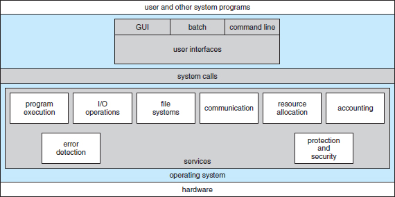
*Silberschatz Fig. 2.1 — View of operating-system services from user, application, and system-programmer perspectives.*

### OS categories

| Category | Characteristics | Examples |
|---|---|---|
| **General-purpose (desktop)** | Interactive, GUI-first, many users | Windows 10/11, macOS, Ubuntu Desktop |
| **Server** | Headless, high reliability, multi-user | Windows Server, RHEL, Ubuntu Server, FreeBSD |
| **Real-time (RTOS)** | Deterministic latency, priority-based preemption | VxWorks, QNX, FreeRTOS, Integrity |
| **Embedded** | Small footprint, fixed hardware | Embedded Linux (Yocto), Zephyr, Tock |
| **Mobile** | Battery, touch, app sandboxing | iOS, Android |
| **Distributed** | Multiple machines acting as one | Plan 9, cluster OSes |
| **Virtualized / hypervisor** | Runs multiple guest OSes | ESXi, Hyper-V, KVM, Xen |

### Mobile vs PC

| | PC | Mobile |
|---|---|---|
| **Power** | Wall or large battery | Small battery; aggressive sleep |
| **Input** | Keyboard + mouse | Touch + voice + sensors |
| **Apps** | Any binary the user runs | Sandboxed, permission-prompted |
| **Install source** | Any; web, disk, store | Primarily curated app store |
| **Updates** | User-scheduled | Vendor-pushed |
| **Multitasking** | Arbitrary processes | Cooperative / limited background |
| **Security model** | User-centric (single trusted user) | App-centric (every app is untrusted) |

### Safeguards

The Bib highlights six OS safeguards:

1. **Authentication** — prove identity (password, key, biometric, MFA).
2. **Authorization / Privileges** — what the authenticated user can do (tokens, groups, capabilities).
3. **Access Control** — enforcement of authorization (DAC, MAC, RBAC, ABAC).
4. **Logging / Auditing** — who did what, when (Security log, auditd, syslog, journald).
5. **Backups** — recovery from loss, corruption, ransomware (full / incremental / differential; offline + offsite + immutable).
6. **Patching / Updates** — close known vulnerabilities promptly.

### Access-control models

| Model | Description |
|---|---|
| **DAC (Discretionary Access Control)** | Owner decides permissions. Classic Unix rwx + Windows ACLs. |
| **MAC (Mandatory Access Control)** | OS-enforced policy regardless of owner. SELinux, AppArmor, TrustedSolaris, Windows Mandatory Integrity Control. |
| **RBAC (Role-Based Access Control)** | Permissions assigned to roles; users mapped to roles. Enterprise directories, sudo with role-based policies. |
| **ABAC (Attribute-Based)** | Decisions from subject/object/environment attributes. Modern cloud IAM. |
| **Capabilities** | Fine-grained kernel privileges (Linux capabilities like `CAP_NET_ADMIN` replace the monolithic root). |

### Backup strategies

- **Full** — copy everything every time. Simplest to restore; highest storage/time cost.
- **Incremental** — copy only what changed since the last backup of any kind. Smallest; longest restore chain.
- **Differential** — copy only what changed since the last full. Middle ground.
- **Synthetic full** — reconstruct a full from a base + incrementals without touching source.
- **3-2-1 rule** — 3 copies of data, on 2 different media, 1 of which is offsite.
- **Immutable / WORM backups** — write-once storage (S3 Object Lock, tape) defeats ransomware that encrypts online backups.

---

## 2. Boot Process

Both desktop OSes follow the same macro-stages with platform-specific details.

### Common macro-stages

1. **Firmware** — BIOS or UEFI initializes hardware, runs POST, loads bootloader.
2. **Bootloader** — picks and loads the kernel image.
3. **Kernel init** — kernel bootstraps, initializes subsystems, mounts root filesystem.
4. **User-space init** — first userspace process starts service tree.
5. **Login / shell / GUI** — user session.

### Disk preparation

Before an OS can boot from a disk, the disk needs a **partition table** and a **filesystem**.

- **Partition table** — map of logical disks on a physical device.
- **Filesystem** — per-partition organization (NTFS, ext4, APFS, FAT32, …).
- **Bootable media** — at least one partition flagged as bootable (legacy) or an EFI System Partition (modern).

### Legacy — BIOS + MBR

**BIOS (Basic Input/Output System)** — 1981 IBM PC-era 16-bit firmware. Runs from ROM, tests hardware (POST), enumerates devices, reads the first 512 bytes of the boot disk (the MBR), and jumps into that code.

**MBR (Master Boot Record)** — first sector of the disk:

```
Offset 0x000 .. 0x1BD : Boot code (446 bytes)
Offset 0x1BE .. 0x1FD : 4 partition-table entries × 16 bytes each
Offset 0x1FE .. 0x1FF : Signature 0x55 0xAA
```

**MBR partition table** — 4 entries × 16 bytes. Each entry has:

- Boot indicator (0x00 = no, 0x80 = active).
- Starting CHS (legacy cylinder-head-sector).
- Partition type (0x07 = NTFS, 0x83 = Linux, 0x82 = Linux swap, 0x0B = FAT32, 0xEE = GPT-protective).
- Ending CHS.
- Starting LBA (32-bit — the reason for the 2 TiB limit).
- Size in sectors.

MBR limits:
- 4 primary partitions (or 3 primary + 1 extended with logical partitions nested).
- 2 TiB maximum disk size (32-bit LBA × 512-byte sectors).
- No crypto signing of the boot code.

### Modern — UEFI + GPT

**UEFI (Unified Extensible Firmware Interface)** — 64-bit firmware with modern features:
- Boot from any GPT partition with an EFI executable.
- Built-in disk driver, network stack, GUI shell.
- **Secure Boot** — firmware verifies signed bootloaders and drivers against platform keys.
- Boot Manager with an ordered list of boot entries, user-editable.
- HTTP/HTTPS network boot support.

**GPT (GUID Partition Table)**:

- Header at LBA 1 (LBA 0 is a protective MBR to hide the disk from legacy OSes).
- Up to **128 partitions** by default (extensible).
- 64-bit LBA → effective 9.4 ZB limit.
- Each partition has a **GUID type**, a **partition GUID**, name, attributes.
- Backup header + partition array at the end of the disk.
- CRC32 checksums on headers and partition array.

**EFI System Partition (ESP)** — small FAT32 partition holding `.efi` bootloaders under `\EFI\<vendor>\` (e.g., `\EFI\Microsoft\Boot\bootmgfw.efi`, `\EFI\ubuntu\grubx64.efi`).

### UEFI boot sequence

1. **SEC (Security phase)** — CPU reset vector, minimal trust, transition to long mode.
2. **PEI (Pre-EFI Initialization)** — memory controller init, boot-mode detection.
3. **DXE (Driver Execution Environment)** — load device drivers as EFI modules.
4. **BDS (Boot Device Selection)** — consult Boot#### entries, pick target, check Secure Boot.
5. **TSL (Transient System Load)** — hand off to the OS loader.
6. **RT (Runtime)** — OS running; UEFI runtime services available.

### Secure Boot

Firmware holds public keys (PK = Platform Key, KEK = Key Exchange Key, DB = allowed signers, DBX = revoked hashes). Every EFI executable in the boot path must be signed by a key in DB and not hashed in DBX. Breaks pre-boot rootkits; requires signed bootloaders (shim → GRUB → kernel chain on Linux).

### Linux boot (summary)

UEFI → GRUB → kernel + initramfs → init/systemd → target/runlevel. Full treatment in `JCAC-UNIX-LINUX.md` §4.

### Windows boot (summary)

UEFI → Windows Boot Manager (`bootmgr` / `bootmgfw.efi`) → `winload.efi` → `ntoskrnl.exe` → `smss.exe` → `csrss.exe` + `wininit.exe` → `services.exe`. Full treatment in `JCAC-WINDOWS.md` §9.

### Boot-process attacks and defenses

- **Evil Maid attack** — attacker with physical access modifies bootloader. Defense: Secure Boot + BitLocker/LUKS with TPM.
- **Bootkits** — malicious code in the bootloader or firmware. Defense: Secure Boot, Measured Boot with TPM, firmware attestation.
- **Unquoted service paths** (Windows) — services with spaces in path hijacked by placing binary in a parent dir.

---

## 3. Windows

> **Deep dive in `JCAC-WINDOWS.md` (Module 7).** Summary here for Module 5 context.

### At-a-glance

- **Kernel:** `ntoskrnl.exe` — hybrid (microkernel-inspired structure but monolithically compiled in).
- **Primary authentication store:** SAM (local), NTDS.DIT (Active Directory).
- **Filesystem:** NTFS (default), ReFS (Server), FAT/exFAT (removable).
- **Process creation:** `CreateProcess` → `NtCreateUserProcess`.
- **Access control:** ACLs attached to every securable object; SIDs identify principals.
- **Policy:** Local Security Policy + Group Policy (AD-joined).
- **Shell:** `cmd.exe` (legacy), PowerShell (modern).
- **Logging:** Event Log (`.evtx`) channels: Security, System, Application, plus per-provider operational logs.
- **Patching:** Windows Update + WSUS / Intune / Configuration Manager.

### Editions

- **Workstation:** Home, Pro, Enterprise, Education. Pro+ can join a domain.
- **Server:** 2016, 2019, 2022, 2025. Core (headless) vs Desktop Experience.

### Enumeration quick commands

```
ver
systeminfo
whoami /all
net user
net localgroup administrators
tasklist /svc
Get-ComputerInfo
Get-Service
```

For the full Windows treatment (accounts, security policy, PowerShell, services, logon, AD, etc.) see `JCAC-WINDOWS.md`.

---

## 4. UNIX

> **Deep dive in `JCAC-UNIX-LINUX.md` (Module 8).** Summary here for Module 5 context.

### Accessing a UNIX system

- Local console (TTY): `getty` → `login`.
- SSH remote: TCP 22, key or password auth, `~/.ssh/authorized_keys`.
- Serial console on embedded gear.
- X11 forwarding or Wayland remote for GUI.

### Anatomy of a command

```
command [options] [arguments]

ls -la /home/alice
│  │   │
│  │   └── argument (path)
│  └────── options (flags)
└───────── command
```

Flags: short (`-l`) and long (`--long-flag`). `--` ends options, lets you pass a filename starting with `-`.

### System command manual

```
man 1 ls          # user command
man 2 open        # syscall
man 3 printf      # library function
man 5 passwd      # file format
man 8 mount       # sysadmin command
apropos <topic>   # keyword search
whatis <cmd>      # short description
```

Sections: 1 user, 2 syscalls, 3 libc, 4 devices, 5 file formats, 6 games, 7 misc, 8 admin.

### Introductory commands

| Command | Purpose |
|---|---|
| `pwd` | Print working directory |
| `cd` | Change directory |
| `ls` | List directory contents |
| `cp` | Copy file |
| `mv` | Move / rename |
| `rm` | Remove |
| `mkdir` | Make directory |
| `rmdir` | Remove empty directory |
| `touch` | Create or update mtime |
| `cat` | Concatenate and print |
| `less` | Pager |
| `echo` | Print argument |
| `grep` | Search text |
| `find` | Search filesystem |

### File and directory structure

System dirs: `/bin`, `/sbin`, `/etc`, `/var`, `/usr`, `/home`, `/tmp`, `/proc`, `/sys`, `/dev`. Full FHS table in `JCAC-UNIX-LINUX.md` §1.

### Visual editor — vi / vim

Modal editor: **Normal** (default, commands), **Insert** (typing), **Visual** (select), **Command-line** (`:` commands).

Minimum survival:

```
i           enter insert mode
Esc         back to normal
:w          write
:q          quit
:wq or ZZ   write and quit
:q!         quit without saving
/pattern    search forward
dd          delete line
u           undo
```

---

## 5. Advanced UNIX Commands

> **Deep dive in `JCAC-UNIX-LINUX.md` (Modules 8 & covered across §2, §7, §12).** Summary table here.

### File / directory

```
stat, file, lsof, du, df, lsblk, blkid
ls -lai             # inode, full perms
readlink -f         # resolve symlinks
find / -name X -type f
tree -L 2
```

### Process

```
ps aux
ps -ef
top, htop
pgrep, pkill
kill -SIGTERM <pid>
pidof nginx
nohup cmd &         # detach from terminal
disown
jobs, fg, bg
```

### Forensics

```
strings binary
hexdump -C file
xxd file
md5sum, sha256sum
stat file           # all timestamps
lsof -p <pid>
/proc/<pid>/maps    # memory map of a process
```

### File compression / archiving

```
gzip / gunzip       # .gz
bzip2 / bunzip2     # .bz2
xz / unxz           # .xz
zstd / unzstd       # .zst
zip / unzip
tar -czf out.tgz dir/     # create compressed tar
tar -xzf out.tgz          # extract
tar -tf out.tgz           # list
```

### Scheduling

- **cron** — classic time-based scheduler.

```
# Per-user crontab
crontab -e
# Format: m h dom mon dow command
0 3 * * *  /usr/local/bin/backup.sh
*/15 * * * * /opt/health-check.sh
@reboot    /opt/app/startup.sh
```

- **at** — one-off jobs: `echo "reboot" | at 3am`.
- **systemd timers** — modern replacement for cron; units pair a `.timer` with a `.service`.
- **anacron** — catches up missed runs (laptops sometimes off at cron time).

### User management

```
useradd, usermod, userdel, passwd, chage
/etc/passwd, /etc/shadow, /etc/group, /etc/gshadow
id, groups, getent passwd alice
```

Full auth/authz treatment in `JCAC-UNIX-LINUX.md` §12.

---

## 6. File and Directory Permissions

> **Deep dive in `JCAC-UNIX-LINUX.md` §2.** Summary of the Unix model; Windows ACLs in `JCAC-WINDOWS.md` §12.

### Unix permission triad

`rwxr-xr--` = owner rwx, group r-x, others r--. Numeric: 754 (r=4, w=2, x=1).

### Special bits

- **SUID (4xxx)** — executable runs as file owner's EUID.
- **SGID (2xxx)** — executable runs as file group; on dir, new files inherit dir's group.
- **Sticky (1xxx)** — on dir, only owner can delete entries (`/tmp`).

### Key commands

```
chmod 755 file
chmod u+x file
chown alice:dev file
chgrp dev file
umask 027
getfacl file
setfacl -m u:bob:rwx file
chattr +i /etc/resolv.conf
```

### Windows NTFS permissions

Per-object **DACL** (Discretionary ACL) — list of ACEs (Access Control Entries). Each ACE: principal SID, mask of allowed/denied rights, inheritance flags. See `JCAC-WINDOWS.md` §12 for full NTFS permissions and inheritance.

---

## 7. PowerShell

> **Deep dive in `JCAC-WINDOWS.md` §5.** Summary for Module 5 context.

### What it is

PowerShell is the modern Windows administration shell — object-oriented pipeline, verb-noun cmdlets, cross-platform since 6.x (pwsh). Two implementations:

- **Windows PowerShell 5.1** — shipped with Windows 10/11, .NET Framework.
- **PowerShell 7+ (`pwsh`)** — cross-platform (Windows/Linux/macOS), .NET Core/5+.

### Cmdlet grammar

`Verb-Noun`: `Get-Service`, `Set-Item`, `New-ADUser`, `Stop-Process`, `Restart-Computer`, `Invoke-WebRequest`.

### Pipeline passes objects, not text

```powershell
Get-Process |
    Where-Object CPU -gt 10 |
    Sort-Object CPU -Descending |
    Select-Object -First 5 Name, CPU, Id
```

### Help

```powershell
Get-Help Get-Service -Examples
Get-Command -Verb Get
Get-Module -ListAvailable
```

### ISE vs modern editor

- **PowerShell ISE** — legacy graphical editor; feature-frozen.
- **VS Code + PowerShell extension** — modern preferred environment.

### Security-relevant features

- **Execution Policy** — Restricted / AllSigned / RemoteSigned / Unrestricted / Bypass.
- **AMSI** — pre-execution scan of scripts via registered AV/EDR.
- **Script Block Logging** — Event ID 4104.
- **Constrained Language Mode** — restricted PS subset via WDAC/AppLocker.
- **JEA (Just Enough Administration)** — role-scoped constrained endpoints.

Full PowerShell surface in `JCAC-WINDOWS.md` §5.

---

## 8. Mobile OSes

### Android

Android is **Linux kernel** + **AOSP userspace** + **Android Runtime (ART)**.

**Device hardware typical (Bib's scope):**

- ARM64 SoC (Qualcomm Snapdragon, Samsung Exynos, MediaTek Dimensity, Google Tensor).
- TrustZone — ARM's secure-world / normal-world partition; hosts the Trusted Execution Environment (TEE).
- eMMC or UFS flash.
- TPM or dedicated secure element (Titan M on Pixel).

**OS security model:**

- Every app runs as a distinct Linux UID — isolation via the Linux kernel's UID/GID model.
- App sandbox — filesystem, IPC, and network restrictions per UID.
- Permissions — explicit user prompts for sensitive APIs (location, camera, contacts).
- Full-disk and file-based encryption (FBE) with hardware-backed keystore.
- SELinux enforcing mode mandatory since Android 5 (Lollipop).
- Verified Boot — dm-verity on read-only partitions; boot verified by TEE.
- SafetyNet / Play Integrity — runtime attestation.

**Runtime (ART) — Android Runtime:**

- Replaced Dalvik VM (Android 5+).
- **AOT (Ahead-Of-Time)** compilation of DEX bytecode to native on install (and again at first boot); runtime JIT for hot paths.
- DEX files inside APKs; `classes.dex` is the compiled app.

**Rooting:**

- Gaining full root on the device, typically by exploiting a kernel or bootloader vulnerability or by unlocking the bootloader.
- **Magisk** — systemless root; modifies only `/data` and boot image, keeps `/system` intact so OTA updates and attestation can still work (partially).
- Rooting breaks the app-sandbox guarantees — banking / DRM apps refuse to run.

**Android threats:**

- Malicious apps bypassing Play Store (sideload APK, third-party stores).
- `Toast Overlay` / accessibility-service abuse for clickjacking.
- SMS-intercept malware for SMS-based 2FA defeat.
- Stalkerware with device-admin privileges.

### iOS (and iPadOS)

iOS is **Darwin** (XNU kernel + BSD userspace) + Cocoa Touch + App sandbox.

**Secure Boot chain:**

1. Boot ROM — immutable, hardware-verified root of trust.
2. Low-Level Bootloader (LLB) — signed by Apple.
3. iBoot — signed.
4. Kernelcache — signed.
5. System image — signed and sealed (SSV — Signed System Volume, iOS 15+).

Break in this chain anywhere means the OS won't boot. Verified with Apple's root certificate burned into the Boot ROM.

**Software updates:**

- Delivered OTA or via iTunes/Finder.
- Personalized — each update bundle is signed for a specific device's ECID.
- **SHSH2 blobs** — Apple's signing records. Apple stops signing old versions to prevent downgrade.

**Secure Enclave (SEP):**

- Dedicated coprocessor (separate ARM CPU in Apple SoC) isolated from the main application processor.
- Holds biometric templates (Touch ID / Face ID), device passcode-derived keys, Keychain secrets, Apple Pay cryptographic keys.
- Even with kernel-level code execution on AP, SEP keys aren't extractable.
- Communicates via a mailbox protocol; own OS image (sepOS).

**Jailbreaking:**

- Iterative kernel / bootchain vulnerabilities grant root + disable code-signing enforcement.
- Terminology: **tethered** (requires computer each boot), **semi-tethered** (boots but jail off until reactivated), **semi-untethered** (manual re-jail app each reboot), **untethered** (persists across reboots).
- Notable historic exploits: checkm8 (bootrom, A5–A11, unpatchable), checkra1n jailbreak using it.
- Consequence: same as Android rooting — sandbox broken, attestation fails, some apps refuse.

**App sandbox and entitlements:**

- Each app in its own container directory under `/var/mobile/Containers/Data/Application/<UUID>/`.
- Entitlements — signed privileges granted to the binary (e.g., `com.apple.developer.networking.HotspotConfiguration`).
- Hardened Runtime + System Integrity Protection (macOS) / Data Protection (iOS).
- Notarization — macOS apps scanned by Apple.

### Mobile threat landscape (both platforms)

- Phishing / smishing for credentials.
- Malicious profiles (iOS MDM abuse) — grants the attacker enterprise management rights.
- Supply-chain app compromise (XcodeGhost).
- Sideloaded malware on jailbroken devices.
- Pegasus / Predator — commercial spyware exploiting zero-click chains (iMessage, WhatsApp).

---

## 9. File Systems — the Five-Layer Model

JCAC frames the filesystem as five layers, each with distinct artifacts.

### The layers

| Layer | Purpose | Windows | Linux/Unix |
|---|---|---|---|
| **Physical** | Bits on the medium | Sectors on HDD/SSD/NVMe | Same |
| **File System** | On-disk structure | NTFS/ReFS/FAT/exFAT | ext4/XFS/Btrfs/ZFS |
| **Data** | Where file content lives | Clusters in MFT data runs | Data blocks pointed at by inode |
| **Metadata** | Ownership, timestamps, perms | MFT $STANDARD_INFORMATION / $SECURITY_DESCRIPTOR | Inode |
| **Filename** | Human-readable name to inode mapping | MFT $FILE_NAME | Directory entry |

### Physical layer

- HDDs: platters, heads, tracks, sectors. LBA (Logical Block Addressing) flattens the CHS geometry.
- SSDs: NAND cells organized as pages (read/write unit, ~4–16 KB) inside blocks (erase unit, 256 KB–4 MB). Flash Translation Layer (FTL) hides wear-leveling and garbage collection.
- NVMe: protocol on PCIe; bypasses SATA/SCSI command overhead.
- Sector size typically 512 bytes (legacy) or 4 KB (advanced format / native 4K).

### File System layer

Common file system types:

| FS | Typical OS | Notes |
|---|---|---|
| **NTFS** | Windows | Journaled, ACL-based permissions, USN Journal, MFT, ADS |
| **ReFS** | Windows Server | Resilient FS, checksums, storage-spaces integration |
| **FAT32** | Cross-platform removable | No ACLs, 4 GB file limit, 2 TB volume limit |
| **exFAT** | Cross-platform removable | Extended FAT; ≥ 4 GB files |
| **ext4** | Linux | Journaled, extent-based |
| **XFS** | Linux | High-throughput, metadata journaling |
| **Btrfs / ZFS** | Linux / BSD | CoW, snapshots, checksumming, integrated volume mgmt |
| **APFS** | macOS | Modern default, CoW, clones, snapshots |
| **HFS+** | macOS (legacy) | Pre-APFS |

### Data layer

- **Block / cluster** — allocation unit (typically 4 KB on modern FS).
- **Extent** — (start, length) run of contiguous blocks. ext4, NTFS, XFS use extents over block lists.
- **Sparse file** — holes don't consume disk; read as zeros.
- **Compression / dedup** — some FS (NTFS compressed attribute, Btrfs, ZFS) compress transparently.

### Metadata layer

**On NTFS:**

- **MFT (Master File Table)** — every file has an MFT record (typically 1 KB). Small files are *resident* — data fits inside the record.
- **`$STANDARD_INFORMATION`** — timestamps, DOS-file-attribute flags, owner ID, security ID.
- **`$FILE_NAME`** — name + timestamps (second copy). Harder to timestomp.
- **`$DATA`** — main data stream (plus alternate data streams).
- **`$SECURITY_DESCRIPTOR`** / SECURITY hive — DACL/SACL.

**On ext4:**

- **Superblock** — filesystem header (block size, counts, UUID, mount state); backups in specific block groups.
- **Group Descriptor Table (GDT)** — per-block-group pointers to bitmaps and inode tables.
- **Inode** (typically 256 bytes): owner, permissions, size, timestamps, extents/block pointers.

### Filename layer

- Directory = a file whose content is a list of `(inode, name)` pairs (ext) or indexed MFT records (NTFS).
- Case sensitivity varies: ext is case-sensitive; NTFS is case-insensitive by default (can be toggled per-dir on Windows 10+); APFS is case-insensitive by default.
- **Hardlinks** — another filename pointing at the same inode/MFT record; link count incremented.
- **Symbolic links** — file holding a path string; resolved at access.

### Forensic timestamps — MACB / MACE

| Platform | Timestamps |
|---|---|
| **NTFS (MACE)** | Modified, Accessed, Created (born), MFT-entry-changed |
| **ext4 (MACB)** | Modified (mtime), Accessed (atime), Changed (ctime = inode-change), Born (crtime) |
| **APFS** | mtime, atime, ctime, btime |
| **FAT32** | Limited — Created, LastAccess (date-only), Modified |

**Timestomping** sets timestamps to deceive investigators. On NTFS, defenders compare `$STANDARD_INFORMATION` timestamps against `$FILE_NAME` timestamps; the latter are harder to forge.

### NTFS-specific artifacts of forensic interest

- **USN Journal (`$UsnJrnl:$J`)** — append-only record of changes.
- **`$LogFile`** — NTFS transaction log (enables journaling).
- **Alternate Data Streams (ADS)** — `file.txt:hidden.exe` syntax; malware hiding.
- **Volume Shadow Copy Service (VSS)** — filesystem snapshots; `vssadmin list shadows`.

### Linux filesystem forensic artifacts

- **Journal** — `/journal` or separate device; records pending metadata changes.
- **Orphan inodes** — deleted but still referenced; `debugfs` recovers.
- **extfs magic** `0xEF53` in superblock.

---

## 10. OS Processes — Kernel Designs

Kernels come in three architectural shapes:

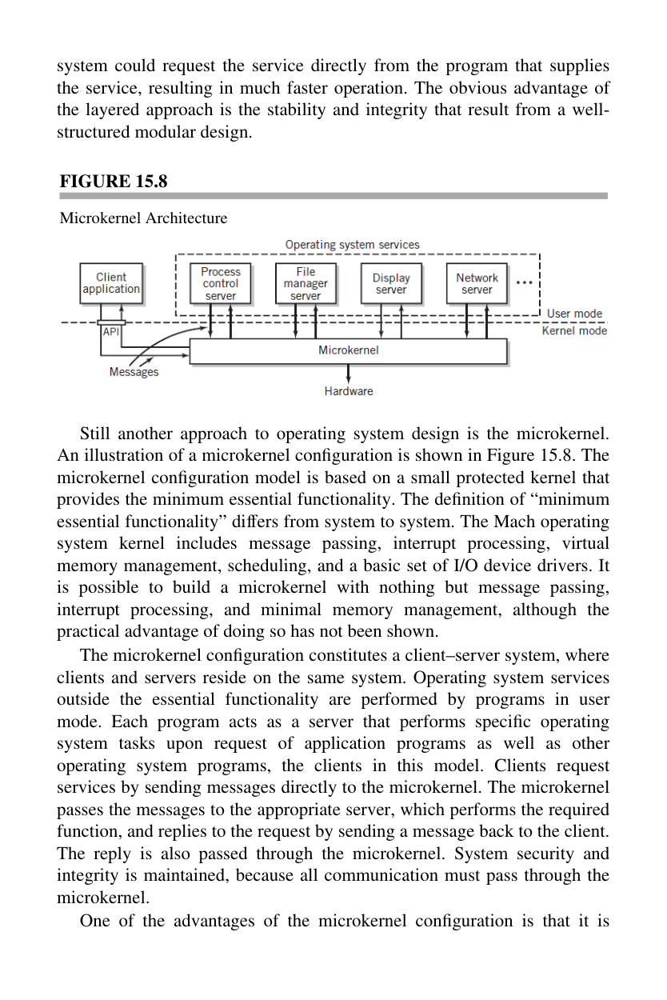
*Englander — abstraction layers of a general-purpose OS over the hardware platform.*

| Architecture | Description | Examples |
|---|---|---|
| **Monolithic** | All OS services (drivers, FS, net, scheduler) in one address space in ring 0 | Linux, traditional Unix |
| **Microkernel** | Only bare essentials (IPC, scheduling, basic memory) in kernel; services in userspace | MINIX, L4 family, QNX, seL4 |
| **Hybrid** | Microkernel structure but most services still in kernel space for performance | Windows NT family, macOS XNU |

### Linux — monolithic with modules

- Single kernel binary (`vmlinuz`) with most drivers compiled in or loaded as LKMs.
- All kernel components share a single address space.
- Fast (no IPC between kernel components); complex (one bug can take down the system).
- Preemptible since 2.6; fully preemptible realtime variants (PREEMPT_RT).

Source layout: `kernel/`, `mm/`, `fs/`, `drivers/`, `net/`, `arch/<arch>/`, `security/`.

### Windows — hybrid (NT kernel)

- `ntoskrnl.exe` includes Executive, Kernel, HAL wrapper.
- Drivers loaded as kernel-mode modules (`.sys`).
- User-mode subsystems: Win32 (`csrss.exe`), POSIX/WSL, legacy SFU/SUA.
- Microkernel-inspired structure but not microkernel-pure.
- Object Manager — every securable thing (file, process, event, mutex, token) is an Object with a type and security descriptor.

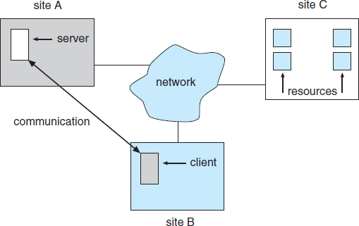
*Silberschatz Fig. 17.x — Distributed system as cooperating independent nodes communicating via network.*

### Android — Linux kernel + AOSP

- Inherits Linux kernel (frequently an LTS branch with vendor patches + GKI — Generic Kernel Image).
- **Binder IPC** — custom driver for efficient message passing between apps and system services. The backbone of Android's service architecture.
- Zygote — pre-forked process that `fork()`s to spawn app processes quickly.
- init + service manager: `init.rc`, `servicemanager`.
- HAL (Hardware Abstraction Layer) — vendor drivers run in user space as HAL services accessed via Binder.

### iOS / macOS — XNU (hybrid)

- XNU = Mach microkernel core + BSD personality + I/O Kit driver framework.
- Mach ports for IPC; BSD for POSIX compatibility.
- Launchd as PID 1 (successor to init).

### Monolithic vs microkernel trade-offs

| | Monolithic | Microkernel |
|---|---|---|
| **Performance** | Fast — direct function calls | Slower — IPC between components |
| **Fault isolation** | Weak — driver bug = kernel panic | Strong — service crash restartable |
| **Security** | Huge attack surface in ring 0 | Minimal kernel; most code un-privileged |
| **Complexity** | Conceptually simple; source huge | Conceptually elegant; IPC design subtle |
| **Development velocity** | Long cycle to touch kernel | Services evolve independently |

---

## 11. Process Internals

### What a process is

A running program: an executable image loaded into a virtual address space with allocated kernel resources (open files, sockets, signals), scheduled for CPU time by the OS.

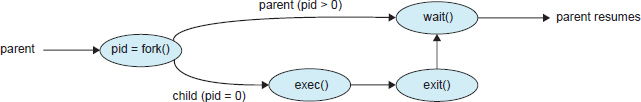
*Silberschatz Fig. 3.8 — Process tree rooted at `init`/PID 1, showing parent-child relationships created by `fork()`.*

### Threads

- Multiple threads within one process share the address space, open files, and process-level resources.
- Each thread has its **own stack, registers, and thread-local storage**.
- **Linux:** pthreads (POSIX threads) via `clone()` syscall with `CLONE_VM|CLONE_FS|CLONE_FILES|CLONE_SIGHAND`. Kernel sees threads as tasks sharing those resources.
- **Windows:** Win32 `CreateThread`, under the hood `NtCreateThread`. Every thread has a thread environment block (TEB).

Advantages of threads vs processes: faster context switches (no address-space change), easy shared memory, lower overhead for fine-grained parallelism. Disadvantages: no isolation — one thread's crash or memory corruption affects all.

### Process Control Block (PCB)

Kernel data structure per process; in Linux it's `struct task_struct`. Contains:

| Field | Purpose |
|---|---|
| **PID, PPID** | Identifiers |
| **State** | R, S, D, Z, T (Linux); similar on Windows |
| **Program counter** | Next instruction |
| **CPU registers (saved)** | For context switch |
| **Memory-management info** | Page table pointer, VMAs |
| **Accounting** | CPU time, user/system time, priority |
| **Scheduling info** | Priority, policy, nice value |
| **I/O status** | Open file descriptors, PTY |
| **Signal mask** | Pending and blocked signals |
| **Credentials** | UID, GID, EUID, EGID, capabilities |
| **Parent / children / threads pointers** | Process tree |

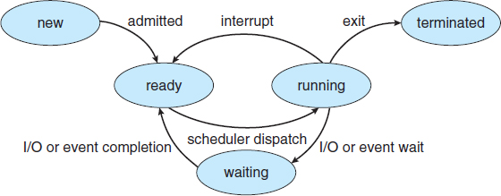
*Silberschatz Fig. 3.2 — PCB fields: state, PID, registers, memory-management info, accounting, I/O status.*

### Process states

| State | Linux letter | Meaning |
|---|---|---|
| **Running** | R | Currently on CPU or ready to run |
| **Sleeping (interruptible)** | S | Waiting on event; can be woken by signal |
| **Uninterruptible sleep** | D | Usually blocked on I/O; can't be killed until I/O completes |
| **Stopped** | T | Suspended via SIGSTOP/SIGTSTP or ptrace |
| **Zombie** | Z | Terminated but parent hasn't reaped via `wait()` |
| **Dead** | X | Transient — about to be cleaned up |

Windows equivalents: Ready, Running, Waiting (many wait-reasons), Terminated, Initialized, Transition, Standby.

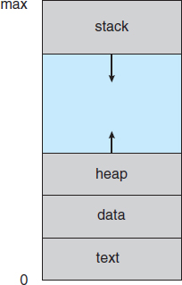
*Silberschatz Fig. 3.1 — New → Ready → Running → Waiting → Terminated, with transitions driven by the scheduler, I/O, and exit.*

### Process lifecycle

1. **Create** — `fork()` + `execve()` on Linux; `CreateProcess()` on Windows.
2. **Schedule** — kernel assigns CPU quanta.
3. **Run / wait / sleep** — transitions among states.
4. **Terminate** — `exit()` or signal-induced death.
5. **Zombie** — awaits parent `wait()`.
6. **Reaped** — PCB freed.

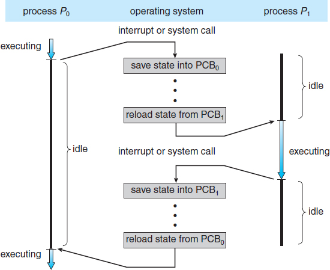
*Silberschatz Fig. 3.3 — Sequence of saving P0's state to its PCB, loading P1's state from its PCB, and resuming execution on P1.*

### IPC mechanisms

| Mechanism | OS | Notes |
|---|---|---|
| **Pipes (anonymous)** | Both | One-way; `pipe()` / `CreatePipe()` |
| **Named pipes (FIFO)** | Both | Cross-process; Linux `mkfifo`, Windows `\\.\pipe\name` |
| **Message queues** | Both | POSIX MQ on Linux; mailslots on Windows |
| **Shared memory** | Both | Linux `shmget`/`mmap`; Windows `CreateFileMapping` |
| **Semaphores / mutexes** | Both | Classic synchronization primitives |
| **Sockets (UNIX domain)** | Linux | Local only; file-system rendezvous |
| **Sockets (network)** | Both | TCP/UDP over loopback or remote |
| **Signals** | Linux | Async notification; 1–31 standard, 32–64 realtime |
| **Events** | Windows | WaitForSingleObject on event handle |
| **D-Bus** | Linux desktop | System/session bus; service-oriented |
| **COM / RPC** | Windows | DCOM for distributed |
| **Binder** | Android | Kernel-driver IPC for app-to-service |
| **Mach ports** | macOS/iOS | Darwin's primary IPC |

---

## 12. Scheduling and Dispatch

The **scheduler** picks which runnable thread runs next; the **dispatcher** does the context switch.

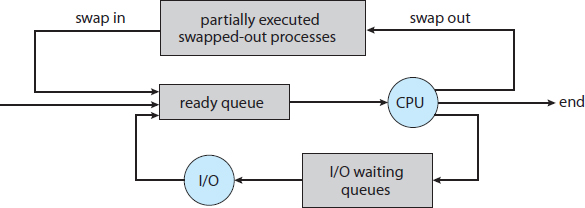
*Silberschatz Fig. 3.7 — Three-level scheduler model: long-term admits jobs, medium-term swaps, short-term dispatches to CPU.*

### Preemptive vs non-preemptive

- **Non-preemptive (cooperative)** — a running thread continues until it blocks or voluntarily yields. Fast; risky (runaway thread starves others). Classic Windows 3.x, macOS 9.
- **Preemptive** — the kernel can interrupt any thread at quantum expiration. All modern general-purpose OSes.

### Common scheduling algorithms

| Algorithm | How it picks next |
|---|---|
| **FCFS (First-Come First-Served)** | Runs in arrival order |
| **SJF (Shortest-Job-First)** | Shortest known burst first |
| **Priority** | Highest-priority runnable |
| **Round Robin (RR)** | Each gets a quantum, rotate |
| **Multilevel Feedback Queue (MLFQ)** | Several queues with different priorities; tasks move between queues based on behavior |
| **Completely Fair Scheduler (CFS)** | Each task gets "fair" share based on weight; Linux 2.6.23+ |
| **EEVDF (Earliest Eligible Virtual Deadline First)** | Linux CFS successor, 6.6+ |

### Linux schedulers

- **SCHED_OTHER / SCHED_NORMAL** — default; CFS or EEVDF.
- **SCHED_BATCH** — long-running CPU-bound work; deprioritized.
- **SCHED_IDLE** — only runs when CPU otherwise idle.
- **SCHED_FIFO** — realtime first-in-first-out; runs until yields.
- **SCHED_RR** — realtime round-robin with quantum.
- **SCHED_DEADLINE** — real-time deadline scheduler.

Set via `chrt -f 50 ./rt_task` or `sched_setscheduler(2)`.

### Windows scheduler

- 32 priority levels: 0–15 dynamic (classic user processes), 16–31 real-time.
- Priority classes: Idle, Below Normal, Normal, Above Normal, High, Realtime.
- Per-thread priority boost on I/O completion and foreground-window ownership.
- Quantum typically 20 ms on workstation, 120 ms on server (to favor long-running server ops).

### Concurrency concerns

- **Race conditions** — order-of-execution bugs; prevent with synchronization.
- **Deadlock** — threads waiting on each other's locks forever; prevent with lock ordering, timeouts, try-locks.
- **Livelock** — threads stay active but make no progress.
- **Priority inversion** — low-pri thread holds lock that high-pri needs; medium-pri starves the low. Fix: priority inheritance.
- **Starvation** — thread never gets CPU.
- **Spinlocks vs blocking locks** — spinlocks burn CPU waiting; appropriate for short critical sections on multi-core.

### Context switch cost

Switching threads involves saving registers, switching page tables (if cross-process), flushing TLB (partially via PCID/ASID), cache invalidation. Typical cost: a few microseconds. **Reducing** context switches (batching I/O, larger quanta, pinning threads to cores) can be a big win for throughput.

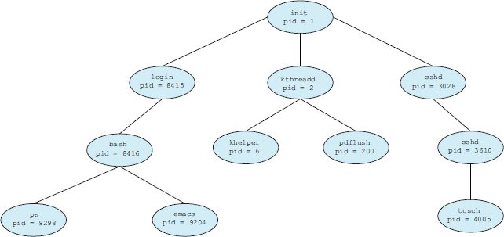
*Silberschatz — save state of current thread, pick next runnable, restore its state, resume. Pure overhead from the application's perspective.*

---

## 13. Interrupts, Exceptions, and Trap Handling

The CPU provides three mechanisms for the OS to regain control asynchronously or synchronously.

### Interrupts

Asynchronous events from hardware (disk I/O complete, NIC packet arrived, timer tick).

- **Maskable** — can be disabled temporarily (most device IRQs).
- **Non-maskable (NMI)** — cannot be masked; catastrophic events (hardware failure, watchdog).
- Dispatched via the **IDT (Interrupt Descriptor Table)** on x86. Each IRQ number maps to a handler address + privilege level.
- Modern systems use **MSI / MSI-X** — devices write a magic value to a PCI address instead of asserting a wire. Gives more IRQ vectors and better scalability.

### Exceptions

Synchronous CPU-detected conditions:

- **Faults** — recoverable. E.g., page fault (load the missing page, retry instruction).
- **Traps** — intentional. E.g., `int3` breakpoint, syscall instruction.
- **Aborts** — unrecoverable. E.g., double fault, machine check.

### Syscalls — the user→kernel trap

Since ~2003 on x86-64, Linux and Windows use the `syscall` instruction:

1. User code puts syscall number in `%rax`, args in `%rdi`, `%rsi`, `%rdx`, `%r10`, `%r8`, `%r9`.
2. `syscall` — CPU switches to ring 0, jumps to address in `MSR_LSTAR`.
3. Kernel entry point dispatches based on syscall number.
4. Handler runs in kernel mode; returns result in `%rax`.
5. `sysret` returns to user mode.

Historical x86: `int 0x80` (slow), `sysenter` (faster).

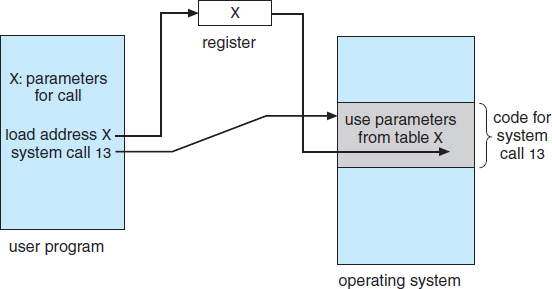
*Silberschatz Fig. 2.7 — User program invokes `read()`, libc wraps the trap, CPU switches to kernel mode, handler executes, returns.*

### Common Linux syscalls (x86-64)

| # | Name | Purpose |
|---|---|---|
| 0 | read | Read from fd |
| 1 | write | Write to fd |
| 2 | open | Open file |
| 3 | close | Close fd |
| 9 | mmap | Map memory |
| 10 | mprotect | Change page permissions |
| 11 | munmap | Unmap memory |
| 12 | brk | Extend data segment / heap |
| 57 | fork | Create process |
| 59 | execve | Replace process image |
| 60 | exit | Terminate process |
| 62 | kill | Send signal |
| 231 | exit_group | Terminate all threads |

### Windows syscalls (NT)

Microsoft doesn't publicly document the numeric NT syscall table; numbers shift between Windows versions. Userspace calls Win32 API (`CreateFile`), which calls `Nt*` wrappers in `ntdll.dll` (`NtCreateFile`), which performs the `syscall` to kernel.

### Handler entry / exit discipline

- Save all caller-saved registers of the user context.
- Switch to kernel stack.
- Enable minimal interrupts needed (or keep disabled depending on handler type).
- Do the work.
- Restore registers, switch back to user stack, `sysret` / `iret`.

### Attack-relevant trap handling

- **`mprotect` abuse** — change a data page to executable (RWX). Classic stack-shellcode enabler, defeated by DEP/NX + W^X.
- **Syscall filtering** — seccomp-BPF on Linux, Process Mitigation Policies on Windows — restricts which syscalls a sandboxed process can invoke.
- **User-mode-only attacks** — ROP gadgets chain existing executable bytes instead of injecting new code, sidestepping DEP.

---

## 14. Memory Management

### Virtual memory

Each process has its own **virtual address space** — typically 48-bit on x86-64 (256 TB) or 52-bit (4 PB) on newer CPUs. Physical RAM is much smaller; the OS maps virtual pages to physical frames via the **MMU** and page tables.

**Page** — the unit of mapping: **4 KB** baseline on x86 / ARM64; **2 MB** "large" / "huge" pages; **1 GB** "gigantic" pages.

**Page-table hierarchy on x86-64 (4-level):**

- PML4 → PDPT → PD → PT → Page.
- 9 bits per level × 4 = 36 bits of virtual address, + 12 bits offset = 48-bit virtual addresses.
- 5-level paging (Ice Lake+) extends to 57-bit.

**TLB (Translation Lookaside Buffer)** — hardware cache of recent virtual→physical translations. Hit: ~1 cycle. Miss: page-table walk (tens to hundreds of cycles).

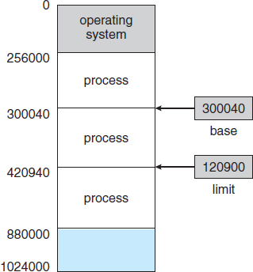
*Silberschatz Fig. 8.1 — Base + limit registers define the physical memory range a process can access.*

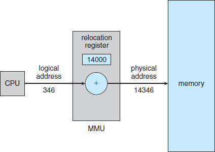
*Silberschatz Fig. 8.6 — MMU adds the relocation/base register to every logical address, checking against the limit.*

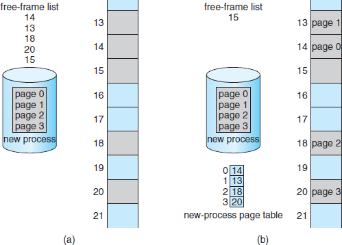
*Silberschatz Fig. 8.14 — Paging hardware with TLB; TLB hit returns the frame directly, miss walks the page table.*

### Page protection bits

Per-page attributes enforced by MMU:

| Bit | Effect |
|---|---|
| **Present** | Page is in RAM (vs swapped) |
| **RW** | Writable |
| **NX / XD** | Non-executable (enforces DEP/W^X) |
| **User/Supervisor** | Ring 3 allowed vs ring 0 only |
| **Accessed / Dirty** | Hardware-set; used by page replacement |
| **Global** | TLB not flushed on CR3 write (for kernel pages) |
| **CoW / shared** | OS-level marker for copy-on-write forks |

### Paging and swap

- When physical RAM is full and new pages are needed, the OS picks a victim page (typically via LRU or a clock algorithm), writes it to backing store if dirty, and repurposes the frame.
- **Swap** on Linux (swap partition or swapfile); **pagefile.sys** on Windows (often `C:\pagefile.sys`).
- **Thrashing** — working set exceeds RAM; system is mostly paging in/out instead of computing.

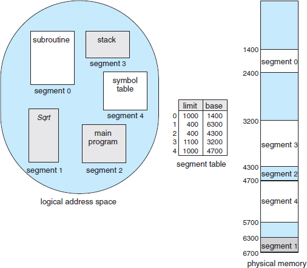
*Silberschatz Fig. 8.10 — Page number + offset; page number indexes the page table to produce a frame number; frame number + offset = physical address.*

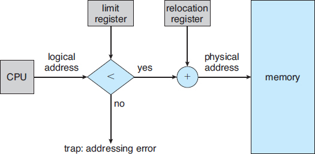
*Silberschatz Fig. 8.13 — Hierarchical page table walk: each level of the virtual address indexes one table level to find the next.*

### Allocation schemes

| Scheme | Description |
|---|---|
| **Contiguous** | Single chunk per process; fragmentation issue |
| **Paging** | Fixed-size pages; no external fragmentation |
| **Segmentation** | Variable-size logical segments (x86 real mode, legacy) |
| **Paged segmentation** | Combine both |
| **Buddy allocator** | Split/merge power-of-2 blocks; Linux physical-page allocator |
| **Slab allocator** | Cache of object-sized chunks; for kernel structures |

### Process memory layout

Classic layout (low → high address, x86-64 Linux):

```
+--------------------+  ← ~0x00007FFFFFFFFFFF (top of user space)
| Stack (grows down) |
|        ↓           |
+--------------------+
|   mmap / shared    |
|   libraries (.so)  |
+--------------------+
| Heap (grows up)    |
|        ↑           |
+--------------------+
| BSS (uninit data)  |
+--------------------+
| Data (init data)   |
+--------------------+
| Text (code)        |
+--------------------+  ← 0x0040_0000 typical non-PIE, random if PIE
```

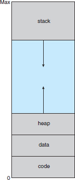
*Silberschatz Fig. 9.2 — Text / data / heap / stack regions of a running process in virtual memory.*

### Memory-mapped files (mmap)

- Linux `mmap(2)` / Windows `CreateFileMapping` + `MapViewOfFile`.
- File contents appear as pages in the process address space; reads/writes go through the page cache.
- **Shared mappings** — multiple processes see the same memory; classic IPC.
- **Anonymous** — not backed by a file; `MAP_ANON`.
- **Copy-on-Write** — `fork()` shares pages with CoW; write faults trigger copy.
- **ELF binaries and Windows PE files** are loaded via memory mapping — not copied upfront.

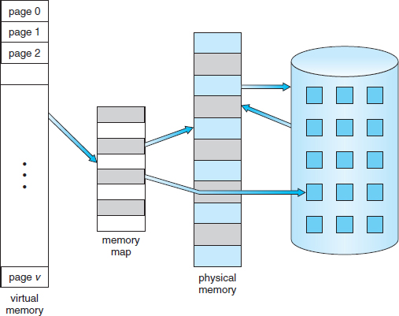
*Silberschatz Fig. 9.1 — Logical pages back-mapped to physical frames on demand; unused pages live on disk until faulted in.*

### Memory-management attack surface

- **Buffer overflows** → memory corruption → code-flow hijack.
- **Use-after-free** → reuse of freed chunk with attacker-controlled data.
- **Double-free** → allocator metadata corruption.
- **Heap-spraying** → fill memory with predictable content to make UAF / integer-bug targets land on controlled data.
- **Page-table attacks** — Meltdown, Spectre, MDS, RIDL, CacheOut — microarchitectural side channels inferring kernel memory from user space.
- **Rowhammer** — DRAM bit-flips induced by repeated access; can flip page-table entries.

### Mitigations

- **ASLR** — randomize stack, heap, libraries, PIE main — breaks precomputed exploit addresses.
- **DEP / NX / W^X** — pages are never both writable and executable.
- **Stack canaries / guards** — random value between locals and saved return; checked on function exit.
- **KASLR** — kernel-address-space randomization; mitigated somewhat by Meltdown.
- **SMEP / SMAP** (CPU) — kernel cannot execute user pages / implicit-access user pages.
- **CET (Intel) / BTI (ARM)** — Shadow Stack + Indirect Branch Tracking against ROP/JOP.
- **Memory tagging (ARM MTE)** — every allocation gets a tag; mismatched tag access traps.

---

## 15. Device Drivers

Drivers are the OS's bridge to hardware. They run in kernel mode (ring 0) on most systems.

### Linux drivers

Three categories:

| Class | Examples |
|---|---|
| **Character** | Serial ports, `/dev/null`, `/dev/tty*`, sound; byte-stream access |
| **Block** | Disks, SSDs, loop devices; fixed-size block access with cache |
| **Network** | NICs; kernel hooks via `net_device` struct, not `/dev/*` |

Architecture:

- **Monolithic + LKMs** — drivers are kernel modules loaded with `modprobe`.
- **Driver model** — buses (`/sys/bus/`), classes (`/sys/class/`), devices (`/sys/devices/`), unified via sysfs.
- **udev** — userspace hotplug event handler; populates `/dev/` and runs rules (`/etc/udev/rules.d/`).
- **Module signing** — `CONFIG_MODULE_SIG_FORCE=y` mandates signed drivers (enforced in Secure Boot + "lockdown" mode).

Signed driver bypass (BYOVD — "Bring Your Own Vulnerable Driver") is a prominent modern attack — load a legitimately-signed but buggy driver to get kernel primitives. `kernel.modules_disabled=1` sysctl and driver-revocation blocklists (Microsoft VulnDriver blocklist) are the defender's responses.

### Windows drivers

Kernel-mode drivers (`.sys`) load into `ntoskrnl.exe`'s address space. Managed by the Service Control Manager (`services.msc`) with type 1 (kernel driver).

- **WDM (Windows Driver Model)** — legacy.
- **KMDF (Kernel-Mode Driver Framework)** — modern, simpler, recommended.
- **UMDF (User-Mode Driver Framework)** — for drivers that can run unprivileged (HID, some USB, printers).
- Driver store: `C:\Windows\System32\DriverStore\FileRepository\`.
- Signing: WHQL (cross-signed) or Windows Hardware Dev Center signed since Windows 10.

**Driver Signature Enforcement (DSE)** — 64-bit Windows requires signed kernel drivers. Bypassing DSE requires boot-config changes (`bcdedit /set testsigning on`) or a separate vulnerability.

**PatchGuard (KPP)** — since Windows XP SP2 x64 / Vista. Kernel self-check detects hooking of system structures (SSDT, IDT, callbacks). Rootkits must hide beneath or unload PatchGuard.

### Driver-related attack surface

- IOCTL handlers — many drivers expose `DeviceIoControl` that process untrusted user input; classic LPE source.
- Pool / heap corruption in the kernel.
- Uninitialized memory returned to userspace (infoleak).
- Arbitrary-read / arbitrary-write IOCTL capabilities.
- Trusted drivers with dangerous primitives (RWEverything, vulnerable OEM utilities).

### Driver debugging

- Linux: `dmesg`, `/var/log/kern.log`, `ftrace`, `bpftrace`, `kgdb` over serial/network, KASAN for kernel ASAN.
- Windows: WinDbg kernel debugger, attached over serial/FireWire/USB/network or Hyper-V.

---

## 16. System Virtualization

### Hypervisor (VMM) types

| Type | Description | Examples |
|---|---|---|
| **Type 1 (bare metal)** | Hypervisor runs directly on hardware | VMware ESXi, Microsoft Hyper-V (server), KVM (Linux kernel module), Xen |
| **Type 2 (hosted)** | Hypervisor runs as an app on a host OS | VMware Workstation, Oracle VirtualBox, Parallels Desktop, QEMU+TCG |

Note: KVM is simultaneously Type 1 (Linux becomes the hypervisor) and looks Type 2-ish (it's a kernel module on a general-purpose OS). Hyper-V, when installed on Windows 10/11 Pro, pushes Windows into a root partition, effectively making it Type 1.

### Hardware virtualization technologies

- **Intel VT-x / VT-i** — VMX root and non-root modes (Ring -1); VMCS structure holds guest state.
- **AMD-V / SVM** — equivalent.
- **EPT (Intel) / NPT (AMD)** — Extended / Nested Page Tables: hardware support for two-level address translation (guest VA → guest PA → host PA).
- **IOMMU (VT-d / AMD-Vi)** — hardware MMU for devices; enables direct-device assignment to guests and prevents DMA attacks from one VM to another.
- **SR-IOV** — PCI devices that present multiple "virtual functions" to different VMs with near-native performance.
- **Nested virtualization** — a hypervisor inside a hypervisor; VT-x-in-VT-x support.

### Full virtualization vs paravirtualization

- **Full virtualization** — guest is unmodified; hypervisor traps and emulates privileged instructions. Requires hardware assist for performance.
- **Paravirtualization** — guest is modified to cooperate with hypervisor (hypercalls replace privileged ops). Faster on older hardware; Xen's original approach.
- **Hardware-assisted full virtualization** — modern default.

### Type-1 hypervisors — specifics

**VMware ESXi:**
- Bare-metal Linux-like kernel with VMkernel.
- vCenter Server manages fleets.
- vMotion, Storage vMotion, HA, DRS, Fault Tolerance.
- Datastores: VMFS (clustered) or NFS.

**Microsoft Hyper-V:**
- Role on Windows Server, or feature on Windows 10/11 Pro/Enterprise.
- Root partition (management OS) + guest partitions.
- Generation 1 VMs (BIOS, IDE boot) vs Generation 2 (UEFI, Secure Boot, SCSI, vTPM).
- Integration Services (drivers in guests) give near-native performance.

**KVM (Linux):**
- `kvm.ko` module turns Linux into a hypervisor.
- QEMU provides device emulation or uses virtio paravirtualized devices.
- Libvirt + `virsh` for management; OpenStack uses KVM widely.

**Xen:**
- Hypervisor layer under Dom0 (management) and DomU (guests).
- Strong paravirt history; now HVM with hardware assist dominates.
- Used by AWS (until transitioned to Nitro) and cloud providers.

### Containers vs VMs

| | VMs | Containers |
|---|---|---|
| **Isolation** | Hardware-enforced (ring -1) | Kernel namespaces + cgroups |
| **Kernel** | Each guest has its own | All share the host kernel |
| **Startup time** | Seconds to minutes | Milliseconds |
| **Size** | GBs (full OS image) | MBs (just app + dependencies) |
| **Workload density** | Tens per host | Hundreds to thousands |
| **Compatibility** | Any guest OS | Linux containers on Linux host (or WSL2 on Windows) |
| **Kernel-bug blast radius** | Limited to the VM | Affects all containers on the host |

Linux containerization primitives:

- **Namespaces** — PID, NET, MNT, IPC, UTS, USER, CGROUP, TIME — per-process views.
- **Cgroups (v1 / v2)** — resource limits (CPU, memory, I/O, PIDs).
- **Seccomp-BPF** — syscall filtering.
- **Capabilities** — drop unneeded root powers.
- **LSM hooks** — SELinux, AppArmor enforcement.

Runtimes: Docker, Podman (daemonless), containerd, CRI-O, runc.

Orchestration: Kubernetes (K8s) as the dominant platform.

### VM escape

A guest-to-host or guest-to-other-guest compromise is the **VM escape** nightmare:

- **VENOM (CVE-2015-3456)** — QEMU floppy controller bug; guest→host.
- **Various Xen XSAs** — PV guest to hypervisor.
- **Spectre/Meltdown/L1TF/MDS** — microarchitectural side channels crossing VM boundaries in multi-tenant clouds. Mitigations: microcode + kernel patches + hyperthread-aware scheduling + flush-on-switch.
- **Device-emulation bugs** — USB, SCSI, GPU passthrough are complex and have been CVE sources.

Defender posture: keep hypervisor patched, prefer paravirtual devices (virtio), disable unused emulated devices, minimize multi-tenant mixing of trust levels.

### Virtualization-Based Security (VBS) on Windows

Hyper-V isolation used as a *security boundary*, not just a compatibility layer:

- **HVCI (Hypervisor-protected Code Integrity)** — kernel-mode code-integrity checks isolated from the main kernel.
- **Credential Guard** — LSASS secrets (NTLM hashes, Kerberos keys, TGTs) moved to LSAISO in a Hyper-V secure VM. Pass-the-Hash-resistant.
- **Application Guard** — Edge / Office runs untrusted content in a throwaway container.
- **Core Isolation / Memory Integrity** — UI surface for HVCI.
- Prerequisites: SLAT, IOMMU, Secure Boot, TPM 2.0, UEFI Lock.

---

## Cross-cutting: OS security posture checklist

For any OS deployment the defender audits:

- **Patching** — current cumulative updates applied.
- **Baseline hardening** — CIS / STIG benchmark applied; drift monitored.
- **Least privilege** — no routine admin accounts; MFA on admin access.
- **Attack surface reduction** — services/roles minimized; ports closed.
- **Logging** — local logs + remote forwarding to SIEM; retention per policy.
- **Backups** — verified restore; 3-2-1; immutable copy.
- **Encryption at rest** — BitLocker / LUKS / FileVault.
- **Endpoint security** — AV/EDR, HIPS, firewall.
- **Application allowlisting** — WDAC/AppLocker on Windows; SELinux domain transitions on Linux.
- **Vulnerability scanning** — regular authenticated scans; track mean-time-to-patch.

---

## Cross-cutting: Data-layer attack surface

What an attacker targets when operating inside an OS:

- **Configuration files** — `/etc/shadow`, Windows registry hives (SAM, SYSTEM, SOFTWARE, SECURITY).
- **Application data** — browser credential stores, SSH keys, cloud CLI configs, session cookies.
- **Timestomping** — change MFT/inode timestamps to hide activity.
- **ADS / sparse files** — stash payloads in non-obvious places.
- **Swap / pagefile** — historical contents of process memory can persist here.
- **Page cache** — recent file contents in RAM; memory-forensics target.
- **Unallocated clusters** — deleted file content until overwritten.
- **VSS snapshots** — `ntds.dit` and hive backups.
- **Journal files** — USN journal, ext4 journal — sometimes still hold entries of removed files.

Defender controls: FIM on sensitive paths, auditd on syscalls touching them, memory forensics (Volatility) on captured RAM, encrypted swap, secure-delete workflows.

---

## Exam-testable concepts (rapid-fire)

- **PID 1 on Linux?** `init` or `systemd`.
- **First userspace process on Windows?** `smss.exe` (Session Manager).
- **MBR signature bytes?** `0x55 0xAA` at offset 510–511.
- **GPT default partition count?** 128.
- **EFI System Partition filesystem?** FAT32.
- **Secure Boot verifies what?** Bootloaders and kernel signed by keys in the DB database.
- **NTFS MFT record size (typical)?** 1 KB — small files fit resident.
- **Windows equivalent of a Linux inode?** MFT file record.
- **Swap / pagefile is?** Backing store for paged-out virtual memory.
- **DAC vs MAC — which is policy-enforced regardless of owner?** MAC.
- **x86 ring for kernel space?** Ring 0. User space? Ring 3.
- **How do applications make kernel requests?** Syscalls (x86-64 `syscall` instruction).
- **In classic process memory layout, which grows down?** Stack. Which grows up? Heap.
- **Linux syscall 59 is?** `execve`.
- **Linux syscall 57 is?** `fork`.
- **NTFS metadata harder to timestomp than `$STANDARD_INFORMATION`?** `$FILE_NAME` attribute.
- **Android IPC backbone?** Binder.
- **iOS secure coprocessor?** Secure Enclave (SEP).
- **Android app-sandbox isolation mechanism?** Per-app Linux UID.
- **iOS jailbreak that persists across reboots?** Untethered.
- **What does MACB stand for on ext4?** Modified, Accessed, Changed (ctime = inode-change), Born (crtime).
- **Preemptive scheduling can do what that cooperative cannot?** Interrupt a running thread at quantum expiration.
- **Linux default scheduler class?** CFS (or EEVDF on 6.6+).
- **Priority inversion fix?** Priority inheritance.
- **PML4 is?** The top level of x86-64 4-level page tables.
- **TLB stands for?** Translation Lookaside Buffer.
- **Typical page size on x86?** 4 KB (2 MB large, 1 GB gigantic).
- **ASLR randomizes?** Base addresses of stack, heap, libraries, PIE main.
- **NX bit prevents?** Execution of data pages (DEP/W^X).
- **SMEP prevents?** Kernel execution of user-space pages.
- **Rowhammer is?** DRAM bit-flip attack via repeated access.
- **Type-1 hypervisor example?** ESXi / Hyper-V (server) / KVM / Xen.
- **Type-2 hypervisor example?** VirtualBox / VMware Workstation / Parallels.
- **Hardware support for two-level address translation?** EPT (Intel) / NPT (AMD).
- **IOMMU provides?** Device-side address translation and isolation; DMA protection.
- **Windows feature that moves LSASS secrets to an isolated VM?** Credential Guard (part of VBS).
- **BYOVD stands for?** Bring Your Own Vulnerable Driver.
- **PatchGuard is on Windows?** Kernel Patch Protection — detects structural hooks in the kernel.
- **Non-maskable interrupt?** NMI — hardware-failure / watchdog interrupt that cannot be disabled.
- **Zombie process is?** Terminated process not yet reaped by its parent's `wait()`.
- **D state is?** Uninterruptible sleep — usually disk I/O; cannot be killed until I/O completes.

---

## Cross-references

- **[Operating System Concepts (Silberschatz) 9th Ed](../references/Operating%20System%20Concepts,%209th%20Edition-9781118063330.pdf)** — the textbook
- **[OS: Three Easy Pieces (free)](https://pages.cs.wisc.edu/~remzi/OSTEP/)** — free alternative textbook
- **[MIT 6.828](https://pdos.csail.mit.edu/6.828/)** — OS Engineering course
- **[Linux Kernel Documentation](https://www.kernel.org/doc/html/latest/)** — upstream docs
- **[Windows Internals (Yosifovich/Russinovich/Solomon/Ionescu)](https://learn.microsoft.com/en-us/sysinternals/resources/windows-internals)** — definitive Windows reference
- **[Intel SDM](https://www.intel.com/content/www/us/en/developer/articles/technical/intel-sdm.html)** — x86-64 architecture and system programming manual
- **[OSDev Wiki](https://wiki.osdev.org/Main_Page)** — practical low-level OS development reference
- **[Android Platform Architecture](https://developer.android.com/guide/platform)** — official Android platform docs
- **[iOS Security Guide (Apple)](https://support.apple.com/guide/security/welcome/web)** — official Apple Platform Security guide
- **JCAC-WINDOWS** — full Windows treatment (Module 7)
- **JCAC-UNIX-LINUX** — full Linux treatment (Module 8)
- **JCAC-FORENSIC-MAL** — data-layer forensic artifacts
- **JCAC-COMP-ORG-ARCH** — hardware layer beneath the OS
- **JCAC-PROG-FUND** — how C++ programs consume OS services
