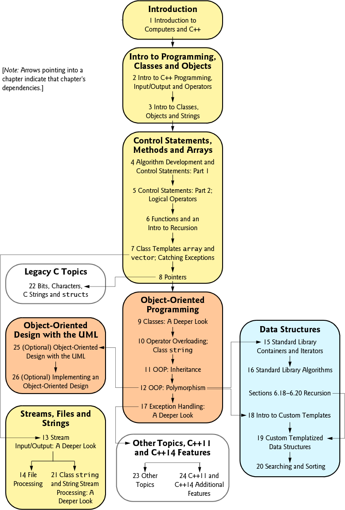
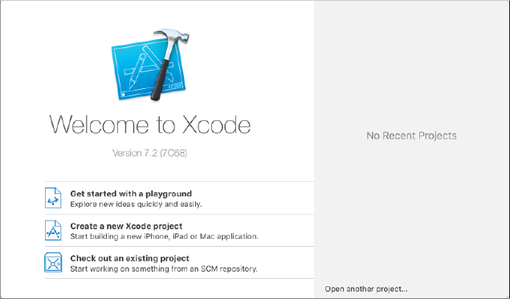
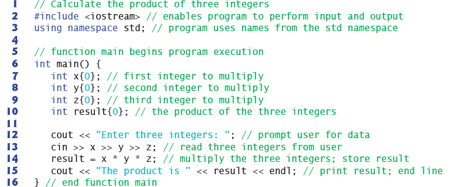
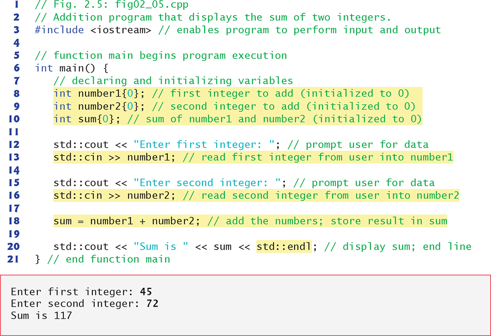
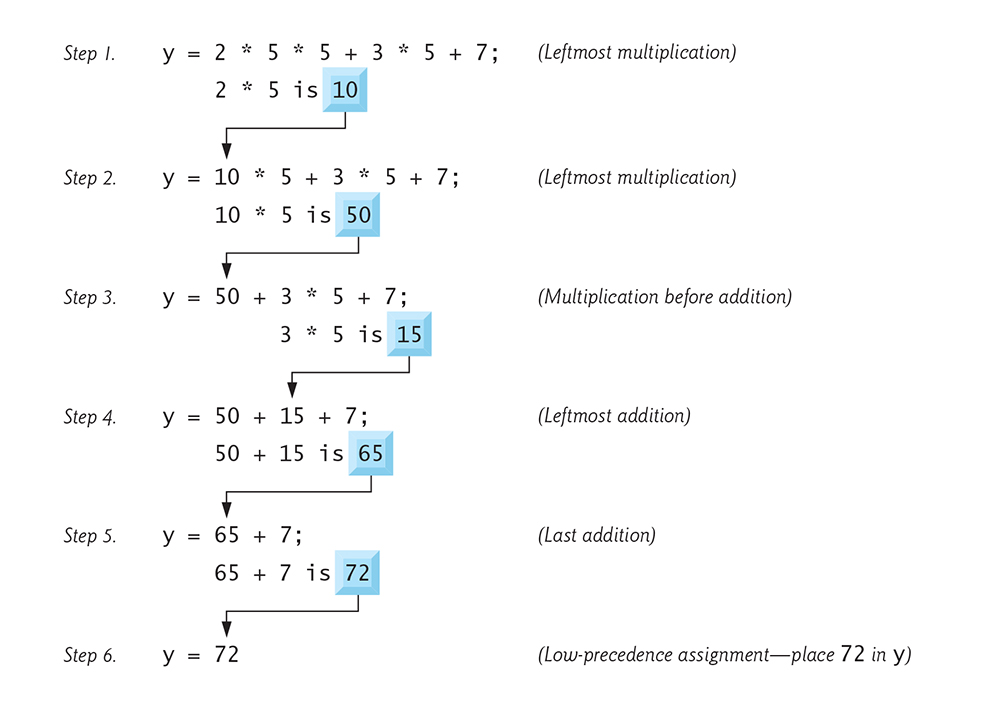
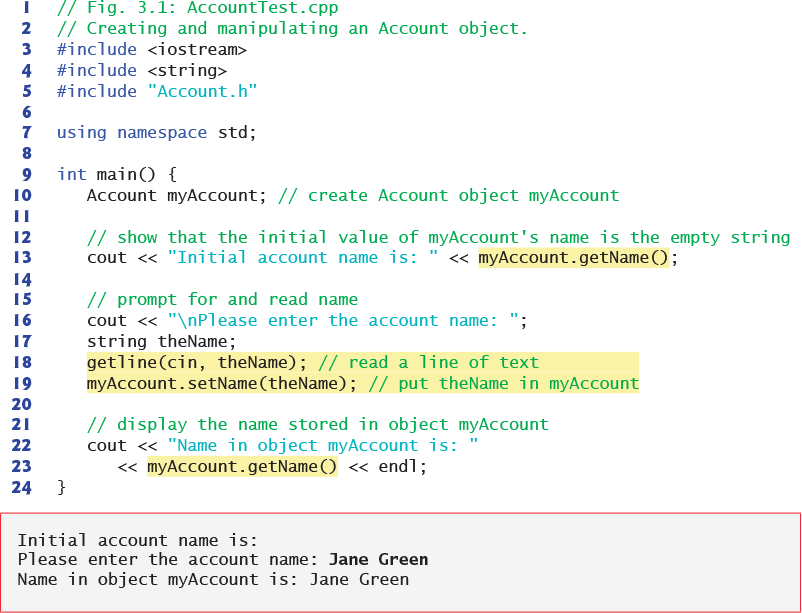
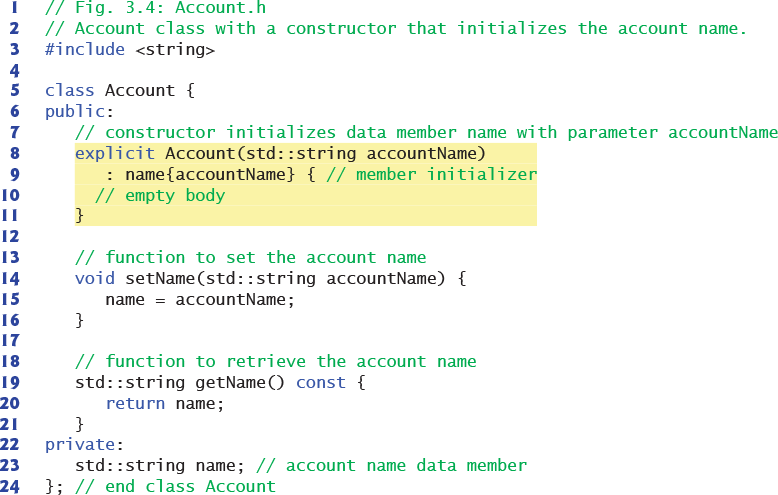

# JCAC Student Guide — Programming Fundamentals (C++)

> **Realigned to JCAC Module 3 (Programming Fundamentals, v2016-09R2) TOC.** Matches the 20-section course structure from the physical Student Guide (photos IMG_3704–IMG_3705).

**Module 3 scope:** SDLC → Language Generations → Memory → Methodologies → Program Design → C++ Intro → Strings → I/O → Decisions → Repetition (random) → Repetition (while/for) → Pointers → Functions → Arrays → Dynamic Allocation → Vectors → File I/O → Classes → Linked Lists → Debugging.

**Posture:** This is a **C++ programming course**, not a generic "data structures" module. Sections 1–5 are programming concepts and language theory; sections 6–20 are hands-on C++ with code that compiles as written. The security / CWE / compiler-protection content previously in this guide is preserved as supplementary appendices at the end.

---

## 1. Programming Concepts — the SDLC

The **Software Development Life Cycle (SDLC)** is the end-to-end process for taking software from concept to decommissioning. Five canonical phases, each with formal deliverables:

| Phase | Activity | Key deliverables |
|---|---|---|
| **Requirements** | Gather what the system must do | SRS (Software Requirements Specification), user stories, use cases, acceptance criteria |
| **Design** | Architect the solution | Architecture diagrams, data model, API contracts, UI wireframes, ICDs (Interface Control Documents) |
| **Development** | Write and integrate the code | Source code, unit tests, build artifacts |
| **Testing / Deployment** | Verify and release | Test plan, test results, deployment runbook, release notes |
| **Support / Maintenance** | Operate, patch, evolve | Patches, bug fixes, incident reports, decommissioning plan |

### Lifecycle models

| Model | Shape | When appropriate |
|---|---|---|
| **Waterfall** | Linear, one-pass | Fixed requirements, high ceremony (DoD, aerospace) |
| **V-Model** | Waterfall mirrored with verification at each level | Safety-critical systems |
| **Iterative** | Repeated passes refining the same artifact | Requirements discovered through prototyping |
| **Spiral** | Iterations with explicit risk analysis per loop | Large, high-risk projects |
| **Agile (Scrum, Kanban, XP)** | Short cycles (sprints), continuous feedback | Uncertain requirements, fast delivery |
| **DevOps / CI-CD** | Continuous delivery; automated pipelines | Cloud-native, SaaS |

### DoD context

DoDI 5000.87 (Software Acquisition Pathway) and DoDI 5000.02 govern software-intensive acquisition. Modern DoD leans on **Agile + DevSecOps** for software pathways; legacy waterfall still appears in hardware-bundled programs.

### Security across the lifecycle

Each phase has a security deliverable:

- Requirements → threat model, abuse cases.
- Design → secure architecture review, data classification.
- Development → secure coding, SAST (static analysis), peer review.
- Testing → DAST (dynamic analysis), pen test, red team.
- Support → patch management, vulnerability response, incident response.

**Shift-left**: catch issues earlier where the fix is cheaper. A bug caught in requirements costs 1×; in production it can cost 100×+.

---

## 2. Language Generation and Types

Programming languages are classified by **generation** (abstraction distance from the metal) and by **type system / execution model**.

### Generations (Gen I–V)

| Gen | Name | Example | Notes |
|---|---|---|---|
| **I** | Machine | Raw opcodes: `48 89 E5` | What the CPU actually executes; hand-written today only by reverse engineers |
| **II** | Assembly | `mov rbp, rsp` | One-to-one with machine instructions; portable only across same ISA |
| **III** | High-level compiled | C, C++, Fortran, Pascal, Go, Rust | Compiled to machine code ahead of time |
| **IV** | Very-high-level / interpreted | Python, Ruby, Perl, Bash, JavaScript | Interpreted or JIT-compiled at runtime; SQL and report-gen languages are also called 4GL |
| **V** | Constraint / logic | Prolog, Mercury | Describe the problem, solver finds a solution |

Common alternate taxonomy:

- **Compiled** — source → machine code by compiler (C/C++/Rust/Go). Fast; platform-specific binary.
- **Interpreted** — source parsed and executed at runtime (Bash, Python classic). Portable source; slower.
- **Bytecode + VM** — source compiled to platform-independent bytecode executed by a VM (Java `.class`, Python `.pyc`, .NET IL).
- **JIT (Just-In-Time)** — bytecode translated to machine code at runtime (Java HotSpot, V8, .NET CoreCLR, PyPy).
- **AOT (Ahead-Of-Time)** — pre-compile JIT languages to static binaries (GraalVM native-image, Android ART post-install).

### Compilation pipeline (C++ example)

```
source.cpp
  │
  ▼  preprocessor (cpp)   — #include, #define, conditionals
source.i
  │
  ▼  compiler (g++ -S)    — syntax → AST → IR → target asm
source.s
  │
  ▼  assembler (as)       — mnemonic → machine code
source.o
  │
  ▼  linker (ld)          — resolve symbols, combine .o + libs
a.out / source
```

On Linux the whole chain runs with `g++ source.cpp -o program`. Use `-save-temps` to keep intermediate files.

### Type systems

| Axis | Options |
|---|---|
| **Static vs Dynamic** | C, C++, Java, Go, Rust (static — checked at compile) vs Python, JS, Ruby (dynamic — checked at runtime) |
| **Strong vs Weak** | Python, Java (strong — no implicit dangerous conversions) vs C, JavaScript (weak — implicit coercions) |
| **Nominal vs Structural** | Java, C++ classes match by name vs Go interfaces and TypeScript match by shape |
| **Manifest vs Inferred** | `int x = 5;` (manifest) vs `auto x = 5;` (inferred) |

**C++ is statically, strongly (mostly), manifestly-or-inferred-typed** — gives compile-time safety plus the escape hatches (`reinterpret_cast`, pointer arithmetic) that make it suitable for systems work and dangerous in careless hands.

---

## 3. Memory

A running program's view of memory is its **virtual address space**. The OS maps virtual pages to physical RAM on demand, possibly paging cold pages to swap.

### Process memory layout (typical Linux x86-64)

```
 Higher virtual address
+------------------------+
| Kernel space           |  (mapped but inaccessible from user mode)
+------------------------+  ← 0x7FFF_FFFF_FFFF on x86-64
| Stack                  |  grows downward; one per thread
| ↓                      |
|                        |
| ↑                      |
| mmap / shared libs     |  libc.so, libstdc++.so, anonymous mmap
|                        |
| ↑                      |
| Heap (↑ grows upward)  |  malloc/new allocations; brk/sbrk/mmap-backed
+------------------------+
| BSS (uninit globals)   |  zero-initialized at load
+------------------------+
| Data (init globals)    |  values copied from binary
+------------------------+
| Text / Code            |  read-only executable; the program itself
+------------------------+  ← 0x0040_0000 typical non-PIE; random if PIE
 Lower virtual address
```

### Segments in depth

| Segment | Contents | Permissions | Source |
|---|---|---|---|
| **.text** | Machine code | r-x | Binary on disk |
| **.rodata** | String literals, const globals | r-- | Binary on disk |
| **.data** | Initialized globals and statics | rw- | Binary on disk |
| **.bss** | Uninitialized globals and statics | rw- | Allocated zero-filled at load |
| **Heap** | `malloc`/`new` allocations | rw- | Extended via `brk` / `mmap` |
| **Stack** | Automatic variables, call frames | rw- | Grown by the kernel on page fault |
| **Memory-mapped** | `mmap`'d files, shared libs | varies | `mmap` syscall |

### Stack mechanics

- Grows **downward** on x86/x86-64/ARM.
- Each function call pushes a **stack frame**: saved return address, saved frame pointer, callee-saved registers, locals.
- Frame pointer (`%rbp` on x86-64) optional with `-fomit-frame-pointer` (default at `-O2`).
- Default Linux stack limit: 8 MB (`ulimit -s`). Exceeding it causes SIGSEGV (stack overflow).

### Heap mechanics

- Managed by the C library allocator (`glibc`'s ptmalloc by default; alternatives: jemalloc, tcmalloc, mimalloc).
- `malloc(n)` finds or requests a block ≥ n bytes; returns pointer.
- Metadata is stored **inline** adjacent to allocations — overflow into metadata is the classic heap-exploit primitive.
- `free(p)` returns to allocator's freelist; allocator may coalesce with neighbors, may release back to kernel (`munmap`) or retain for reuse.

### Memory bugs and their classes

| Bug | What happens | CWE |
|---|---|---|
| Stack buffer overflow | Write past local buffer, overwrite return addr / canary / SEH | CWE-121 |
| Heap buffer overflow | Write past heap chunk, corrupt allocator metadata | CWE-122 |
| Use-after-free | Dereference pointer after `free` | CWE-416 |
| Double free | `free` the same pointer twice | CWE-415 |
| Memory leak | Allocation never freed | CWE-401 |
| Uninitialized read | Read before write | CWE-457 |
| Null pointer dereference | `*p` where `p == nullptr` | CWE-476 |
| Integer overflow → buffer overflow | `malloc(n*sizeof(T))` where n*sizeof wraps | CWE-190 |
| Format string | `printf(userInput)` | CWE-134 |

Defenders use compiler flags (`-fstack-protector-strong`, `-D_FORTIFY_SOURCE=2`, `-fsanitize=address`) plus OS mitigations (ASLR, NX/DEP, W^X) plus runtime tools (Valgrind, AddressSanitizer, ThreadSanitizer). Modern C++ practice leans on RAII + smart pointers to eliminate whole bug classes.

---

## 4. Programming Methodologies

Three main paradigms in ascending structure:

### Unstructured

- Flat sequence of instructions with `goto` for control flow.
- Early BASIC, FORTRAN II, assembly style.
- Hard to reason about; largely deprecated. "Spaghetti code" term originates here.

### Structured / Structural

Popularized by **Dijkstra's "Go To Statement Considered Harmful" (1968)**. Three legal control-flow primitives:

1. **Sequence** — statements run in order.
2. **Selection** — `if/else`, `switch`.
3. **Iteration** — `while`, `for`.

Plus subroutines (functions/procedures). Any algorithm can be expressed in these without `goto`. C is the canonical structured language.

### Object-Oriented Programming (OOP)

Data and behavior bundled in objects. Four pillars:

| Pillar | Meaning |
|---|---|
| **Encapsulation** | State hidden behind methods (`private` + `public`) |
| **Inheritance** | Derived class reuses and extends base class |
| **Polymorphism** | Same interface, different behavior (virtual functions / interfaces) |
| **Abstraction** | Expose essence, hide details (abstract classes, pure virtual methods) |

C++, Java, C#, Python (multi-paradigm), Smalltalk are OOP-primary.

### Other paradigms (context)

- **Functional** — Haskell, ML, parts of Python/JS — functions are first-class; mutation minimized; side-effect isolation.
- **Declarative** — SQL, HTML, Prolog, Make — describe *what*, not *how*.
- **Event-driven** — UI toolkits, JavaScript in browsers — react to events on a main loop.
- **Concurrent / parallel** — goroutines (Go), actors (Erlang), CSP channels, thread-plus-mutex (pthreads, C++ `std::thread`).

Modern C++ is **multi-paradigm**: supports structured, OOP, functional (lambdas, `<algorithm>`), and generic (templates).

---

## 5. Programming Concepts — Program Design

### Pseudocode

A language-agnostic, English-ish description of an algorithm. Not executable; reviewed by humans before code is written.

```
ALGORITHM FindMax(array A of length n)
  max ← A[0]
  FOR i FROM 1 TO n-1 DO
    IF A[i] > max THEN
      max ← A[i]
    END IF
  END FOR
  RETURN max
```

### Flowchart symbols

| Shape | Meaning |
|---|---|
| Rounded rectangle (terminator) | Start / End |
| Rectangle | Process (assignment, computation) |
| Parallelogram | Input / Output |
| Diamond | Decision (Yes/No branch) |
| Arrow | Flow direction |
| Circle (connector) | Off-page or on-page connector |
| Cylinder | Stored data (file, DB) |
| Document | Printed output |

### Control structures

| Structure | Control-flow shape |
|---|---|
| **Sequential Action** | One statement then the next |
| **Branching** | `if condition then A else B` |
| **Loops** | `while condition do …` or `for i from 1 to n do …` |
| **Nesting** | Any control structure inside another |

### Flowchart ⇄ pseudocode ⇄ code

These are isomorphic representations. The exam may ask you to convert between them.

Pseudocode (above) → C++:

```cpp
int findMax(const int A[], int n) {
    int max = A[0];
    for (int i = 1; i < n; ++i) {
        if (A[i] > max) max = A[i];
    }
    return max;
}
```

### Design principles

- **Top-down decomposition** — break big problem into smaller problems.
- **Stepwise refinement** — repeat until each step is implementable.
- **Modularity** — each module does one thing, with a clean interface.
- **DRY** (Don't Repeat Yourself) — shared logic in one place.
- **SOLID** (OOP):
  - **S**ingle Responsibility
  - **O**pen/Closed (open to extension, closed to modification)
  - **L**iskov Substitution (subclasses usable anywhere the base is)
  - **I**nterface Segregation (many small interfaces > one fat one)
  - **D**ependency Inversion (depend on abstractions, not concretions)

---


*Deitel, C++ How to Program 10e — figure from Ch 2/3 area illustrating program structure, statements, or basic input/output.*

## 6. Introduction to C++

### The compiler

C++ source is translated to machine code by a compiler. Common toolchains:

| Compiler | Platforms | Invocation |
|---|---|---|
| **GCC (`g++`)** | Linux, macOS, Windows (MinGW) | `g++ -std=c++17 hello.cpp -o hello` |
| **Clang (`clang++`)** | Linux, macOS (Apple default), Windows | `clang++ -std=c++17 hello.cpp -o hello` |
| **MSVC (`cl.exe`)** | Windows | `cl /std:c++17 hello.cpp` |

Useful flags (GCC/Clang):

- `-std=c++17` / `-std=c++20` — language standard.
- `-Wall -Wextra -Wpedantic` — enable warnings.
- `-Werror` — warnings become errors.
- `-O0` / `-O2` / `-O3` — optimization levels.
- `-g` — include debug info.
- `-fsanitize=address` — AddressSanitizer (runtime memory-error detection).

### Hello, world

```cpp
#include <iostream>

int main() {
    std::cout << "Hello, world!" << std::endl;
    return 0;
}
```

What each part does:

- `#include <iostream>` — preprocessor pulls in the I/O stream header.
- `int main()` — program entry point; returns process exit status.
- `std::cout` — standard output stream object, in namespace `std`.
- `<<` — stream-insertion operator.
- `std::endl` — writes `'\n'` **and** flushes the buffer.
- `return 0;` — zero = success to the calling shell.

### Operators

| Category | Operators |
|---|---|
| **Arithmetic** | `+ - * / %` (integer modulo) |
| **Relational** | `== != < > <= >=` |
| **Logical** | `&& \|\| !` |
| **Bitwise** | `& \| ^ ~ << >>` |
| **Assignment** | `= += -= *= /= %= &= \|= ^= <<= >>=` |
| **Increment / Decrement** | `++ --` (pre- and post-forms) |
| **Member access** | `. -> ::` |
| **Address / Indirection** | `& *` |
| **Sizeof** | `sizeof` |
| **Ternary** | `? :` |
| **Cast** | `static_cast<T>(x)`, `dynamic_cast<T>(x)`, `reinterpret_cast<T>(x)`, `const_cast<T>(x)`, C-style `(T)x` |

### Operator precedence and associativity

Precedence (partial, high→low): `::` → `. -> [] ()` → `++ -- unary*&+-!~ sizeof cast` → `* / %` → `+ -` → `<< >>` → `< <= > >=` → `== !=` → `&` → `^` → `|` → `&&` → `||` → `?:` → `= += -= …` → `,`.

When in doubt, **parenthesize**. Reviewer-friendly and cost-free.

### Expressions and statements

- **Expression** — anything that yields a value: `a + b`, `f(x)`, `x++`.
- **Statement** — complete unit of execution, ends with `;`: `int x = 5;`, `return 0;`.
- **Code block** — `{ … }` — sequence of statements; introduces a new scope.

### Comments

```cpp
// Single-line comment

/* Multi-line
   comment */

/// Doxygen-style documentation comment
///
/// @param x  first input
/// @return   twice x
int twice(int x) { return x * 2; }
```

### Variables

Named storage of a specific type. Declared then (usually) initialized:

```cpp
int count = 0;              // declaration + initialization
double ratio;                // declaration only; value indeterminate
ratio = 1.5;                 // assignment

const int kMax = 100;        // constant
auto total = 0LL;            // type inferred to long long (C++11+)
```

### Constants

```cpp
const int MAX = 100;             // runtime const
constexpr int LIMIT = 200;        // compile-time const (C++11+)
#define BUFSZ 512                 // preprocessor macro (pre-C++, avoid in modern C++)
```

### Identifiers — naming rules

- Start with letter or `_`.
- Follow with letters, digits, or `_`.
- Case-sensitive (`Count` ≠ `count`).
- Cannot be a keyword (`int`, `class`, `return`, `new`, `for`, `while`, …).
- Reserved: names with `__` or starting with `_` + uppercase are reserved for implementation.

Common conventions: `PascalCase` for types and classes, `camelCase` or `snake_case` for functions/variables, `UPPER_SNAKE_CASE` for macros and constants.

### Data types

**Built-in fundamental types (sizes on typical 64-bit Linux):**

| Type | Size | Range |
|---|---|---|
| `bool` | 1 byte | `true` or `false` |
| `char` | 1 byte | -128 … 127 (signed) or 0 … 255 (unsigned; platform-dependent default) |
| `short` | 2 bytes | -32,768 … 32,767 |
| `int` | 4 bytes | ±2^31 |
| `long` | 8 bytes | ±2^63 (Linux x86-64; 4 bytes on Windows) |
| `long long` | 8 bytes | ±2^63 |
| `float` | 4 bytes | ~6–7 decimal digits |
| `double` | 8 bytes | ~15–16 decimal digits |
| `long double` | 16 bytes (Linux) | ~18–33 digits |

Modifiers: `unsigned`, `signed`, `short`, `long`. Fixed-width types in `<cstdint>`: `int8_t`, `uint16_t`, `int32_t`, `uint64_t`, `intptr_t`, `size_t`, `ptrdiff_t`.

### Declaration vs definition vs initialization

- **Declaration** — introduces a name and its type: `extern int counter;`.
- **Definition** — allocates storage: `int counter;` (also declares).
- **Initialization** — assigns an initial value at construction: `int counter = 0;` or `int counter{0};` (C++11 uniform init).

**Uniform initialization** (C++11) with braces prohibits narrowing conversions:

```cpp
int x{3.14};   // ERROR — narrowing double → int
int y = 3.14;  // OK — implicit truncation (to 3)
```

---

## 7. Strings

C++ has two string worlds: **C-style strings** (null-terminated `char` arrays, inherited from C) and **`std::string`** (the class from `<string>`).

### C-style strings

```cpp
const char *greeting = "Hello";  // string literal; null-terminated
char buffer[16] = "world";        // array; room for 15 chars + '\0'
```

A C-style string is a sequence of `char` ending with `'\0'` (null byte). Every classic `str*` function in `<cstring>` stops at the null.

```cpp
#include <cstring>
std::strlen("Hello");             // 5  (does not count '\0')
std::strcpy(dst, src);            // UNSAFE — no bounds check
std::strncpy(dst, src, sizeof(dst) - 1);  // safer
std::strcmp(a, b);                // 0 if equal, <0 if a < b
std::strcat(dst, src);            // concatenate, assumes dst has room
```

**Pitfalls:** `strcpy` / `strcat` / `sprintf` / `gets` have no bounds check → classic buffer overflows.

### `std::string`

```cpp
#include <string>
std::string s = "Hello";
std::string t{"world"};
std::string u = s + ", " + t;     // concatenation
```

### Concatenation

```cpp
std::string a = "Hello";
std::string b = ", world";

std::string c = a + b;            // operator+
a += b;                           // operator+=
a.append(b);                      // member function
a.append(b, 2, 3);                // b's substring starting at 2, length 3
```

### Copy

```cpp
std::string src = "source";
std::string dst = src;            // copy constructor
dst = src;                        // copy assignment

char cbuf[16];
src.copy(cbuf, sizeof(cbuf) - 1); // explicit copy to char array
cbuf[std::min(src.size(), sizeof(cbuf) - 1)] = '\0';
```

### Size

```cpp
std::string s = "Hello";
s.length();    // 5
s.size();      // 5  (same as length)
s.empty();     // false
s.capacity();  // ≥ 5; implementation-dependent
```

### Escape characters

Inside a string literal `"…"` or character literal `'…'`:

| Sequence | Meaning |
|---|---|
| `\n` | Newline (LF) |
| `\r` | Carriage return (CR) |
| `\t` | Horizontal tab |
| `\v` | Vertical tab |
| `\b` | Backspace |
| `\f` | Form feed |
| `\a` | Alert / bell |
| `\0` | Null character |
| `\\` | Literal backslash |
| `\'` | Literal single quote |
| `\"` | Literal double quote |
| `\?` | Literal question mark (legacy trigraph escape) |
| `\xHH` | Hex byte |
| `\ooo` | Octal byte |
| `\uXXXX` | Unicode code point (C++11) |

Raw string literals (C++11) skip escape processing:

```cpp
std::string path = R"(C:\Users\Alice\file.txt)";   // no need to escape \
std::string regex = R"(\d{3}-\d{4})";
```

### `std::string_view` (C++17)

Non-owning view into a string. Cheap to pass; careful not to outlive the backing buffer.

```cpp
#include <string_view>
void print(std::string_view sv) {
    std::cout << sv << std::endl;
}
print("literal");                 // OK, no allocation
print(std::string("dynamic"));    // OK
```

---

## 8. Input / Output

C++ streams live in `<iostream>`, `<fstream>` (files), and `<sstream>` (strings).

### Standard streams

| Stream | Purpose | Buffering |
|---|---|---|
| `std::cin` | Standard input | Line-buffered when attached to terminal |
| `std::cout` | Standard output | Line-buffered when attached to terminal |
| `std::cerr` | Standard error (urgent) | **Unbuffered** — writes appear immediately |
| `std::clog` | Standard error (logging) | Buffered |

### Output with `<<`

```cpp
int x = 42;
double pi = 3.14159;
std::cout << "x=" << x << ", pi=" << pi << '\n';
```

`<<` is the **stream-insertion operator**; it's overloaded for every built-in type plus `std::string`. `<<` returns the stream so calls chain.

`std::endl` inserts `'\n'` and **flushes** the buffer. Use `'\n'` alone when you don't need an immediate flush — faster in tight loops.

### Input with `>>`

```cpp
int age;
std::cout << "Enter age: ";
std::cin >> age;
```

- `>>` skips leading whitespace, reads until next whitespace.
- For strings, `>>` reads one whitespace-delimited token.
- For full lines, use `std::getline(std::cin, s)`.

```cpp
std::string line;
std::getline(std::cin, line);
```

### Error handling

Streams have state bits:

- `good()` — no errors.
- `eof()` — end-of-file reached.
- `fail()` — logical error (format mismatch, e.g., reading `int` from "abc").
- `bad()` — unrecoverable error.

```cpp
int n;
if (std::cin >> n) {
    // success
} else {
    std::cin.clear();                                       // reset error flags
    std::cin.ignore(std::numeric_limits<std::streamsize>::max(), '\n');  // skip bad input
    std::cerr << "invalid input" << std::endl;
}
```

### Manipulators

From `<iomanip>`:

```cpp
#include <iomanip>
std::cout << std::setw(10) << 42 << '\n';              // width 10, right-aligned
std::cout << std::left << std::setw(10) << "hi" << '\n';// left-aligned
std::cout << std::setfill('0') << std::setw(4) << 7 << '\n'; // "0007"
std::cout << std::fixed << std::setprecision(2) << 3.14159 << '\n'; // "3.14"
std::cout << std::hex << 255 << '\n';                   // "ff"
std::cout << std::oct << 8 << '\n';                     // "10"
std::cout << std::dec;                                   // back to decimal
std::cout << std::boolalpha << true << '\n';             // "true" instead of "1"
```

### Mixing C and C++ I/O

By default `std::cin`/`cout` are synchronized with C's `stdin`/`stdout`. Disabling the sync (`std::ios::sync_with_stdio(false)`) speeds stream I/O at the cost of mixing.

---


*Deitel, C++ How to Program 10e — figure from the control-flow chapter illustrating selection / branching constructs.*

## 9. Decision Statements

### if / else

```cpp
if (score >= 90) {
    grade = 'A';
} else if (score >= 80) {
    grade = 'B';
} else if (score >= 70) {
    grade = 'C';
} else {
    grade = 'F';
}
```

Always brace single-statement bodies (Apple's goto-fail bug). The compiler doesn't care; reviewers and future-you do.

### switch / case

```cpp
switch (command) {
    case 'q':
    case 'Q':
        quit();
        break;
    case 'h':
        help();
        break;
    case 's':
        save();
        [[fallthrough]];        // C++17 — explicit fall-through
    case 'd':
        dump();
        break;
    default:
        std::cerr << "unknown command\n";
}
```

Rules:

- `case` labels require integral or enum constants.
- `break` exits the switch. **Forgetting `break` falls through** to the next case — common bug source.
- Use `[[fallthrough]];` (C++17) to document intentional fall-through.
- `default` handles anything unmatched.

### Ternary

```cpp
int max = (a > b) ? a : b;
```

Readable for short conditions; avoid nesting.

### Nested conditionals

```cpp
if (user.authenticated()) {
    if (user.role() == Role::Admin) {
        adminView();
    } else {
        userView();
    }
} else {
    loginPrompt();
}
```

Prefer early-return / guard-clause style to reduce nesting:

```cpp
if (!user.authenticated()) { loginPrompt(); return; }
if (user.role() == Role::Admin) { adminView(); return; }
userView();
```

### Short-circuit evaluation

`&&` and `||` evaluate left-to-right and stop as soon as the result is known:

```cpp
if (p != nullptr && p->isValid()) { ... }  // safe — p-> only if p not null
if (cache.hit() || db.fetch()) { ... }     // skip db.fetch on cache hit
```

---

## 10. Repetition Statements — Pseudo-random Numbers

Before discussing `while` and `for`, the Module 3 TOC calls out **pseudo-random numbers** as the first repetition topic — because classic beginner exercises (guessing games, dice simulators) drive loops from random input.

### Legacy C API — `<cstdlib>`

```cpp
#include <cstdlib>
#include <ctime>

std::srand(static_cast<unsigned>(std::time(nullptr)));   // seed once
int roll = std::rand() % 6 + 1;                          // 1..6
```

Issues with `rand()`:

- Modulo bias — `rand() % n` is slightly biased when `n` doesn't divide `RAND_MAX+1`.
- Low-order bits are often poor quality.
- `RAND_MAX` may be as small as 32767 (Windows).
- Not thread-safe in older implementations.

Acceptable for throwaway classroom code; **avoid in production**.

### Modern C++ — `<random>` (C++11+)

```cpp
#include <random>

std::random_device rd;                   // hardware/OS entropy source
std::mt19937 gen(rd());                  // Mersenne Twister, 32-bit
std::uniform_int_distribution<int> die(1, 6);

for (int i = 0; i < 10; ++i) {
    std::cout << die(gen) << ' ';
}
```

Generators:

| Generator | Notes |
|---|---|
| `std::minstd_rand` | Linear-congruential, tiny state |
| `std::mt19937` | Mersenne Twister, 32-bit state — default go-to |
| `std::mt19937_64` | 64-bit MT |
| `std::ranlux24` / `std::ranlux48` | RANLUX family |
| `std::random_device` | OS entropy (on Linux reads `/dev/urandom`) |

Distributions:

- `std::uniform_int_distribution<T>(a, b)` — inclusive [a,b].
- `std::uniform_real_distribution<T>(a, b)` — [a,b) real.
- `std::bernoulli_distribution(p)` — true with probability p.
- `std::normal_distribution<T>(mean, stddev)` — Gaussian.
- `std::poisson_distribution<T>(mean)`, `std::exponential_distribution<T>(lambda)`, etc.

### Cryptographic randomness

`mt19937` is **fast but predictable** — seeing 624 consecutive outputs lets you reconstruct the state and predict future outputs. For security (tokens, keys, nonces) use:

- Linux: `/dev/urandom` or `getrandom(2)`.
- Windows: `BCryptGenRandom`.
- OpenSSL: `RAND_bytes(buf, len)`.
- Libsodium: `randombytes_buf(buf, len)`.

---

## 11. Repetition Statements — while and for

### while

```cpp
int i = 0;
while (i < 10) {
    std::cout << i << ' ';
    ++i;
}
```

Test-then-execute. Body may never run if condition starts false.

### do/while

```cpp
int input;
do {
    std::cout << "Enter 0 to quit: ";
    std::cin >> input;
} while (input != 0);
```

Execute-then-test. Body runs at least once.

### for — classic

```cpp
for (int i = 0; i < n; ++i) {
    std::cout << arr[i] << ' ';
}
```

Three semicolon-separated parts:

1. **Init** — runs once before first iteration (`int i = 0`).
2. **Condition** — tested before each iteration (`i < n`).
3. **Update** — runs after each body (`++i`).

Any part may be empty: `for (;;) { … }` is the C idiom for infinite loop.

### for — range-based (C++11)

```cpp
std::vector<int> v{1, 2, 3, 4, 5};
for (int x : v) std::cout << x << ' ';
for (auto &x : v) x *= 2;                  // in-place modification
for (const auto &x : v) std::cout << x;    // read-only, no copy
```

Works for any container supporting `begin()` / `end()` plus C arrays of known size.

### break and continue

```cpp
for (int i = 0; i < 100; ++i) {
    if (found) break;                      // exit loop entirely
    if (i % 2 == 0) continue;              // skip to next iteration
    process(i);
}
```

`break` exits the **nearest** loop/switch. For nested break, use a flag or a labeled break pattern (C++ has no labeled break; use a function and `return`).

### Nested loops

```cpp
for (int r = 0; r < rows; ++r) {
    for (int c = 0; c < cols; ++c) {
        std::cout << matrix[r][c] << ' ';
    }
    std::cout << '\n';
}
```

Outer loop advances slowly; inner loop completes in full for each outer step. Complexity: O(rows × cols).

### Infinite loops

```cpp
while (true)  { … }
for (;;)       { … }
do { … } while (true);
```

All idiomatic. Use `break` or `return` to exit.

---


*Deitel, C++ How to Program 10e — figure from the pointer chapter illustrating address-of and dereference semantics.*

## 12. Pointers

A pointer is a variable that holds the **address** of another variable.

### Declaration

```cpp
int    *p;        // p is a pointer to int
char   *s;        // pointer to char
double *d;        // pointer to double
int    **pp;      // pointer to pointer to int
void   *raw;      // untyped pointer — can hold any address; can't deref directly
```

Style note: `int *p` and `int* p` are syntactically equivalent. Keeping the `*` with the variable (`int *p, *q;`) makes multi-variable declarations less surprising.

### Address-of and dereference

```cpp
int x = 42;
int *p = &x;        // p now holds the address of x
std::cout << *p;    // 42  — dereference
*p = 100;           // modifies x through p
std::cout << x;     // 100
```

### Null and nullptr

```cpp
int *p = nullptr;   // C++11 — type-safe null
if (p == nullptr) { ... }
int *q = NULL;      // C-era; technically 0; less safe
int *r = 0;         // same; still works
```

Dereferencing a null pointer is **undefined behavior** — typically a SIGSEGV on Linux, access violation on Windows.

### Pointer arithmetic

Adding `n` to a `T *` advances by `n * sizeof(T)` bytes:

```cpp
int arr[5] = {10, 20, 30, 40, 50};
int *p = arr;       // points to arr[0]
++p;                // now points to arr[1]  (advanced 4 bytes on 32-bit int)
p += 2;             // now points to arr[3]
std::cout << *p;    // 40
```

Pointer subtraction on two pointers into the same array gives the element distance (`ptrdiff_t`).

### Pointers to functions

```cpp
int square(int x) { return x * x; }

int (*fp)(int) = &square;       // fp points to square
int (*fp2)(int) = square;       // same; & is optional for functions
int r = fp(5);                  // 25
int r2 = (*fp)(5);              // same
```

### Dangling pointers

A pointer to memory that's been freed / gone out of scope:

```cpp
int *dangling() {
    int local = 42;
    return &local;   // BUG — local goes out of scope; pointer dangles
}
```

```cpp
int *p = new int(5);
delete p;
*p = 10;            // use-after-free — undefined behavior
```

Fix: zero the pointer (`p = nullptr;`) after `delete`, or use smart pointers.

### const and pointers

```cpp
const int *p;        // pointer to const int — cannot modify *p
int *const p = &x;   // const pointer — cannot reassign p
const int *const p = &x;  // neither
```

Read right-to-left: `const int * const p` = "p is a const pointer to a const int."

### References vs pointers

```cpp
int x = 5;
int &r = x;          // reference — alias for x
r = 10;              // modifies x
// int &r2;          // ERROR — references must be initialized
// r = other;        // re-seats? NO — assigns value of other to x
```

References are syntactic sugar for pointers with restrictions: must be bound at creation, never null, never re-seatable. Prefer references for function parameters when you don't need null / re-assignment.

---


*Deitel, C++ How to Program 10e — figure from the functions chapter (function call, parameter passing, or scope).*

## 13. Functions

A function is a named, reusable block of code. Declaration, definition, and call:

```cpp
// Declaration (prototype) — often in a header
int add(int a, int b);

// Definition — in a .cpp file
int add(int a, int b) {
    return a + b;
}

// Call
int s = add(3, 4);        // 7
```

### Parameters — pass by value / reference / pointer

```cpp
// By value — copy; modifications local
void increment(int x) { ++x; }

// By reference — alias; modifications visible to caller
void increment_ref(int &x) { ++x; }

// By pointer — explicit address; modifications via *
void increment_ptr(int *x) { ++(*x); }

int n = 5;
increment(n);       // n still 5
increment_ref(n);   // n now 6
increment_ptr(&n);  // n now 7
```

Const-correctness: `void print(const std::string &s);` takes by reference (no copy) and promises not to modify.

### Return values

```cpp
int square(int x) { return x * x; }
void log(const std::string &msg) { std::cerr << msg << '\n'; }  // void returns nothing
```

Multiple return values via tuple (C++11+) or struct:

```cpp
#include <tuple>
std::tuple<int, int> divmod(int a, int b) {
    return {a / b, a % b};
}
auto [q, r] = divmod(17, 5);        // C++17 structured bindings
```

### Default arguments

```cpp
void greet(const std::string &name, const std::string &prefix = "Hello") {
    std::cout << prefix << ", " << name << "!\n";
}
greet("Alice");                       // "Hello, Alice!"
greet("Bob", "Hi");                   // "Hi, Bob!"
```

Default values appear only in the declaration (typically the header), not in the definition.

### Function overloading

Same name, different parameter lists:

```cpp
int area(int side) { return side * side; }
int area(int w, int h) { return w * h; }
double area(double r) { return 3.14159 * r * r; }
```

Compiler picks the best match based on argument types. Overloading on **return type alone** is not allowed.

### Scope — local, static, global

```cpp
int globalCounter = 0;        // global — accessible from any translation unit that declares it
                              // extern

void f() {
    int local = 5;            // local — stack; lives only during call
    static int persistent = 0;// static local — survives across calls;
                              // initialized once, on first entry
    ++persistent;
    ++globalCounter;
}
```

| Storage class | Lifetime | Scope |
|---|---|---|
| `auto` (default local) | Function call | Block |
| `static` (local) | Program | Block (single initialization) |
| `static` (file-scope) | Program | Single translation unit |
| `extern` | Program | Multiple translation units |
| Global (no specifier) | Program | Translation unit + external linkage |
| `thread_local` | Thread | Block / file |

**"Bypassing scope"** usually means `goto` to jump into a block skipping declarations — heavily restricted in C++ because it would skip constructors. Avoid.

### System calls from C++

A system call is a request to the kernel (the OS boundary from §3). From C++ you reach them:

1. **Through libc wrappers** — `open`, `read`, `write`, `close`, `stat`, `fork`, `execve`. Declared in `<unistd.h>`, `<fcntl.h>`, `<sys/stat.h>`.
2. **Through the C++ standard library** — `std::ofstream` internally calls `open`/`write`/`close`.
3. **Via `syscall(2)` directly** — `syscall(SYS_getpid)` — rarely needed.

Example direct libc:

```cpp
#include <fcntl.h>
#include <unistd.h>

int fd = open("/etc/passwd", O_RDONLY);
char buf[256];
ssize_t n = read(fd, buf, sizeof(buf));
close(fd);
```

### Recursion

A function that calls itself. Every recursion needs a **base case** to terminate.

```cpp
unsigned long long factorial(unsigned n) {
    if (n <= 1) return 1;            // base case
    return n * factorial(n - 1);     // recursive case
}
```

Each call consumes stack. Deep recursion → stack overflow. Tail-call optimization (TCO) can reduce to a loop when the recursive call is the last operation — C++ doesn't guarantee TCO.

### Lambdas (C++11)

Anonymous function objects, often used with `<algorithm>`:

```cpp
#include <algorithm>
#include <vector>

std::vector<int> v{5, 1, 4, 2, 3};
std::sort(v.begin(), v.end(), [](int a, int b) { return a > b; });   // descending

int count = std::count_if(v.begin(), v.end(), [](int x) { return x > 2; });

int threshold = 3;
auto is_big = [threshold](int x) { return x > threshold; };          // captures threshold
```

Capture syntax: `[]` nothing, `[=]` by value, `[&]` by reference, `[x]` x by value, `[&x]` x by reference, `[=, &y]` all by value except y.

---


*Deitel, C++ How to Program 10e — figure from the arrays chapter illustrating contiguous-element storage or indexing.*

## 14. Arrays

### Declaration and initialization

```cpp
int a[5];                             // uninitialized — contents indeterminate
int b[5] = {1, 2, 3, 4, 5};           // initialized
int c[5] = {1, 2};                    // rest zero-filled: {1, 2, 0, 0, 0}
int d[] = {1, 2, 3};                  // size inferred: 3
int e[3]{};                           // all zero (C++11 value-init)
```

### Access and assignment

```cpp
int arr[5] = {10, 20, 30, 40, 50};
int first = arr[0];                   // 10
arr[2] = 99;                          // {10, 20, 99, 40, 50}
```

Indices are 0-based. **No bounds check** on C-style arrays — reading or writing `arr[5]` through `arr[n]` is undefined behavior.

### Size

```cpp
int arr[10];
sizeof(arr);                          // 40 bytes (10 ints × 4 bytes)
sizeof(arr) / sizeof(arr[0]);         // 10 — the length
std::size(arr);                       // 10 (C++17)
```

The `sizeof(arr)/sizeof(arr[0])` trick **fails when `arr` is a pointer** — e.g., inside a function taking `int arr[]`, because the parameter decays to `int *`.

### Arrays and pointers — decay

```cpp
int arr[5] = {1, 2, 3, 4, 5};
int *p = arr;                         // equivalent to &arr[0]
p[2];                                 // 3 — subscripting works on pointers
*(p + 2);                             // 3 — same via pointer arithmetic
```

When passed to a function:

```cpp
void print(int arr[], int n) {        // arr really is `int *arr`
    for (int i = 0; i < n; ++i) std::cout << arr[i] << ' ';
}

// or explicitly:
void print(int *arr, int n);

int a[5] = {1,2,3,4,5};
print(a, 5);                          // must pass size separately
```

### Pointer arithmetic on arrays

```cpp
int arr[5] = {10, 20, 30, 40, 50};
for (int *p = arr; p != arr + 5; ++p) {
    std::cout << *p << ' ';           // 10 20 30 40 50
}
```

### Multi-dimensional arrays

```cpp
int m[3][4] = {
    {1, 2, 3, 4},
    {5, 6, 7, 8},
    {9,10,11,12}
};
m[1][2];                              // 7
```

Laid out in row-major order in memory. The first dimension may be omitted in function parameters: `void f(int m[][4], int rows);`.

### std::array (C++11)

```cpp
#include <array>
std::array<int, 5> a{1, 2, 3, 4, 5};
a.size();                             // 5
a.at(2);                              // 3 (bounds-checked; throws std::out_of_range)
a[2];                                 // 3 (no check)
```

`std::array` is a fixed-size array wrapper with STL interface. Prefer over raw arrays in modern code.

---

## 15. Dynamic Memory Allocation

Stack memory is fixed-size and scope-limited. For lifetime beyond a function call, or sizes known only at runtime, use the **heap**.

### new / delete

```cpp
int *p = new int(42);                 // allocate and initialize
std::cout << *p;                      // 42
delete p;                             // free
p = nullptr;                          // prevent double-delete / use-after-free
```

### new[] / delete[]

```cpp
int n;
std::cin >> n;
int *arr = new int[n];                // runtime-sized array
for (int i = 0; i < n; ++i) arr[i] = i * i;
delete[] arr;                         // MUST use delete[] for array allocations
arr = nullptr;
```

Mixing `new[]` with plain `delete` (or `new` with `delete[]`) is undefined behavior.

### Classic allocation pairs

| Allocator | Deallocator | Language |
|---|---|---|
| `new T` | `delete p` | C++ |
| `new T[n]` | `delete[] p` | C++ |
| `malloc(size)` | `free(p)` | C (still available in C++) |
| `calloc(n, size)` | `free(p)` | C (zero-fills) |
| `realloc(p, size)` | `free(p)` | C (resizes) |

**Never mix families.** `free(new T)` and `delete malloc(n)` are both undefined behavior.

### Memory leaks

```cpp
void leak() {
    int *p = new int[1000];
    // ... no delete[] ... function returns
}   // 1000 ints leaked every call
```

Tools to detect: **Valgrind** (`valgrind --leak-check=full ./a.out`), **AddressSanitizer** (`g++ -fsanitize=address`), **LeakSanitizer**. Long-running services with memory leaks eventually OOM-kill.

### Smart pointers (C++11+)

Replace raw `new`/`delete` with RAII-managed smart pointers:

```cpp
#include <memory>

// Unique ownership — one owner at a time
std::unique_ptr<int> p1 = std::make_unique<int>(42);
std::unique_ptr<int[]> arr = std::make_unique<int[]>(n);

// Shared ownership — reference counted
std::shared_ptr<Widget> w1 = std::make_shared<Widget>();
std::shared_ptr<Widget> w2 = w1;      // refcount = 2
// w1 and w2 out of scope → delete

// Non-owning reference to a shared_ptr (breaks cycles)
std::weak_ptr<Widget> observer = w1;
```

Rules of thumb:

- Default to `unique_ptr` (zero overhead vs raw pointer).
- Use `shared_ptr` only when ownership really is shared.
- Use `weak_ptr` to break reference cycles.
- `make_unique` / `make_shared` are exception-safe; prefer over `std::unique_ptr<T>(new T)`.

### Dynamic sized arrays (classic)

Before `std::vector` dominated, a common C-style pattern:

```cpp
int n = requestedCount();
int *data = new int[n];
// ... use data ...
delete[] data;
```

Modern replacement: `std::vector<int> data(n);`.

---

## 16. Vectors

`std::vector` is the default modern C++ sequence container: a dynamically-sized array that owns its storage, grows automatically, and cleans up via RAII.

### Declaration and initialization

```cpp
#include <vector>
std::vector<int> v1;                       // empty
std::vector<int> v2(10);                   // 10 zero-initialized ints
std::vector<int> v3(10, -1);               // 10 copies of -1
std::vector<int> v4{1, 2, 3, 4, 5};        // initializer list
std::vector<int> v5(v4);                   // copy
std::vector<int> v6(v4.begin(), v4.end()); // from iterator range
```

### Append — push_back / emplace_back

```cpp
std::vector<int> v;
v.push_back(1);                            // copy/move 1 into back
v.push_back(2);
v.emplace_back(3);                         // construct in place from args
```

`emplace_back` avoids a copy when constructing complex types:

```cpp
struct Point { int x, y; Point(int a, int b) : x(a), y(b) {} };
std::vector<Point> pts;
pts.emplace_back(3, 4);                    // constructs Point(3,4) in the vector
```

### Access

```cpp
v[0];                                      // no bounds check — UB if out of range
v.at(0);                                   // bounds-checked — throws std::out_of_range
v.front();                                 // first element
v.back();                                  // last element
v.data();                                  // pointer to underlying buffer
```

### Size and capacity

```cpp
v.size();                                  // number of elements
v.empty();                                 // size() == 0
v.capacity();                              // allocated storage (≥ size())
v.reserve(1000);                           // pre-allocate (no element construction)
v.resize(100);                             // change size (default-construct new elements)
v.shrink_to_fit();                         // hint to reduce capacity to size
v.clear();                                 // erase all elements (capacity unchanged)
```

**Capacity vs size:** vector doubles (or 1.5×) capacity on overflow to amortize push_back to O(1). `reserve()` upfront when you know the final size to avoid re-allocations.

### Iteration

```cpp
// Range-based (preferred)
for (int x : v) std::cout << x << ' ';

// Iterators
for (auto it = v.begin(); it != v.end(); ++it) std::cout << *it << ' ';

// Indexed
for (size_t i = 0; i < v.size(); ++i) std::cout << v[i] << ' ';

// STL algorithm
std::for_each(v.begin(), v.end(), [](int x) { std::cout << x << ' '; });
```

### Insert, erase, clear

```cpp
v.insert(v.begin() + 2, 99);              // insert 99 at position 2
v.insert(v.end(), {10, 11, 12});          // append a list
v.erase(v.begin());                       // erase first
v.erase(v.begin() + 1, v.begin() + 3);    // erase range [1, 3)
v.pop_back();                             // remove last (O(1))
v.clear();                                // remove all
```

Insertion or erasure in the middle is O(n) — shifts the tail. For many mid-inserts use `std::list` or `std::deque`.

### Vector vs array vs list

| Container | Random access | Append | Mid-insert | Memory |
|---|---|---|---|---|
| `std::array<T, N>` | O(1) | — (fixed) | — | Single contiguous, stack |
| `T[N]` (C-style) | O(1) | — | — | Single contiguous, stack or heap |
| `std::vector<T>` | O(1) | Amortized O(1) | O(n) | Contiguous heap, cache-friendly |
| `std::deque<T>` | O(1) | O(1) both ends | O(n) | Chunked heap |
| `std::list<T>` | O(n) | O(1) both ends | O(1) with iterator | Node-per-element heap |

**Default to `std::vector`** unless profiling demands otherwise.

### Iterator invalidation

Operations that may invalidate iterators, pointers, and references into the vector:

- `push_back`, `emplace_back`, `insert`, `resize`, `reserve` — may reallocate → everything invalidated.
- `erase` — invalidates iterators at and after the erase point.
- Mid-insert without reallocation — invalidates at and after the insert point.

Iterate carefully; store indices rather than iterators across modifications.

---

## 17. File Input / Output

C++ file I/O mirrors console I/O — the streams are just backed by a file instead of a terminal.

### Headers and stream types

```cpp
#include <fstream>
// std::ifstream — input (read)
// std::ofstream — output (write)
// std::fstream  — both
```

### Modes

Pass a bit-OR of flags from `std::ios`:

| Mode | Effect |
|---|---|
| `ios::in` | Read |
| `ios::out` | Write |
| `ios::app` | Append (seek to end before each write) |
| `ios::ate` | At-end (seek to end on open; writes can still happen anywhere) |
| `ios::trunc` | Truncate to zero length if exists (default for `ofstream`) |
| `ios::binary` | Binary mode — no text translations (no `\r\n` munging on Windows) |

Default modes:

- `ifstream` → `ios::in`
- `ofstream` → `ios::out | ios::trunc`
- `fstream` → neither; you must specify

### Writing

```cpp
std::ofstream out("report.txt");
if (!out) { std::cerr << "cannot open\n"; return 1; }
out << "Hello, file!\n";
out << 42 << ' ' << 3.14 << '\n';
// destructor closes on scope exit
```

Append:

```cpp
std::ofstream log("app.log", std::ios::app);
log << std::time(nullptr) << " event\n";
```

Binary write:

```cpp
std::ofstream bin("data.bin", std::ios::binary);
int values[] = {1, 2, 3, 4, 5};
bin.write(reinterpret_cast<const char*>(values), sizeof(values));
```

### Reading

```cpp
std::ifstream in("report.txt");
std::string line;
while (std::getline(in, line)) {
    std::cout << line << '\n';
}
```

Token-by-token:

```cpp
std::ifstream in("numbers.txt");
int n;
while (in >> n) {
    process(n);
}
```

Binary read:

```cpp
std::ifstream bin("data.bin", std::ios::binary);
int values[5];
bin.read(reinterpret_cast<char*>(values), sizeof(values));
std::streamsize n = bin.gcount();   // bytes actually read
```

### Positioning

```cpp
std::ifstream in("file.bin", std::ios::binary);
in.seekg(0, std::ios::end);          // seek to end
std::streampos size = in.tellg();    // file size
in.seekg(100, std::ios::beg);        // 100 bytes from start
```

`seekg`/`tellg` for input streams; `seekp`/`tellp` for output streams.

### Closing

```cpp
std::ofstream f("out.txt");
f << "data\n";
f.close();                           // explicit; otherwise destructor closes
if (!f) { /* check for write errors detected at close time */ }
```

**RAII** — when an `fstream` goes out of scope its destructor closes the file. You rarely need explicit `close()`.

### Error checking

```cpp
std::ifstream in("config.ini");
if (!in.is_open()) {
    std::cerr << "failed to open config\n";
    return 1;
}

std::string line;
while (std::getline(in, line)) {
    // process line
}

if (in.bad()) {
    std::cerr << "I/O error\n";
} else if (!in.eof()) {
    std::cerr << "parse error before EOF\n";
}
```

---


*Deitel, C++ How to Program 10e — figure from the OOP chapters illustrating class structure, member access, or object instantiation.*

## 18. Classes and Objects

A **class** bundles data (members) and the functions that operate on it (methods). An **object** is an instance of a class.

### Basic class

```cpp
class Rectangle {
public:
    Rectangle(double w, double h) : width_(w), height_(h) {}

    double area() const { return width_ * height_; }
    double perimeter() const { return 2 * (width_ + height_); }

    void setWidth(double w) { width_ = w; }
    double width() const { return width_; }

private:
    double width_;
    double height_;
};

Rectangle r(3.0, 4.0);
std::cout << r.area();              // 12
r.setWidth(5.0);
```

### class vs struct

Identical except **default access**:

- `class` → `private`.
- `struct` → `public`.

Convention: `struct` for plain data bundles, `class` when encapsulation matters.

### Access specifiers

| Specifier | Access |
|---|---|
| `public` | From anywhere |
| `protected` | From the class and its derived classes |
| `private` | Only from the class itself |

### Constructors

Called when an object is created; initializes members.

```cpp
class Point {
public:
    Point() : x_(0), y_(0) {}                 // default
    Point(double x, double y) : x_(x), y_(y) {}// parameterized
    Point(const Point &other) : x_(other.x_), y_(other.y_) {}  // copy
    Point(Point &&other) noexcept              // move (C++11)
        : x_(other.x_), y_(other.y_) {}
    // ... assignment operators similar

private:
    double x_, y_;
};
```

**Member initializer lists** (the `: x_(x), y_(y)` syntax) are preferred over in-body assignment — mandatory for `const` or reference members, and more efficient.

### Destructors

Called when an object is destroyed. Free resources here.

```cpp
class FileHandle {
public:
    FileHandle(const char *name) { fp_ = std::fopen(name, "r"); }
    ~FileHandle() { if (fp_) std::fclose(fp_); }
private:
    std::FILE *fp_;
};
```

This is **RAII** (Resource Acquisition Is Initialization): the object owns the resource; when it dies, the resource is released. Smart pointers, `std::lock_guard`, `std::fstream` all use this.

### The rule of three / five / zero

If your class manages a resource manually, implement:

1. Destructor.
2. Copy constructor.
3. Copy assignment operator.

Plus, in C++11+:

4. Move constructor.
5. Move assignment operator.

**Rule of Zero:** manage no resources directly — use STL / smart pointers — so the compiler-synthesized special members are correct.

### this pointer

Inside a member function, `this` is an implicit pointer to the object the method was called on:

```cpp
class Counter {
public:
    Counter& increment() {
        ++count_;
        return *this;          // return the object by reference for chaining
    }
private:
    int count_ = 0;
};

Counter c;
c.increment().increment().increment();   // chains
```

### Static members

Shared by all instances:

```cpp
class Logger {
public:
    static void log(const std::string &msg) { ++count_; /* write */ }
    static int count() { return count_; }
private:
    static int count_;       // declaration
};

int Logger::count_ = 0;      // definition, exactly once, in one .cpp
```

Static members aren't tied to an instance — call via `Logger::log(...)`.

### Inheritance

```cpp
class Shape {
public:
    virtual double area() const = 0;    // pure virtual — Shape is abstract
    virtual ~Shape() = default;          // virtual destructor — mandatory for polymorphic base
};

class Circle : public Shape {
public:
    Circle(double r) : r_(r) {}
    double area() const override { return 3.14159 * r_ * r_; }
private:
    double r_;
};

class Square : public Shape {
public:
    Square(double s) : s_(s) {}
    double area() const override { return s_ * s_; }
private:
    double s_;
};
```

Public inheritance: "is-a" relationship. Circle is-a Shape.

### Virtual functions and polymorphism

Marking a function `virtual` enables dispatch via the derived-class override at runtime:

```cpp
std::vector<std::unique_ptr<Shape>> shapes;
shapes.emplace_back(std::make_unique<Circle>(1.0));
shapes.emplace_back(std::make_unique<Square>(2.0));

for (const auto &s : shapes) {
    std::cout << s->area() << '\n';   // dispatches to Circle::area / Square::area
}
```

`override` keyword (C++11) checks at compile time that you really are overriding something. `final` prevents further override.

### Multiple inheritance

C++ allows multiple base classes. Use sparingly — can lead to the "diamond problem":

```cpp
class Audible { public: virtual void sound() = 0; };
class Visible { public: virtual void draw() = 0; };

class Duck : public Audible, public Visible {
public:
    void sound() override { std::cout << "quack"; }
    void draw() override { std::cout << "duck"; }
};
```

For shared bases, use `virtual` inheritance to collapse to a single instance.

### Abstract classes and interfaces

A class with ≥ 1 pure virtual function (`= 0`) is **abstract** — cannot be instantiated. Models an interface. Implement all pure virtuals in a derived class to make it concrete.

---


*Deitel, C++ How to Program 10e — figure from the data-structures area illustrating linked-list node arrangement.*

## 19. Linked Lists

The Module 3 TOC covers singly and doubly linked lists both as a data structure and as a **C++ exercise** — classes with pointers, dynamic allocation, and destructors.

### Singly linked list — node and class

```cpp
class IntList {
    struct Node {
        int value;
        Node *next;
        Node(int v, Node *n = nullptr) : value(v), next(n) {}
    };
    Node *head_ = nullptr;

public:
    ~IntList() { clear(); }

    void push_front(int v) {
        head_ = new Node(v, head_);
    }

    void push_back(int v) {
        Node *n = new Node(v);
        if (!head_) { head_ = n; return; }
        Node *cur = head_;
        while (cur->next) cur = cur->next;
        cur->next = n;
    }

    bool remove(int v) {
        Node **cur = &head_;
        while (*cur) {
            if ((*cur)->value == v) {
                Node *dead = *cur;
                *cur = dead->next;
                delete dead;
                return true;
            }
            cur = &(*cur)->next;
        }
        return false;
    }

    void print() const {
        for (Node *c = head_; c; c = c->next)
            std::cout << c->value << " -> ";
        std::cout << "nullptr\n";
    }

    void clear() {
        while (head_) {
            Node *dead = head_;
            head_ = head_->next;
            delete dead;
        }
    }

    // Rule of Five: prevent shallow copies that would double-free
    IntList() = default;
    IntList(const IntList &) = delete;
    IntList& operator=(const IntList &) = delete;
    IntList(IntList &&other) noexcept : head_(other.head_) { other.head_ = nullptr; }
    IntList& operator=(IntList &&other) noexcept {
        if (this != &other) { clear(); head_ = other.head_; other.head_ = nullptr; }
        return *this;
    }
};
```

Operations and complexity:

| Operation | Singly linked |
|---|---|
| push_front | O(1) |
| push_back | O(n) (O(1) with a tail pointer) |
| pop_front | O(1) |
| find | O(n) |
| remove (by value) | O(n) |
| random access | O(n) |

### Doubly linked list

Each node has `prev` and `next` pointers, enabling backward traversal and O(1) removal given a node pointer.

```cpp
struct DNode {
    int value;
    DNode *prev;
    DNode *next;
};
```

Operations improve:

| Operation | Doubly linked |
|---|---|
| push_front / push_back | O(1) (with head+tail) |
| pop_front / pop_back | O(1) |
| remove (given node pointer) | O(1) |
| find | O(n) |
| random access | O(n) |

### Linked list vs std::list vs std::vector

- **`std::list<T>`** — doubly linked list in the standard library. Always O(1) insert/remove given iterator; O(n) random access.
- **`std::forward_list<T>`** — singly linked (C++11).
- **`std::vector<T>`** — contiguous storage; O(1) random access, O(1) amortized append, O(n) mid-insert.

**When lists win:** you have iterators / pointers to nodes and do many splices/moves. Otherwise vectors are almost always faster due to cache locality.

---

## 20. Debugging Tools

### gdb — the GNU Debugger (Linux)

Compile with debug symbols:

```bash
g++ -g -O0 buggy.cpp -o buggy
```

Interactive session:

```
$ gdb ./buggy
(gdb) break main                 # set breakpoint at main
(gdb) break buggy.cpp:42         # at specific line
(gdb) run arg1 arg2              # start program
(gdb) next        # n            # step over
(gdb) step        # s            # step into
(gdb) finish                     # run until function returns
(gdb) continue    # c            # resume to next breakpoint
(gdb) print x                    # inspect variable
(gdb) print *p                   # dereference pointer
(gdb) info locals                # all local vars
(gdb) info args                  # function args
(gdb) backtrace    # bt          # call stack
(gdb) frame 2                    # switch to frame 2
(gdb) watch x                    # break when x changes
(gdb) disassemble                # show machine code
(gdb) quit
```

Load a core dump: `gdb ./buggy core`. Generate a core on crash: `ulimit -c unlimited`; kernel writes `core` (or `core.<pid>`) to CWD (see `/proc/sys/kernel/core_pattern`).

### lldb (macOS, LLVM)

Similar command set with slightly different names:

```
(lldb) b main           # break
(lldb) r                # run
(lldb) n                # next
(lldb) s                # step
(lldb) p x              # print
(lldb) bt               # backtrace
(lldb) frame variable   # locals
```

### Visual Studio debugger (Windows)

GUI-first, but the commands are analogous: F9 breakpoint, F5 run, F10 step over, F11 step into, Shift-F11 step out. Watch window for variables; Call Stack window for the backtrace.

Remote debugging across a network is supported for kernel-mode and user-mode targets.

### Valgrind (memory errors, leaks)

```bash
valgrind --leak-check=full --show-leak-kinds=all ./buggy
valgrind --tool=memcheck ./buggy              # default tool
valgrind --tool=callgrind ./buggy             # profiling
valgrind --tool=helgrind ./buggy              # data-race detector
```

Memcheck reports: invalid reads/writes, uses of uninitialized memory, leaks, mismatched `new`/`free`.

### Compiler sanitizers

Built into GCC and Clang:

```bash
g++ -g -fsanitize=address -fno-omit-frame-pointer buggy.cpp -o buggy
g++ -g -fsanitize=undefined buggy.cpp -o buggy       # UBSan
g++ -g -fsanitize=thread buggy.cpp -o buggy          # TSan (data races)
g++ -g -fsanitize=leak buggy.cpp -o buggy            # LSan
g++ -g -fsanitize=memory buggy.cpp -o buggy          # MSan (uninit reads; Clang only)
```

AddressSanitizer catches: buffer overflows (stack, heap, global), use-after-free, use-after-return, double-free, memory leaks. Slower (~2×) but finds things Valgrind misses and is a run-in-CI enabler.

### Static analysis

- **`cppcheck`** — standalone static analyzer for C/C++.
- **`clang-tidy`** — LLVM-based linter with fix suggestions.
- **`scan-build`** — Clang static analyzer harness.
- **Coverity**, **SonarQube**, **CodeQL** — commercial / cloud offerings.

Run early, run in CI, fix every high-severity finding.

### Dynamic analysis / profiling

- **`perf`** (Linux) — system-wide sampling profiler.
- **`gprof`** — function-level profiler (compile with `-pg`).
- **`callgrind`** (Valgrind tool) — call graph.
- **`strace` / `ltrace`** — syscall and library-call tracing.
- **`ltrace`** traces dynamically-linked library calls; **`strace`** traces syscalls.

### Debugging methodology

1. **Reproduce** — make the bug deterministic. Intermittent bugs need loops, timing control, env capture.
2. **Simplify** — strip inputs/code to the minimal repro.
3. **Bisect** — `git bisect` to find the commit that introduced it.
4. **Hypothesize + test** — read the code with the hypothesis in mind; run experiments.
5. **Fix at the root, not the symptom** — a symptom fix just delays the next collision.
6. **Add a regression test** — so the bug cannot return silently.

---

## Appendix A — Data Structures (supplement)

C++ gives you these via the standard library; Module 3 touches on arrays, vectors, and linked lists directly. Further context for exam cross-references:

### Arrays (contiguous)

- Fixed-size sequence; direct indexed access in **O(1)**.
- Insert/delete in the middle is **O(n)** (requires shifting).
- Memory: single contiguous allocation; cache-friendly.

### Linked lists (pointer-chained)

- Each node contains data + pointer to next (singly) or next+prev (doubly).
- Insert/delete at head in **O(1)**; by iterator in **O(1)**; by index in **O(n)**.
- Access by index is **O(n)**.
- No cache locality → slower in practice than arrays for iteration despite same asymptotic.

### Stacks (LIFO)

- Push/pop at one end. Operations **O(1)**.
- Implemented on arrays or linked lists; `std::stack` adapter on top of `std::deque`.
- Uses: function call stack, undo history, expression evaluation, DFS traversal.

### Queues (FIFO)

- Enqueue at rear, dequeue at front. **O(1)** each.
- `std::queue` adapter on `std::deque`; ring buffers for fixed-size lock-free.
- Uses: BFS traversal, producer-consumer, scheduling.

### Hash tables (dictionaries / maps)

- Key-value with **O(1) average** lookup/insert/delete; **O(n) worst-case** on adversarial collisions.
- Collision handling: chaining (linked lists per bucket) or open addressing (linear/quadratic probing).
- `std::unordered_map`, `std::unordered_set`, Python `dict`, Java `HashMap`, Go `map`.
- Security: hash-flooding DoS — randomized seeds or SipHash-based hashing mitigates.

### Trees

- **Binary tree** — up to 2 children per node.
- **BST** — sorted; avg O(log n), worst O(n) if unbalanced.
- **Self-balancing BST** — AVL, Red-Black. `std::map`, `std::set` are typically red-black.
- **B-tree / B+-tree** — balanced, multi-child; filesystems (NTFS, ext4 htree) and databases.
- **Heap** — complete binary tree with heap property; priority queue. `std::priority_queue`.
- **Trie** — prefix tree; autocomplete, IP-prefix lookup, Aho-Corasick.

### Graphs

- **V** vertices, **E** edges.
- **Adjacency matrix** — V×V boolean, O(V²) space; dense graphs.
- **Adjacency list** — each vertex has list of neighbors; O(V+E) space; sparse graphs.
- Algorithms: BFS (shortest path unweighted), DFS (traversal, cycle detection, topo sort), Dijkstra (shortest path, non-negative), Bellman-Ford (handles negative), Floyd-Warshall (all pairs).

---

## Appendix B — Big-O Complexity

| Notation | Name | Examples |
|---|---|---|
| O(1) | Constant | Array index, hashmap avg |
| O(log n) | Logarithmic | Binary search, balanced BST ops |
| O(n) | Linear | Linear search, iterate array |
| O(n log n) | Linearithmic | Merge sort, heap sort, quicksort avg |
| O(n²) | Quadratic | Nested loops, bubble/selection sort |
| O(n³) | Cubic | Naive matrix multiply, Floyd-Warshall |
| O(2ⁿ) | Exponential | Naive recursive Fibonacci, subset enumeration |
| O(n!) | Factorial | Brute-force TSP, permutation enumeration |

Space complexity is analyzed the same way. **Recursion depth** counts toward space.

### Amortized analysis

Averaging expensive operations over many cheap ones. `std::vector::push_back` is amortized O(1) because doubling the capacity costs O(n) once per doubling but serves n/2 cheap pushes between doublings.

---

## Appendix C — Key Algorithms

### Sorting

- **Bubble sort** — O(n²), pedagogical only.
- **Insertion sort** — O(n²) worst, O(n) best; efficient for small or nearly-sorted arrays.
- **Selection sort** — O(n²); simple but uninteresting.
- **Merge sort** — O(n log n) stable, O(n) extra space.
- **Quick sort** — O(n log n) avg, O(n²) worst (bad pivots); in-place.
- **Heap sort** — O(n log n) in-place, not stable.
- **Radix sort** — O(nk) for k-digit keys; integer/string-specific.
- **Counting sort** — O(n + k) for small integer ranges.
- **`std::sort`** — introspective sort: quicksort + heapsort fallback + insertion sort for small ranges; O(n log n) guaranteed.

### Searching

- **Linear** — O(n) on unsorted data.
- **Binary** — O(log n) on sorted data. `std::binary_search`, `std::lower_bound`, `std::upper_bound`.
- **Hash lookup** — O(1) average.
- **Interpolation search** — O(log log n) on uniformly-distributed sorted data.

### Graph

- **BFS** — shortest path in unweighted graphs.
- **DFS** — cycle detection, topological sort, connected components.
- **Dijkstra** — shortest path, non-negative weights.
- **Bellman-Ford** — handles negative weights; detects negative cycles.
- **A*** — heuristic-guided Dijkstra (when you have an admissible heuristic).
- **Floyd-Warshall** — all-pairs shortest paths O(V³).
- **Prim / Kruskal** — minimum spanning tree.

---

## Appendix D — Function Calling Conventions & Stack Frame

When you call a function, something has to:

1. Save caller's state (registers, return address).
2. Transfer control to callee.
3. Let callee run with its own stack frame.
4. Return, restoring caller's state.

### System V AMD64 (Linux, macOS, BSD)

Integer args 1–6 go in `rdi, rsi, rdx, rcx, r8, r9`. Floats in `xmm0–xmm7`. Return value in `rax` (and `rdx` for 128-bit). Callee-saved: `rbx, rbp, r12–r15`. Caller-saved: everything else.

### Microsoft x64 (Windows)

Integer args 1–4 go in `rcx, rdx, r8, r9`. Floats in `xmm0–xmm3`. Caller allocates 32-byte shadow space above args. Return in `rax`.

### Stack frame (Linux x86-64 System V)

```
 higher address
+-------------------+
| args 7..n         |  (pushed by caller if >6 integer args)
+-------------------+
| return address    |  (pushed by CALL instruction)
+-------------------+  ← old RBP saved below
| saved RBP         |
+-------------------+  ← new RBP points here
| local vars        |
| callee-saved regs |
+-------------------+  ← RSP
 lower address
```

This structure is why stack-smashing overwrites of `saved RBP` and `return address` allow code-flow hijacking. Every mitigation in Appendix E aims at breaking this chain.

---

## Appendix E — Security-Relevant Programming Concepts

### Classic memory-safety bug classes

- **Buffer overflows** — writes past allocated bounds corrupt adjacent memory. Source of uncountable CVEs.
- **Use-after-free** — dereferencing freed memory; often exploitable.
- **Integer overflow / underflow** — arithmetic wraps silently in C/C++; often the gateway to a later overflow (small computed allocation + large copy).
- **Format-string vulnerabilities** — `printf(userInput)` instead of `printf("%s", userInput)` lets an attacker read and/or write memory via `%x`, `%s`, `%n`.
- **Null pointer dereference** — DoS in well-hardened systems; escalates on older kernels with low mmap_min_addr.

### Injection (for the exam's CWE mapping)

- **SQL injection** — concatenating user input into SQL. Fix: parameterized queries / prepared statements.
- **OS command injection** — passing untrusted input to a shell-invoking API (the `system`, `popen`, and shell-invoking `exec` family without an explicit argv array) without sanitization. Fix: the `execve` family with an explicit argv vector; never pass user data through a shell.
- **LDAP / XPath / NoSQL injection** — same pattern in different query languages.

### Defenses in code

- Bounds checking (`at()` over `[]`; `std::array` and `std::vector`; `std::string` over `char[]`).
- Safer APIs (`snprintf` not `sprintf`; `fgets` not `gets`; `strlcpy` not `strcpy`).
- Parameterized queries (prepared statements).
- Input validation (allowlist, not denylist).
- Integer safety (use `<cstdint>`, check overflows with `__builtin_add_overflow` or `std::numeric_limits`).
- RAII + smart pointers + STL containers — eliminate manual memory management.

### Compiler protections

| Protection | Also known as | Mechanism |
|---|---|---|
| **Stack canaries** | SSP, StackGuard | Random value on stack before return address; checked on function exit |
| **DEP / NX** | Data Execution Prevention | CPU NX bit marks data pages non-executable |
| **ASLR** | Address Space Layout Randomization | Randomizes base addresses of stack, heap, libraries, executable each run |
| **PIE** | Position Independent Executable | Whole executable loadable at random address |
| **RELRO** | Relocation Read-Only | Makes GOT (Global Offset Table) read-only after load — blocks GOT overwrite |
| **CFG / CFI** | Control Flow Guard / Integrity | Validates indirect branches against expected set |
| **Shadow stack** | Intel CET | Hardware-backed second stack holding return addresses — checked on ret |
| **SafeSEH / SEHOP** | Structured Exception Handler protection | Windows-specific — prevents SEH overwrites |
| **Fortify source** | `_FORTIFY_SOURCE` | Compiler adds runtime bounds checks to unsafe libc functions |

Modern exploits chain bypasses: ASLR → leak address; DEP → ROP; stack canary → read/leak; CFG → JOP or data-only attack. The offensive side of this lives in `JCAC-ACTIVE-EXPLOIT.md`.

### Common Weakness Enumeration (CWE) — classes to know

| CWE | Title |
|---|---|
| **CWE-20** | Improper input validation |
| **CWE-22** | Path traversal |
| **CWE-78** | OS command injection |
| **CWE-79** | Cross-site scripting (XSS) |
| **CWE-89** | SQL injection |
| **CWE-119** | Buffer overflow (generic) |
| **CWE-120** | Classic buffer overflow (strcpy-style) |
| **CWE-121** | Stack-based buffer overflow |
| **CWE-122** | Heap-based buffer overflow |
| **CWE-125** | Out-of-bounds read |
| **CWE-134** | Format string vulnerability |
| **CWE-190** | Integer overflow |
| **CWE-287** | Improper authentication |
| **CWE-352** | CSRF |
| **CWE-416** | Use-after-free |
| **CWE-476** | Null pointer dereference |
| **CWE-502** | Unsafe deserialization |
| **CWE-787** | Out-of-bounds write |
| **CWE-798** | Hard-coded credentials |

### Example — the classic stack overflow

```cpp
#include <cstring>
void vulnerable(const char *input) {
    char buf[64];
    std::strcpy(buf, input);       // no bounds check — CWE-121
}

int main(int argc, char **argv) {
    vulnerable(argv[1]);           // attacker controls argv[1]
    return 0;
}
```

If `argv[1]` exceeds 64 bytes + padding, it overwrites the saved `RBP` and return address on the stack. The defender's mitigations (stack canary, ASLR, NX, PIE) all aim at breaking the exploit chain.

Safer alternatives:

```cpp
std::strncpy(buf, input, sizeof(buf) - 1);
buf[sizeof(buf) - 1] = '\0';

// Better:
std::snprintf(buf, sizeof(buf), "%s", input);

// Better still:
std::string safe = input;          // std::string manages its own memory
```

---

## Exam-testable concepts (rapid-fire)

- **Entry point of a C++ program?** `int main()` (or `int main(int argc, char **argv)`).
- **Header for `cin`/`cout`/`cerr`?** `<iostream>`.
- **Which stream is unbuffered by default?** `std::cerr`.
- **Operator to send data to an output stream?** `<<` (insertion).
- **Operator to read from an input stream?** `>>` (extraction).
- **What does `std::endl` do that `'\n'` doesn't?** Flushes the buffer.
- **Default access in `class`?** `private`. In `struct`? `public`.
- **SDLC phase order?** Requirements → Design → Development → Testing/Deployment → Support.
- **Which generation is C++?** Third (compiled high-level).
- **Which generation is Python?** Fourth (interpreted).
- **Direction the stack grows on x86?** Downward (toward lower addresses).
- **Size of `int` on typical Linux x86-64?** 4 bytes.
- **Uncatchable signals?** SIGKILL (9) and SIGSTOP (19).
- **What does `nullptr` replace in C++11+?** `NULL` (and integer `0` for pointers).
- **Which smart pointer has unique ownership?** `std::unique_ptr`.
- **Which allows shared ownership?** `std::shared_ptr`.
- **How do you prevent double-free after `delete`?** Set the pointer to `nullptr`.
- **What does RAII stand for?** Resource Acquisition Is Initialization.
- **Rule of Three members?** Destructor, copy constructor, copy assignment.
- **Rule of Five adds?** Move constructor and move assignment.
- **Keyword for compile-time constant?** `constexpr` (C++11+); `const` is runtime-const.
- **Operator precedence of `=` vs `==`?** `==` higher than `=`. `a = b == c` is `a = (b == c)`.
- **Pure virtual function syntax?** `virtual ReturnType name(params) = 0;`.
- **Can you instantiate an abstract class?** No — must derive and implement all pure virtuals.
- **Big-O of `std::vector::push_back`?** Amortized O(1).
- **Big-O of `std::list::push_back`?** O(1).
- **Big-O of `std::map::find`?** O(log n) — red-black tree.
- **Big-O of `std::unordered_map::find`?** O(1) average, O(n) worst.
- **Which CWE is stack buffer overflow?** CWE-121.
- **Which CWE is use-after-free?** CWE-416.
- **Which CWE is format string?** CWE-134.
- **ASLR does what?** Randomizes base addresses of memory regions at runtime to break precomputed exploit addresses.
- **DEP / NX bit prevents?** Execution of data pages.
- **Intel CET shadow stack protects?** Return addresses (against stack-smashing return hijacks).
- **Compiler flag to enable AddressSanitizer?** `-fsanitize=address`.
- **Tool to detect memory leaks on Linux without recompiling?** Valgrind (`--leak-check=full`).
- **Which gdb command shows the call stack?** `backtrace` (or `bt`).
- **Which gdb command steps into a function?** `step` (or `s`).
- **Which gdb command steps over a function?** `next` (or `n`).
- **Syntax of a for-each loop in C++11?** `for (auto x : container) { ... }`.
- **Capture-by-reference syntax in a lambda?** `[&]` (all) or `[&x]` (just x).
- **A function that calls itself is?** Recursive.
- **What's required for a recursive function to terminate?** A base case.
- **C++ keyword that compiler uses to detect bad override?** `override`.
- **Operator to dereference a pointer?** `*` (unary).
- **Operator to get a variable's address?** `&` (unary).

---

## Cross-references

- **[BOOK-CPP-HTP](#references/BOOK-CPP-HTP)** — Deitel & Deitel, *C++ How to Program*, the traditional JCAC textbook
- **[cppreference.com](https://en.cppreference.com/)** — canonical C++ standard-library reference
- **[ISO C++ Standard (draft)](https://eel.is/c++draft/)** — authoritative language definition
- **[C++ Core Guidelines](https://isocpp.github.io/CppCoreGuidelines/CppCoreGuidelines)** — Bjarne Stroustrup + Herb Sutter's best-practices document
- **[Compiler Explorer (godbolt.org)](https://godbolt.org/)** — paste C++, see assembly output across compilers
- **[CWE Top 25](https://cwe.mitre.org/top25/)** — most dangerous software weaknesses
- **[Operating System Concepts (Silberschatz)](../references/Operating%20System%20Concepts,%209th%20Edition-9781118063330.pdf)** — OS memory and process concepts
- **[Princeton Algorithms (Coursera free)](https://www.coursera.org/learn/algorithms-part1)** — Sedgewick/Wayne deep course
- **[MIT 6.0001 Intro to CS](https://ocw.mit.edu/courses/6-0001-introduction-to-computer-science-and-programming-in-python-fall-2016/)** — free course
- **JCAC-PROG-SCRIPT** — regex and scripting (Module 9)
- **JCAC-COMP-ORG-ARCH** — how data structures map to memory and CPU (Module 4)
- **JCAC-OS** — process / memory / syscall sibling
- **JCAC-ACTIVE-EXPLOIT** — offensive use of memory-safety bugs (buffer overflows, shellcode, ROP)
