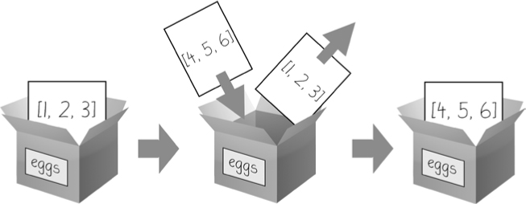
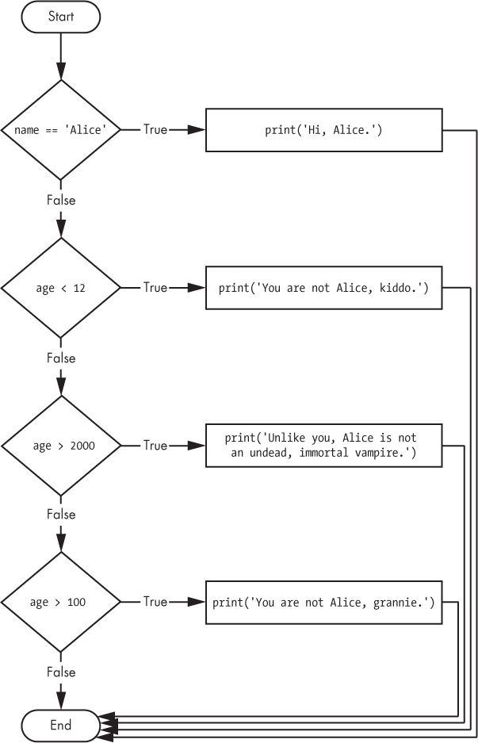

# JCAC Student Guide — Programming / Scripting

> **Realigned to JCAC Module 9 (Programming / Scripting, v2020-01R2) TOC.** Matches the 9-section course structure from the physical Student Guide (photos IMG_3682–IMG_3684).

**Module 9 scope:** Compiled vs. Scripting Languages → Scripting Concepts → Regular Expressions → Bash → Python → Network Programming (Sockets) → PowerShell → Encryption / Decryption of Text → HTML + CGI.

**Posture:** Practical scripting at a Chief's operational level — write, read, and debug scripts in Bash, Python, and PowerShell; use regex fluently; understand client/server sockets; recognize the web-surface basics (HTML, CGI, iframes) as both a defender and a targeter. Offensive tradecraft is cross-referenced to `JCAC-ACTIVE-EXPLOIT.md`; this guide teaches **mechanisms and defensive awareness**, not weaponization.

---

## 1. Compiled vs. Interpreted / Scripting Languages

### Compiled languages

Source code is translated to native machine code **ahead of time** by a compiler; the resulting binary runs directly on the CPU.

| Language | Compiler(s) | Notes |
|---|---|---|
| **C** | gcc, clang, msvc | Close to the metal; OS kernels, libraries |
| **C++** | g++, clang++, msvc | OO + templates + systems-level |
| **Go** | go build | Single binary, fast compile, GC |
| **Rust** | rustc, cargo | Memory-safe without GC; systems |
| **Swift** | swiftc | Apple ecosystem |
| **Fortran / COBOL / Ada** | gfortran / etc. | Legacy + scientific |

Properties:

- **Fast execution** — no interpreter overhead.
- **Static typing + compile-time checks** — many errors caught before run.
- **Platform-specific binary** — must recompile per OS/arch.
- **Longer edit-build-run cycle** — minutes on large codebases.

### Interpreted / scripting languages

Source is parsed and executed at runtime by an interpreter.

| Language | Interpreter | Notes |
|---|---|---|
| **Bash / sh / zsh** | /bin/bash | Unix shell scripting |
| **Python** | /usr/bin/python3 | General-purpose, huge ecosystem |
| **Perl** | /usr/bin/perl | Text-processing legacy |
| **Ruby** | /usr/bin/ruby | Rails, DevOps (Chef, Puppet) |
| **JavaScript** | Browser V8, Node.js | Web frontend + backend |
| **PowerShell** | powershell.exe / pwsh | Windows + cross-platform admin |
| **Lua** | lua | Embedded, game scripting |
| **Tcl** | tclsh | Legacy automation |

Properties:

- **Fast edit-run cycle** — no compile step.
- **Dynamic typing** — types resolved at runtime.
- **Platform-portable source** — if interpreter exists on target.
- **Slower execution** — interpreter adds overhead.
- **Source visible** — distribution = readable code.

### Hybrid: bytecode + VM + JIT

- Source compiled to **bytecode** (platform-independent).
- Bytecode executed by a **VM** (interpreter) with optional **JIT** compilation of hot paths.
- **Java** (`javac` → `.class` → JVM with HotSpot JIT).
- **.NET / C#** (csc → IL → CLR with RyuJIT).
- **Python** (compiled to `.pyc` bytecode → CPython VM; PyPy has a JIT).

### When to use what

- **Systems, OS, perf-critical** → compiled (C, C++, Rust, Go).
- **Automation, data wrangling, one-offs, glue** → scripting (Bash, Python, PowerShell).
- **Enterprise apps** → JVM (Java, Kotlin) or .NET (C#).
- **Web frontend** → JavaScript/TypeScript; **backend** → any of the above.

For a Chief: Bash for OS-glue, Python for anything beyond 50 lines, PowerShell on Windows hosts. C/C++ understanding for reverse engineering, not usually for original authorship.

---

## 2. Scripting Concepts

Common to every scripting language: source layout, flow control, variables, functions, I/O redirection.

### Source code structure

| Element | Purpose |
|---|---|
| **Shebang** | First line tells OS which interpreter: `#!/usr/bin/env python3` |
| **Comments** | Readable notes, not executed: `#` (Python/shell), `//` and `/* */` (many), `<#...#>` (PowerShell) |
| **Imports / includes** | Pull in libraries: `import re` (Py), `source lib.sh` (Bash), `Import-Module` (PS) |
| **Declarations** | Introduce functions, classes, variables |
| **Main / entry point** | Some scripts run top-to-bottom; Python often uses `if __name__ == "__main__":` |

### Pseudocode → code

Language-agnostic algorithm description before implementation. Teaches logic without syntax distraction.

```
INPUT: list of log lines
FOR each line:
    IF line contains "ERROR":
        extract the IP address
        ADD IP to a set
PRINT sorted set
```

Translated to Python:

```python
import re
ips = set()
with open('syslog') as f:
    for line in f:
        if 'ERROR' in line:
            m = re.search(r'\b\d+\.\d+\.\d+\.\d+\b', line)
            if m:
                ips.add(m.group())
for ip in sorted(ips):
    print(ip)
```

### Comments

- Python / Bash: `# comment`.
- PowerShell: `# single-line`, `<# block #>`.
- JavaScript / C / Java: `// single`, `/* block */`.
- Good comments explain **why**, not what. Code shows what.

### Flow control

Every scripting language has:

- **Sequence** — statements run top-to-bottom.
- **Selection** — `if`/`elif`/`else`, `switch`/`case`.
- **Iteration** — `while`, `for`, `foreach`.
- **Jumps** — `break`, `continue`, `return`.
- **Error handling** — `try`/`except`/`catch`/`finally`.

### Variables — data types

| Type | Examples |
|---|---|
| **Integer** | `42` |
| **Float** | `3.14` |
| **String** | `"hello"` |
| **Boolean** | `True` / `False` |
| **None / null** | Python `None`, JS `null`/`undefined` |
| **List / array** | Ordered collection |
| **Tuple** | Immutable ordered |
| **Set** | Unordered, unique |
| **Dict / map / hash** | Key → value |

Dynamic-typed languages (Python, Bash, JS) let a variable hold any type; the type is a property of the value, not the name.

### Arrays

```python
# Python list
nums = [1, 2, 3]
nums.append(4)
nums[0]                # 1
```

```bash
# Bash array
nums=(1 2 3 4)
echo "${nums[0]}"      # 1
echo "${nums[@]}"      # 1 2 3 4
echo "${#nums[@]}"     # 4
```

```powershell
# PowerShell array
$nums = 1, 2, 3, 4
$nums[0]               # 1
$nums.Count            # 4
$nums += 5
```

### Classes and objects (scripting)

- **Python:** full OOP — classes, inheritance, MRO, dataclasses.
- **PowerShell:** classes since 5.0; mostly uses .NET types directly.
- **Bash:** no real classes — function-plus-namespacing conventions.
- **JavaScript:** prototype-based OO (ES6 introduced class syntax sugar).

```python
class Packet:
    def __init__(self, src, dst, length):
        self.src = src
        self.dst = dst
        self.length = length
    def summary(self):
        return f"{self.src} -> {self.dst} ({self.length} B)"

p = Packet("10.0.0.1", "10.0.0.2", 1500)
print(p.summary())
```

### Typecasting

Converting a value from one type to another:

```python
int("42")              # 42
str(42)                # "42"
float("3.14")          # 3.14
bool("")               # False
bool("x")              # True
list("abc")            # ['a', 'b', 'c']
```

```bash
# Bash: arithmetic context auto-converts
num="42"
((result = num + 8))   # 50
```

```powershell
[int]"42"              # 42
[string]42             # "42"
[int]"abc"             # ERROR
```

### Scoping (local / global)

```python
x = 10                 # module scope

def f():
    x = 5              # local to f
    print(x)           # 5

f()
print(x)               # 10

def g():
    global x
    x = 99             # modifies module scope

g()
print(x)               # 99
```

Bash default: all variables global. `local` keyword inside a function scopes to that function.

```bash
counter() {
    local count=0
    for i in "$@"; do ((count++)); done
    echo "$count"
}
```

### Functions

```python
def greet(name, prefix="Hello"):
    return f"{prefix}, {name}!"
```

```bash
greet() {
    local name="$1"
    local prefix="${2:-Hello}"
    echo "${prefix}, ${name}!"
}
greet "Alice"
```

```powershell
function Greet {
    param(
        [string]$Name,
        [string]$Prefix = "Hello"
    )
    "$Prefix, $Name!"
}
Greet -Name Alice
```

### Redirection (I/O)

| Shell | Python | PowerShell |
|---|---|---|
| `cmd > file` | `print(x, file=fh)` | `cmd > file` |
| `cmd >> file` (append) | `open(p, 'a')` | `cmd >> file` |
| `cmd 2> err.log` | `sys.stderr.write(...)` | `cmd 2> err.log` |
| `cmd 2>&1` | — | `cmd 2>&1` |
| `cmd < input.txt` | `open(p).read()` | `cmd < input.txt` |
| `a \| b` | subprocess pipes | `a \| b` |

### Modularity

- Break code into functions; group related functions into modules.
- Python: files under a directory with `__init__.py` form packages.
- PowerShell: `.psm1` modules; `Import-Module`.
- Bash: `source lib.sh` to pull in functions.

### Exception handling

```python
try:
    n = int(input("number: "))
except ValueError as e:
    print(f"bad input: {e}")
except KeyboardInterrupt:
    print("\ninterrupted")
    raise
finally:
    cleanup()
```

```powershell
try {
    $n = [int](Read-Host "number")
} catch [FormatException] {
    Write-Error "bad input"
} finally {
    Cleanup
}
```

Bash uses exit codes + `trap`:

```bash
trap 'rm -f "$TMPFILE"' EXIT
set -euo pipefail
```

---

## 3. Regular Expressions


*Sweigart, Automate the Boring Stuff with Python 2e — figure from the regex chapter (Ch 7) illustrating pattern syntax or a match flow.*

A **regular expression** describes a pattern for matching strings. Analyst work: finding IPs in logs, extracting emails, filtering Wireshark displays, masking PCAPs, writing Snort rules, tuning YARA rules.

### Regex flavors

| Flavor | Used by |
|---|---|
| **POSIX BRE (Basic)** | `grep`, `sed`, `ed` default |
| **POSIX ERE (Extended)** | `grep -E`, `egrep`, `awk` |
| **PCRE (Perl-Compatible)** | `grep -P`, `pcregrep`, Python `re`, Perl, Ruby, PHP |
| **.NET** | PowerShell `-match`, C# |
| **JavaScript** | Browser / Node |
| **Go RE2** | Go standard library — no backreferences, linear time |

### Core metacharacters

| Symbol | Meaning |
|---|---|
| `.` | Any one character (except newline by default) |
| `^` | Start of line / string |
| `$` | End of line / string |
| `*` | Zero or more of preceding |
| `+` | One or more of preceding |
| `?` | Zero or one of preceding |
| `{n}` | Exactly n |
| `{n,m}` | Between n and m |
| `{n,}` | n or more |
| `[...]` | Character class |
| `[^...]` | Negated class |
| `\|` | Alternation (OR) |
| `(...)` | Group + capture |
| `(?:...)` | Non-capturing group |
| `\` | Escape the next metacharacter |

### Escape character `\`

Use `\` before a metacharacter to match it literally:

```
\.     matches a literal .
\*     matches a literal *
\\     matches a literal \
\(     matches a literal (
```

### Character classes (shortcuts)

| Class | Meaning |
|---|---|
| `\d` | Digit `[0-9]` |
| `\D` | Non-digit |
| `\w` | Word char `[A-Za-z0-9_]` |
| `\W` | Non-word |
| `\s` | Whitespace `[ \t\n\r\f\v]` |
| `\S` | Non-whitespace |
| `\b` | Word boundary |
| `\B` | Not a word boundary |

### Character classes `[...]`

Any one character from the set.

```
[aeiou]       vowel
[A-Z]         uppercase letter
[A-Za-z0-9]   alphanumeric
[^0-9]        any non-digit
[.]           literal dot (inside brackets, most metas lose meaning)
[-./]         literal -, ., or /
```

### Quantifiers `{}`

```
a{3}          exactly aaa
a{2,4}        aa, aaa, or aaaa
a{3,}         aaa or more
```

### Anchors

- `^` — start of input (or line, in multiline mode).
- `$` — end of input (or line).
- `\A`, `\Z` — absolute start / end (PCRE).
- `\b` — word boundary (between `\w` and `\W` or at string edge).

### Grouping and backreferences

```
(abc)         captures as group 1
\1            backreference to group 1
```

Example: `(\w+) \1` matches repeated words — "the the", "and and".

Named groups:

- Python: `(?P<name>pattern)`, backref `(?P=name)` or `\g<name>`.
- PCRE / .NET: `(?<name>pattern)`, backref `\k<name>`.

Non-capturing: `(?:abc)` — groups without consuming a capture number.

### Alternation `|`

```
cat|dog       "cat" or "dog"
^(GET|POST)   line starts with GET or POST
```

Alternation has low precedence; use groups to scope it: `(foo|bar)baz` vs `foo|barbaz`.

### Quantifiers — greedy vs lazy

Default: **greedy** — match as much as possible.

```
<.*>      on   <a>b<c>     →   <a>b<c>        (whole string)
<.*?>     on   <a>b<c>     →   <a>            (shortest)
```

**Possessive** (`*+`, `++`, `?+`): no backtracking. Avoids catastrophic backtracking but not supported everywhere (PCRE yes; Python `re` no; `regex` module yes).

### Lookarounds (zero-width)

- `(?=pattern)` — positive lookahead (must be followed by).
- `(?!pattern)` — negative lookahead.
- `(?<=pattern)` — positive lookbehind (PCRE; fixed-width in older engines).
- `(?<!pattern)` — negative lookbehind.

```
foo(?=bar)    matches "foo" only if followed by "bar"  — does not consume "bar"
(?<=\$)\d+    number preceded by $ — "$42" → "42"
```

### Common practical patterns

```
# IPv4 (loose, allows 0-999)
\b\d{1,3}\.\d{1,3}\.\d{1,3}\.\d{1,3}\b

# IPv4 (strict, each octet 0-255)
\b(25[0-5]|2[0-4]\d|1\d\d|[1-9]?\d)(\.(25[0-5]|2[0-4]\d|1\d\d|[1-9]?\d)){3}\b

# IPv6 (simplified)
\b[0-9A-Fa-f:]{2,}\b

# MAC address (colon or dash separated)
\b[0-9A-Fa-f]{2}([:-][0-9A-Fa-f]{2}){5}\b

# Email (simplified)
[A-Za-z0-9._%+-]+@[A-Za-z0-9.-]+\.[A-Za-z]{2,}

# URL
https?://[A-Za-z0-9.-]+(?::\d+)?(?:/[^\s]*)?

# MD5, SHA-1, SHA-256
\b[A-Fa-f0-9]{32}\b
\b[A-Fa-f0-9]{40}\b
\b[A-Fa-f0-9]{64}\b

# Base64 block
[A-Za-z0-9+/=]{20,}

# Common log timestamp (ISO 8601)
\d{4}-\d{2}-\d{2}T\d{2}:\d{2}:\d{2}(\.\d+)?(Z|[+-]\d{2}:?\d{2})
```

### Regex in common tools

```bash
# grep
grep 'ERROR' /var/log/syslog                # literal
grep -E '^ERROR|WARN' /var/log/syslog       # ERE
grep -P '\bERROR\b' /var/log/syslog         # PCRE
grep -oE '\b\d+\.\d+\.\d+\.\d+\b' log       # -o prints only matches

# sed
sed 's/foo/bar/g' file.txt
sed -E 's/([A-Z]+): (.*)/\2 [\1]/' file.txt

# awk
awk '/pattern/ { print $2, $3 }' file.txt
awk -F'\t' '$1 ~ /^192\.168\./' flows.tsv

# Python
import re
m = re.search(r'\b(\d+\.\d+\.\d+\.\d+)\b', line)
if m: ip = m.group(1)
ips = re.findall(r'\b\d+\.\d+\.\d+\.\d+\b', text)

# PowerShell
$line -match '\d+'                          # bool, fills $Matches
$line -replace 'foo', 'bar'
Select-String -Pattern 'ERROR' -Path *.log
```

### Pitfalls

- **Catastrophic backtracking** — nested quantifiers like `(a+)+b` can go exponential on adversarial input. Defense: atomic groups `(?>...)`, possessive quantifiers, or the `regex` module with recursion limits.
- **Greedy `.*`** eats too much — use `.*?` or a specific negated class `[^"]*`.
- **Unicode** — `\w` in ASCII mode is `[A-Za-z0-9_]`; PCRE `/u` includes Unicode letters.
- **DOTALL** — `.` doesn't match newline by default; use `re.DOTALL` / `/s` flag.
- **Anchors + multiline** — `^`/`$` match string boundaries by default; multiline mode makes them per-line.

---


*Sweigart, Automate the Boring Stuff with Python 2e — figure from the control-flow / functions chapters illustrating program logic.*

## 4. Bash Shell Scripting

### Shell interpreter

The program that parses and executes shell commands. Default interactive shell on Linux: typically Bash. Scripts run the shell in their shebang (`#!/usr/bin/env bash`).

### Robust defaults

```bash
#!/usr/bin/env bash
set -euo pipefail      # -e exit on error, -u error on unset vars, -o pipefail
IFS=$'\n\t'            # safer word-splitting for filenames with spaces
```

### Echo / printf

```bash
echo "hello"
echo -e "line1\nline2"           # interpret \n (not all echos do)
echo -n "no newline"
printf "%s=%d\n" "count" 42
printf -v formatted "%05d" 42    # format into variable, no print
```

Prefer `printf` over `echo` when portability matters (`echo -e` is non-POSIX).

### Variables — accessing

```bash
name="Alice"
echo "$name"              # Alice
echo "${name}"            # Alice (braces required for concatenation)
echo "${name}_log"        # Alice_log
echo "${name:-default}"   # default if unset/empty
echo "${name:=def}"       # assign default if unset
echo "${#name}"           # 5 (length)
echo "${name^^}"          # ALICE (uppercase)
echo "${name,,}"          # alice (lowercase)
echo "${name/A/a}"        # alice (first A → a)
echo "${name//A/a}"       # alice (all A → a)
```

### Positional parameters

```bash
$0          script name
$1 .. $9    arguments
${10}       tenth argument (braces needed)
$#          count of args
$@          all args as separate words
$*          all args as one word (IFS-joined)
$?          exit status of previous command
$$          PID of this script
$!          PID of last background job
```

### Arrays

```bash
# Indexed array
files=("a.txt" "b.txt" "c.txt")
echo "${files[0]}"        # a.txt
echo "${files[@]}"        # all elements
echo "${#files[@]}"       # count
files+=("d.txt")          # append

# Associative array (Bash 4+)
declare -A user
user[name]="Alice"
user[id]=1001
echo "${user[name]}"
```

### Read-only variables

```bash
readonly MAX=100
MAX=200              # error: readonly variable
```

### Quoting

- **Single quotes** `'...'` — literal, no substitution.
- **Double quotes** `"..."` — allows `$var`, `${var}`, `$(cmd)`, `\$`, `\"`.
- **Backticks** `` `cmd` `` — command substitution (legacy; prefer `$(cmd)`).
- **No quotes** — word-splitting applies; dangerous with filenames containing spaces.

```bash
name="Alice Jones"
echo "$name"              # Alice Jones
echo '$name'              # $name (literal)
echo $name                # Alice Jones (word-split; dangerous in general)
```

**Always quote `"$var"` unless you specifically need word-splitting.**

### Read — get input from user or file

```bash
read -p "Name: " name
read -s -p "Password: " pw    # silent
read -r -a words              # split into array by IFS
read -t 5 answer              # 5-second timeout

# Read a file line-by-line
while IFS= read -r line; do
    echo "$line"
done < input.txt
```

### Sorting / filtering utilities

```bash
sort file.txt | uniq -c | sort -rn | head
awk -F: '{print $1}' /etc/passwd | sort -u
grep -v '^#' config.ini        # skip comments
cut -d: -f1,3 /etc/passwd      # username and UID
tr '[:lower:]' '[:upper:]' < file.txt
```

### Arithmetic

```bash
(( x = 2 + 3 ))               # x=5
(( x++ ))                     # post-increment
y=$((2 ** 10))                # 1024
if (( x > 0 )); then ...; fi  # numeric comparison
result=$(echo "scale=2; 7/3" | bc)   # floating point via bc
```

### UNIX scripting flow control

**Branching:**

```bash
if [[ -f /etc/hostname ]]; then
    echo "file exists"
elif [[ -d /etc/hostname ]]; then
    echo "is dir"
else
    echo "neither"
fi

case "$1" in
    start)   start_service ;;
    stop)    stop_service ;;
    restart) stop_service; start_service ;;
    *)       echo "usage: $0 {start|stop|restart}"; exit 1 ;;
esac
```

**Test operators:**

| Op | Meaning |
|---|---|
| `-f file` | regular file exists |
| `-d dir` | directory exists |
| `-L path` | symlink |
| `-r/-w/-x` | readable/writable/executable |
| `-z str` | string empty |
| `-n str` | string non-empty |
| `-eq -ne -lt -le -gt -ge` | numeric |
| `= !=` | string equality |
| `=~` | regex (`[[ $s =~ ^[0-9]+$ ]]`) |

**Loops:**

```bash
for i in {1..10}; do echo "$i"; done
for f in /var/log/*.log; do wc -l "$f"; done
for ((i=0; i<10; i++)); do echo "$i"; done

while [[ -f /tmp/wait ]]; do sleep 1; done
until systemctl is-active -q nginx; do sleep 1; done
```

**break / continue** — exit / skip iteration of innermost loop.

---


*Sweigart, Automate the Boring Stuff with Python 2e — figure from the early Python chapters (data types, expressions, or interpreter flow).*

## 5. Python Programming Language

### Hello world

```python
print("Hello, world!")
```

### Print — formatted output

```python
name = "Alice"
age = 30

print("Name:", name, "Age:", age)              # auto sep=' '
print(f"Name: {name}, Age: {age}")             # f-string (3.6+)
print("Name: {}, Age: {}".format(name, age))   # .format()
print("Name: %s, Age: %d" % (name, age))       # legacy % (printf-like)
print("no newline", end="")                    # suppress newline
print("a", "b", "c", sep="/")                  # custom separator
```

### Escape sequences in strings

```
"hello\nworld"           two lines
"col1\tcol2"             tab-separated
"back\\slash"            literal \
"quote\""                literal "
r"C:\Users\Alice"        raw string — no escapes processed (great for regex/paths)
"\x41"                   hex — 'A'
"\u03b1"                 Unicode — 'α'
```

### Variables — typecasting and helpful built-ins

```python
x = "42"
y = int(x)                  # 42
z = float(x)                # 42.0
s = str(42)                 # "42"
b = bool("")                # False
b2 = bool("x")              # True
ls = list("abc")            # ['a','b','c']

# Helpful built-ins
len("hello")                # 5
abs(-5)                     # 5
min([3, 1, 2])              # 1
max([3, 1, 2])              # 3
sum([1, 2, 3])              # 6
sorted([3, 1, 2])           # [1, 2, 3]
reversed([1, 2, 3])         # iterator
type(42)                    # <class 'int'>
isinstance(42, int)         # True
```

### `input()` / legacy `raw_input()`

- Python 3: `input(prompt)` returns a string.
- Python 2: `raw_input(prompt)` — returns a string. `input(prompt)` in Python 2 evaluated the input as code — dangerous and removed in Python 3.

```python
name = input("Name: ")
age = int(input("Age: "))    # convert to int
```

### Strings

```python
s = "Hello, world"
s.upper()                    # "HELLO, WORLD"
s.lower()                    # "hello, world"
s.split(",")                 # ["Hello", " world"]
s.replace("world", "there")
s.startswith("Hello")        # True
s.endswith("world")          # True
s.strip()                    # trim whitespace
"x" in s                     # False
s[0:5]                       # "Hello" (slice)
s[-5:]                       # "world"
len(s)                       # 12
",".join(["a", "b", "c"])    # "a,b,c"
```

### Lists

```python
nums = [1, 2, 3, 4, 5]
nums[0]                      # 1
nums[-1]                     # 5
nums[1:3]                    # [2, 3]
nums[::-1]                   # [5, 4, 3, 2, 1]
nums.append(6)
nums.insert(0, 0)
nums.remove(3)
nums.pop()                   # remove & return last
nums.sort()
nums.reverse()
len(nums)
sum(nums)
max(nums); min(nums)
3 in nums                    # membership
```

List comprehensions:

```python
squares = [x*x for x in range(10)]
evens   = [x for x in nums if x % 2 == 0]
pairs   = [(x, y) for x in [1,2,3] for y in ['a','b']]
```

### Dicts / sets / tuples

```python
d = {"name": "Alice", "age": 30}
d["name"]
d.get("missing", "default")
d.keys(); d.values(); d.items()
d["role"] = "Chief"
"age" in d

s = {1, 2, 3}
s.add(4)
s & {2, 3, 4}                # intersection
s | {5}                      # union

t = (1, 2, 3)                # immutable
```

### Python flow control

```python
# if / elif / else
if x > 0:
    print("positive")
elif x == 0:
    print("zero")
else:
    print("negative")

# while
while n > 0:
    n -= 1

# for
for i in range(10):
    print(i)

for item in ["a", "b", "c"]:
    print(item)

for i, v in enumerate(items):
    print(i, v)

for k, v in d.items():
    print(k, v)

# break / continue
for i in range(100):
    if i == 50: break
    if i % 2 == 0: continue
```

### `range()` function

```python
range(10)                    # 0..9
range(1, 11)                 # 1..10
range(0, 20, 2)              # 0, 2, 4, ..., 18
range(10, 0, -1)             # 10, 9, ..., 1
```

### File I/O

**Output:**

```python
with open("out.txt", "w") as f:
    f.write("line 1\n")
    f.write("line 2\n")

with open("out.txt", "a") as f:        # append
    f.write("another\n")
```

**Input:**

```python
with open("in.txt") as f:
    contents = f.read()                # whole file

with open("in.txt") as f:
    for line in f:                     # streamed, memory-friendly
        process(line.rstrip())

with open("in.txt") as f:
    lines = f.readlines()              # list of lines
```

Binary mode: `open(path, "rb")` / `"wb"`. CSV, JSON, XML get dedicated modules (`csv`, `json`, `xml.etree`).

### Functions — local/global scope, modularity

```python
def greet(name, prefix="Hello"):
    """Return greeting. Docstring shows with help(greet)."""
    return f"{prefix}, {name}!"

msg = greet("Alice")
```

**Variable scope:**

```python
x = 10

def f():
    x = 5               # local
    print(x)            # 5

def g():
    global x
    x = 99              # modifies module-level x

def h():
    print(x)            # reads module-level x (no assignment → not local)
```

**LEGB rule** — name lookup: Local → Enclosing → Global → Built-in.

### Modularity

- Save functions in a `.py` file (a module).
- Import into another: `import mymod` → `mymod.greet(...)`.
- `from mymod import greet` → just `greet(...)`.
- Multiple modules under a directory with `__init__.py` = package.

```
project/
    main.py
    mypkg/
        __init__.py
        utils.py
        logging.py
```

### Using regex — `re` module

```python
import re

m = re.search(r'\b(\d+\.\d+\.\d+\.\d+)\b', line)
if m:
    ip = m.group(1)

all_ips = re.findall(r'\b\d+\.\d+\.\d+\.\d+\b', text)

# Match at start only
m = re.match(r'ERROR', line)

# Substitute
new = re.sub(r'\d+', 'N', "abc123def456")   # "abcNdefN"

# Compile for reuse
ip_re = re.compile(r'\b(\d+\.\d+\.\d+\.\d+)\b')
for line in lines:
    m = ip_re.search(line)

# Flags
re.search(r'error', line, re.IGNORECASE)
re.search(r'a.b', 'a\nb', re.DOTALL)    # . matches newline
```

**Common flags:**

| Flag | Effect |
|---|---|
| `re.IGNORECASE` / `re.I` | Case-insensitive |
| `re.MULTILINE` / `re.M` | `^`/`$` match line boundaries |
| `re.DOTALL` / `re.S` | `.` matches newline |
| `re.VERBOSE` / `re.X` | Whitespace + `#` comments in pattern |
| `re.UNICODE` / `re.U` | Full Unicode `\w`, `\d`, etc. |

**Search vs findall:**

- `search` returns a match object (or None) for the first match.
- `findall` returns a list of all matches (strings, or tuples if groups).
- `finditer` returns an iterator of match objects — best for large texts.

### Exception handling

```python
try:
    n = int(input("number: "))
    r = 100 / n
except ValueError:
    print("not a number")
except ZeroDivisionError:
    print("zero disallowed")
except KeyboardInterrupt:
    print("cancelled")
    raise
except Exception as e:
    print(f"unexpected: {e}")
finally:
    cleanup()
```

**Raise your own:**

```python
if not path.exists():
    raise FileNotFoundError(f"no such file: {path}")
```

**Custom exception classes:**

```python
class AuthError(Exception):
    pass

try:
    login(user, pw)
except AuthError as e:
    audit_log(e)
```

### Security: avoid dangerous sinks with untrusted input

- Never pass untrusted strings to Python's runtime-code-evaluation builtins. Use `ast.literal_eval` for parsing literal data structures.
- Never pass untrusted strings to Python's shell-invoking helpers (the `system` function in the `os` module; `subprocess` calls that enable `shell=True`). Use the list-argument form instead: `subprocess.run(["curl", url], check=True)`.
- Never construct SQL with string formatting; use parameterized queries: `cur.execute("SELECT * FROM t WHERE id=?", (id,))`.
- Prefer JSON for untrusted data interchange; Python's stdlib binary-serializer module runs arbitrary constructors on load, which is unsafe for externally-supplied bytes.

This pairs with the CWE table in `JCAC-PROG-FUND.md` Appendix E.

---

## 6. Network Programming

Sockets are the OS API for network I/O. Most languages wrap the BSD socket API; Python's `socket` module is thin and transparent.

### Socket concept

A **socket** is an endpoint: `(protocol, local-addr, local-port, remote-addr, remote-port)`.

- **Stream socket (SOCK_STREAM)** — reliable, ordered bytes (TCP).
- **Datagram socket (SOCK_DGRAM)** — unreliable messages (UDP).
- **Raw socket (SOCK_RAW)** — craft full IP/L4 headers (root/admin only).

Address families:

| Family | Scope |
|---|---|
| `AF_INET` | IPv4 |
| `AF_INET6` | IPv6 |
| `AF_UNIX` | Unix domain socket (local IPC) |

### Python socket module — TCP echo server

```python
import socket

HOST = "0.0.0.0"
PORT = 5555

with socket.socket(socket.AF_INET, socket.SOCK_STREAM) as srv:
    srv.setsockopt(socket.SOL_SOCKET, socket.SO_REUSEADDR, 1)
    srv.bind((HOST, PORT))
    srv.listen()
    print(f"listening on {HOST}:{PORT}")

    while True:
        conn, addr = srv.accept()
        with conn:
            print(f"connected: {addr}")
            while True:
                data = conn.recv(4096)
                if not data:
                    break
                conn.sendall(data)    # echo back
```

### TCP echo client

```python
import socket

HOST = "127.0.0.1"
PORT = 5555

with socket.socket(socket.AF_INET, socket.SOCK_STREAM) as s:
    s.connect((HOST, PORT))
    s.sendall(b"Hello, server\n")
    reply = s.recv(4096)
    print("got:", reply.decode())
```

### UDP server

```python
import socket

with socket.socket(socket.AF_INET, socket.SOCK_DGRAM) as srv:
    srv.bind(("0.0.0.0", 5555))
    while True:
        data, addr = srv.recvfrom(4096)
        print(f"{addr}: {data}")
        srv.sendto(data, addr)       # echo
```

### UDP client

```python
import socket

with socket.socket(socket.AF_INET, socket.SOCK_DGRAM) as s:
    s.sendto(b"ping", ("127.0.0.1", 5555))
    data, _ = s.recvfrom(4096)
    print("got:", data)
```

### Concurrency

- `threading` — one thread per connection; simple; GIL limits CPU-bound.
- `asyncio` — async/await event loop; best for many I/O-bound connections.
- `socketserver.ThreadingTCPServer` — batteries-included multi-thread server.
- `selectors` (kqueue/epoll on Linux) — low-level readiness notification.

### TLS-wrapped socket

```python
import socket, ssl

ctx = ssl.create_default_context()
with socket.create_connection(("example.com", 443)) as raw:
    with ctx.wrap_socket(raw, server_hostname="example.com") as s:
        s.sendall(b"GET / HTTP/1.1\r\nHost: example.com\r\n\r\n")
        resp = s.recv(4096)
        print(resp[:200])
```

### Higher-level libraries

- `urllib.request` / `requests` — HTTP client.
- `http.server` — quick HTTP server.
- `smtplib` / `poplib` / `imaplib` — email.
- `ftplib` / `paramiko` — FTP / SSH.
- `scapy` — packet crafting (L2+ with raw sockets or libpcap).

### Sockets in Bash

Bash has limited built-in TCP via `/dev/tcp`:

```bash
# Test TCP connectivity
cat < /dev/tcp/example.com/80

# Simple HTTP GET
exec 3<>/dev/tcp/example.com/80
printf 'GET / HTTP/1.0\r\nHost: example.com\r\n\r\n' >&3
cat <&3
```

Netcat is the canonical network tool for shell scripting:

```bash
nc -l 5555                    # listen on 5555
nc example.com 80             # connect
echo "test" | nc -u host 5555 # UDP
```

### PowerShell sockets

```powershell
$client = New-Object System.Net.Sockets.TcpClient
$client.Connect("example.com", 80)
$stream = $client.GetStream()
$writer = New-Object System.IO.StreamWriter($stream)
$writer.WriteLine("GET / HTTP/1.0`r`nHost: example.com`r`n`r`n")
$writer.Flush()
$reader = New-Object System.IO.StreamReader($stream)
$reader.ReadToEnd()
$client.Close()
```

Higher-level:

```powershell
Invoke-WebRequest -Uri http://example.com
Invoke-RestMethod -Uri https://api.github.com/repos/torvalds/linux
Test-NetConnection -ComputerName example.com -Port 443
```

---

## 7. Windows PowerShell

### Commands within PowerShell

PowerShell ships with ~1,500 cmdlets (Verb-Noun form). Pipeline passes **objects**, not text.

```powershell
Get-Service
Get-Process | Where-Object CPU -gt 10
Get-ChildItem C:\logs -Filter *.log
Get-EventLog -LogName Security -Newest 50
```

Aliases (convenience): `ls`, `dir`, `gci` → `Get-ChildItem`; `cat`, `type` → `Get-Content`; `ps` → `Get-Process`; `kill` → `Stop-Process`. See `Get-Alias` for all.

### Build a pipeline in ISE — filter, sort, format

```powershell
Get-Process |
    Where-Object { $_.WS -gt 100MB } |
    Sort-Object WS -Descending |
    Select-Object -First 10 Name, Id, @{n='WS(MB)';e={[int]($_.WS/1MB)}} |
    Format-Table -AutoSize
```

Breakdown:

- `Where-Object { ... }` — filter by predicate.
- `Sort-Object` — order.
- `Select-Object` — pick / transform properties; calculated property via hashtable.
- `Format-Table` — human display (never pipe into a further cmdlet after Format-*).

### Create a script

```powershell
# save as deploy.ps1
[CmdletBinding()]
param(
    [Parameter(Mandatory)][string]$Target,
    [int]$Port = 22
)

Write-Host "Deploying to $Target on port $Port" -ForegroundColor Green

try {
    Test-NetConnection -ComputerName $Target -Port $Port -ErrorAction Stop
} catch {
    Write-Error "cannot reach $Target on port $Port"
    exit 1
}
```

Run:

```powershell
.\deploy.ps1 -Target server.navy.mil -Port 22
```

### Write-Host / Write-Output / Write-Error / Write-Verbose

- `Write-Host` — console display only, bypasses pipeline.
- `Write-Output` (implicit when you just write an expression) — sends to pipeline.
- `Write-Error` — error stream (stream 2).
- `Write-Warning` — warning (stream 3).
- `Write-Verbose` — verbose (stream 4) — appears only when `-Verbose` requested.
- `Write-Debug` — debug (stream 5).

**Output redirection:**

```powershell
cmd *> all.log                  # all streams
cmd 2> err.log                  # error only
cmd 2>&1                        # error merged to output
```

### Variables and arrays

```powershell
$name = "Alice"
$count = 42
$pi = 3.14
$active = $true
$nothing = $null

# Arrays
$nums = 1, 2, 3, 4
$nums = @(1, 2, 3)              # explicit array
$nums[0]
$nums.Count
$nums += 5                      # append (creates new array)

# Hashtables
$user = @{ Name = "Alice"; Age = 30 }
$user.Name
$user["Age"]
$user.Role = "Chief"
```

### Quotes

```powershell
'single-quoted: $name'          # literal $name
"double-quoted: $name"          # Alice
"double with expr: $($user.Name)"
@"
multiline
"@                              # here-string, double-quoted
@'
multiline
'@                              # here-string, single-quoted
```

Escape character in PowerShell is the **backtick** `` ` `` (not `\`):

```powershell
"line1`nline2"                  # newline
"tab`there"                     # tab
"literal `"quote`""
```

### Read-Host

```powershell
$name = Read-Host "Name"
$pw   = Read-Host "Password" -AsSecureString
```

### PowerShell flow control

```powershell
if ($score -ge 90) { "A" }
elseif ($score -ge 80) { "B" }
else { "F" }

switch ($day) {
    "Mon" { "workday" }
    "Sat" { "weekend" }
    default { "other" }
}

for ($i = 0; $i -lt 10; $i++) { $i }

foreach ($f in Get-ChildItem *.log) { "$($f.Name) - $($f.Length) bytes" }

while ($attempts -lt 3) { ... }

do { ... } while ($running)

# Break, continue
foreach ($n in 1..100) {
    if ($n -gt 50) { break }
    if ($n % 2) { continue }
    $n
}
```

Comparison operators in PowerShell are **`-eq`, `-ne`, `-lt`, `-le`, `-gt`, `-ge`, `-like`, `-match`, `-contains`, `-in`**. `=` is assignment; `==` doesn't exist.

---

## 8. Encryption / Decryption of Text

Scripting language primitives for symmetric and hash operations.

### Hashing in Python

```python
import hashlib

data = b"Hello, world"
hashlib.md5(data).hexdigest()       # broken, change-detection only
hashlib.sha1(data).hexdigest()      # broken
hashlib.sha256(data).hexdigest()    # current default
hashlib.sha512(data).hexdigest()
hashlib.blake2b(data).hexdigest()

# Streaming (large files)
h = hashlib.sha256()
with open("big.bin", "rb") as f:
    for chunk in iter(lambda: f.read(65536), b""):
        h.update(chunk)
print(h.hexdigest())
```

### Password hashing (scripts)

Never use plain `sha256(password)`. Use a slow KDF:

```python
import secrets, hashlib

password = b"hunter2"
salt = secrets.token_bytes(16)
derived = hashlib.pbkdf2_hmac("sha256", password, salt, 200_000)
# Or use `bcrypt` / `argon2-cffi` packages for better defaults.
```

### Symmetric encryption — AES-GCM (AEAD)

```python
from cryptography.hazmat.primitives.ciphers.aead import AESGCM
import os

key = AESGCM.generate_key(bit_length=256)      # 32-byte key
aes = AESGCM(key)
nonce = os.urandom(12)                         # 12-byte unique-per-message nonce
plaintext = b"message"
aad = b"associated"                            # authenticated, not encrypted
ciphertext = aes.encrypt(nonce, plaintext, aad)
decrypted = aes.decrypt(nonce, ciphertext, aad)   # raises if tampered
```

**Key rules:**

- Never reuse a (key, nonce) pair with GCM — catastrophic failure.
- Store keys outside the script (env var, secret manager, HSM, DPAPI, Linux keyring).
- Use AEAD modes (GCM, ChaCha20-Poly1305) — authenticated encryption.

### Symmetric encryption — openssl command-line

```bash
# Encrypt a file (AES-256-CBC with password-derived key)
openssl enc -aes-256-cbc -salt -pbkdf2 -iter 200000 -in plain.txt -out cipher.bin

# Decrypt
openssl enc -aes-256-cbc -d -pbkdf2 -iter 200000 -in cipher.bin -out plain.txt
```

### Asymmetric — Python `cryptography` package

```python
from cryptography.hazmat.primitives.asymmetric import rsa, padding
from cryptography.hazmat.primitives import hashes, serialization

# Generate RSA keypair
priv = rsa.generate_private_key(public_exponent=65537, key_size=4096)
pub = priv.public_key()

# Serialize
pem_priv = priv.private_bytes(
    encoding=serialization.Encoding.PEM,
    format=serialization.PrivateFormat.PKCS8,
    encryption_algorithm=serialization.BestAvailableEncryption(b"passphrase"),
)
pem_pub = pub.public_bytes(
    encoding=serialization.Encoding.PEM,
    format=serialization.PublicFormat.SubjectPublicKeyInfo,
)

# Encrypt (small data only — wrap a symmetric key in practice)
ct = pub.encrypt(
    b"small data",
    padding.OAEP(mgf=padding.MGF1(hashes.SHA256()), algorithm=hashes.SHA256(), label=None),
)

# Sign / verify
signature = priv.sign(b"message",
    padding.PSS(mgf=padding.MGF1(hashes.SHA256()), salt_length=padding.PSS.MAX_LENGTH),
    hashes.SHA256())

pub.verify(signature, b"message",
    padding.PSS(mgf=padding.MGF1(hashes.SHA256()), salt_length=padding.PSS.MAX_LENGTH),
    hashes.SHA256())
```

### PowerShell crypto

```powershell
# SHA-256 of file
Get-FileHash -Algorithm SHA256 C:\Windows\System32\cmd.exe

# Random bytes
$bytes = New-Object byte[] 32
[System.Security.Cryptography.RandomNumberGenerator]::Create().GetBytes($bytes)

# AES-GCM (PowerShell 7.2+)
$key  = New-Object byte[] 32
[System.Security.Cryptography.RandomNumberGenerator]::Create().GetBytes($key)
$nonce = New-Object byte[] 12
[System.Security.Cryptography.RandomNumberGenerator]::Create().GetBytes($nonce)

$aes = [System.Security.Cryptography.AesGcm]::new($key)
$plain  = [Text.Encoding]::UTF8.GetBytes("hello")
$cipher = New-Object byte[] ($plain.Length)
$tag    = New-Object byte[] 16
$aes.Encrypt($nonce, $plain, $cipher, $tag)
```

### Encoding ≠ encryption

Common mistake: treating Base64 / hex / URL-encoding as encryption. They're **reversible without a key** — anyone can decode. Use them for transport, never for secrecy.

```python
import base64
b64 = base64.b64encode(b"secret").decode()      # "c2VjcmV0" — trivially reversible
raw = base64.b64decode(b64)
```

### Classical ciphers (exam / curiosity)

| Cipher | Mechanism |
|---|---|
| **Caesar / shift** | Each letter shifted by k |
| **ROT13** | Shift by 13 (self-inverse) |
| **Vigenère** | Repeating-key Caesar; breakable by Kasiski / IC |
| **Substitution** | 26! permutations; breakable by frequency analysis |
| **Transposition** | Rearrange letters by a pattern |
| **XOR** | Byte-wise XOR with key; one-time-pad if key as long as message and random |

None are secure for real use; they show up in CTFs and exam questions.

```python
# ROT13 (built into Python)
import codecs
codecs.encode("Hello", "rot_13")       # "Uryyb"
```

---

## 9. HyperText Markup Language (HTML) and CGI

HTML structures web documents; CGI is the classic server-side mechanism for dynamic pages.

### Minimal HTML document

```html
<!DOCTYPE html>
<html lang="en">
<head>
    <meta charset="UTF-8">
    <title>Example</title>
</head>
<body>
    <h1>Hello</h1>
    <p>Paragraph with a <a href="https://example.com">link</a>.</p>
</body>
</html>
```

### Document formatting elements

| Tag | Purpose |
|---|---|
| `<h1>` … `<h6>` | Headings |
| `<p>` | Paragraph |
| `<a href="">` | Link |
| `` | Image |
| `<ul>` / `<ol>` / `<li>` | Lists |
| `<table>` / `<tr>` / `<td>` / `<th>` | Tables |
| `<div>` | Block container |
| `<span>` | Inline container |
| `<form>` | Input container |
| `<input>` | Form field |
| `<textarea>` | Multi-line text |
| `<select>` / `<option>` | Dropdown |
| `<button>` | Action trigger |
| `<script>` | JavaScript |
| `<style>` | CSS |

### iframe — embedded document

```html
<iframe src="https://other.example.com" width="600" height="400"></iframe>
```

**Security risks:**

- **Clickjacking** — overlay a transparent iframe over your page; victim clicks what looks like your UI but actually clicks the framed site's button.
  - Defense: `X-Frame-Options: DENY` or `Content-Security-Policy: frame-ancestors 'none'` HTTP header.
- **iframe injection** — XSS that injects an iframe pointing to malicious content (drive-by download, phishing).
- **Cross-site leaks** — framed content behavior (size, error, timing) may leak info about the user's session on the other origin.
- **sandbox attribute** — `<iframe sandbox>` restricts script / form / top-navigation / same-origin in the framed doc.

### Common Gateway Interface (CGI)

CGI = protocol for running a program on the web server to handle an HTTP request and return dynamic content.

- Web server receives request for a URL mapped to a CGI script.
- Server spawns the script, passes request metadata via **environment variables** and body via **stdin**.
- Script writes HTTP headers + body to **stdout**; server relays to client.

### CGI environment variables (subset)

| Variable | Meaning |
|---|---|
| `REQUEST_METHOD` | `GET`, `POST`, etc. |
| `QUERY_STRING` | URL query after `?` |
| `PATH_INFO` | Extra path after script name |
| `CONTENT_LENGTH` | Body size for POST |
| `CONTENT_TYPE` | `application/x-www-form-urlencoded`, `multipart/form-data`, `application/json` |
| `HTTP_*` | HTTP headers from client |
| `REMOTE_ADDR` | Client IP |
| `SCRIPT_NAME` | Path to this CGI |
| `SERVER_NAME` / `SERVER_PORT` | Server's identity |

### Simple CGI script (Python)

```python
#!/usr/bin/env python3
# save as cgi-bin/hello.py with mode 755
import cgi, html

print("Content-Type: text/html\n")         # blank line ends headers

form = cgi.FieldStorage()                  # parses GET / POST form data safely
name = form.getfirst("name", "guest")      # defaults to "guest"

print(f"<html><body><h1>Hello, {html.escape(name)}</h1></body></html>")
```

**Critical — HTML-escape** (`html.escape`) any user input before emitting into HTML. Otherwise, reflected **XSS** (`?name=<script>alert(1)</script>`).

### HTML forms

```html
<form action="/cgi-bin/login.py" method="post">
    <label for="user">Username:</label>
    <input type="text" id="user" name="user">
    <label for="pass">Password:</label>
    <input type="password" id="pass" name="pass">
    <input type="submit" value="Log in">
</form>
```

**Form method:**

- `GET` — data in URL query string; visible, cached, logged; use for idempotent read.
- `POST` — data in body; use for state-changing and for secrets (not visible in URL).

**Input types:** `text`, `password`, `email`, `number`, `date`, `checkbox`, `radio`, `file`, `hidden`, `submit`, `reset`.

### Security surface at the HTML/CGI boundary

| Attack | Mechanism | CWE |
|---|---|---|
| **XSS (Reflected)** | User input echoed back into HTML without escaping | CWE-79 |
| **XSS (Stored)** | User input stored and served to other users | CWE-79 |
| **CSRF** | Victim's browser makes authenticated request on behalf of attacker | CWE-352 |
| **Clickjacking** | Victim clicks framed button thinking it's another site | CWE-1021 |
| **Open redirect** | `?redirect=evil.com` used unvalidated | CWE-601 |
| **SSRF** | Server fetches attacker-controlled URL | CWE-918 |
| **File upload bypass** | Uploaded file executed as code | CWE-434 |
| **Command injection** | User input passed to a shell-invoking function | CWE-78 |
| **Path traversal** | `../../../etc/shadow` escapes the web root | CWE-22 |

Defender checklist:

- **Input validation** — allowlist expected characters.
- **Output encoding** — context-appropriate escape (HTML, attribute, JS string, URL, CSS).
- **Content Security Policy (CSP)** header — restrict script sources.
- **X-Frame-Options** / `frame-ancestors` — anti-clickjacking.
- **Strict-Transport-Security (HSTS)** — force HTTPS.
- **SameSite cookies** — mitigate CSRF.
- **HTTP-only + Secure cookies** — mitigate script-stealing session cookies.
- **WAF / ModSecurity** — detect common payloads.
- **Security scanners** — OWASP ZAP, Burp Suite, Nikto, Wapiti.

### Modern alternatives to CGI

CGI spawns a process per request — slow. Modern:

- **FastCGI / SCGI** — persistent worker processes.
- **WSGI** (Python), **PSGI** (Perl), **Rack** (Ruby), **Servlet** (Java) — language-native gateway protocols.
- **ASP.NET** Core on Windows.
- **Standalone app servers** (Gunicorn, uWSGI, Node.js) fronted by reverse proxies (nginx, Apache, HAProxy, Caddy).

---

## Cross-cutting: operator safety for scripts

- Always validate external input (CLI args, env vars, files, network).
- Never build a shell command by concatenating user input; use array-argument execution APIs.
- Use `set -euo pipefail` in Bash.
- Use structured logging (timestamp, severity, source file).
- Prefer functions with narrow responsibility over 1000-line monoliths.
- Rotate credentials, don't hard-code them; use env vars or secret managers.
- Commit scripts to version control; code-review changes.
- Run security linters (`bandit` for Python, `ShellCheck` for Bash, `PSScriptAnalyzer` for PowerShell).

---

## Exam-testable concepts (rapid-fire)

- **Compiled vs interpreted — one trade-off each way?** Compiled faster runtime / interpreted faster edit cycle.
- **Python version introduced `f"..."`?** 3.6.
- **Regex flavor used by `grep` default?** POSIX BRE.
- **Regex flavor used by `grep -E`?** POSIX ERE.
- **Metacharacter for any single character (except newline)?** `.`
- **Start-of-line anchor?** `^`
- **End-of-line anchor?** `$`
- **Word-boundary anchor?** `\b`
- **Digit shorthand?** `\d`
- **Whitespace shorthand?** `\s`
- **Greedy vs lazy quantifier suffix?** Lazy adds `?` after the quantifier.
- **Non-capturing group syntax?** `(?:...)`
- **Positive lookahead syntax?** `(?=...)`
- **Escape a literal `.` in regex?** `\.`
- **Backreference to first group?** `\1`
- **Alternation operator?** `|`
- **Bash shebang line?** `#!/usr/bin/env bash` or `#!/bin/bash`
- **Bash strict-mode flags?** `set -euo pipefail`
- **Bash exit status of last command?** `$?`
- **Bash positional parameters?** `$1`, `$2`, ... `$@`, `$#`
- **Bash how to declare local in a function?** `local x=...`
- **Read a file line-by-line in Bash?** `while IFS= read -r line; do ...; done < file`
- **Python module for regex?** `re`
- **`re.search` vs `re.match` vs `re.findall`?** search anywhere, match at start, findall returns list.
- **Python list slice syntax?** `lst[start:stop:step]`
- **Python dict access with default?** `d.get(key, default)`
- **Python opens file safely how?** `with open(path) as f:`
- **Python 3 replacement for `raw_input()`?** `input()`
- **Python type conversion to int?** `int(x)`
- **Scoping rule Python follows?** LEGB — Local, Enclosing, Global, Built-in.
- **Global keyword usage?** `global x` inside a function to assign the module-level x.
- **Python exception base class?** `Exception` (or `BaseException` for root).
- **Socket type for TCP?** `SOCK_STREAM`.
- **Socket type for UDP?** `SOCK_DGRAM`.
- **Address family for IPv4?** `AF_INET`. IPv6? `AF_INET6`.
- **Listener `accept()` returns?** A new socket plus the client's address.
- **PowerShell pipeline passes?** Objects (not text).
- **PowerShell cmdlet grammar?** Verb-Noun.
- **PowerShell escape character?** Backtick `` ` ``.
- **PowerShell equality operator?** `-eq` (not `==`).
- **PowerShell split on comma?** `"a,b,c" -split ','`
- **PowerShell read user input?** `Read-Host`.
- **AEAD encryption modes?** AES-GCM, ChaCha20-Poly1305.
- **SHA-256 digest length?** 256 bits = 32 bytes = 64 hex chars.
- **Base64 is encryption?** No — reversible encoding with no key.
- **XSS CWE?** CWE-79.
- **CSRF CWE?** CWE-352.
- **SQL injection CWE?** CWE-89.
- **Path traversal CWE?** CWE-22.
- **HTTP header to block framing?** `X-Frame-Options` or CSP `frame-ancestors`.
- **HTTP header to force HTTPS?** `Strict-Transport-Security`.
- **Cookie attribute that mitigates CSRF?** `SameSite`.
- **Cookie attribute that blocks JS access?** `HttpOnly`.
- **Output-encoding function in Python `html` module?** `html.escape`.

---

## Cross-references

- **[Automate the Boring Stuff with Python, 2e](../references/Automate%20the%20Boring%20Stuff%20with%20Python,%202nd%20Edition-9781098122584.pdf)** — regex in Ch. 7, file/dir in 9–10, web scraping in 12
- **[Python `re` documentation](https://docs.python.org/3/library/re.html)**
- **[Python `socket` documentation](https://docs.python.org/3/library/socket.html)**
- **[PCRE2 documentation](https://www.pcre.org/)**
- **[Bash Reference Manual](https://www.gnu.org/software/bash/manual/)**
- **[ShellCheck](https://www.shellcheck.net/)** — static analyzer for shell scripts
- **[about_Scripts (PowerShell)](https://learn.microsoft.com/powershell/module/microsoft.powershell.core/about/about_scripts)**
- **[OWASP Top 10](https://owasp.org/www-project-top-ten/)** — web vulnerability classes
- **JCAC-PROG-FUND** — C++ foundation (Module 3)
- **JCAC-UNIX-LINUX** — Bash shell scripting depth (Module 8 §9–§10)
- **JCAC-WINDOWS** — PowerShell depth (Module 7 §5)
- **JCAC-ACTIVE-EXPLOIT** — offensive application of scripting (Module 14)
