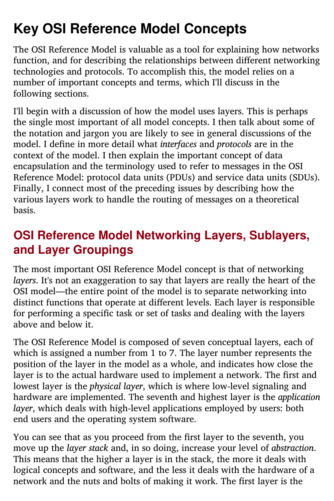
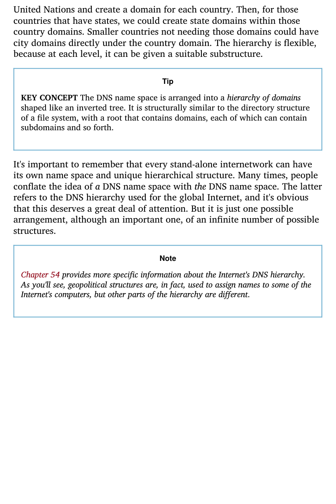
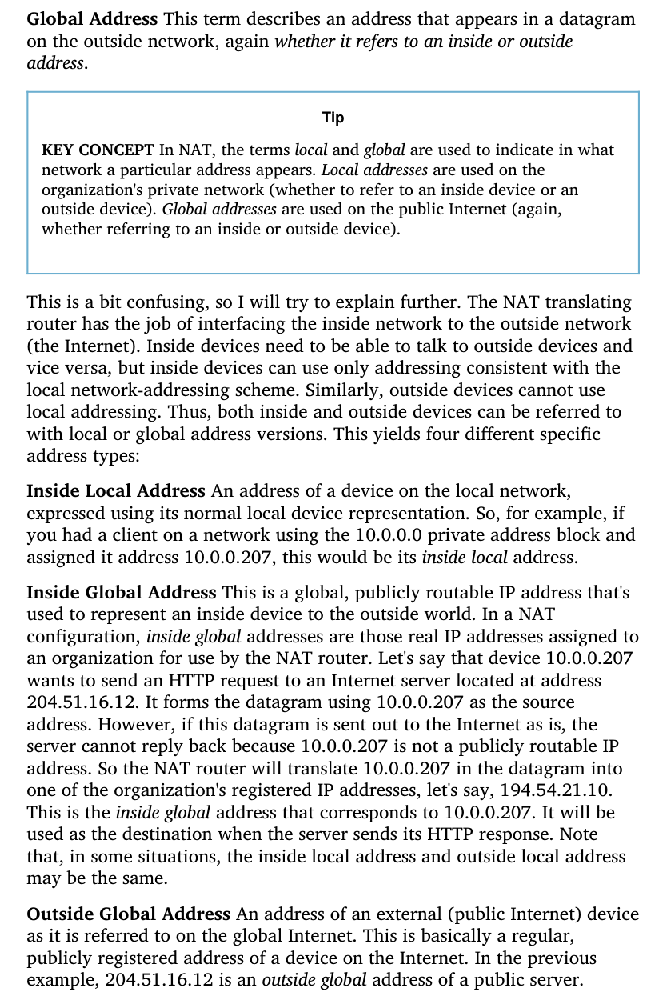

# JCAC Student Guide — Protocol Analysis

> **Realigned to JCAC Module 11 (Protocol Analysis, v2020-02) TOC.** Matches the 7-section course structure from the physical Student Guide (photos IMG_3685–IMG_3686).

**Module 11 scope:** Protocol Analysis Methodology → Common Network Traffic → Packet Analysis Software (tcpdump, Wireshark) → Ethernet Header → Network Layer Protocol Headers (ARP, IPv4, IP Fragmentation, IPv6, ICMP, ICMPv6) → Transport Layer Headers (TCP, UDP) → Application Layer Protocols (DNS, HTTP, HTTPS/TLS, VoIP, Telnet, SSH, FTP, TFTP, SMTP, POP3, IMAP).

**Posture:** Wire-level packet analysis — byte layouts, Wireshark/tcpdump display filters, filtering tricks for each protocol, and the characteristic fingerprint of normal vs. abnormal traffic. Pairs with `JCAC-NETWORKING.md` (conceptual protocol reference) — this guide goes deeper on what a packet looks like on capture.

---

## 1. Protocol Analysis Methodology

Protocol analysis is the discipline of inspecting captured packets to understand what applications are doing on a network — for troubleshooting, performance tuning, security monitoring, incident response, or reverse engineering.

### Packet analysis methodology

The repeatable workflow:

1. **Define the question.** "Why is this app slow?" "Is this host beaconing?" "What protocol is on :5555?" Without a question, every capture looks like noise.
2. **Scope the capture.** Right host, right interface, right BPF filter, right duration. A 10-GB capture with no filter is a debugging anti-pattern.
3. **Capture.** tcpdump / dumpcap / Wireshark / SPAN port / TAP. Timestamp and checksum-verify.
4. **Triage at protocol-hierarchy level.** What's in this capture by volume? Any obvious anomalies (unknown protocol, unusual port, repeated errors)?
5. **Narrow with display filters.** Focus on one conversation, one protocol, one anomaly.
6. **Read the bytes.** Wireshark's dissector + raw hex. Know the header layout; don't trust the dissector blindly.
7. **Correlate.** Timeline against logs, host events, other captures. Packet truth ≠ application truth (e.g., timestamps, clock skew, intermediary rewrites).
8. **Conclude.** Answer the original question with evidence (packet numbers, timestamps, byte values).

### Top-to-bottom network monitoring


*Kozierok — each protocol layer wraps the one above with its own header. A capture dissector unwraps these in reverse: Ethernet → IP → TCP/UDP → application payload.*

Look at a capture across layers in order:

| Layer | What you check |
|---|---|
| **Physical** | Link speeds, errors, FCS failures, link flaps |
| **Data Link** | Frame size distribution, VLAN tags, broadcast/multicast ratio, MAC churn |
| **Network** | IP pairs (top talkers), TTL anomalies, fragmentation, ICMP types |
| **Transport** | TCP retransmits, resets, zero-windows, out-of-order; UDP burstiness |
| **Session** | TLS handshakes, Kerberos tickets, RPC calls |
| **Application** | HTTP status codes, DNS query mix, SMB share access, RDP version |

"Top-to-bottom" in JCAC TOC phrasing = starting from app layer and walking down to L2; alternately "bottom-up" walks from L1 upward. Do whichever fits the question — in practice most analysts start at the layer the question lives at and expand outward.

### Detailed packet analysis

Going byte-level:

- Use the **hex pane + packet-detail pane + packet-bytes pane** together (Wireshark has all three).
- **Select a dissector field → see it highlighted in hex.** This is how you learn the protocol bit by bit.
- **Follow Stream** re-assembles TCP or UDP content into a single conversational view.
- **Export Objects** pulls HTTP, FTP, SMB files out of captures.
- **Statistics → Protocol Hierarchy** gives the byte/packet distribution at a glance.
- **Statistics → Conversations / Endpoints** ranks by IP pair / host.
- **Expert Information** summarizes warnings, errors, malformed packets.

### Capture discipline

- Capture with **sufficient privilege** (root/admin; libpcap/NPF needs raw socket access).
- **Capture filter (BPF)** — apply at capture time; reduces disk I/O, can't be undone.
- **Display filter (Wireshark)** — apply after capture; non-destructive, reversible.
- **Ring buffers** — for long-running captures use `tcpdump -C 500 -W 10 -w capture.pcap` to rotate among 10 × 500 MB files.
- **PCAPNG** format (default modern) preserves per-packet interface info and comments. PCAP (classic) still everywhere for compatibility.

---

## 2. Common Network Traffic

What you see in a "normal" capture of an enterprise endpoint, and what's worth paying attention to.

### On boot / logon (Windows domain host)

- DHCP (UDP 67/68) — DORA exchange for IP lease.
- ARP for default gateway.
- DNS (UDP 53) — lookups for domain controller records (`_ldap._tcp.dc._msdcs.<domain>`, SRV queries).
- NTP (UDP 123) — time sync.
- Kerberos AS-REQ / AS-REP (TCP/UDP 88) — user logon ticket.
- LDAP (TCP 389) — AD queries.
- SMB (TCP 445) — SYSVOL, NETLOGON for GPO.
- RPC/DCOM (TCP 135 + ephemeral) — WMI, service control.
- Certificate revocation (HTTP 80, 443 + OCSP).

### On idle (Windows workstation)

- Periodic AD keepalives (LDAP, Kerberos renewals every ~10 hours).
- SMB heartbeats to file shares.
- Telemetry to Microsoft (HTTPS 443).
- Software updates (HTTPS 443 to CDN).
- Browser background — prefetch, telemetry.
- Mouse/keyboard don't generate packets (OS-local).

### On idle (Linux server)

- SSH keepalive if connected.
- Outbound updates (apt/dnf — HTTPS).
- NTP sync.
- Monitoring agent pushes (Zabbix, Datadog, Prometheus scrape).
- Mail / syslog to central collector.

### User-driven

- Web browsing — DNS → TCP 443 → TLS handshake → HTTP/2 or HTTP/3.
- Email — IMAP/POP3 poll on schedule.
- Chat/Teams/Zoom — SIP/RTP or proprietary TCP 443 with STUN/TURN.
- File share access — SMB2/3 with signing.

### Anomalous patterns (learn to recognize)

| Pattern | What it suggests |
|---|---|
| **Large outbound DNS TXT records, periodic** | DNS tunneling / exfil |
| **Periodic beacons to unusual IP at fixed interval** | C2 callback |
| **SMB with unusual user agent / tools strings** | Credential-harvesting scanner |
| **Failed Kerberos (event 4768 + auth log)** | Password spray / Kerberoast |
| **Unknown protocol on high port with predictable length** | Custom malware protocol |
| **HTTP with domain generation algorithm (DGA)** | Bot communication |
| **Internal host scanning internal ranges** | Recon / lateral movement |
| **TLS SNI to domain unrelated to destination IP** | Domain fronting |
| **ICMP with large payloads, short interval** | ICMP tunnel |
| **Multi-megabyte single-direction flow to external cloud** | Data exfiltration |

### Baseline-first analytics

Normal for one network is anomalous for another. Baseline means: what does this subnet normally look like at this hour of this day? SIEM + NetFlow / IPFIX / Zeek logs give you the long-term context; PCAP gives you the byte-level detail when something stands out.

---

## 3. Packet Analysis Software

### tcpdump — the canonical CLI

```bash
# Capture to stdout
tcpdump -i eth0

# Capture to file
tcpdump -i eth0 -w capture.pcap

# Read from file
tcpdump -r capture.pcap

# Common flags
tcpdump -i eth0 \
    -n              # no DNS resolution (fast)
    -nn             # also no port-name resolution
    -v / -vv / -vvv # verbosity
    -s 0            # full packet (modern tcpdump defaults to 262144)
    -c 100          # capture 100 packets and stop
    -C 100          # rotate every 100 MB
    -W 10           # keep 10 files max
    -G 3600         # rotate every 3600 s
    -e              # show link-layer (MAC) addresses
    -X              # hex + ASCII dump
    -A              # ASCII only (for text protocols)
    -q              # quiet (single-line summary)
    -tttt           # human-readable absolute timestamps
```

### tcpdump BPF capture filters

Primitives:

```
host <ip>                    src or dst = ip
src host <ip>
dst host <ip>
net <cidr>                   src or dst in cidr
port <n>
src port <n>
dst port <n>
portrange <lo>-<hi>
proto <icmp|tcp|udp|ipv6>
ether src|dst <mac>
vlan <id>
```

Combinators: `and`, `or`, `not`. Parens for grouping.

```bash
tcpdump -i eth0 'host 10.0.0.5 and port 443'
tcpdump -i eth0 'tcp port 22 and not src host 10.0.0.10'
tcpdump -i eth0 '(src net 10.0.0.0/24 and dst port 80) or icmp'
tcpdump -i eth0 'tcp[tcpflags] & (tcp-syn|tcp-fin) != 0'
```

### Wireshark — GUI

Three main panes:

- **Packet List** — top: one row per packet, columns customizable (No., Time, Source, Destination, Protocol, Length, Info).
- **Packet Details** — middle: dissected fields of the selected packet, expandable by layer.
- **Packet Bytes** — bottom: raw hex + ASCII.

Other windows worth knowing:

- **Statistics → Protocol Hierarchy** — what's in the capture by % of bytes/packets.
- **Statistics → Conversations** — host-pair tables with durations and byte counts.
- **Statistics → Endpoints** — top-talker ranking.
- **Statistics → I/O Graphs** — throughput over time; overlay filters.
- **Statistics → Flow Graph** — sequence diagram of selected packets.
- **Statistics → Expert Information** — warnings, errors, notes from dissectors.
- **Analyze → Follow → TCP/UDP/TLS/HTTP Stream** — reassemble a conversation.
- **Analyze → Decode As** — force a protocol for a non-standard port.
- **File → Export Objects** — extract HTTP, SMB, FTP files.

### Display filters (Wireshark syntax)

Different from capture filters! More expressive.

Comparison operators:

| Operator | Meaning |
|---|---|
| `==` or `eq` | equal |
| `!=` or `ne` | not equal |
| `<` `>` `<=` `>=` | numeric |
| `contains` | substring |
| `matches` | regex (PCRE) |
| `in {…}` | membership |

Boolean:

| Operator | Meaning |
|---|---|
| `and` | AND |
| `or` | OR |
| `not` or `!` | NOT |

### Common display filters

```
# By host
ip.addr == 10.0.0.5
ip.src == 10.0.0.5
ip.dst == 10.0.0.5

# By subnet
ip.addr == 10.0.0.0/24

# By port
tcp.port == 443
udp.port == 53
tcp.srcport == 22
tcp.dstport == 80

# By protocol
http
https                       # historical; use tls now
tls
dns
smb2
ssh
icmp
arp

# Combined
tcp.port == 443 and ip.src == 10.0.0.5
http and !(ip.dst == 10.0.0.0/24)

# TCP flags
tcp.flags.syn == 1 and tcp.flags.ack == 0    # SYN-only (initiator)
tcp.flags.syn == 1 and tcp.flags.ack == 1    # SYN-ACK (server response)
tcp.flags.reset == 1
tcp.flags.fin == 1

# Errors and anomalies
tcp.analysis.retransmission
tcp.analysis.duplicate_ack
tcp.analysis.zero_window
tcp.analysis.lost_segment

# HTTP specifics
http.request.method == "POST"
http.response.code == 404
http.host contains "example"
http.user_agent contains "curl"

# DNS
dns.qry.name contains "evil.com"
dns.flags.response == 0               # queries only
dns.flags.rcode == 3                  # NXDOMAIN

# TLS (Server Name Indication)
tls.handshake.extensions_server_name contains "example.com"
tls.handshake.type == 1               # ClientHello

# Packet size
frame.len > 1500
frame.len < 100

# Payload hex/regex
frame matches "(?i)password"
tcp contains "GET /admin"
```

### Filter by traffic stream / conversation

- **Right-click a packet → Follow → TCP Stream** — Wireshark computes a `tcp.stream eq N` filter and opens a reassembled view.
- Same for UDP, TLS, HTTP, HTTP/2, QUIC.
- `tcp.stream` and `udp.stream` are auto-assigned integers per conversation.

### Coloring rules

Wireshark colors rows by protocol / anomaly. Customize: View → Coloring Rules. Classic: red for resets/retransmits, yellow for HTTP errors, green for DNS, etc.

---

## 4. Ethernet Header

Ethernet II (DIX) is the dominant framing. Minimum frame 64 bytes (post-preamble); maximum 1518 bytes (1522 with 802.1Q tag); jumbo up to 9000 in data centers.

### Frame layout

```
 0                   1                   2                   3
 0 1 2 3 4 5 6 7 8 9 0 1 2 3 4 5 6 7 8 9 0 1 2 3 4 5 6 7 8 9 0 1
+-+-+-+-+-+-+-+-+-+-+-+-+-+-+-+-+-+-+-+-+-+-+-+-+-+-+-+-+-+-+-+-+
|                    Destination MAC                            |
+                         ---                                   +
|                                                               |
+-+-+-+-+-+-+-+-+-+-+-+-+-+-+-+-+-+-+-+-+-+-+-+-+-+-+-+-+-+-+-+-+
|                      Source MAC                               |
+                         ---                                   +
|                                                               |
+-+-+-+-+-+-+-+-+-+-+-+-+-+-+-+-+-+-+-+-+-+-+-+-+-+-+-+-+-+-+-+-+
|   EtherType/Length     |       Payload (46-1500 bytes)        |
+-+-+-+-+-+-+-+-+-+-+-+-+-+-+-+-+-+-+-+-+-+-+-+-+-+-+-+-+-+-+-+-+
|                      ...                                      |
+-+-+-+-+-+-+-+-+-+-+-+-+-+-+-+-+-+-+-+-+-+-+-+-+-+-+-+-+-+-+-+-+
|                Frame Check Sequence (4 bytes)                 |
+-+-+-+-+-+-+-+-+-+-+-+-+-+-+-+-+-+-+-+-+-+-+-+-+-+-+-+-+-+-+-+-+
```

Preamble (7 bytes 0x55) + SFD (1 byte 0xD5) are sent by PHY and usually **not in captures** (handled below the capture layer).

### EtherType values

| Value | Protocol |
|---|---|
| `0x0800` | IPv4 |
| `0x0806` | ARP |
| `0x86DD` | IPv6 |
| `0x8100` | 802.1Q VLAN tag |
| `0x8847` / `0x8848` | MPLS unicast / multicast |
| `0x888E` | 802.1X EAPOL |
| `0x88CC` | LLDP |

When the field is ≤ 1500, it's the IEEE 802.3 Length; when > 1535, it's an EtherType. This disambiguation is historical cruft from 802.3 vs DIX.

### 802.1Q VLAN tag

Inserted between source MAC and EtherType — 4 bytes:

```
+-----+---+----------+
|TPID | PCP|DEI|VLAN |
|0x8100| 3 | 1 | 12  |
+-----+---+----------+
```

- **TPID** `0x8100`.
- **PCP** — 3-bit IEEE 802.1p priority (0–7).
- **DEI** — Drop Eligible.
- **VLAN ID** — 12 bits, 1–4094.

Double-tagging (Q-in-Q, `0x88A8`) wraps another VLAN tag around — attack vector for VLAN hopping.

### Wireshark display filters for Ethernet

```
eth.addr == aa:bb:cc:dd:ee:ff       # src or dst
eth.src == aa:bb:cc:dd:ee:ff
eth.dst == ff:ff:ff:ff:ff:ff        # broadcast
eth.type == 0x0800                  # IPv4 frames
vlan.id == 10
vlan                                  # any tagged frame
eth.ig == 1                          # multicast bit (I/G)
eth.lg == 1                          # locally-administered bit
```

### Ethernet-level exploitation

| Attack | Mechanism |
|---|---|
| **MAC flooding** | Exhaust switch CAM table → switch fails open (floods) → attacker eavesdrops |
| **ARP spoofing** | Broadcast false IP→MAC binding (L3 above Ethernet, but drives MAC-level redirection) |
| **VLAN hopping (double tag)** | Craft frame with two 802.1Q tags; first stripped at trunk → delivers to second VLAN |
| **VLAN hopping (switch spoof)** | Negotiate DTP trunking with access-port switch → send any-VLAN |
| **STP root hijack** | Advertise a lower bridge priority → become root bridge → redirect traffic |
| **LLDP/CDP spoof** | Manipulate neighbor discovery to cause misrouting or reveal topology |
| **Rogue DHCP** | Respond to DHCP before real server → give victim attacker-controlled default gateway |

Defender controls: Dynamic ARP Inspection (DAI), DHCP snooping, Port Security, BPDU Guard, Root Guard, Loop Guard, 802.1X, no DTP on edge ports, explicit native VLAN, private VLANs for isolation (see `JCAC-NETWORKING.md` §34).

---

## 5. Network Layer Protocol Headers

### ARP — Address Resolution Protocol

EtherType `0x0806`. 28 bytes inside Ethernet frame:

| Field | Bytes |
|---|---|
| Hardware type | 2 (`0x0001` Ethernet) |
| Protocol type | 2 (`0x0800` IPv4) |
| HW addr len | 1 (6) |
| Proto addr len | 1 (4) |
| Operation | 2 (1=Request, 2=Reply) |
| Sender MAC | 6 |
| Sender IP | 4 |
| Target MAC | 6 (zeros in Request) |
| Target IP | 4 |

**Filtering ARP:**

```
arp                                    # all ARP
arp.opcode == 1                        # requests
arp.opcode == 2                        # replies
arp.src.proto_ipv4 == 10.0.0.5         # sender IP
arp.dst.proto_ipv4 == 10.0.0.10
arp.src.hw_mac == aa:bb:cc:dd:ee:ff
arp.duplicate-address-frame           # Wireshark duplicate-ARP detection
```

**ARP exploitation:**

- **Gratuitous ARP abuse** — unsolicited replies flood victim caches with attacker's MAC.
- **ARP spoofing MITM** — tell victim "gateway MAC is my MAC"; tell gateway "victim MAC is my MAC" → you see all traffic.
- **MAC flood + ARP poison** combo — defeat most small-network defenses.
- Tool indicators: `arpspoof`, `ettercap` — ettercap signatures in packet timing/sequence.

### IPv4 header

Fixed 20 bytes (plus optional options up to 40):

```
 0                   1                   2                   3
 0 1 2 3 4 5 6 7 8 9 0 1 2 3 4 5 6 7 8 9 0 1 2 3 4 5 6 7 8 9 0 1
+-+-+-+-+-+-+-+-+-+-+-+-+-+-+-+-+-+-+-+-+-+-+-+-+-+-+-+-+-+-+-+-+
|Version|  IHL  |Type of Service|          Total Length         |
+-+-+-+-+-+-+-+-+-+-+-+-+-+-+-+-+-+-+-+-+-+-+-+-+-+-+-+-+-+-+-+-+
|         Identification        |Flags|      Fragment Offset    |
+-+-+-+-+-+-+-+-+-+-+-+-+-+-+-+-+-+-+-+-+-+-+-+-+-+-+-+-+-+-+-+-+
|  Time to Live |    Protocol   |         Header Checksum       |
+-+-+-+-+-+-+-+-+-+-+-+-+-+-+-+-+-+-+-+-+-+-+-+-+-+-+-+-+-+-+-+-+
|                       Source Address                          |
+-+-+-+-+-+-+-+-+-+-+-+-+-+-+-+-+-+-+-+-+-+-+-+-+-+-+-+-+-+-+-+-+
|                    Destination Address                        |
+-+-+-+-+-+-+-+-+-+-+-+-+-+-+-+-+-+-+-+-+-+-+-+-+-+-+-+-+-+-+-+-+
|                    Options                    |    Padding    |
+-+-+-+-+-+-+-+-+-+-+-+-+-+-+-+-+-+-+-+-+-+-+-+-+-+-+-+-+-+-+-+-+
```

Fields to know:

- **Version** — 4 for IPv4.
- **IHL** — header length in 32-bit words (min 5 = 20 bytes).
- **ToS / DSCP + ECN** — QoS and explicit congestion notification.
- **Total Length** — entire datagram (header + payload).
- **Identification** — per-packet ID used for fragment reassembly.
- **Flags** — 3 bits: Reserved(0), **DF** Don't Fragment, **MF** More Fragments.
- **Fragment Offset** — in 8-byte units.
- **TTL** — decremented each hop; 0 → ICMP Time Exceeded.
- **Protocol** — upper-layer identifier:

| Number | Protocol |
|---|---|
| 1 | ICMP |
| 2 | IGMP |
| 6 | TCP |
| 17 | UDP |
| 41 | IPv6 encapsulation (6in4) |
| 47 | GRE |
| 50 | ESP (IPsec) |
| 51 | AH (IPsec) |
| 58 | ICMPv6 |
| 89 | OSPF |

- **Header Checksum** — over header only (recomputed each hop as TTL changes).
- **Source / Destination** — 32-bit IPv4 addresses.

**Filtering IPv4:**

```
ip.addr == 10.0.0.5
ip.src == 10.0.0.5
ip.dst == 10.0.0.5
ip.proto == 6                          # TCP
ip.ttl < 10                            # low TTL (traceroute / expiring)
ip.len > 1500                          # jumbograms (shouldn't exist on standard Ethernet)
ip.flags.df == 1
ip.flags.mf == 1
ip.frag_offset > 0                     # fragment (not first)
```

### IP Datagram Fragmentation

When a router encounters a packet larger than the next-hop MTU **and** DF=0:

1. Split payload into fragments whose size + 20 B fits the MTU.
2. Copy Identification field to every fragment.
3. Set MF=1 on all except the last; MF=0 on final.
4. Fragment Offset indicates position (in 8-byte units) within the original payload.
5. Receiver reassembles by matching Identification + source + destination + protocol.

If DF=1: router drops, sends ICMP Type 3 Code 4 "Fragmentation needed and DF set" including the MTU. This is **Path MTU Discovery**.

**Attacks relying on fragmentation:**

- **Tiny fragments** — make L4 header span fragment boundary, evade IDS that only inspects the first fragment.
- **Overlapping fragments** — different OSes resolve overlaps differently; attacker exploits dissenter behavior vs. IDS.
- **Teardrop (historical)** — crafted overlapping fragments crashed old Windows 95 / 98 stacks.
- **Nesting / fragment flood** — DoS via unfinishable reassembly buffers.

**Wireshark view:** `ip.fragment` pseudo-field; reassembled packet shows up once after all fragments arrive.

### IPv6 header (40 B fixed)

```
 0                   1                   2                   3
 0 1 2 3 4 5 6 7 8 9 0 1 2 3 4 5 6 7 8 9 0 1 2 3 4 5 6 7 8 9 0 1
+-+-+-+-+-+-+-+-+-+-+-+-+-+-+-+-+-+-+-+-+-+-+-+-+-+-+-+-+-+-+-+-+
|Version| Traffic Class |           Flow Label                  |
+-+-+-+-+-+-+-+-+-+-+-+-+-+-+-+-+-+-+-+-+-+-+-+-+-+-+-+-+-+-+-+-+
|         Payload Length        |  Next Header  |   Hop Limit   |
+-+-+-+-+-+-+-+-+-+-+-+-+-+-+-+-+-+-+-+-+-+-+-+-+-+-+-+-+-+-+-+-+
|                        Source Address (128 bits)              |
+                                                               +
|                                                               |
+-+-+-+-+-+-+-+-+-+-+-+-+-+-+-+-+-+-+-+-+-+-+-+-+-+-+-+-+-+-+-+-+
|                     Destination Address (128 bits)            |
+                                                               +
|                                                               |
+-+-+-+-+-+-+-+-+-+-+-+-+-+-+-+-+-+-+-+-+-+-+-+-+-+-+-+-+-+-+-+-+
```

- **Version** = 6.
- **Traffic Class** — DSCP+ECN (analog of v4 ToS).
- **Flow Label** — per-flow tag for QoS.
- **Payload Length** — bytes after fixed header.
- **Next Header** — like v4 Protocol, but can chain extension headers.
- **Hop Limit** — TTL analog.
- No checksum (relies on L2 + L4).
- No fragmentation in the fixed header — uses Fragment extension header.

### IPv6 extension headers

Chain via **Next Header**:

| Value | Header |
|---|---|
| 0 | Hop-by-Hop Options |
| 43 | Routing |
| 44 | Fragment |
| 50 | ESP |
| 51 | AH |
| 60 | Destination Options |
| 58 | ICMPv6 (terminates chain) |
| 59 | No next header |

### IPv6 fragmentation

- Only **source** fragments (routers don't).
- Fragment extension header carries Identification + Offset + M bit.
- Reassembled using source + destination + Fragment ID.
- Payload limit: 65,535 bytes (same as v4 Total Length constraint, though jumbogram option exists).

**Filtering the IPv6 header:**

```
ipv6
ipv6.addr == 2001:db8::1
ipv6.src == 2001:db8::1
ipv6.dst == ff02::1                   # all-nodes link-local multicast
ipv6.nxt == 6                         # TCP over IPv6
ipv6.hlim < 10
ipv6.fragment
```

### ICMP (IPv4)

Protocol 1. 8-byte minimum header + variable payload:

```
+-------+-------+---------------+
| Type  | Code  |   Checksum    |
+-------+-------+---------------+
|         Rest of Header        |
+-------------------------------+
```

Types you must know:

| Type | Name | Common codes |
|---|---|---|
| **0** | Echo Reply | — |
| **3** | Destination Unreachable | 0 Net, 1 Host, 3 Port, 4 Frag Needed + DF |
| **5** | Redirect | 0 Net, 1 Host |
| **8** | Echo Request | — |
| **11** | Time Exceeded | 0 TTL expired in transit, 1 frag reassembly |
| **12** | Parameter Problem | — |
| **13 / 14** | Timestamp Request / Reply | — |
| **17 / 18** | Address Mask Request / Reply | — (deprecated) |

**Filtering ICMP:**

```
icmp
icmp.type == 8                         # echo request
icmp.type == 0                         # echo reply
icmp.type == 3 and icmp.code == 4      # frag needed + DF
icmp.type == 11                        # TTL exceeded (traceroute)
```

**ICMP exploitation:**

- **Ping sweep** — enumeration.
- **Smurf** — spoofed echo to directed broadcast.
- **ICMP tunneling (ping tunnel)** — C2 / exfil in Echo payload.
- **ICMP redirect poisoning** — attacker sends Type 5 to force traffic through their path.
- **Destination Unreachable floods** — unused but high-frequency → bandwidth DoS.
- Defender: drop inbound Type 5; rate-limit ICMP; inspect echo-payload content for tunneling signatures.

### ICMPv6

Protocol 58. Expanded role vs IPv4 ICMP — includes NDP (ARP replacement), MLD (multicast), Router Advertisement / Solicitation.

Key types:

| Type | Name |
|---|---|
| 1 | Destination Unreachable |
| 2 | Packet Too Big (PMTU) |
| 3 | Time Exceeded |
| 4 | Parameter Problem |
| 128 | Echo Request |
| 129 | Echo Reply |
| 133 | Router Solicitation |
| 134 | Router Advertisement |
| 135 | Neighbor Solicitation (ARP equivalent) |
| 136 | Neighbor Advertisement |
| 137 | Redirect |
| 143 | MLDv2 Report |

**Filtering ICMPv6:**

```
icmpv6
icmpv6.type == 128                     # echo request
icmpv6.type == 135                     # NS
icmpv6.type == 136                     # NA
icmpv6.type == 134                     # RA
```

**ICMPv6 attack surface:**

- **Rogue Router Advertisement** — attacker sends RA advertising themselves as default router → MITM.
- **NDP spoofing** — IPv6's ARP spoofing equivalent.
- **RA flood** — storm of RAs exhausts host resources.
- Defenders: **RA Guard** (switch feature), **SEND (Secure Neighbor Discovery)**, first-hop security features in switches.

---

## 6. Transport Layer Protocol Headers

### TCP — Transmission Control Protocol

Protocol 6. 20-byte minimum header (plus options up to 40 more):

```
 0                   1                   2                   3
 0 1 2 3 4 5 6 7 8 9 0 1 2 3 4 5 6 7 8 9 0 1 2 3 4 5 6 7 8 9 0 1
+-+-+-+-+-+-+-+-+-+-+-+-+-+-+-+-+-+-+-+-+-+-+-+-+-+-+-+-+-+-+-+-+
|          Source Port          |       Destination Port        |
+-+-+-+-+-+-+-+-+-+-+-+-+-+-+-+-+-+-+-+-+-+-+-+-+-+-+-+-+-+-+-+-+
|                        Sequence Number                        |
+-+-+-+-+-+-+-+-+-+-+-+-+-+-+-+-+-+-+-+-+-+-+-+-+-+-+-+-+-+-+-+-+
|                     Acknowledgment Number                     |
+-+-+-+-+-+-+-+-+-+-+-+-+-+-+-+-+-+-+-+-+-+-+-+-+-+-+-+-+-+-+-+-+
|DataOff|  Rsv  |C|E|U|A|P|R|S|F|            Window             |
|       |       |W|C|R|C|S|S|Y|I|                               |
|       |       |R|E|G|K|H|T|N|N|                               |
+-+-+-+-+-+-+-+-+-+-+-+-+-+-+-+-+-+-+-+-+-+-+-+-+-+-+-+-+-+-+-+-+
|           Checksum            |         Urgent Pointer        |
+-+-+-+-+-+-+-+-+-+-+-+-+-+-+-+-+-+-+-+-+-+-+-+-+-+-+-+-+-+-+-+-+
|                    Options                    |    Padding    |
+-+-+-+-+-+-+-+-+-+-+-+-+-+-+-+-+-+-+-+-+-+-+-+-+-+-+-+-+-+-+-+-+
```

Flags (memorize the letters, in header order):

| Flag | Meaning |
|---|---|
| **CWR** | Congestion Window Reduced (ECN) |
| **ECE** | ECN Echo |
| **URG** | Urgent pointer valid |
| **ACK** | Ack number valid |
| **PSH** | Push buffered data to app |
| **RST** | Reset connection |
| **SYN** | Synchronize seq numbers (start) |
| **FIN** | Finish (graceful close) |

### How TCP works — the handshake

```
Client ─── SYN (seq=X, ack=0)                    ────► Server
Client ◄── SYN-ACK (seq=Y, ack=X+1)              ───── Server
Client ─── ACK (seq=X+1, ack=Y+1)                ────► Server
       ... data flow ...
Client ─── FIN (seq=X+k)                         ────► Server
Client ◄── ACK (ack=X+k+1)                       ───── Server
Client ◄── FIN (seq=Y+m)                         ───── Server
Client ─── ACK (ack=Y+m+1)                       ────► Server
```

Alternatively, **RST** closes abruptly without four-way FIN.

### TCP options (negotiated at handshake)

| Kind | Name | Notes |
|---|---|---|
| 0 | End of Option List | |
| 1 | No-Op | |
| 2 | MSS | Max Segment Size — negotiated max payload |
| 3 | Window Scale | Shift count, scales the Window field by 2^n |
| 4 | SACK Permitted | Enable Selective Acknowledgments |
| 5 | SACK | Carries SACK blocks |
| 8 | Timestamps | RTT measurement + PAWS anti-replay |

### Filtering TCP

```
tcp
tcp.port == 443
tcp.srcport == 22
tcp.stream eq 3                         # entire conversation
tcp.flags.syn == 1 and tcp.flags.ack == 0
tcp.flags.reset == 1
tcp.analysis.retransmission
tcp.analysis.duplicate_ack
tcp.analysis.zero_window
tcp.analysis.lost_segment
tcp.seq == 123456
tcp.len > 0                            # payload-bearing segments
tcp.options.mss_val >= 1460
```

### TCP exploitation

- **SYN flood** — send many SYNs without completing, exhaust listener's half-open queue.
- **TCP reset injection** — spoof a RST mid-conversation (e.g., GFW-style censorship).
- **Sequence prediction** — old OSes with weak ISNs could be hijacked.
- **ACK flood** — overwhelm stateful firewall state tables.
- **Session hijacking** — after ARP MITM, craft packets into a cleartext TCP stream.
- **Slowloris** — hold many TCP connections open with partial HTTP requests — application-layer DoS.

### UDP — User Datagram Protocol

Protocol 17. 8-byte header:

```
 0                   1                   2                   3
 0 1 2 3 4 5 6 7 8 9 0 1 2 3 4 5 6 7 8 9 0 1 2 3 4 5 6 7 8 9 0 1
+-------------------------------+-------------------------------+
|          Source Port          |       Destination Port        |
+-------------------------------+-------------------------------+
|             Length            |            Checksum           |
+-------------------------------+-------------------------------+
```

No handshake, no retransmit, no ordering. Uses: DNS, DHCP, SNMP, NTP, TFTP, RTP, QUIC-transport, syslog, most streaming.

### Filtering UDP

```
udp
udp.port == 53
udp.length > 512                        # oversized DNS → inspect
```

### UDP exploitation

- **Amplification DoS** — small spoofed request → huge response (DNS, NTP monlist, memcached, chargen).
- **UDP scan** — slow and noisy; response = open, ICMP Port Unreachable = closed.
- **DNS cache poisoning** — spoof UDP 53 responses (Kaminsky).
- **SSDP / UPnP abuse** — discover and reconfigure local devices.

### Well-known TCP/UDP ports to memorize

| Port | Proto | Service |
|---|---|---|
| 20 / 21 | TCP | FTP (data / control) |
| 22 | TCP | SSH |
| 23 | TCP | Telnet |
| 25 | TCP | SMTP |
| 53 | UDP/TCP | DNS |
| 67 / 68 | UDP | DHCP server / client |
| 69 | UDP | TFTP |
| 80 | TCP | HTTP |
| 88 | TCP/UDP | Kerberos |
| 110 | TCP | POP3 |
| 123 | UDP | NTP |
| 135 | TCP | MSRPC endpoint mapper |
| 137 / 138 | UDP | NetBIOS name / datagram |
| 139 | TCP | NetBIOS session |
| 143 | TCP | IMAP |
| 161 / 162 | UDP | SNMP / SNMP trap |
| 389 | TCP/UDP | LDAP |
| 443 | TCP | HTTPS |
| 445 | TCP | SMB |
| 465 / 587 | TCP | SMTPS / Submission |
| 514 | UDP | Syslog |
| 636 | TCP | LDAPS |
| 993 | TCP | IMAPS |
| 995 | TCP | POP3S |
| 3389 | TCP | RDP |

---

## 7. Application Layer Protocols

### DNS — Domain Name System

UDP/53 for normal queries; TCP/53 for responses > 512 bytes or zone transfers.

**Message format:**

```
+---------------------+
|       Header        | 12 bytes
+---------------------+
|     Question        |
+---------------------+
|     Answer          |  zero or more
+---------------------+
|     Authority       |  zero or more
+---------------------+
|     Additional      |  zero or more
+---------------------+
```

**Header:**

```
 0                   1
 0 1 2 3 4 5 6 7 8 9 0 1 2 3 4 5
+-------------------------------+
|         Transaction ID        |
+-------------------------------+
|QR|  Opcode  |AA|TC|RD|RA|Z|AD|CD|  RCODE  |
+-------------------------------+
|         Question Count        |
+-------------------------------+
|         Answer Count          |
+-------------------------------+
|       Authority Count         |
+-------------------------------+
|      Additional Count         |
+-------------------------------+
```

- **QR** — 0 = query, 1 = response.
- **Opcode** — 0 standard, 1 inverse (obsolete), 2 status, 4 notify, 5 update.
- **AA** — authoritative answer.
- **TC** — truncated (switch to TCP).
- **RD** — recursion desired.
- **RA** — recursion available.
- **RCODE** — 0 NOERROR, 1 FormErr, 2 ServFail, 3 NXDOMAIN, 4 NotImp, 5 Refused.

**Resource record types:** A, AAAA, CNAME, NS, SOA, MX, PTR, TXT, SRV, CAA, DNSKEY, DS, RRSIG, NSEC/NSEC3.


*Kozierok — root → TLD → second-level → subdomain. When dissecting DNS traffic, know which level of the hierarchy each query hits to spot DGA-style fan-out or anomalous TLDs.*

### DNS query / response

```
Client ──────── query for A example.com ──────► Recursive resolver
                                                       │
                                                       ▼
                                                    roots
                                                    TLD
                                                    authoritative
                                                       │
Client ◄── response: example.com. A 93.184.216.34 ──── resolver
```

**Zone transfer (AXFR / IXFR):**

- TCP/53.
- AXFR = full zone; IXFR = incremental delta since serial.
- Only allowed from authorized secondaries (`allow-transfer` on BIND).
- Leaking AXFR on a public server = recon goldmine.

### Filtering DNS

```
dns
dns.qry.name == "example.com"
dns.qry.name contains ".onion"
dns.qry.type == 1                     # A records
dns.qry.type == 16                    # TXT
dns.flags.response == 0               # queries only
dns.flags.rcode == 3                  # NXDOMAIN
dns.count.answers == 0
```

### DNS exploitation

- **Cache poisoning / Kaminsky** — predict transaction ID, race an attacker response into resolver cache.
- **DNS tunneling** — TXT/CNAME records carry C2 or exfil payloads. Defender signals: oversized TXT, high query volume to one domain.
- **DGA (Domain Generation Algorithms)** — malware queries 1000s of pseudorandom names; most NXDOMAIN, one hits. SIEM detects NXDOMAIN spikes.
- **DNS rebinding** — TTL=0 records flip between external and internal IPs to bypass same-origin policies.
- **Subdomain takeover** — orphaned CNAME pointing at freed cloud resource.

### HTTP


*Kozierok — client GET / server response over TCP/80 or HTTPS/443. Primary Wireshark filters for triage: `http.request.method`, `http.response.code`, `http.host`, `http.user_agent`.*

TCP/80 (clear). HTTP/1.1 classic request/response:

**Request:**

```
GET /path/resource?query=val HTTP/1.1\r\n
Host: example.com\r\n
User-Agent: Mozilla/5.0 ...\r\n
Accept: text/html\r\n
\r\n
(optional body for POST/PUT)
```

**Response:**

```
HTTP/1.1 200 OK\r\n
Date: ...\r\n
Server: nginx\r\n
Content-Type: text/html; charset=utf-8\r\n
Content-Length: 1234\r\n
\r\n
<html>...</html>
```

**Methods:** GET, POST, PUT, DELETE, HEAD, OPTIONS, PATCH, CONNECT, TRACE.

**Status codes:**
- 1xx informational (100 Continue, 101 Switching Protocols).
- 2xx success (200 OK, 201 Created, 204 No Content).
- 3xx redirect (301 Moved, 302 Found, 304 Not Modified).
- 4xx client error (400 Bad Req, 401 Unauthorized, 403 Forbidden, 404 Not Found, 429 Too Many).
- 5xx server error (500 Internal, 502 Bad Gateway, 503 Unavailable, 504 Timeout).

### HTTP/2, HTTP/3

- HTTP/2 (RFC 7540) — binary framing over TCP, multiplexed streams, header compression (HPACK). Usually over TLS.
- HTTP/3 (RFC 9114) — HTTP over QUIC over UDP. Built-in encryption (QUIC includes TLS 1.3). Faster connection setup, no head-of-line blocking.

### Filtering HTTP

```
http
http.request.method == "GET"
http.request.method == "POST"
http.response.code == 404
http.host == "example.com"
http.user_agent contains "curl"
http.request.uri contains "admin"
http.content_type contains "application/json"
```

### HTTPS — TLS over TCP/443

Wireshark dissects up to the TLS layer but can't see inside unless you have the key material (TLS_KEYLOG_FILE, RSA private key for RSA-key-exchange sessions).

### TLS operations and handshake

TLS 1.2 full handshake:

```
Client ── ClientHello (versions, ciphers, extensions: SNI, ALPN, random) ──► Server
Client ◄─ ServerHello (chosen version, cipher, random) ─────────────────── Server
Client ◄─ Certificate (server cert chain) ──────────────────────────────── Server
Client ◄─ ServerKeyExchange (DHE/ECDHE params) ──────────────────────────── Server
Client ◄─ ServerHelloDone ─────────────────────────────────────────────── Server
Client ── ClientKeyExchange ────────────────────────────────────────────► Server
Client ── ChangeCipherSpec + Finished ──────────────────────────────────► Server
Client ◄─ ChangeCipherSpec + Finished ──────────────────────────────────── Server
    -- encrypted application data from here --
```

**TLS 1.3** simplifies to 1-RTT (or 0-RTT on resumption); removes static RSA kex, SHA-1, RC4, CBC stream ciphers.

### TLS security features

- **Forward secrecy** via ephemeral DHE / ECDHE — past sessions safe if long-term key leaks later.
- **AEAD ciphers** (AES-GCM, ChaCha20-Poly1305) — confidentiality + integrity together.
- **Certificate pinning** — clients check the server cert against a known pin, not just the CA chain.
- **HSTS** (`Strict-Transport-Security`) — forces HTTPS for a domain for a duration.
- **Encrypted Client Hello (ECH)** — hides SNI from on-path observers.

### Filtering TLS

```
tls
tls.handshake.type == 1               # ClientHello
tls.handshake.type == 2               # ServerHello
tls.handshake.type == 11              # Certificate
tls.handshake.extensions_server_name == "example.com"
tls.record.version == 0x0303          # TLS 1.2 (confusing — 0x0304 is TLS 1.3 but in 1.3 the outer record version stays at 0x0303 for compat)
tls.alert_message
```

### VoIP

**SIP (Session Initiation Protocol):**

- UDP/TCP 5060 (cleartext) or TCP/TLS 5061 (SIPS).
- Plaintext ASCII messages, similar to HTTP: `INVITE`, `ACK`, `BYE`, `CANCEL`, `REGISTER`, `OPTIONS`.
- Session setup; media sent separately via RTP.

**RTP (Real-time Transport Protocol):**

- UDP; even port (RTCP on the odd port+1).
- Header has sequence + timestamp + SSRC + payload type.
- Unencrypted RTP → decode-able audio in Wireshark (`Telephony → VoIP Calls`).

**SRTP** = RTP + AES-CM encryption + HMAC-SHA1 auth; TLS/DTLS for key exchange.

### Filtering VoIP

```
sip
sip.Method == "INVITE"
sip.Method == "BYE"
sip.From contains "alice"
rtp
rtp.p_type == 0                        # G.711 μ-law
```

### Telnet

TCP/23. Cleartext remote-login protocol; every keystroke visible in packet trace. Never use for real credentials; still shows up on legacy network gear for admin.

```
telnet
telnet.data contains "login"
```

### SSH — Secure Shell

TCP/22. Encrypted remote login.

**Handshake (SSHv2 simplified):**

1. TCP handshake.
2. Version exchange: both sides send `SSH-2.0-<banner>\r\n` plain-text.
3. Algorithm negotiation (KEX algorithms, host-key types, ciphers, MACs, compression).
4. Key exchange (Diffie-Hellman or ECDH); both compute session key.
5. Server sends signed host key → client verifies against `~/.ssh/known_hosts` or CA.
6. Client authentication (publickey, password, GSSAPI, keyboard-interactive).
7. Channel open: shell, exec, direct-tcpip, X11, agent-forward, etc.

### Filtering SSH

```
ssh
tcp.port == 22
ssh.protocol                           # version-exchange banner
```

The banner reveals server software version — enumeration finding.

### FTP

TCP/21 control, TCP/20 active-mode data.

**Active mode:**

```
Client ──── USER alice / PASS ... ────► Server
Client ──── PORT 10,0,0,5,20,0 ──────► Server (client tells server to connect back)
Server ──── connect to 10.0.0.5:5120 ─► Client (data connection)
```

**Passive mode:**

```
Client ──── PASV ────────────────────► Server
Server ──── 227 Entering Passive (10,0,0,10,210,100) ─► Client
Client ──── connect to 10.0.0.10:53860 ──► Server (data connection)
```

Client chooses mode; firewalls prefer PASV.

**FTP commands:** USER, PASS, LIST, RETR, STOR, DELE, PASV, PORT, QUIT, CWD, PWD, MKD, RMD, TYPE (A=ASCII, I=binary).

### Filtering FTP

```
ftp
ftp.request.command == "USER"
ftp.request.command == "PASS"
ftp.request.command == "RETR"
ftp-data                               # data channel
```

FTP sends credentials in plaintext — easy trophy on a capture.

### TFTP — Trivial File Transfer

UDP/69. No auth. Opcodes:

| Opcode | Name |
|---|---|
| 1 | Read request (RRQ) |
| 2 | Write request (WRQ) |
| 3 | Data (512 B blocks) |
| 4 | ACK |
| 5 | Error |

Typical use: boot images for network gear (PXE, Cisco config push/pull).

### Filtering TFTP

```
tftp
tftp.opcode == 1                       # RRQ
```

### SMTP — Simple Mail Transfer

TCP/25 (server-to-server), TCP/587 (submission with auth), TCP/465 (SMTPS legacy).

Commands: HELO / EHLO, MAIL FROM, RCPT TO, DATA, QUIT, STARTTLS, AUTH.

Response codes: 2xx success, 3xx intermediate, 4xx temp fail, 5xx perm fail.

### Filtering SMTP

```
smtp
smtp.req.command == "MAIL"
smtp.req.command == "RCPT"
smtp.data.fragment                     # message body
```

SMTP over clear port 25 — still common between mail servers; body can be inspected unless STARTTLS succeeded.

### POP3

TCP/110 clear, TCP/995 (POP3S with TLS).

Commands: USER, PASS, STAT, LIST, RETR, DELE, RSET, QUIT.

```
pop
pop.request.command == "USER"
```

### IMAP

TCP/143 clear, TCP/993 (IMAPS). Tagged commands:

```
A001 LOGIN alice hunter2
A002 SELECT INBOX
A003 FETCH 1 RFC822
A004 LOGOUT
```

```
imap
imap.request contains "LOGIN"
```

IMAP and POP3 in clear = credential exposure.

---

## Cross-cutting: quick reference for filter-based triage

```
# Find all DNS queries
dns

# DNS TXT (possible tunneling)
dns.qry.type == 16

# Large DNS responses
dns and dns.response == 1 and udp.length > 512

# TLS client hellos (who's talking SSL/TLS)
tls.handshake.type == 1

# Cleartext credentials
ftp.request.command == "PASS" or pop.request.command == "PASS" or imap contains "LOGIN"

# Possible ARP spoof (duplicate IP in ARP)
arp.duplicate-address-frame

# TCP anomalies
tcp.analysis.flags

# SYN without SYN-ACK (scan)
tcp.flags.syn == 1 and tcp.flags.ack == 0

# Outbound to non-RFC1918
ip.src == 10.0.0.0/8 and !(ip.dst == 10.0.0.0/8 or ip.dst == 172.16.0.0/12 or ip.dst == 192.168.0.0/16)
```

---

## Cross-cutting: capture hygiene for ops

- **Store captures on dedicated encrypted volume** — PCAPs can contain creds, tokens, cookies, PII.
- **Checksum-sign captures** (SHA-256) for chain of custody.
- **Label filenames** with host, interface, timestamp, analyst name.
- **Retention policy** — delete after review window unless case-related.
- **Never** ship a capture off-host without redaction if it spans user sessions.
- **Sanitize before sharing** — `editcap -C ranges` to strip payloads; `tcprewrite --pnat` to anonymize addresses.

---

## Exam-testable concepts (rapid-fire)

- **Tool to read/save packets headless on Linux?** `tcpdump`.
- **Tool with GUI for protocol analysis?** Wireshark.
- **File format Wireshark saves to by default?** `pcapng` (legacy `pcap` still widely supported).
- **Wireshark panes (top → bottom)?** Packet List, Packet Details, Packet Bytes.
- **Capture filter syntax?** BPF. Display filter syntax? Wireshark-specific.
- **Follow a conversation?** Right-click → Follow → TCP / UDP / TLS Stream.
- **Ethernet II EtherType for IPv4?** `0x0800`.
- **EtherType for ARP?** `0x0806`.
- **EtherType for IPv6?** `0x86DD`.
- **EtherType for 802.1Q VLAN tag?** `0x8100`.
- **ARP opcode for request?** 1. For reply? 2.
- **IPv4 Protocol field for TCP?** 6. UDP? 17. ICMP? 1.
- **IPv4 header minimum size?** 20 bytes (IHL=5).
- **IPv6 header (fixed) size?** 40 bytes.
- **Who fragments IPv6 packets?** Only the source.
- **IPv4 flag that says "don't fragment"?** DF.
- **ICMP Type for Echo Request?** 8. Echo Reply? 0.
- **ICMP Type for Time Exceeded?** 11.
- **ICMP Type for Destination Unreachable?** 3.
- **ICMPv6 Type for Neighbor Solicitation?** 135.
- **ICMPv6 Type for Router Advertisement?** 134.
- **TCP 3-way handshake?** SYN → SYN-ACK → ACK.
- **TCP flag to initiate a connection?** SYN.
- **TCP flag to abort a connection?** RST.
- **TCP header minimum size?** 20 bytes.
- **UDP header size?** 8 bytes.
- **Well-known port range?** 0–1023.
- **Ephemeral port range?** 49152–65535.
- **DNS transport default?** UDP/53.
- **DNS uses TCP when?** Response > 512 bytes or zone transfer (AXFR/IXFR).
- **DNS flag for truncated response?** TC.
- **SIP port (default, clear)?** 5060.
- **RTP transport?** UDP, even port.
- **SSH port?** 22. FTP? 21. Telnet? 23. SMTP? 25. POP3? 110. IMAP? 143. HTTPS? 443. RDP? 3389.
- **TLS handshake type 1?** ClientHello.
- **TLS extension that carries target hostname?** SNI.
- **HTTP status for Not Found?** 404. Forbidden? 403. Internal Server Error? 500.
- **Wireshark filter for SYN-only segments?** `tcp.flags.syn == 1 and tcp.flags.ack == 0`.
- **Wireshark filter for TLS ClientHello?** `tls.handshake.type == 1`.
- **Wireshark filter for DNS queries?** `dns.flags.response == 0`.
- **SNMP agent port? Trap port?** UDP/161, UDP/162.
- **Most common signs of DNS tunneling?** Oversized TXT records, high volume to one domain, long subdomain labels.

---

## Cross-references

- **[The TCP/IP Guide](../references/TCPIP%20Guide-9781593270476.pdf)** — definitive TCP/IP reference
- **[RFC 791](https://www.rfc-editor.org/rfc/rfc791)** IPv4 · **[RFC 793](https://www.rfc-editor.org/rfc/rfc793)** TCP · **[RFC 768](https://www.rfc-editor.org/rfc/rfc768)** UDP · **[RFC 792](https://www.rfc-editor.org/rfc/rfc792)** ICMP · **[RFC 826](https://www.rfc-editor.org/rfc/rfc826)** ARP
- **[RFC 8200](https://www.rfc-editor.org/rfc/rfc8200)** IPv6 · **[RFC 4443](https://www.rfc-editor.org/rfc/rfc4443)** ICMPv6 · **[RFC 4861](https://www.rfc-editor.org/rfc/rfc4861)** NDP
- **[RFC 8446](https://www.rfc-editor.org/rfc/rfc8446)** TLS 1.3 · **[RFC 9110](https://www.rfc-editor.org/rfc/rfc9110)** HTTP semantics
- **[Wireshark User's Guide](https://www.wireshark.org/docs/wsug_html_chunked/)** · **[Display Filter Reference](https://www.wireshark.org/docs/dfref/)**
- **[tcpdump man page](https://www.tcpdump.org/manpages/tcpdump.1.html)** · **[pcap-filter syntax](https://www.tcpdump.org/manpages/pcap-filter.7.html)**
- **[PacketLife.net Cheat Sheets](https://packetlife.net/library/cheat-sheets/)** — printable per-protocol references
- **JCAC-NETWORKING** — conceptual protocol reference (Modules 6 + 10)
- **JCAC-UNIX-LINUX** — libpcap tooling, iptables LOG, auditd network rules
- **JCAC-WINDOWS** — ETW, Event Tracing for Windows
- **JCAC-ACTIVE-EXPLOIT** — offensive network protocols (scan, exploit, C2)
