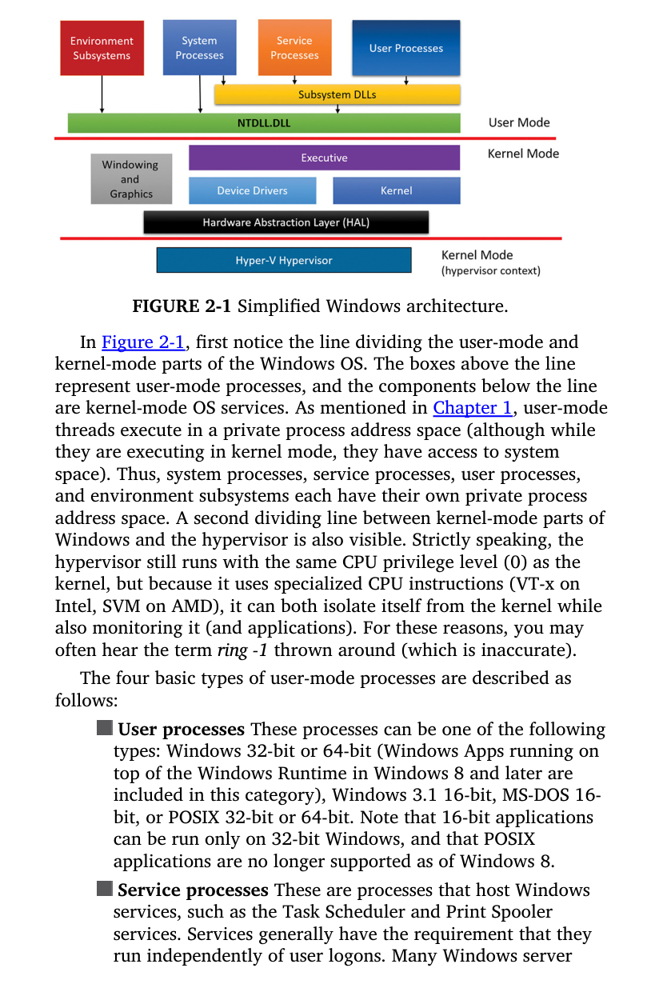
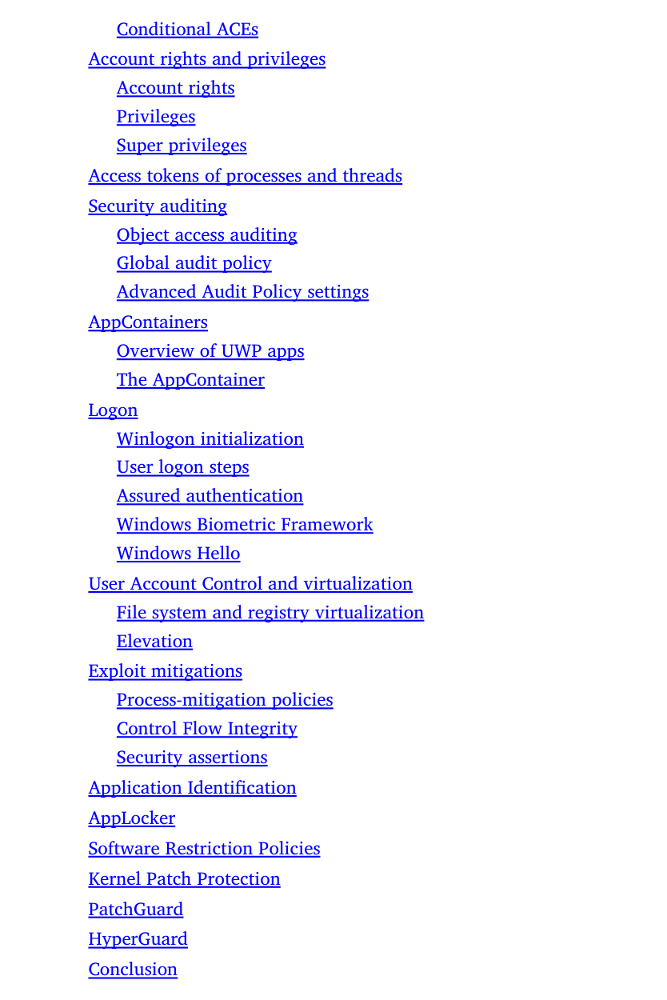
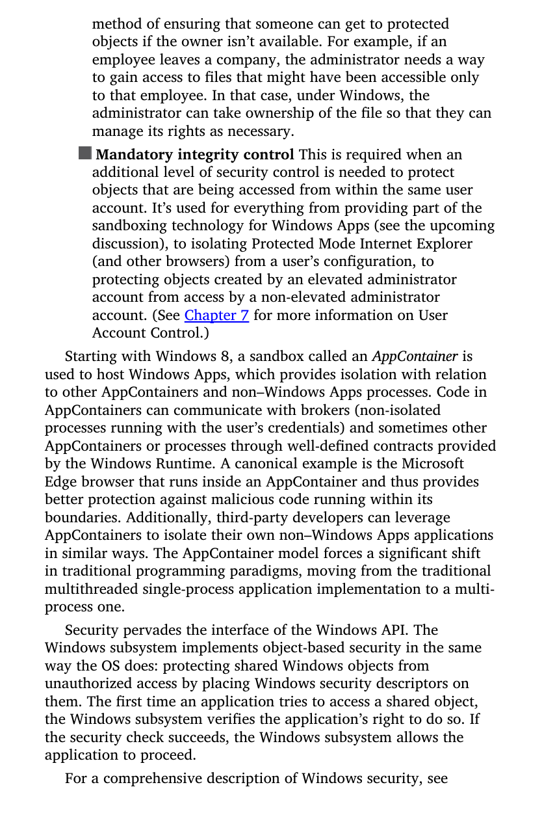
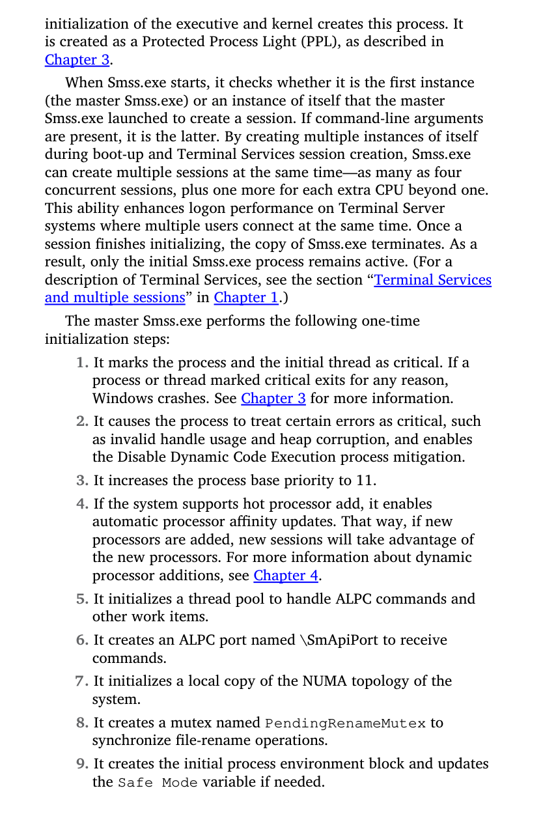
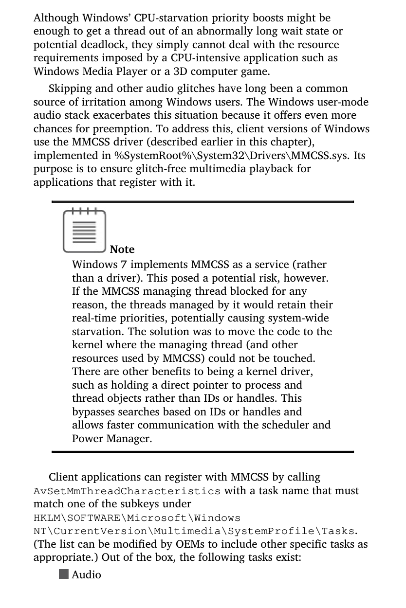

# JCAC Student Guide — Windows

> **Realigned to JCAC Module 7 (Windows, v2020-04) TOC.** Matches the 21-section course structure from the physical Student Guide (photos IMG_3678–IMG_3681).

**Module 7 scope:** Enumeration → Accounts → Security Policy → OS Virtualization → PowerShell → Logging → Registry → Architecture → Boot Process → Services → Logon/Authentication → File System → Networking Protocols → Server Roles → Clustering → LDAP → Active Directory → AD Management/Enumeration → Event Forwarding → Account Management → Scheduling Tasks.

**Posture:** This guide is depth-first. Each section gives you enough to answer exam questions *and* to operate in the field — commands, registry paths, protocol ports, event IDs, attack surface, and hardening notes.

---

## 1. Windows (Enumeration)

The first question on any target Windows host: **which edition, which role, which membership.**

### Server vs Workstation editions

| Family | Typical editions | Role |
|---|---|---|
| **Server** | Server 2003, 2008 (R2), 2012 (R2), 2016, 2019, 2022, 2025 | Domain controllers, file/print, DNS, DHCP, IIS, Hyper-V, database hosts |
| **Workstation** | Windows XP, 7, 8/8.1, 10, 11 | End-user desktops and laptops |

Editions differ by installable roles and features. Server has **Server Core** (headless minimal install) vs **Desktop Experience** (full GUI). Workstation editions split into Home / Pro / Enterprise / Education — **Pro and above** can join a domain, use BitLocker, AppLocker, WDAC, Hyper-V, Credential Guard (Enterprise/Edu only for some).

### Workgroup vs Domain

| Model | Auth store | Admin model | Scale |
|---|---|---|---|
| **Workgroup** | Each box's local SAM | Peer-to-peer; admin per machine | Small (≤20 practical) |
| **Domain** | Active Directory (NTDS.DIT on DCs) | Centralized; single sign-on, GPO | Unlimited |

A workgroup hosts have no shared trust — your `Alice` on Box A is unrelated to `Alice` on Box B. A domain-joined host trusts the domain controllers for authentication and policy.

### Version / edition enumeration

From a shell:

- `ver` — kernel version number.
- `systeminfo` — verbose build, hotfixes, domain/workgroup, install date, boot time.
- `wmic os get Caption,Version,BuildNumber,OSArchitecture`.
- `Get-ComputerInfo` (PowerShell) — comprehensive.
- Registry: `HKLM\SOFTWARE\Microsoft\Windows NT\CurrentVersion` → `ProductName`, `CurrentBuild`, `UBR`, `EditionID`, `InstallationType`.

### Domain / workgroup enumeration

- `echo %USERDOMAIN%` vs `%COMPUTERNAME%` — different = domain member.
- `whoami /fqdn` — returns a full distinguished name if joined.
- `nltest /dsgetdc:<domain>` — which DC this host talks to.
- `nltest /domain_trusts` — trusted domains.
- `net config workstation` — domain/workgroup, logon domain, DNS suffix.

### Remote enumeration (from another host)

- `nbtstat -A <ip>` — NetBIOS name table, unique/group names, user-name entries.
- `nmap --script smb-os-discovery,smb-enum-shares,smb-enum-users <target>`.
- `rpcclient -U "" -N <target>` → `srvinfo`, `enumdomusers`, `lsaquery`, `querydominfo`.
- `enum4linux-ng <target>` — catch-all enumeration.
- `ldapsearch -x -H ldap://<dc> -b "DC=corp,DC=example,DC=com"` — anonymous / authed AD enumeration.

---

## 2. Windows Accounts

### Account types

| Type | Scope | Store | Example |
|---|---|---|---|
| **Local user** | Single machine | SAM hive | `BUILTIN\Administrator` |
| **Domain user** | AD domain | NTDS.DIT on DCs | `CORP\alice` |
| **Microsoft account** | Cloud-tied | Azure / Microsoft identity | `alice@outlook.com` |
| **Local service account** | Single machine | SAM | `NT SERVICE\TrustedInstaller` |
| **Built-in service principal** | Kernel | N/A (virtual) | `NT AUTHORITY\SYSTEM`, `LOCAL SERVICE`, `NETWORK SERVICE` |
| **Managed Service Account (MSA / gMSA)** | Domain | AD | Auto-rotated service passwords |
| **Virtual account** | Service-bound | Kernel | `NT SERVICE\<servicename>` |

### SID structure

A SID uniquely identifies a security principal. Format:

```
S-<revision>-<authority>-<sub-authority-1>-<sub-authority-2>-...-<RID>
```

Example: `S-1-5-21-3623811015-3361044348-30300820-1013` — a domain user RID 1013 in a domain with the given three sub-authorities.

**Well-known SIDs to memorize:**

| SID | Who |
|---|---|
| `S-1-0-0` | Nobody |
| `S-1-1-0` | Everyone |
| `S-1-5-18` | NT AUTHORITY\SYSTEM |
| `S-1-5-19` | LOCAL SERVICE |
| `S-1-5-20` | NETWORK SERVICE |
| `S-1-5-11` | Authenticated Users |
| `S-1-5-32-544` | BUILTIN\Administrators |
| `S-1-5-32-545` | BUILTIN\Users |
| `S-1-5-32-551` | BUILTIN\Backup Operators |

**RIDs (Relative Identifiers) for domain/local principals:**

- **500** — Administrator (local or domain)
- **501** — Guest
- **502** — krbtgt (domain KDC account)
- **512** — Domain Admins
- **513** — Domain Users
- **514** — Domain Guests
- **515** — Domain Computers
- **516** — Domain Controllers
- **519** — Enterprise Admins
- **520** — Group Policy Creator Owners
- **1000+** — user-created accounts

### Access Tokens

When a user authenticates, LSASS builds a **token** attached to every process the user spawns:

- **User SID** — the authenticated principal.
- **Group SIDs** — every group the user is in (direct and transitive).
- **Privileges** — e.g., `SeDebugPrivilege`, `SeImpersonatePrivilege`, `SeBackupPrivilege`, `SeRestorePrivilege`, `SeLoadDriverPrivilege`, `SeTcbPrivilege`.
- **Integrity Level** — Low / Medium / High / System.
- **Logon SID** — unique to this logon session.
- **Token type** — Primary (attached to process) vs Impersonation (thread assumes another user temporarily).

Impersonation levels: Anonymous, Identification, Impersonation, Delegation (delegation allows the server to act on remote systems as the client — "trusted for delegation").

### UAC (User Account Control)

Admin users log on with a **split token**:

- A filtered "standard user" token for everyday processes.
- A full admin token that requires a UAC consent prompt (or credential entry) to activate.

Key facts:

- Explorer.exe runs under the filtered token; elevated apps run under the full one.
- The consent prompt runs on the Secure Desktop (session 0 isolation).
- AppInfo service (part of `svchost.exe`) brokers elevation via RPC.
- Bypasses exist (fodhelper, eventvwr, cmstp UAC bypass, IFEO) — most patched on Windows 10/11, but older builds still vulnerable.

---

## 3. Security Policy

Windows ships with layered security policy knobs. The Bib wants you to know both the **layers** and the **tools**.

### Local Security Policy (secpol.msc)

On a standalone box, `secpol.msc` sets:

| Policy area | Examples |
|---|---|
| **Account Policies** | Password Policy (length, complexity, age), Account Lockout Policy, Kerberos Policy (domain only) |
| **Local Policies** | Audit Policy, User Rights Assignment, Security Options |
| **Windows Defender Firewall with Advanced Security** | Inbound / Outbound / Connection Security rules |
| **Network List Manager Policies** | Domain vs Private vs Public profile behavior |
| **Public Key Policies** | Certificate auto-enrollment, BitLocker recovery |
| **Software Restriction Policies** | Legacy allow/deny rules (superseded by AppLocker / WDAC) |
| **Application Control Policies** | AppLocker |
| **IP Security Policies** | IPSec on this computer |
| **Advanced Audit Policy Configuration** | Fine-grained audit subcategories |

On a domain-joined box, the effective policy is **Group Policy merged with Local** — GPO (domain-level) wins per LSDOU.

### Key policies you'll be tested on

**Password policy (typical hardened baseline):**

- Minimum length 14 characters.
- Complexity enabled.
- Maximum age 60–90 days (or disabled in favor of length + no rotation per NIST 800-63B).
- History: 24 passwords remembered.

**Account Lockout:**

- Threshold 3–10 invalid attempts.
- Duration: 15 minutes+.
- Reset counter: 15 minutes+.

**Kerberos policy (domain-only):**

- Max user ticket lifetime: 10 hours (default).
- Max renewal: 7 days.
- Clock skew tolerance: 5 minutes — critical! Kerberos auth breaks if client and DC drift more than this.

**User Rights Assignment — high-value rights:**

- `SeDebugPrivilege` — debug any process. **Mimikatz prereq.**
- `SeImpersonatePrivilege` — impersonate a client. **Potato family exploit prereq.**
- `SeBackupPrivilege` / `SeRestorePrivilege` — read/write any file regardless of ACL. **Shadow Copy / SAM dump.**
- `SeLoadDriverPrivilege` — load kernel drivers. **BYOVD prereq.**
- `SeTakeOwnershipPrivilege` — take ownership of any object.
- `SeTcbPrivilege` — act as part of the trusted computing base (kernel-equivalent).
- `SeManageVolumePrivilege` — manage volume-level operations.

### Security Templates and secedit

- **Security Template (.inf)** — a text file specifying policy values. Legacy analog of GPO.
- `secedit /configure /db mydb.sdb /cfg template.inf` — apply a template.
- `secedit /analyze /db mydb.sdb /cfg baseline.inf /log out.log` — compare current settings to a baseline.
- `secedit /export /cfg current.inf` — export current security configuration.
- Microsoft Security Compliance Toolkit / Policy Analyzer — modern workflow using GPO Backups + baseline .inf files.

### Local Group Policy Editor (gpedit.msc)

Local GPO lives in `%SystemRoot%\System32\GroupPolicy\` and `GroupPolicyUsers\`. Admin and non-admin local GPOs (MLGPO) allow different settings per user vs machine.

### Effective-policy inspection

- `gpresult /h report.html` — HTML RSoP report.
- `gpresult /r` — text summary of applied GPOs.
- `rsop.msc` — Resultant Set of Policy MMC.
- `auditpol /get /category:*` — current advanced audit configuration.
- `net accounts` — password and lockout effective settings.

---

## 4. OS Virtualization

Module 5 covers virtualization **concepts** (hypervisor types, hardware assist). Module 7 covers **Windows-specific virtualization features**.

### Hyper-V

- **Type-1 hypervisor** baked into Windows — the Hyper-V role installs the hypervisor beneath the existing OS, which then becomes the "root partition" (management OS).
- Available on **Windows Server** (Hyper-V role) and **Windows 10/11 Pro/Enterprise/Education** (Hyper-V feature).
- **Generation 1 VMs** — legacy BIOS firmware, IDE boot.
- **Generation 2 VMs** — UEFI, Secure Boot, SCSI boot, vTPM, nested virtualization.
- Nested virtualization: required for running Hyper-V inside a Hyper-V VM (WSL2, Docker, sandboxed workloads).
- Management: Hyper-V Manager, `Get-VM`, `New-VM`, `Start-VM`, `Stop-VM`, SCVMM for enterprise.
- Default VM store: `C:\ProgramData\Microsoft\Windows\Hyper-V\` and `C:\Users\Public\Documents\Hyper-V\Virtual Hard Disks\`.

### Windows Containers

- **Windows Server Containers** — process/namespace isolation. Share the host kernel. Lightweight, like Linux containers.
- **Hyper-V Containers** — each container runs inside a minimal Hyper-V VM for kernel-level isolation. Heavier but stronger boundary.
- **Docker Engine** runs on Windows Server; **Docker Desktop** on Windows 10/11 uses WSL2 or Hyper-V backend.
- Base images: `mcr.microsoft.com/windows/servercore`, `mcr.microsoft.com/windows/nanoserver`.

### WSL — Windows Subsystem for Linux

- **WSL 1** — syscall translation layer mapping Linux syscalls to Windows. No kernel, no `/dev/mem`, limited compatibility.
- **WSL 2** — full Linux kernel running in a lightweight utility VM on Hyper-V. Near-native performance, full syscall support.
- Admin: `wsl --install`, `wsl --list --verbose`, `wsl --set-default-version 2`, `wsl --shutdown`.

### Windows Sandbox

- Ephemeral, throwaway Windows desktop for running untrusted software.
- Built on Hyper-V containers. State discarded on close.
- Enabled via "Turn Windows features on or off" → Windows Sandbox (Pro+).

### Virtualization-Based Security (VBS)

Hypervisor-isolated runtime used as a security boundary, even against a compromised kernel:

- **HVCI (Hypervisor-protected Code Integrity)** — kernel-mode code-integrity enforcement isolated from the normal kernel.
- **Credential Guard** — LSASS secrets (NTLM hashes, Kerberos keys, TGTs) moved to an isolated LSAISO process. Pass-the-Hash-resistant.
- **Application Guard** — Edge browser runs untrusted sites in a throwaway container. Office also has an Application Guard variant.
- **Core Isolation / Memory Integrity** — UI surface for HVCI.

Requires: SLAT (EPT/NPT), IOMMU, Secure Boot, TPM 2.0 (recommended), UEFI Lock.

---

## 5. PowerShell

PowerShell is both the primary modern admin tool and an attacker favorite.

### Cmdlets — Verb-Noun grammar

Every cmdlet is `<Verb>-<Noun>`: `Get-Service`, `Set-Item`, `New-ADUser`, `Restart-Computer`, `Stop-Process`. Canonical verbs list: `Get-Verb`.

### Parameters and pipeline

- Named parameters: `Get-Service -Name spooler`.
- Positional: `Get-Content file.txt` (first positional is `-Path`).
- Pipeline: output of one cmdlet is **object input** (not text) to the next. `Get-Process | Where-Object CPU -gt 10 | Sort-Object CPU -Desc | Select-Object -First 5`.
- `$_` — current pipeline object.
- `$PSItem` — the modern name for `$_`.

### Aliases

Convenient short names mapped to cmdlets. Inspect with `Get-Alias`.

| Alias | Cmdlet |
|---|---|
| `ls`, `dir`, `gci` | Get-ChildItem |
| `cd` | Set-Location |
| `cat`, `type`, `gc` | Get-Content |
| `ps`, `gps` | Get-Process |
| `kill`, `spps` | Stop-Process |
| `cls` | Clear-Host |
| `?`, `where` | Where-Object |
| `%`, `foreach` | ForEach-Object |
| `iex` | Invoke-Expression |
| `iwr`, `curl` | Invoke-WebRequest |
| `irm` | Invoke-RestMethod |

### Modules

- Module = a self-contained unit of cmdlets/functions (`.psm1`, `.psd1` manifest).
- `Get-Module -ListAvailable` — installed modules.
- `Import-Module <name>` — load a module.
- Auto-loading: modules in `$env:PSModulePath` load on first cmdlet call.
- Key built-ins: `ActiveDirectory`, `GroupPolicy`, `Hyper-V`, `DnsServer`, `ServerManager`, `NetTCPIP`, `Microsoft.PowerShell.Security`.
- PowerShell Gallery: `Install-Module -Name <name>` — installs from the public repo.

### PowerShell Remoting

- Transport: **WinRM** (HTTP 5985, HTTPS 5986).
- Enable: `Enable-PSRemoting -Force` (admin).
- One-to-one: `Enter-PSSession -ComputerName srv1`.
- One-to-many: `Invoke-Command -ComputerName srv1,srv2 -ScriptBlock { Get-Service }`.
- Persistent sessions: `$s = New-PSSession -ComputerName srv1; Invoke-Command -Session $s -ScriptBlock {...}`.
- Auth: default **Kerberos** for domain; NTLM if using IP or non-domain.
- Constrained endpoints: `Register-PSSessionConfiguration` — JEA.

### Scripting — variables and types

- `$var = 5` — scalar. Strongly typed under the hood (`[int]`).
- `[int]$x = 5; [string]$s = "hi"` — explicit typing.
- Arrays: `$a = 1,2,3` or `@(1,2,3)`. `$a[0]`, `$a.Count`, `$a += 4`.
- Hashtables: `$h = @{ Name = "Alice"; Age = 30 }`. Access: `$h.Name` or `$h["Name"]`.
- Automatic variables: `$_`, `$args`, `$PSItem`, `$Error`, `$PWD`, `$Host`, `$ExecutionContext`, `$PSVersionTable`.

### Script structure

```powershell
param(
    [Parameter(Mandatory)][string]$Name,
    [int]$Count = 1
)

function Greet {
    param([string]$who)
    "Hello, $who"
}

for ($i = 0; $i -lt $Count; $i++) { Greet $Name }
```

### Execution policy

- `Restricted` — no scripts run.
- `AllSigned` — signed scripts only.
- `RemoteSigned` — local scripts run; remote must be signed.
- `Unrestricted` — anything runs, warning on remote.
- `Bypass` — anything, no warnings.

Bypass patterns: `powershell -ExecutionPolicy Bypass -File x.ps1`, process-scoped `Set-ExecutionPolicy -Scope Process Bypass`, in-memory execution with `Invoke-Expression`.

**Execution policy is not a security boundary** per Microsoft. It prevents mistakes, not determined attackers.

### Security features (attacker-relevant)

- **AMSI (Antimalware Scan Interface)** — submits script content to registered AV/EDR for scanning prior to execution. Attackers patch `amsi.dll!AmsiScanBuffer` in-memory, or set `$amsiUtils` field via reflection.
- **Script Block Logging** — Event ID 4104 in `Microsoft-Windows-PowerShell/Operational`. Logs deobfuscated script blocks.
- **Module Logging** — Event ID 4103 per pipeline event.
- **Transcription** — per-session transcript to a protected share.
- **Constrained Language Mode (CLM)** — restricted PowerShell subset; enforced via WDAC/AppLocker.
- **JEA (Just Enough Administration)** — role-based constrained endpoints on WinRM.

### Offensive tooling to recognize

- **PowerSploit / PowerView** — offensive PS modules (now maintenance-mode).
- **Nishang** — script offense toolkit.
- **Empire / Starkiller** — post-exploitation C2 in PowerShell.
- **Invoke-Mimikatz** — in-memory Mimikatz loader.
- **BloodHound / SharpHound.ps1** — AD graph enumeration.
- **PowerUpSQL / PowerUp** — local privilege escalation and SQL attack toolkits.

---

## 6. Logging

Windows logs are channel-based, stored as `.evtx` binary files in `%SystemRoot%\System32\winevt\Logs\`.

### Core channels

- **Application** — apps and services-level events.
- **Security** — successful/failed logons, policy changes, object access (audit).
- **System** — kernel, driver, service control manager.
- **Setup** — OS setup and rollbacks.
- **Forwarded Events** — events WEF-forwarded from remote hosts.

### Applications and Services Logs

Operational / Admin / Analytic / Debug channels per provider. Key ones:

- `Microsoft-Windows-PowerShell/Operational` — 4103/4104 script logging.
- `Microsoft-Windows-Sysmon/Operational` — if Sysmon installed.
- `Microsoft-Windows-TaskScheduler/Operational` — task create/run/stop.
- `Microsoft-Windows-TerminalServices-LocalSessionManager/Operational` — RDP 21 (logon), 24 (disconnect), 25 (reconnect).
- `Microsoft-Windows-WinRM/Operational` — remoting.
- `Microsoft-Windows-Windows Defender/Operational` — Defender detections.

### Viewing and querying

- GUI: `eventvwr.msc`.
- CLI: `wevtutil qe Security /c:10 /f:text /rd:true`.
- PowerShell: `Get-WinEvent -LogName Security -MaxEvents 100`, `Get-WinEvent -FilterHashtable @{LogName="Security"; Id=4624}`.
- Archive: `wevtutil epl Security Security.evtx`.

### Auditing — categories and subcategories

High-level categories (9): Account Logon, Account Management, Detailed Tracking, DS Access, Logon/Logoff, Object Access, Policy Change, Privilege Use, System. Each has subcategories (~60 total).

**Configuration:**

- GUI: `secpol.msc` → Advanced Audit Policy Configuration.
- CLI: `auditpol /get /category:*`, `auditpol /set /subcategory:"Logon" /success:enable /failure:enable`.
- GPO: Computer Config → Windows Settings → Security → Advanced Audit Policy.

**DoD / commercial baseline typically enables:** Logon/Logoff, Account Management, Privilege Use, Policy Change, Object Access for sensitive shares, Process Creation with command line.

### Event IDs — the high-yield memorize list

| Event ID | Meaning |
|---|---|
| **4624** | Successful logon |
| **4625** | Failed logon |
| **4634 / 4647** | Logoff (4647 user-initiated) |
| **4648** | Logon with explicit credentials (runas) |
| **4672** | Special privileges assigned to new logon (admin equivalent) |
| **4688** | Process creation (include command line if GPO set) |
| **4689** | Process termination |
| **4697** | Service installed |
| **4698 / 4699 / 4700 / 4701 / 4702** | Scheduled task create/delete/enable/disable/update |
| **4720 / 4722 / 4724 / 4725 / 4726 / 4738** | User account create/enable/password change by admin/disable/delete/modify |
| **4728 / 4732 / 4756** | Member added to global/local/universal group |
| **4740** | Account locked out |
| **4768** | Kerberos TGT requested (AS-REQ result) |
| **4769** | Kerberos service ticket requested (TGS-REQ result) |
| **4776** | NTLM authentication (success or failure) |
| **4798 / 4799** | Local group membership enumerated |
| **5140 / 5145** | Network share accessed / share checked for access |
| **5156** | Windows Filtering Platform allowed a connection |
| **7045** | Service installed (SCM) |
| **1102** | Security audit log cleared (tampering indicator) |

### Logon type codes (Event 4624)

| Code | Type |
|---|---|
| 2 | Interactive (console) |
| 3 | Network (SMB, etc.) |
| 4 | Batch (scheduled task) |
| 5 | Service |
| 7 | Unlock |
| 8 | NetworkCleartext |
| 9 | NewCredentials (runas /netonly) |
| 10 | RemoteInteractive (RDP) |
| 11 | CachedInteractive |

### Log clearing

- `wevtutil cl Security` — clear Security log. Generates **Event 1102** (paradox: clearing the log leaves one entry documenting it was cleared).
- Attacker-advanced: thread impersonation + direct RPC to EventLog service without generating 1102 (see DanderSpritz, Invoke-Phant0m).

---

## 7. Windows Registry

Hierarchical configuration database. The registry is the system's DNA.

### Root keys

| Root | Aka | Source | Purpose |
|---|---|---|---|
| **HKEY_LOCAL_MACHINE** | HKLM | Multiple hives (SAM/SECURITY/SOFTWARE/SYSTEM) | Machine-wide config |
| **HKEY_USERS** | HKU | NTUSER.DAT + UsrClass.dat per user | All loaded user hives |
| **HKEY_CURRENT_USER** | HKCU | Derived from HKU\<current SID> | Current user config |
| **HKEY_CLASSES_ROOT** | HKCR | Merged HKLM\Software\Classes + HKCU\Software\Classes | File associations, COM |
| **HKEY_CURRENT_CONFIG** | HKCC | Derived from HKLM\SYSTEM\CurrentControlSet\Hardware Profiles\Current | Current hardware profile |

**Master vs Derived:**

- **Master** (actually stored on disk): HKLM and HKU.
- **Derived** (virtual, computed at runtime from master hives): HKCR, HKCU, HKCC.

### Hive files on disk

| Hive | File path |
|---|---|
| SAM | `%SystemRoot%\System32\config\SAM` |
| SECURITY | `%SystemRoot%\System32\config\SECURITY` |
| SOFTWARE | `%SystemRoot%\System32\config\SOFTWARE` |
| SYSTEM | `%SystemRoot%\System32\config\SYSTEM` |
| DEFAULT | `%SystemRoot%\System32\config\DEFAULT` |
| NTUSER.DAT (per user) | `%USERPROFILE%\NTUSER.DAT` |
| UsrClass.dat (per user) | `%USERPROFILE%\AppData\Local\Microsoft\Windows\UsrClass.dat` |

Backup copies (Windows 10+) in `%SystemRoot%\System32\config\RegBack\` (populated at user-triggered events only, not scheduled by default).

### Value types

| Type | Meaning |
|---|---|
| REG_SZ | Null-terminated string |
| REG_EXPAND_SZ | String with expandable env vars (`%SystemRoot%`) |
| REG_MULTI_SZ | Array of strings, double-null-terminated |
| REG_DWORD | 32-bit int (little-endian) |
| REG_QWORD | 64-bit int |
| REG_BINARY | Raw bytes |
| REG_LINK | Symlink to another key |
| REG_NONE | No defined type |

### Command-line registry manipulation

**reg.exe:**

- `reg query HKLM\Software\Microsoft\Windows\CurrentVersion\Run /s` — recursive query.
- `reg add HKCU\Software\Test /v MyValue /t REG_SZ /d "hello" /f` — add.
- `reg delete HKCU\Software\Test /v MyValue /f` — delete value.
- `reg delete HKCU\Software\Test /f` — delete key.
- `reg save HKLM\SAM sam.save` — save a hive subtree to a file.
- `reg load HKU\tempkey C:\path\NTUSER.DAT` — mount an offline hive.
- `reg unload HKU\tempkey` — unmount.
- `reg export HKLM\Software\MyKey export.reg`.
- `reg import export.reg`.

**PowerShell:**

- `Get-ItemProperty "HKLM:\Software\Microsoft\Windows\CurrentVersion\Run"`.
- `Set-ItemProperty "HKLM:\..." -Name Key -Value "value"`.
- `New-Item -Path "HKCU:\Software\Test"`.
- `Remove-Item -Path "HKCU:\Software\Test" -Recurse`.

### High-value registry paths

| Path | Contents |
|---|---|
| `HKLM\SAM\SAM\Domains\Account\Users` | Local user NTLM hashes (SYSTEM-only access) |
| `HKLM\SECURITY\Policy\Secrets` | LSA secrets (service creds, auto-logon) |
| `HKLM\SYSTEM\CurrentControlSet\Services\<name>` | Service config |
| `HKLM\SYSTEM\CurrentControlSet\Control\Lsa` | LSA config, NTLM settings |
| `HKLM\SYSTEM\CurrentControlSet\Control\Terminal Server` | RDP config |
| `HKLM\Software\Microsoft\Windows NT\CurrentVersion` | Build, install date |
| `HKLM\Software\Microsoft\Windows\CurrentVersion\Run` | Per-machine autostart |
| `HKCU\Software\Microsoft\Windows\CurrentVersion\Run` | Per-user autostart |
| `HKLM\Software\Microsoft\Windows\CurrentVersion\Uninstall` | Installed programs |
| `HKLM\Software\Microsoft\Windows NT\CurrentVersion\Winlogon` | Shell, Userinit — classic persistence |
| `HKLM\SYSTEM\MountedDevices` | Mounted volume mappings |

---

## 8. Windows Architecture

Two-mode execution model on x86-64.

### User mode (ring 3) vs Kernel mode (ring 0)

- **User mode** — applications, services, subsystems. No direct hardware access.
- **Kernel mode** — kernel, drivers, HAL. Full privilege.
- Boundary crossed via **syscalls** — user code calls `ntdll.dll` stubs → `syscall`/`sysenter`/`int 2E` transition to kernel.

### User-mode components

- **System processes** — `smss.exe`, `csrss.exe`, `wininit.exe`, `winlogon.exe`, `services.exe`, `lsass.exe`.
- **Applications** — everything the user runs.
- **Subsystems** — historically Win32 (Windows), POSIX, OS/2. Now Win32 dominates; WSL replaces POSIX.
- **Native API** — `ntdll.dll` exports `Nt*` / `Zw*` functions; the syscall interface.
- **Subsystem DLLs** — `kernel32.dll`, `user32.dll`, `gdi32.dll`, `advapi32.dll` — Win32 implementations that call Native API.

### Kernel-mode components

- **NTOSKRNL.EXE** — the NT Kernel:
  - **Executive** — object manager, I/O manager, memory manager, process/thread manager, security reference monitor, cache manager, PnP manager, power manager, config manager (registry).
  - **Kernel** (micro-kernel) — scheduling, interrupts, synchronization primitives, thread dispatcher.
- **HAL.DLL** — Hardware Abstraction Layer. Isolates kernel from platform quirks.
- **Win32k.sys** — windowing and graphics kernel component (where the GUI message loop lives).
- **Drivers** — `.sys` files. Types: kernel, file system, filter, bus, HID, network, storage.
- **Hypervisor context (VBS)** — when VBS is on, the hypervisor sits under the root partition; `securekernel.exe` runs in VTL1 isolated from the normal kernel (VTL0).

### Core executive components

- **Object Manager** — everything is an object (files, processes, threads, events, registry keys, ALPC ports). Named in the object namespace (`\Device\HarddiskVolume1`, `\BaseNamedObjects\mutex`).
- **I/O Manager** — dispatches I/O Request Packets (IRPs) to driver stacks.
- **Memory Manager** — virtual memory, paging, working sets, NTFS cache integration.
- **Process/Thread Manager** — EPROCESS/ETHREAD structures, scheduling.
- **Security Reference Monitor (SRM)** — enforces token/ACL checks.
- **Configuration Manager (CM)** — the registry implementation.

### Native API layering (simplified)

```
Application
   ↓
kernel32.dll / user32.dll / gdi32.dll   (Win32 subsystem)
   ↓
ntdll.dll                               (Native API stubs)
   ↓ syscall
NTOSKRNL.EXE executive                  (ring 0)
   ↓
HAL / drivers
   ↓
Hardware
```


*Russinovich — full Windows architecture: user mode (subsystems, services, apps) on top, kernel mode (Executive, Kernel, HAL, drivers) below, with the syscall interface between.*

---

## 9. Windows Boot Process

Four macro-phases: Pre-Boot → Boot → Kernel Init → User-Mode Start Up.

### Phase 1: Pre-Boot

- Firmware POST.
- UEFI or BIOS selects the boot device.
- **UEFI path:** Secure Boot checks EFI binary signature → runs `\EFI\Microsoft\Boot\bootmgfw.efi` from the EFI System Partition (ESP).
- **Legacy BIOS path:** MBR → VBR of active partition → `bootmgr`.
- TPM measures firmware and boot components into PCRs (measured boot), enabling BitLocker's PCR-bind unseal.

### Phase 2: Boot

- Boot Manager reads **BCD store** (`\EFI\Microsoft\Boot\BCD` on UEFI or `\Boot\BCD` on legacy).
- Presents the boot menu if multiple entries.
- Selected entry invokes `winload.efi` / `winload.exe` (or `winresume.efi` from hibernate).
- Winload loads:
  - `ntoskrnl.exe` (kernel).
  - `hal.dll`.
  - Boot-start drivers (`FILTER_TYPE = SERVICE_BOOT_START`).
  - SYSTEM registry hive.
  - ELAM driver (Early Launch Anti-Malware) if configured.
- Secure Boot + HVCI verify each loaded image's signature.

### Phase 3: Kernel Initialization

- `ntoskrnl.exe` runs `KiSystemStartup` → initializes:
  - Memory manager.
  - Process/thread manager (creates initial process, idle thread per CPU).
  - Object manager, SRM.
  - CM (mounts SYSTEM hive).
  - PnP manager (enumerates devices).
  - I/O manager (starts boot-start drivers, then system-start drivers).
- Kernel creates the first user-mode process: **SMSS.EXE** (Session Manager Subsystem).

### Phase 4: User-Mode Start Up

1. **SMSS.EXE** creates session 0 (services), launches:
   - `autochk` (disk integrity check if dirty bit set).
   - Pagefile creation.
   - Mounts additional hives (SAM, SECURITY, SOFTWARE, DEFAULT).
   - Creates env variables and DOS device mappings.
   - Launches `csrss.exe` (Client-Server Runtime Subsystem) for session 0.
   - Launches `wininit.exe` in session 0.

2. **WININIT.EXE** in session 0:
   - Launches `services.exe` (Service Control Manager).
   - Launches `lsass.exe`.
   - Launches `lsaiso.exe` (if Credential Guard enabled).

3. **SMSS.EXE** creates session 1 (first interactive session):
   - Launches `csrss.exe` for session 1.
   - Launches `winlogon.exe` for session 1.

4. **WINLOGON.EXE**:
   - Loads `LogonUI.exe`.
   - Receives the Secure Attention Sequence (Ctrl-Alt-Del).
   - Coordinates authentication via LSASS.
   - After successful logon, launches `userinit.exe`.

5. **USERINIT.EXE**:
   - Runs logon scripts.
   - Launches the shell (`explorer.exe` by default, per `HKLM\...\Winlogon\Shell`).

### Inspection

- `bcdedit /enum` — list BCD entries.
- `bcdedit /set {default} testsigning on` — allow unsigned drivers (dev only; disables many VBS features).
- Boot log (`boot.ini` legacy; `bcdedit /set bootlog yes` then check `%SystemRoot%\ntbtlog.txt`).

---

## 10. Windows Services

A service is a background process managed by the **Service Control Manager (SCM)** — `services.exe`.

### Service properties

Every service has:

- **Service name** — short identifier (e.g., `Spooler`).
- **Display name** — human-readable (e.g., "Print Spooler").
- **Description** — multi-line text.
- **Path to binary** — with arguments; for DLL-based services, hosted by `svchost.exe -k <group>`.
- **Service account** — `LocalSystem`, `LocalService`, `NetworkService`, or a specific account.
- **Startup type** — Automatic (Delayed Start) / Automatic / Manual / Disabled / Boot / System.
- **Dependencies** — other services that must start first.
- **Recovery actions** — first/second/subsequent failures: restart, run program, reboot.
- **SID type** — None / Unrestricted / Restricted.
- **Required privileges** — restricted set when Service Hardening is on.

### Service registry keys

Each service has a key at `HKLM\SYSTEM\CurrentControlSet\Services\<ServiceName>`:

| Value | Meaning |
|---|---|
| `Type` | 1=Kernel driver, 2=FS driver, 0x10=Own process, 0x20=Share process, 0x100=Interactive |
| `Start` | 0=Boot, 1=System, 2=Auto, 3=Manual, 4=Disabled |
| `ErrorControl` | 0=Ignore, 1=Normal, 2=Severe, 3=Critical |
| `ImagePath` | EXE path with args |
| `ObjectName` | Service account (default LocalSystem) |
| `ServiceDll` (under `Parameters`) | For svchost-hosted services, the DLL path |
| `Description`, `DisplayName` | Strings |
| `DependOnService`, `DependOnGroup` | Dependencies |
| `FailureActions` | Binary blob encoding recovery actions |

### Service Control Programs

**sc.exe:**

- `sc query` / `sc queryex` — enumerate.
- `sc qc <name>` — query config.
- `sc qdescription <name>` — description.
- `sc qfailure <name>` — failure actions.
- `sc create <name> binPath= "C:\bin.exe" start= auto` — **space after `=` is required**.
- `sc config <name> binPath= "..."` — modify.
- `sc start <name>` / `sc stop <name>` / `sc delete <name>`.
- `sc sdshow <name>` / `sc sdset <name> <SDDL>` — ACL on the service object.

**services.msc** — MMC GUI.

**net.exe:**

- `net start <name>` / `net stop <name>`.
- `net start` alone — lists running services.

**PowerShell:**

- `Get-Service`, `Start-Service`, `Stop-Service`, `Restart-Service`, `Set-Service`.
- `Get-CimInstance Win32_Service | ? StartMode -eq "Auto"`.

### Service-related attack surface

- **Unquoted service paths** — `C:\Program Files\App\svc.exe` unquoted lets an attacker drop `C:\Program.exe`. Find via `wmic service get name,pathname | findstr /i /v "\"`.
- **Weak service permissions** — `sc sdshow <name>` — if a non-admin has `SERVICE_CHANGE_CONFIG`, they can modify `binPath=` to anything.
- **Weak binary ACL** — service binary world-writable lets attacker overwrite and wait for restart.
- **DLL hijacking** — svchost services load `ServiceDll` from `Parameters`; if writable, plant a malicious DLL.
- **Service account misuse** — service running as SYSTEM with low-priv attacker having config control = instant SYSTEM.

---

## 11. Logon and Authentication

### Local logon (Winlogon flow)

1. User presses Ctrl-Alt-Del (Secure Attention Sequence) to invoke Winlogon.
2. Winlogon calls LogonUI, which presents the credential provider.
3. Credentials passed to LSASS.
4. LSASS authenticates against the **SAM** hive:
   - Hashes the entered password with NTLM (MD4 of UTF-16LE).
   - Compares to the stored NTLM hash in `SAM\Domains\Account\Users\<RID>\V`.
   - SAM entries are DES-encrypted with a SYSKEY derived from `HKLM\SYSTEM\Policy\PolEKList`.
5. On success, LSASS builds the access token with user SID + group SIDs + privileges.
6. Winlogon starts a user session and launches `userinit.exe`, which launches the shell.


*Russinovich — access token: user SID, group SIDs, privileges, integrity level, default DACL, mandatory label. Attached to every process/thread that acts on behalf of the user.*


*Russinovich — security descriptor: owner SID, group SID, DACL (who's allowed), SACL (what's audited). SRM compares the subject's token to the object's SD on every access.*

### Local authentication protocols

**LM (LanMan) hash** — obsolete:
- Pad password to 14 chars, uppercase.
- Split into two 7-byte halves.
- Use each half as a DES key to encrypt the constant `KGS!@#$%`.
- Concatenate 8+8 = 16-byte hash.
- **Broken in seconds** by Ophcrack / rainbow tables. Disabled by default on all modern Windows.

**NTLMv1 (NT hash / NTLM hash)** — base hash is MD4(UTF-16LE password). No salt. Used as key material in challenge/response.

**NTLMv1 authentication:**
- Server sends 8-byte challenge.
- Client DES-encrypts challenge with NT hash (split into 7/7/2-byte keys) → 24-byte response.
- Broken by asleap / crack.sh since DES is weak on these keys.

**NTLMv2 authentication:**
- HMAC-MD5 of (NT hash) → produces the NTLMv2 hash.
- Server challenge + client challenge + timestamp → response via HMAC-MD5 with NTLMv2 hash.
- Harder to crack than NTLMv1 but still offline-attackable if captured (Responder / Impacket ntlmrelayx).

### Hash identification (for Hashcat mode)

| Format | Hashcat mode | Example |
|---|---|---|
| LM | 3000 | `aad3b435b51404ee` |
| NT (raw NTLM) | 1000 | `8846f7eaee8fb117ad06bdd830b7586c` (`password`) |
| NetNTLMv1 | 5500 | 48-char cut of C/R |
| NetNTLMv2 | 5600 | Long `username::domain:challenge:hmac:blob` |
| DCC (MSCACHE) | 1100 | Windows < Vista cached |
| DCC2 (MSCACHE2) | 2100 | Windows ≥ Vista cached |
| Kerberos AS-REP | 18200 | AS-REP roasting output |
| Kerberos TGS-REP (23) | 13100 | Kerberoasting RC4 |
| Kerberos TGS-REP (17/18) | 19600 / 19700 | Kerberoasting AES |

### Network logon

- **Interactive** (type 2): console logon.
- **Network** (type 3): SMB, RPC, LDAP, etc. — credentials proved by challenge/response.
- **Batch** (type 4): scheduled task logon.
- **Service** (type 5): service start.
- **Unlock** (type 7): workstation unlock.
- **NetworkCleartext** (type 8): basic-auth cleartext (IIS, sometimes).
- **NewCredentials** (type 9): `runas /netonly` — local context stays, network context becomes new creds.
- **RemoteInteractive** (type 10): RDP.
- **CachedInteractive** (type 11): DC unreachable, MSCACHE2 used.

### SSPI — Security Support Provider Interface

Pluggable authentication framework. Providers:

- **NTLM SSP** — challenge/response using NT hash.
- **Kerberos SSP** — ticket-based, default for domain.
- **Negotiate (SPNEGO)** — tries Kerberos first, falls back to NTLM.
- **Schannel** — TLS-based auth (certificates).
- **Digest** — HTTP digest (legacy).
- **CredSSP** — Credential Security Support Provider (used by RDP, allows credential delegation).

### Credential material and credential attacks

**Where secrets live:**

| Material | Location | Strength |
|---|---|---|
| NTLM hash | SAM (local), NTDS.DIT (DC), LSASS memory | MD4 of UTF-16 password — not salted |
| LM hash | SAM (legacy) | DES on upper-cased 7-byte halves — broken |
| Kerberos keys (AES256/AES128/RC4) | LSASS memory, NTDS.DIT | PBKDF2-derived (AES) or MD4 (RC4) |
| DPAPI master keys | `%APPDATA%\Microsoft\Protect\<SID>\` | Per-user key hierarchy |
| LSA secrets | SECURITY hive | Service-account plaintexts, auto-logon |
| MSCACHE2 (DCC2) | SECURITY hive | PBKDF2 of NT hash |
| Credential Manager | DPAPI-protected | Saved RDP, web passwords |
| Chrome/Edge saved logins | DPAPI-protected | Per-user |

**Attack catalog:**

| Attack | Requires | Result |
|---|---|---|
| Pass-the-Hash (PtH) | NTLM hash | Authenticate as user |
| Pass-the-Ticket (PtT) | TGT or service ticket | Use the ticket as the user |
| Overpass-the-Hash | NTLM hash | Request TGT with hash (PtH → PtT) |
| Kerberoasting | Any domain user | Request SPN ticket, crack offline |
| AS-REP Roasting | User with preauth disabled | Crack AS-REP offline |
| Golden Ticket | KRBTGT hash | Forge any TGT |
| Silver Ticket | Service account hash | Forge service ticket for that service |
| Diamond Ticket | KRBTGT hash + legit TGT | Forge TGT that looks renewed |
| Sapphire Ticket | RODC KRBTGT hash | Forge TGT on RODC-trusted paths |
| DCSync | Replication rights (DA/EA/delegated) | Pull any hash via MS-DRSR |
| DCShadow | DA | Register fake DC, push malicious changes |
| Skeleton Key | Admin on DC | Patch LSASS to accept universal password |
| Zerologon (CVE-2020-1472) | Unauth network to DC | Reset DC machine account to empty |

**Mitigations:** Credential Guard (VBS-isolated LSASS), Protected Users group (no NTLM, no Kerberos RC4, no delegation, no cached logon), LSA Protection / RunAsPPL, tiered administration, gMSA/dMSA, AD tier 0/1/2 model, disable NTLM where possible, enforce SMB signing, LDAP channel binding + signing, require Kerberos pre-auth.

---

## 12. Windows File System

### FAT family

- **FAT12** — floppies.
- **FAT16** — DOS / early Windows; max 2 GB volume, 4 GB with large sectors.
- **FAT32** — up to 32 GB volume (Windows-imposed; spec allows 2 TB), 4 GB max file.
- **No ACLs**, no journaling, no encryption.
- Structure: Boot Sector → FAT 1 → FAT 2 → Root Directory → Data Area.

### exFAT

- "Extended FAT" — 2006. Designed for SD/flash where NTFS overhead is too high.
- No journaling, no ACLs.
- 128 PB theoretical max volume; 16 EB max file.
- Structure: Boot Sector → FAT → Cluster Heap, with `Allocation Table`.
- Directory entries hold timestamps (Create/Modify/Access). 10 ms granularity.

### NTFS

The workhorse since Windows NT 3.1.

**Structure:**

- **Boot sector / MBR** + **Volume Boot Record (VBR)**.
- **$MFT** — Master File Table. One entry per file/directory (1 KB each by default).
- **$MFTMirr** — small mirror (first 4 entries).
- **$LogFile** — transactional log for NTFS metadata.
- **$Volume**, **$AttrDef**, **$Root (`.`)**, **$Bitmap** (cluster map), **$Boot**, **$BadClus**, **$Secure** (security descriptors), **$UpCase**, **$Extend** (`$Quota`, `$ObjId`, `$Reparse`, `$UsnJrnl`, `$RmMetadata`).

**MFT entry (FILE record) attributes:**

| Attribute | Meaning |
|---|---|
| `$STANDARD_INFORMATION` ($SI) | File flags, MACE timestamps, owner, security ID |
| `$ATTRIBUTE_LIST` | If attributes don't fit in base record, continuation list |
| `$FILE_NAME` ($FN) | Filename, parent MFT reference, MACE timestamps (copies) |
| `$OBJECT_ID` | Distributed link tracking GUID |
| `$SECURITY_DESCRIPTOR` | Legacy; modern NTFS uses $Secure |
| `$VOLUME_NAME`, `$VOLUME_INFORMATION` | Volume meta |
| `$DATA` | Main stream (file content). Can be resident (<~700 B) or non-resident. |
| `$INDEX_ROOT`, `$INDEX_ALLOCATION`, `$BITMAP` | B+ tree indexes (directories, $Secure) |
| `$REPARSE_POINT` | Symlinks, mount points, deduplication tags |
| `$LOGGED_UTILITY_STREAM` | EFS metadata |

**Alternate Data Streams (ADS):** `$DATA` attribute can have multiple named streams. Notation: `file.txt:hidden`. Enumerate: `dir /r`, `Get-Item -Stream *`. Historic malware persistence.

**Timestamps (MACE / MACB):**

- **M** — Modified ($SI and $FN).
- **A** — Accessed (last access — often disabled by default).
- **C** — Created (file birth).
- **E** (or **B**) — MFT Entry modified ($SI ChangeTime) / Birth.

$SI timestamps are settable by user-mode (`SetFileTime`) — this is what **timestomping** targets. $FN timestamps are only touched by the kernel during file create/rename — **forensic gold** for timestomping detection.

**Permissions:**

- Standard permissions: Read, Write, Read & Execute, Modify, Full Control, Special.
- Granular (under Advanced): Traverse, List, Read Attributes, Write Attributes, Read Extended, Write Extended, Delete, Read Permissions, Change Permissions, Take Ownership, etc.
- ACL structure: DACL (discretionary — access rights) + SACL (system — auditing). Stored as NT Security Descriptor.
- **NTFS vs Share permissions** — when accessed over SMB, effective permission = most-restrictive intersection. When accessed locally, only NTFS applies.

**Copy vs Move effects (classic exam question):**

| Operation | Same volume | Different volume |
|---|---|---|
| **Copy** | Inherits destination folder ACL | Inherits destination folder ACL |
| **Move** | **Keeps source ACL** (rename in MFT; no data moves) | Inherits destination folder ACL (copy + delete) |

This matters both operationally and forensically — a move within a volume preserves timestamps and ACL; across volumes, timestamps reset and ACL changes.

**Other NTFS features:**

- **Sparse files** — zero regions not allocated on disk.
- **Hard links** — multiple names for the same MFT record (`mklink /H`).
- **Junctions** — directory reparse points (`mklink /J`) — volume-local.
- **Symbolic links** — file or directory (`mklink`, `mklink /D`) — can cross volumes; require SeCreateSymbolicLinkPrivilege.
- **EFS (Encrypting File System)** — per-file encryption via FEK wrapped with user DPAPI key.
- **Compression** — per-file/folder LZNT1; slow on large files.
- **USN Journal** — `$UsnJrnl` tracks change events (create, delete, rename, security change) — forensic gold.
- **Transactional NTFS (TxF)** — deprecated; used by "process doppelgänging."

### ReFS (Resilient File System)

- Windows Server 2012+ (now Pro for Workstations too).
- **Integrity streams** — per-block 64-bit checksum + self-heal on mirror/parity spaces.
- **Block cloning** — copy-on-write fast file clones (Hyper-V checkpoints).
- **Allocate-on-write metadata** — corruption-resistant.
- No `$DATA` ADS, no EFS, no file-level compression, no hard links.
- Max volume 35 PB.

### exFAT (summary above)

- Use cases: SD cards, large USB sticks, cross-platform flash. No ACLs, no journal.

### Filesystem forensic artifacts (don't sleep on these)

- `$MFT` — snapshot the MFT and parse with `analyzeMFT`, `MFTECmd`.
- `$LogFile` + `$UsnJrnl:$J` — transaction and USN change records (Eric Zimmerman's `MFTECmd`, `LogFileParser`).
- `$I30` — NTFS directory indexes; often retain deleted filenames.
- Recycle Bin — `$Recycle.Bin\<SID>\$Ixxxxxx` metadata + `$Rxxxxxx` content.
- Shadow Copies — `vssadmin list shadows`, or `Get-CimInstance Win32_ShadowCopy`.

---

## 13. Windows Networking Protocols

### RPC and DCE/RPC

- **DCE/RPC** — Distributed Computing Environment Remote Procedure Call. The open standard.
- **MSRPC** — Microsoft's implementation, with extensions.
- **Endpoint Mapper** — `epmapper` on **TCP/135**. Client asks "where is interface `<UUID>`?", gets back a dynamic high port (49152–65535 by default on Windows 2008+).
- Transports: `ncacn_ip_tcp` (TCP), `ncacn_np` (named pipe over SMB), `ncalrpc` (local ALPC).
- Attackers use RPC heavily — DCOM lateral movement, PetitPotam, PrintNightmare, Zerologon all ride RPC.
- Enumeration: `rpcdump.py`, `Impacket rpcmap.py`, `epdump.exe`.

### NetBIOS services

NetBIOS over TCP/IP (NBT) offers three services:

- **UDP/137 — NetBIOS Name Service (NBNS)** — name registration, queries, releases.
- **UDP/138 — NetBIOS Datagram Service** — unreliable broadcast/unicast datagrams; used for browser service.
- **TCP/139 — NetBIOS Session Service** — reliable, carried SMB1 before port 445.

Suffixes on NetBIOS names (hex byte on a 16-char name):

| Suffix | Meaning |
|---|---|
| `00` | Workstation (hostname) |
| `03` | Messenger (user alerter) |
| `20` | File server (SMB) |
| `1B` | Domain master browser |
| `1C` | Domain controllers group |
| `1D` | Master browser |
| `1E` | Browser service elections |

### NBTSTAT

Queries NetBIOS-over-TCP/IP:

- `nbtstat -n` — local NetBIOS name table.
- `nbtstat -c` — NetBIOS cache.
- `nbtstat -A <ip>` — remote name table (by IP).
- `nbtstat -a <name>` — remote name table (by name).
- `nbtstat -R` — purge cache.
- `nbtstat -RR` — release/refresh registrations (rarely used).
- `nbtstat -S` — session summary.

### SMB / CIFS (TCP/445)

**Server Message Block** — file/print sharing, IPC, named pipes.

- **SMB 1** — deprecated. CVE-2017-0144 (EternalBlue, WannaCry) kills unpatched SMB1. Remove: `Disable-WindowsOptionalFeature -Online -FeatureName SMB1Protocol`.
- **SMB 2 / 2.1** — Windows Vista / 7. Larger reads/writes, fewer commands.
- **SMB 3 / 3.0.2 / 3.1.1** — Windows 8+. AES-CMAC signing, AES-GCM encryption, SMB Direct (RDMA), Multichannel, Transparent Failover.

Auth inside SMB: NTLM or Kerberos via SPNEGO. Anonymous / `IPC$` null sessions — historically allowed broad enumeration before Windows XP SP2 and later lockdowns.

**Key shares:**

- `C$`, `ADMIN$`, `IPC$` — administrative / hidden shares (hidden = name ends in `$`).
- `NETLOGON`, `SYSVOL` — domain-replicated shares on DCs.

### RDP (TCP/3389)

Remote Desktop Protocol. Uses ITU T.128-family multipoint channels. Authentication:

- **Network Level Authentication (NLA)** — CredSSP negotiates before session. Modern default.
- Credential theft: RDP session re-uses on the target expose credentials to the target — **mstsc /restrictedadmin** or `/remoteguard` mitigate.

### WinRM (HTTP/5985 or HTTPS/5986)

Windows Remote Management — SOAP-based protocol (WS-Management). Transport for PowerShell Remoting, Server Manager, Event Forwarding.

- `winrm quickconfig` — configure service.
- `Enable-PSRemoting` — PS convenience wrapper.
- Auth: Negotiate (Kerberos), CredSSP, Certificate, Basic (HTTP not recommended), Digest.

### PowerShell Remoting

Rides WinRM. See Section 5.

### Network Discovery protocols

- **SSDP (UDP/1900)** — Simple Service Discovery Protocol (UPnP).
- **WS-Discovery (UDP/3702)** — "Network Discovery" multicast.
- **LLMNR (UDP/5355)** — Link-Local Multicast Name Resolution (IPv4 + IPv6). Spoofable by Responder.
- **NBT-NS (UDP/137)** — legacy name resolution. Spoofable by Responder.
- **mDNS (UDP/5353)** — Bonjour / multicast DNS.
- **WPAD** — Web Proxy Auto-Discovery. Spoofable when LLMNR/NBT-NS fail.

### Netstat

- `netstat -an` — all connections, numeric.
- `netstat -anob` — adds executable name and PID (admin required).
- `netstat -ano -p tcp` — protocol filter.
- `netstat -rn` — routing table.
- `netstat -s` — per-protocol stats.
- PowerShell: `Get-NetTCPConnection`, `Get-NetUDPEndpoint`.

### Net.exe "Net commands"

| Command | Purpose |
|---|---|
| `net user` | Local users (add, list, enable, password) |
| `net user /domain` | Domain users (runs on DC implicitly) |
| `net localgroup administrators` | Members of local admin group |
| `net group "Domain Admins" /domain` | Domain group members |
| `net use \\target\share /user:domain\user pw` | Map a share / create a logon session |
| `net use` (no args) | List current mappings |
| `net share` | Local shares |
| `net view \\target` | Remote shares |
| `net view /domain:CORP` | Enumerate domain members |
| `net session` | Active SMB sessions (admin only) |
| `net accounts` | Password / lockout policy effective settings |
| `net time \\dc /set` | Sync time (helpful before Kerberos) |
| `net config workstation` | Domain/workgroup status |
| `net start` | Running services |

### Null Sessions

A **null session** is an anonymous SMB connection:

```
net use \\target\IPC$ "" /u:""
```

Historically (pre-XP SP2), this allowed enumeration of users, groups, shares, and policy via MS-RPC calls over the `\PIPE\LSARPC`, `\PIPE\SAMR`, `\PIPE\NETLOGON` named pipes. Modern Windows restricts via:

- `RestrictAnonymous` (`HKLM\SYSTEM\CurrentControlSet\Control\Lsa`) = 1 or 2.
- `RestrictAnonymousSAM` = 1.
- `EveryoneIncludesAnonymous` = 0.

Tools: `rpcclient -U "" -N`, `enum4linux`, `samrdump.py`, `lsadump.py`.

---

## 14. Windows Server Roles

### WINS (Windows Internet Name Service)

- **Purpose:** NetBIOS name → IP mapping on routed networks (NetBIOS broadcasts don't cross routers).
- **Port:** UDP/137 (client to WINS), TCP/42 (WINS replication).
- **Replication:** push/pull between WINS servers.
- **Status:** legacy — almost entirely replaced by DNS and disabled in modern domains. Exam still asks about it.

### DNS

AD domains require DNS. DCs typically host DNS.

**Zones:**

| Type | Storage | Usage |
|---|---|---|
| **Primary** | Writable flat file | Stand-alone authoritative |
| **Secondary** | Read-only copy | Redundancy via zone transfer |
| **Stub** | Just NS records of another zone | Delegate lookups |
| **AD-Integrated** | In AD database, multi-master | Recommended for AD zones |

**Queries:**

- **Recursive** — resolver promises to get the full answer.
- **Iterative** — server hands back best referral.

**Resource records:**

| RR | Meaning |
|---|---|
| A | IPv4 host |
| AAAA | IPv6 host |
| PTR | Reverse — IP → name |
| CNAME | Alias → canonical name |
| MX | Mail exchanger |
| NS | Authoritative nameserver |
| SOA | Start of authority (zone admin info, serial) |
| SRV | Service location (`_kerberos._tcp.dc._msdcs.corp`) |
| TXT | Free text (SPF, DKIM, domain verification) |
| DS / DNSKEY / RRSIG | DNSSEC |

**Resolution chain:**

Client cache → hosts file (`C:\Windows\System32\drivers\etc\hosts`) → stub resolver → configured DNS server → recursion (root → TLD → authoritative) → answer.

**Securing DNS:**

- **DNSSEC** — signs records (RRSIG/DNSKEY/DS chain from root). Validates authenticity, not confidentiality.
- **DoH (DNS over HTTPS)** / **DoT (DNS over TLS)** — confidentiality from network.
- **Response Rate Limiting (RRL)** — amplification-attack mitigation on authoritative servers.
- **Split-horizon DNS** — different answers for internal vs external queries.
- **Secure dynamic updates** — AD-integrated zones only accept signed updates from domain members.

### IIS (Internet Information Services)

Microsoft's web server. Installed as a role.

- **Ports:** TCP/80 (HTTP), TCP/443 (HTTPS); admin on TCP/8172 (WDeploy), TCP/8080 or custom.
- **Config:** `%SystemRoot%\System32\inetsrv\config\applicationHost.config` (XML).
- **Registry:** `HKLM\SOFTWARE\Microsoft\InetStp\`, `HKLM\SYSTEM\CurrentControlSet\Services\W3SVC`.
- **Worker process:** `w3wp.exe` per application pool. App pool identity: `ApplicationPoolIdentity` (virtual) by default — maps to `IIS APPPOOL\<PoolName>`.
- **Default path:** `C:\inetpub\wwwroot\`.
- **Logs:** `C:\inetpub\logs\LogFiles\W3SVC<N>\`.
- **Modules:** native (C++) or managed (.NET). Handler mappings per extension.
- **Web libraries:** ASP.NET (Framework and Core), FastCGI (PHP), ISAPI filters.

Management: IIS Manager (`inetmgr.exe`), `appcmd.exe`, PowerShell `WebAdministration` and `IISAdministration` modules.

### Other common roles

- **File Server / FSRM** — file shares, quotas, file screening.
- **Print Server** — printer sharing (Print Spooler service — PrintNightmare CVE-2021-34527 lived here).
- **DHCP Server** — UDP/67 server, UDP/68 client. Authorized in AD.
- **Active Directory Domain Services (AD DS)** — covered in §17–18.
- **AD Certificate Services (AD CS)** — PKI. ESC1-11 vuln family lives here.
- **AD Federation Services (AD FS)** — SAML/WS-Fed IdP.
- **Network Policy Server (NPS)** — RADIUS authentication.
- **Remote Desktop Services (RDS)** — session host, connection broker, gateway.
- **Hyper-V** — §4.
- **Failover Clustering** — §15.

---

## 15. Windows Clustering

Two distinct clustering technologies — know the difference.

### Failover Clustering

- **Purpose:** high availability. If node A fails, the clustered role (SQL instance, file share, VM) restarts on node B.
- **Shared storage:** SAN LUNs (iSCSI/FC), SMB 3 shares, **Storage Spaces Direct (S2D)** hyper-converged (Windows Server 2016+ Datacenter).
- **Cluster name object (CNO)** — AD computer object representing the cluster.
- **Virtual Computer Object (VCO)** — per-clustered-role AD computer account.
- **Heartbeat network** — dedicated (or shared) network between nodes, ≤ 1 second heartbeat.
- **Quorum** — determines which partition survives a split-brain:
  - **Node Majority** — each node votes.
  - **Node + Disk Majority** — nodes + a disk witness.
  - **Node + File Share Majority** — nodes + SMB file share witness.
  - **Cloud Witness** — Azure blob-based witness.
  - **Dynamic Quorum** — votes recalculated as nodes join/leave.
- **Cluster Shared Volumes (CSV)** — all nodes can read/write the same NTFS/ReFS volume concurrently (used heavily for Hyper-V).
- **Management:** Failover Cluster Manager (`cluadmin.msc`), `Get-Cluster`, `Get-ClusterNode`, `Get-ClusterResource`, `cluster.exe` (legacy).

### Network Load Balancing (NLB)

- **Purpose:** scale-out of stateless workloads (web tier). Up to 32 nodes share a virtual IP.
- **Modes:**
  - **Unicast** — cluster MAC address on all nodes; requires port-flooding considerations.
  - **Multicast** — multicast MAC for VIP; ARP entries on switches and routers.
  - **IGMP Multicast** — IGMP-aware switches limit flooding.
- No shared storage; each node independent.
- **Management:** Network Load Balancing Manager (`nlbmgr.exe`), `Get-NlbCluster`.

### Storage Spaces Direct (S2D)

- Hyper-converged: compute + storage on same nodes.
- Uses SMB 3 over RDMA for east-west traffic.
- 3-way mirror or dual parity for resilience.
- Requires Datacenter edition.

---

## 16. LDAP

Lightweight Directory Access Protocol — the read/write protocol for AD and other X.500-like directories.

### Information Model

- **Entry** — one record; has a **distinguished name** (DN) and a set of attributes.
- **Attribute** — name + one or more values. Attribute **type** defined by **schema** (`objectClass`, `cn`, `sn`, `givenName`, `mail`, `memberOf`, `sAMAccountName`, `userPrincipalName`).
- **ObjectClass** — defines which attributes are mandatory/optional on an entry. Chain: `top` → `person` → `organizationalPerson` → `user`.
- **Schema** — the overall dictionary. One per AD forest (Schema FSMO role).
- **DIT (Directory Information Tree)** — hierarchical entry tree.

### Naming

- **DN (Distinguished Name)** — full path from entry up to root. Example: `CN=Alice Jones,OU=Sales,OU=Users,DC=corp,DC=example,DC=com`.
- **RDN (Relative Distinguished Name)** — left-most component: `CN=Alice Jones`.
- **Base DN** — the root of a subtree (often `DC=corp,DC=example,DC=com`).
- **Suffix** — the naming context root.
- AD has three default naming contexts:
  - **Domain NC** — `DC=corp,DC=example,DC=com`.
  - **Configuration NC** — `CN=Configuration,DC=corp,DC=example,DC=com`.
  - **Schema NC** — `CN=Schema,CN=Configuration,DC=corp,DC=example,DC=com`.

### Functional model (operations)

- **Bind** — authenticate the session. Types:
  - **Anonymous bind** — no credentials; read-only limited data.
  - **Simple bind** — DN + password in the clear (use LDAPS).
  - **SASL bind** — GSSAPI/GSS-SPNEGO (Kerberos), EXTERNAL (client cert), DIGEST-MD5.
- **Search** — main query operation:
  - Parameters: base DN, scope, filter, attributes, size/time limits.
  - **Scopes:** `base` (entry only), `one-level` (direct children), `subtree` (entire subtree).
  - **Filter syntax (RFC 4515):** `(&(objectClass=user)(sAMAccountName=alice))`; `(|(A)(B))` OR; `(!(A))` NOT.
- **Compare** — check one attribute value.
- **Add** — create new entry.
- **Modify** — add/replace/delete attribute values.
- **Modify DN (ModDN)** — rename/move entry.
- **Delete** — remove entry.
- **Abandon** — cancel a pending op.
- **Extended** — StartTLS, Password Modify, etc.
- **Unbind** — close the session.

### Security

- **LDAP** — TCP/389 cleartext (or with StartTLS extended op). Simple binds over cleartext = password leak.
- **LDAPS** — TCP/636 TLS from connect.
- **Global Catalog** — TCP/3268 (GC), TCP/3269 (GC over SSL). Read-only forest-wide subset of attributes.
- **LDAP Signing** — integrity-protect messages via Kerberos/NTLM session key.
- **LDAP Channel Binding (EPA / Extended Protection for Authentication)** — binds authentication to the TLS channel; defeats NTLM relay to LDAPS.

### Common AD LDAP queries (pentester staples)

- All users: `(&(objectCategory=person)(objectClass=user))`.
- Disabled users: `(&(objectCategory=person)(objectClass=user)(userAccountControl:1.2.840.113556.1.4.803:=2))` — bit 2 = disabled (uses **LDAP_MATCHING_RULE_BIT_AND**).
- Users with SPN (kerberoast candidates): `(&(objectCategory=person)(objectClass=user)(servicePrincipalName=*))`.
- Password-never-expires: `(&(objectCategory=person)(objectClass=user)(userAccountControl:1.2.840.113556.1.4.803:=65536))`.
- ASREP-roastable: `(&(objectCategory=person)(objectClass=user)(userAccountControl:1.2.840.113556.1.4.803:=4194304))`.
- Domain computers: `(&(objectCategory=computer)(objectClass=computer))`.
- Members of a group: `(memberOf=CN=Domain Admins,CN=Users,DC=corp,DC=example,DC=com)`.
- Transitive member: `(memberOf:1.2.840.113556.1.4.1941:=CN=Admins,...)` (LDAP_MATCHING_RULE_IN_CHAIN).

**Tools:** `ldapsearch`, `dsquery`, `ADExplorer`, `ldp.exe`, PowerShell `Get-ADUser -LDAPFilter`.

---

## 17. Active Directory Fundamentals

### Structure

- **Forest** — top-level security and schema boundary. Contains one or more domain trees.
- **Tree** — a contiguous namespace (`corp.example.com` → `eu.corp.example.com` → `finance.eu.corp.example.com`).
- **Domain** — partition of the directory; authentication boundary. Replicated among its own DCs.
- **OU (Organizational Unit)** — container within a domain for delegation + GPO targeting.
- **Site** — physical network grouping; controls replication topology and DC locator preference.
- **Schema** — definition of every objectClass/attribute in the forest. Single forest-wide instance.

### Core services on a DC

- **KDC (Key Distribution Center)** — Kerberos AS + TGS, runs as the `krbtgt` account.
- **NTDS (Directory System Agent)** — Jet database engine serving LDAP queries on `ntds.dit`.
- **DNS** — AD-integrated zones, SRV records for client discovery.
- **SYSVOL** — replicated share (`\\<domain>\SYSVOL`) with GPO and scripts.
- **Netlogon** — secure channel setup, `\\<DC>\NETLOGON` share.
- **DFS-R (or FRS)** — file replication for SYSVOL.
- **W32Time** — time service; critical for Kerberos (≤5 min skew).

### Trust relationships

| Trust | Transitive? | Scope |
|---|---|---|
| Parent-child | Yes | Within a forest (auto) |
| Tree-root | Yes | Between trees in a forest (auto) |
| External | No | Specific domain ↔ domain across forests |
| Forest (Kerberos) | Yes (within target forest) | Forest ↔ forest |
| Realm | Configurable | Windows ↔ MIT Kerberos |
| Shortcut | Yes | Cross-domain speedup in same forest |

Trust direction:

- **One-way incoming** — our users can't access other side; their users can access us.
- **One-way outgoing** — our users can access other side; theirs can't access us.
- **Two-way** — both directions.

Trust key: stored in AD under `CN=System,DC=...`; used for inter-realm Kerberos referrals.

### FSMO roles (5)

Forest-level:
- **Schema Master** — schema changes.
- **Domain Naming Master** — add/remove domains.

Domain-level (per domain):
- **RID Master** — allocates RID pools to DCs.
- **PDC Emulator** — primary time source, authoritative password changes, legacy NT BDC emulation.
- **Infrastructure Master** — cross-domain references (not needed if every DC is a GC).

### PS Remoting in a domain

- **Basics:** `Enter-PSSession -ComputerName srv1.corp.example.com`. Kerberos auth by default.
- **Sessions:** `$s = New-PSSession -ComputerName srv1`; reusable for multiple invocations.
- **Security:**
  - TrustedHosts: `Set-Item WSMan:\localhost\Client\TrustedHosts "srv1"` — for workgroup/non-Kerberos targets only.
  - **Double-hop problem** — Kerberos tickets aren't delegated by default over WinRM. Solutions: CredSSP (leaves credentials on the second hop — risky), Kerberos Resource-Based Constrained Delegation (RBCD — preferred).
  - PS Session Configurations — `Register-PSSessionConfiguration` to create JEA endpoints.

### AD PowerShell modules

- **ActiveDirectory** (RSAT) — `Get-ADUser`, `Get-ADComputer`, `Get-ADGroup`, `Get-ADGroupMember`, `Get-ADOrganizationalUnit`, `Get-ADObject`.
- **GroupPolicy** — `Get-GPO`, `New-GPO`, `Set-GPRegistryValue`, `Backup-GPO`, `Import-GPO`.
- **ADDSDeployment** — `Install-ADDSForest`, `Install-ADDSDomain`, `Install-ADDSDomainController`.
- **DnsServer** — DNS administration on DCs.

### Kerberos flow (in detail)

**AS-Exchange (Authentication Service):**

1. **AS-REQ** — client sends username + timestamp encrypted with user's long-term key (derived from password).
2. KDC decrypts (if pre-auth enabled — default). Validates timestamp vs skew.
3. **AS-REP** — KDC issues a **TGT** encrypted with the **krbtgt** key + a session key encrypted with the user's key.
4. Client decrypts the session key; stashes the TGT and session key.

**TGS-Exchange (Ticket Granting Service):**

1. **TGS-REQ** — client presents TGT + authenticator + requested SPN.
2. KDC validates TGT, issues a **service ticket** for the SPN, encrypted with the **service account's** key, with a new session key for client↔service.
3. **TGS-REP** — returns the service ticket + client↔service session key.

**AP-Exchange (Application):**

1. **AP-REQ** — client sends the service ticket + authenticator to the service.
2. Service decrypts the ticket with its own key, validates authenticator.
3. **AP-REP** (optional mutual auth) — service returns timestamp encrypted with session key.

**Additional service tickets after logon:**
- Each new service = new TGS-REQ/TGS-REP (cached in ticket cache).
- `klist` — list cached tickets.
- `klist purge` — flush cache.

**Pre-authentication (PA-ENC-TIMESTAMP):**
- Default on AD. Client must prove knowledge of key by sending encrypted timestamp in AS-REQ.
- If disabled per-user (UAC bit 4194304) → AS-REP roasting possible.

---

## 18. AD Management and Enumeration

### Management tools (admin)

| Tool | File | Purpose |
|---|---|---|
| **Active Directory Users and Computers** | `dsa.msc` | User/computer/group CRUD, OU organization |
| **Active Directory Administrative Center** | `dsac.exe` | Modern UI + recycle bin, fine-grained password policies |
| **Active Directory Sites and Services** | `dssite.msc` | Sites, subnets, replication topology |
| **Active Directory Domains and Trusts** | `domain.msc` | Trusts, forest/domain functional levels |
| **Active Directory Schema** | `schmmgmt.msc` | Schema edits (after `regsvr32 schmmgmt.dll`) |
| **Group Policy Management Console** | `gpmc.msc` | GPO lifecycle |
| **ADSI Edit** | `adsiedit.msc` | Low-level attribute editor (caution) |
| **Server Manager** | `ServerManager.exe` | Role installation, dashboards |
| **RSAT** | n/a | Remote Server Administration Tools pack |

### CLI admin

- `dsquery user/group/computer/ou` — legacy query tool.
- `dsadd`, `dsmod`, `dsrm`, `dsget`, `dsmove` — legacy CRUD.
- `net user`, `net group`, `net localgroup` — basic CRUD.
- `nltest` — domain/trust/DC diagnostics.
- `ntdsutil` — NTDS maintenance (authoritative restore, metadata cleanup, IFM).
- `repadmin` — replication status (`repadmin /showrepl`, `repadmin /replsummary`).
- `dcdiag` — DC health.
- PowerShell as the modern choice — every admin task has a cmdlet.

### Enumeration tools (attacker-oriented, but also blue-team-relevant)

| Tool | Role |
|---|---|
| **BloodHound** / SharpHound | AD attack-path graphing |
| **PowerView** | PowerShell module for AD recon |
| **AD Explorer** (Sysinternals) | Snapshot + browse AD |
| **ADRecon** | Comprehensive report generator |
| **ldapsearch**, **ldp.exe** | Raw LDAP |
| **Impacket GetUserSPNs.py** | Kerberoast target enumeration |
| **Rubeus** | Kerberos toolkit (roasting, ticket forging, renewing) |
| **Certify** / **Certipy** | AD CS enumeration (ESC1-11) |
| **BloodyAD** | Python AD attack toolkit |

### Group Policy

**GPO (Group Policy Object)** — bundle of registry and script settings applied to users/computers in an OU/domain/site.

- Stored in:
  - **AD** — `CN=Policies,CN=System,DC=...` (metadata).
  - **SYSVOL** — `\\<domain>\SYSVOL\<domain>\Policies\{GUID}\` (files).
- **Processing order: LSDOU** — Local → Site → Domain → OU. **Later wins** unless a policy is marked "Enforced" (overrides downstream).
- **Block Inheritance** — an OU can block upstream policies (but not Enforced ones).
- **Security Filtering** — GPO applies only to specified users/groups/computers.
- **WMI Filtering** — GPO applies only if WMI query returns true (e.g., only laptops).
- **Loopback Processing** — apply user-side GPOs based on the computer's location, not the user's (common on kiosks, RDS hosts).

**Inspection:**

- `gpresult /h report.html`.
- `gpresult /r /scope computer`.
- `rsop.msc`.
- `gpupdate /force` — immediate refresh.

**Security Templates:**

- `.inf` files defining password policy, user rights, services, registry values.
- Applied via `secedit /configure`.
- Microsoft baseline templates from Security Compliance Toolkit.

**GPO-based attacks:**

- Write access to a GPO → execute as SYSTEM on every targeted machine. Check with `Get-GPPermission`.
- Group Policy Preferences (GPP) cpassword — deprecated but legacy SYSVOL may still contain AES-encrypted-with-published-key passwords. Tools: `gpprefdecrypt`, `Get-GPPPassword`.
- ACL abuse on AD objects (WriteDACL, GenericWrite, WriteOwner) — BloodHound maps these paths.

---

## 19. Windows Event Forwarding (WEF)

**Why it matters:** centralize Windows events from thousands of endpoints to a collector without an agent — built-in, free, auditable.

### Components

- **WEC — Windows Event Collector** — the collector host role; runs `Wecsvc`.
- **WinRM** — the transport (HTTP/5985, HTTPS/5986).
- **Source-initiated subscriptions** — endpoints push to collector. Endpoints configured via GPO to know the collector URI. Best at scale.
- **Collector-initiated subscriptions** — collector pulls from named endpoints. Better for small counts.
- **ForwardedEvents** log — where forwarded events land on the collector (`%SystemRoot%\System32\winevt\Logs\ForwardedEvents.evtx`).

### Setup basics

**Collector side:**

- Enable collector: `wecutil qc`.
- Create a subscription (XML config): `wecutil cs subscription.xml`.
- Subscription XML specifies query (XPath over event logs), filter, target event log, target renderer, delivery mode (push/pull), max latency, etc.

**Source side:**

- GPO: Computer Config → Admin Templates → Windows Components → Event Forwarding → "Configure target Subscription Manager" → `Server=http://collector:5985/wsman/SubscriptionManager/WEC,Refresh=60`.
- GPO: add the collector computer account (or `NT AUTHORITY\NETWORK SERVICE`) to the local **Event Log Readers** group.
- `winrm quickconfig` and `wevtutil gl Security /ca` → adjust SDDL so Network Service can read Security log.

### WECutil

`wecutil.exe` operations:

- `wecutil qc` — quick config collector.
- `wecutil es` — enumerate subscriptions.
- `wecutil gs <sub>` — get subscription config.
- `wecutil ss <sub> /q:...` — set subscription properties.
- `wecutil rs <sub>` — retry a subscription.
- `wecutil gr <sub>` — get runtime status per source.
- `wecutil ds <sub>` — delete subscription.
- `wecutil cs <xml>` — create from XML.

### Baseline subscriptions to deploy (common practice)

- Security: 4624, 4625, 4672, 4688, 4697, 4698, 4720-ish, 4740.
- PowerShell: 4103, 4104.
- Sysmon: all channels if installed.
- Task Scheduler Operational.
- Windows Defender Operational.

### Common pitfalls

- Source computer account needs read on the Security log (NetSvc SDDL edit or `LogAccess` registry).
- Clock skew breaks Kerberos auth to WinRM — align to domain PDC.
- Firewall rules must permit WinRM ports.

---

## 20. Account Management

### User Accounts

**CLI (local):**

- `net user` — list.
- `net user <name> <password> /add` — create.
- `net user <name> /delete` — remove.
- `net user <name> /active:yes|no` — enable/disable.
- `net user <name> /expires:never`.
- `net user <name> /passwordchg:no`.

**CLI (domain, from a DC or RSAT):**

- `net user <name> /domain`.
- Any `net user` op with `/domain` targets the domain.

**PowerShell — Local:**

- `Get-LocalUser`.
- `New-LocalUser -Name alice -Password (Read-Host -AsSecureString)`.
- `Set-LocalUser -Name alice -Password ...`.
- `Disable-LocalUser / Enable-LocalUser`.
- `Remove-LocalUser`.

**PowerShell — Domain (AD module):**

- `Get-ADUser -Filter * -Properties *`.
- `New-ADUser -Name "Alice Jones" -SamAccountName alice -UserPrincipalName alice@corp.example.com -Path "OU=Users,DC=corp,DC=example,DC=com" -AccountPassword (Read-Host -AsSecureString) -Enabled $true`.
- `Set-ADUser -Identity alice -Description "Analyst"`.
- `Unlock-ADAccount`, `Disable-ADAccount`, `Enable-ADAccount`, `Remove-ADUser`.

### Profiles

- **Local profile** — `C:\Users\<name>\` — default.
- **Roaming profile** — stored on a server share, copied to every machine the user logs into. Set on the user object's Profile tab.
- **Mandatory profile** — roaming profile renamed to `NTUSER.MAN` — read-only, changes discarded at logoff.
- **Temporary profile** — used when the real profile can't load; discarded at logoff.
- **Default profile** — `C:\Users\Default\` — template copied for new users.
- **Public profile** — `C:\Users\Public\` — shared across all users.
- **User folders redirection** — GPO redirects Documents/Desktop/etc. to a network share.

### Group Accounts

**Scope (domain groups):**

| Scope | Members from | Assign to | Use case |
|---|---|---|---|
| **Domain Local** | Any domain in forest / trusted forests / any group | Resources **in same domain only** | Resource ACL applied |
| **Global** | Same domain only (users, computers, other Global groups) | Any domain in forest | Logical grouping of users |
| **Universal** | Any domain in forest | Any domain in forest | Cross-domain grouping |

**AGDLP / AGUDLP strategy:**

- **A**ccount → **G**lobal → **D**omain **L**ocal → **P**ermission (single domain).
- **A**ccount → **G**lobal → **U**niversal → **D**omain **L**ocal → **P**ermission (multi-domain forest).

**CLI:**

- `net localgroup` — list local groups.
- `net localgroup Administrators alice /add`.
- `net group "Domain Admins" /domain`.
- `net group "Domain Admins" alice /add /domain`.

**PowerShell — Local:**

- `Get-LocalGroup`, `Get-LocalGroupMember`.
- `New-LocalGroup`, `Add-LocalGroupMember -Group Administrators -Member alice`.

**PowerShell — Domain:**

- `Get-ADGroup`, `Get-ADGroupMember -Recursive`.
- `New-ADGroup -Name "Analysts" -GroupScope Global -Path "OU=Groups,..."`.
- `Add-ADGroupMember -Identity Analysts -Members alice,bob`.
- `Remove-ADGroupMember`.

**Built-in / high-privilege groups:**

- **Enterprise Admins** — full control of forest.
- **Domain Admins** — full control of domain.
- **Schema Admins** — schema edits.
- **Administrators (local)** — local full control.
- **Account Operators** — create/modify users (not admins). Historically dangerous — can reset most passwords.
- **Server Operators** — server share/service management.
- **Backup Operators** — read/write any file (SeBackup/SeRestore).
- **Print Operators** — print spooler admin; can load drivers → historic escalation.
- **Protected Users** — restricts NTLM, RC4, delegation, cached logon — **defensive group**.

---

## 21. Scheduling Tasks

### Task Scheduler

The modern Task Scheduler service (`Schedule` service, `schedsvc.dll`) replaces the legacy `at` scheduler.

**Task anatomy:**

- **Triggers** — when to run:
  - Schedule (time, daily/weekly/monthly).
  - At logon of a user / any user.
  - At startup.
  - On idle.
  - On event (specific Event Log event matches).
  - On workstation lock/unlock / connect / disconnect.
- **Actions** — what to do:
  - Start a program (with args, working dir).
  - Send an email (deprecated in modern versions).
  - Display a message (deprecated).
- **Conditions** — only run if idle, on AC, network available, etc.
- **Settings** — run only if logged on, stop if runs longer than, restart on failure, highest privileges.
- **Run as account** — any local or domain identity, or SYSTEM / LOCAL SERVICE / NETWORK SERVICE.

**GUI:** `taskschd.msc`.

**Storage:**

- File system: `%SystemRoot%\System32\Tasks\<path>\<TaskName>` — XML per task.
- Registry: `HKLM\SOFTWARE\Microsoft\Windows NT\CurrentVersion\Schedule\TaskCache\Tasks\{GUID}` and `...\TaskCache\Tree\<path>\<TaskName>`.

**Logs:** `Microsoft-Windows-TaskScheduler/Operational` (Event IDs 106 registered, 140 updated, 141 deleted, 200 action started, 201 completed, 142 disabled).

### CLI Schedulers

**at.exe (deprecated — Windows 8+ removes; older hosts still have it):**

- `at 14:00 /every:M,T,W,Th,F "C:\script.cmd"`.
- `at` (no args) — list.
- `at <id> /delete`.
- Tasks created by `at` run as SYSTEM by default (historic privesc vector).
- On Windows 10/11, `at` generates a warning and recommends `schtasks`.

**schtasks.exe (current):**

- Create:
  ```
  schtasks /Create /TN "MyTask" /TR "C:\bin.exe arg1" /SC DAILY /ST 14:00 /RU SYSTEM /RL HIGHEST /F
  ```
- List: `schtasks /Query /FO LIST /V`.
- Run now: `schtasks /Run /TN "MyTask"`.
- Delete: `schtasks /Delete /TN "MyTask" /F`.
- Change: `schtasks /Change /TN "MyTask" /TR "C:\new.exe"`.
- Remote: add `/S <host>` and `/U <user> /P <password>`.

Key flags:
- `/RU SYSTEM /RL HIGHEST` — run as SYSTEM with highest privileges.
- `/SC ONSTART` / `/SC ONLOGON` / `/SC ONIDLE` / `/SC ONEVENT /EC Security /MO *[System/EventID=4624]`.
- `/XML <file.xml>` — create from an XML template (enables features not available on the command line).

**PowerShell:**

- `Get-ScheduledTask`.
- `Register-ScheduledTask` — create (with `New-ScheduledTaskTrigger`, `New-ScheduledTaskAction`, `New-ScheduledTaskPrincipal`).
- `Start-ScheduledTask`, `Stop-ScheduledTask`, `Unregister-ScheduledTask`.

### Scheduling as attack surface

- Creating a task as SYSTEM is a common persistence technique (MITRE T1053.005).
- Remote `schtasks /S` without SMB file share — just RPC endpoint — is a classic lateral-movement tool (Impacket `atexec.py`).
- Modify existing legit task to add a second action, or to point at a rogue binary.
- `HKLM\Software\Microsoft\Windows NT\CurrentVersion\Schedule\TaskCache\Tree\Microsoft\Windows\*` — altering registry entries can hide tasks from `schtasks /Query` without removing execution.
- Detection: WEF Task Scheduler Operational log (106/140/141), Sysmon 1 process creation for `svchost -k netsvcs` spawning children, `4698` in Security log.

---

## Cross-cutting: Persistence mechanisms

Collected summary — most of these touch sections above (Registry, Services, Scheduled Tasks, GPO).

| Mechanism | Location | Section |
|---|---|---|
| Run / RunOnce keys | `HK*\...\CurrentVersion\Run` | §7 Registry |
| Services | `HKLM\SYSTEM\CurrentControlSet\Services` | §10 Services |
| Scheduled Tasks | `%SystemRoot%\System32\Tasks` + registry | §21 Tasks |
| Startup folders | `shell:startup`, `shell:common startup` | §7 Registry / user profile |
| Winlogon Shell/Userinit/Notify | `HKLM\...\Winlogon` | §7 Registry |
| Image File Execution Options (IFEO) Debugger | `HKLM\...\IFEO\<target>\Debugger` | §7 Registry |
| AppInit_DLLs | `HKLM\...\Windows` | §7 Registry (disabled with Secure Boot) |
| COM hijacking | `HKCU\Software\Classes\CLSID` | §7 Registry |
| WMI event subscription | `ROOT\subscription` namespace | Outside Bib direct — still testable |
| DLL hijacking (Services ServiceDll) | Service Parameters key | §10 Services |
| Office templates / add-ins | Normal.dotm, AddIns folder | User profile |
| Accessibility feature hijack | `sethc.exe`, `utilman.exe` replacements | Filesystem |
| BITS jobs | bitsadmin / BITS service | §10 Services |

Enumeration tool: **Autoruns** (Sysinternals) covers ~80 locations in one pane.

---

## Cross-cutting: Handles, objects, named pipes

Windows kernel treats everything as an **object**: processes, threads, files, registry keys, events, mutexes, semaphores, tokens, ALPC ports.

- **Handle** — user-mode reference to a kernel object. Inspected with `handle.exe` (Sysinternals), Process Explorer, Volatility `handles`.
- **Named pipes** — IPC via `\\.\pipe\<name>`. Used by SMB (`\\<target>\IPC$\<pipe>`), RPC, many LOLBAS. Enumerate: `pipelist.exe`, `Get-ChildItem \\.\pipe\`.
- **ALPC (Advanced Local Procedure Call)** — kernel IPC used by LSASS, RPC, UAC. Named at `\RPC Control\<name>` in object manager namespace.
- **Object manager namespace** — inspected with `WinObj.exe` (Sysinternals).

---

## Cross-cutting: Process creation and integrity


*Russinovich — PEB fields: image base, loader data (LDR), heap pointers, process parameters (command line, env block, image path), GDI tables. Lives in user-mode memory; readable via `NtQueryInformationProcess`.*


*Russinovich — thread data: ETHREAD (kernel) with scheduling state + TEB (user) with TLS slots, stack info, SEH chain, last-error. Every Win32 thread has both.*

- **Parent PID** — stored in EPROCESS. Spoofed via `UpdateProcThreadAttribute(PROC_THREAD_ATTRIBUTE_PARENT_PROCESS)`.
- **Integrity levels** — Low / Medium / High / System. A new process's integrity is `min(token IL, image IL)`.
- **Token elevation type** — Default / Full / Limited (UAC split token).
- **Process Mitigation Policies** — DEP, ASLR, CFG, child-process block, dynamic code block, extension-point disable, font disable, image load restrictions. Configured via `SetProcessMitigationPolicy` or Exploit Protection UI.
- **Process injection (MITRE T1055) catalog:**
  - DLL injection (`CreateRemoteThread(LoadLibrary)`).
  - Reflective DLL loading.
  - Process hollowing (`CreateProcess(SUSPENDED)`, unmap image, write payload, resume).
  - Process doppelgänging / herpaderping (TxF or mismatched on-disk vs in-memory image).
  - APC injection / Early Bird APC.
  - Thread hijacking (SuspendThread, set RIP, resume).
  - AtomBombing (write payload via Global Atom Table).
  - Module stomping (overwrite legitimate loaded module).

---

## Cross-cutting: Memory protection

- **DEP (NX bit)** — non-executable data pages. Hardware-enforced via MMU.
- **ASLR** — randomizes base addresses of exe, DLLs, stack, heap, PEB/TEB (needs `/DYNAMICBASE` at compile).
- **CFG (Control Flow Guard)** — compiler + runtime bitmap check on indirect calls.
- **SEHOP** — validates SEH chain to defeat SEH-overwrite.
- **Stack cookies (`/GS`)** — canary on the stack to detect BOF.
- **ACG (Arbitrary Code Guard)** — blocks runtime-generated executable memory.
- **CIG (Code Integrity Guard)** — signed DLLs only.
- **HVCI** — hypervisor-enforced kernel CI (§4 VBS).
- **xfg (eXtended Flow Guard)** — CFG + indirect call signature validation (Windows 10 2004+).
- **CET (Control-flow Enforcement Technology)** — Intel hardware shadow stack + indirect branch tracking.

---

## Cross-cutting: Sysinternals / admin tooling

Mark Russinovich's suite — every Windows practitioner knows these:

| Tool | Purpose |
|---|---|
| Process Explorer | Rich Task Manager — tree, DLL/handle detail, VirusTotal integration |
| Process Monitor (procmon) | File/registry/network/process event trace |
| Autoruns | Enumerate ~80 persistence locations |
| TCPView | Live connections per process |
| Sysmon | Persistent event-log enrichment (install as service) |
| PsExec | Remote process execution (tool of admins and attackers) |
| PsExec's siblings | PsKill, PsList, PsInfo, PsLoggedOn, PsLogList, PsService, PsPasswd, PsShutdown |
| Handle / ListDLLs | CLI handle/DLL enumeration |
| AccessChk | ACL and privilege auditing |
| Strings | GNU `strings` port |
| Sigcheck | Verify signatures + VirusTotal hash |
| WinObj | Object manager namespace browser |
| BgInfo | Desktop overlay of system info |
| PipeList | Enumerate named pipes |
| RAMMap | Physical memory usage |
| VMMap | Per-process virtual memory |
| ADExplorer | AD snapshot + browse |
| ShareEnum | Share enumeration across a network |

---

## Exam-testable concepts (rapid-fire)

- Which Windows process performs authentication and stores cached creds? **LSASS.**
- Highest-privileged local account SID? **S-1-5-18 (NT AUTHORITY\SYSTEM).**
- Default admin RID? **500.** Guest? **501.** KRBTGT? **502.** Domain Admins group? **512.**
- The NT kernel binary? **NTOSKRNL.EXE.**
- Hardware Abstraction Layer DLL? **HAL.DLL.**
- Syscall entry layer in user mode? **ntdll.dll.**
- Which protection randomizes load addresses? **ASLR.**
- Which protection marks data pages non-executable? **DEP (NX).**
- Which compile+runtime protection validates indirect-call targets? **CFG.**
- Kerberos port? **TCP/88.** LDAPS? **TCP/636.** SMB? **TCP/445.** RDP? **3389.** WinRM? **5985/5986.** RPC endpoint mapper? **135.** Global Catalog? **3268/3269.**
- NetBIOS services? **UDP/137 name, UDP/138 datagram, TCP/139 session.**
- What process creates the first user session? **SMSS.EXE → CSRSS.EXE + WINLOGON.**
- Process that launches the shell after logon? **USERINIT.EXE.**
- What is a Golden Ticket? **A forged Kerberos TGT signed with the stolen KRBTGT NTLM/AES hash, granting long-term domain-wide impersonation.**
- What is a Silver Ticket? **A forged service ticket signed with a service account's hash — scoped to that one service.**
- DCSync? **Pulling hashes from a DC via the MS-DRSR replication protocol (`DRSGetNCChanges`).**
- What protects LSASS memory via VBS? **Credential Guard.**
- Which PowerShell Event ID logs deobfuscated script blocks? **4104.** Module logging? **4103.**
- Which interface lets AV scan script content at runtime? **AMSI.**
- NTLM hash algorithm? **MD4 of UTF-16LE password, no salt.**
- What Kerberos clock-skew tolerance breaks auth when exceeded? **5 minutes (default).**
- What are the five FSMO roles? **Schema Master, Domain Naming Master (forest); RID Master, PDC Emulator, Infrastructure Master (domain).**
- What is the LSDOU rule? **GPO processing order — Local → Site → Domain → OU; later wins; Enforced overrides.**
- What attack pulls hashes from a DC using replication? **DCSync.**
- What is token impersonation? **A thread temporarily assumes another user's security context via their token. Basis for SeImpersonatePrivilege attacks (Potato family).**
- What privilege allows debugging any process? **SeDebugPrivilege** (Mimikatz prereq).
- Which tool enumerates autostart locations? **Autoruns (Sysinternals).**
- What kernel object enables local IPC between processes? **Named pipe, mailslot, or ALPC port.**
- What is a null session? **Anonymous SMB connection (`net use \\tgt\IPC$ "" /u:""`).**
- What's stored at `%SystemRoot%\System32\config\SAM`? **The SAM hive — local user NTLM hashes.**
- What's stored at `%SystemRoot%\NTDS\ntds.dit`? **The AD directory database on a DC.**
- Name three Windows persistence mechanisms. **Run keys, Services, Scheduled Tasks** (also Winlogon, IFEO, COM hijacking, WMI subscriptions, startup folders).
- What is the Protected Users group? **AD group that disables NTLM, Kerberos RC4, delegation, and cached logon for its members.**
- What's SYSVOL? **Domain-replicated share holding GPOs and logon scripts (`\\<domain>\SYSVOL`).**
- What's the difference between NTFS and Share permissions? **Share applies only over SMB; NTFS always; effective = intersection.**
- Which NTFS attribute stores file content? **`$DATA`.**
- What technique overwrites file timestamps? **Timestomping** (touch-equivalent on $STANDARD_INFORMATION — $FILE_NAME timestamps often survive).
- What's an Alternate Data Stream? **A named `$DATA` stream on an NTFS file (`file.txt:hidden`).**
- What Windows Event ID records process creation? **4688** (with command-line if GPO enabled).
- What Event ID records account lockout? **4740.**
- What Event ID records log clearing? **1102.**
- What does `wecutil qc` do? **Quick-config the Windows Event Collector service.**
- What ports does WinRM use? **5985 HTTP, 5986 HTTPS.**
- What's the default location for forwarded events on a collector? **`ForwardedEvents` log (winevt\Logs\ForwardedEvents.evtx).**

---

## Cross-references

- **[Windows Internals Part 1](data/bibs/CWT-E7/references/Windows%20Internals,%20Part%201%20-%20System%20architecture,%20processes,%20threads,%20memory%20management,%20and%20more,%20Seventh%20Edition-9780133986471.pdf)** (on disk) — authoritative Windows architecture reference
- **[Windows Internals Part 2](data/bibs/CWT-E7/references/Windows%C2%AE%20Internals,%20Sixth%20Edition,%20Part%202-9780735677265.pdf)** (on disk) — subsystems, networking, drivers
- **[Microsoft Learn — Windows Security](https://learn.microsoft.com/en-us/windows/security/)**
- **JCAC-COMP-ORG-ARCH** — x86-64 internals underpinning Windows memory model
- **JCAC-OS** — OS concepts (scheduling, memory, virtualization, file systems) that Module 7 specializes
- **JCAC-NETWORKING** — the networking stack that Windows protocols ride on
- **JCAC-ACTIVE-EXPLOIT** — §§18, 22 (Meterpreter + Windows collection), §§23–25 (HBSS evasion, persistence, expanding access) build on this module
- **JCAC-FORENSIC-MAL** — Windows memory forensics ties here
